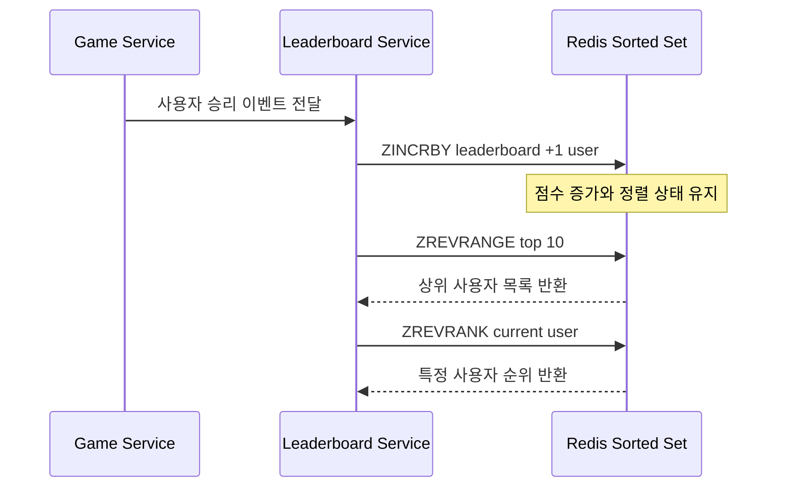
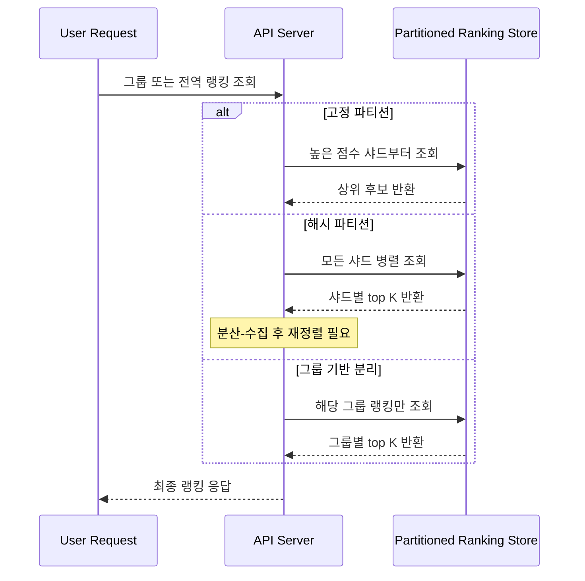
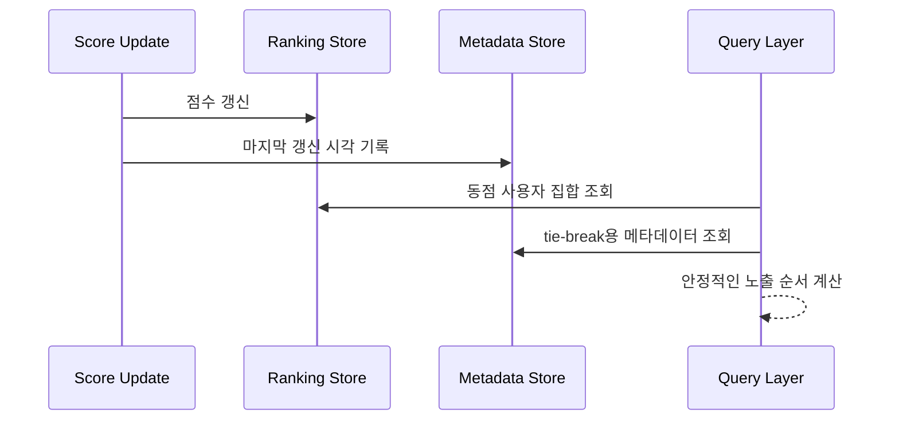

# 10장 딥다이브 — 실시간 게임 순위표

## 핵심 3가지 (이것만 기억하자)

- 이 문제의 본질은 데이터를 어디에 저장하느냐보다 **순위를 얼마나 싸게 갱신하고 질의하느냐**에 있다.
- 샤딩은 “데이터를 나눈다”에서 끝나지 않고, **상위 10명/내 순위 같은 질의가 샤딩 이후에도 쉬운가**까지 같이 봐야 한다.
- 실무 랭킹은 점수만 저장하면 끝나지 않고, **동점 처리·그룹 분리·TTL·fallback** 같은 운영 요소가 붙으면서 훨씬 현실적인 시스템이 된다.

## 딥다이브 1. 저장소 선택: 왜 이 문제는 RDB보다 Redis Sorted Set(정렬 집합) 사고방식에 가깝나

### 왜 어려운지

많은 사람이 “점수 저장이면 DB 테이블 하나 두면 되는 것 아닌가?”라고 생각한다. 실제로 `user_id`, `score` 두 칼럼만 있으면 데이터는 저장된다. 문제는 저장 그 자체가 아니라, 사용자가 이길 때마다 점수가 바뀌고, 그 바뀐 결과를 바탕으로 상위 10명과 특정 사용자의 순위를 계속 보여줘야 한다는 점이다.

여기서 어려운 부분은 세 연산이 한 번에 묶여 있다는 것이다.

1. 점수 갱신
2. 상위 K명 조회
3. 특정 사용자 순위 조회

관계형 데이터베이스는 1번은 쉽지만 2번과 3번이 커질수록 비싸진다. 반대로 Redis Sorted Set은 세 연산을 모두 “정렬된 집합” 하나에서 처리할 수 있다. 이 차이를 저장소 차이라고만 보면 얕고, **질의 모델의 차이**로 봐야 이 장의 핵심이 보인다.

### 동작 원리

책의 설계는 승리 이벤트가 들어오면 `ZINCRBY`로 점수를 올리고, `ZREVRANGE`로 상위권을 조회하고, `ZREVRANK`로 특정 사용자의 위치를 읽는 구조다. 핵심은 “점수 증가”와 “정렬 유지”가 분리되지 않는다는 것이다. 즉, 쓰기 순간에 정렬 상태가 함께 업데이트된다.

관계형 데이터베이스로 가면 사고방식이 달라진다. 점수 테이블은 쉽게 만들 수 있지만, 특정 사용자 순위를 계산하려면 결국 “나보다 점수가 높은 사람이 몇 명인가”를 세야 한다. 테이블이 작을 때는 버틸 수 있지만, 수백만 사용자로 커지면 순위 질의가 병목이 된다.

반대로 Sorted Set은 점수 기준 정렬을 자료구조 수준에서 유지한다. 그래서 이 장은 단순한 캐시 도입이 아니라, **문제 자체에 맞는 저장 구조를 고른 것**으로 읽는 편이 맞다.

### 함정

- “RDB도 LIMIT 10이면 빠르지 않나?”처럼 보이지만, 그건 상위 10명 조회만 본 시각이다. 내 순위, 내 주변 순위까지 요구되면 얘기가 달라진다.
- “레디스는 메모리라 무조건 빠르다”도 반만 맞다. 빠른 이유는 메모리 때문만이 아니라, 질의 형태에 맞는 자료구조를 제공하기 때문이다.
- “NoSQL이면 자동 확장되니 더 좋다”도 단순화다. 파티션/정렬 키 설계를 잘못하면 오히려 핫 파티션과 분산-수집 복잡도가 생긴다. 즉, 이 장에서 NoSQL은 ‘대안’이지 ‘더 쉬운 정답’이 아니다.

### 실무 시사점

실무에서는 랭킹성 데이터가 들어오면 RDB를 정답으로 두고 시작하기보다, 먼저 **조회 패턴이 무엇인지**를 본다. 상위권 조회가 자주 일어나는지, 특정 사용자의 상대 위치가 필요한지, 점수가 얼마나 자주 갱신되는지에 따라 저장소 선택이 달라진다.

실제로 Redis 기반 랭킹 패턴에서는 Sorted Set을 중심으로 두고, 필요하면 보조 저장소를 붙이는 경우가 많다. 또한 Redis 조회 실패나 장애 상황을 대비해 다른 저장소를 복구용 이력으로 두는 패턴도 자연스럽다. 즉, 책의 설계는 “학술적 예시”가 아니라 실무에서 자주 보는 구조와 상당히 닮아 있다.

## 딥다이브 2. 샤딩은 분산 문제가 아니라 질의 문제다: 고정 파티션 vs 그룹 기반 분리 vs 해시 파티션

### 왜 어려운지

샤딩 이야기가 나오면 보통 “부하를 여러 서버에 나눠 담는다” 수준에서 끝난다. 그런데 리더보드는 단순 저장 시스템이 아니기 때문에, 데이터를 어떻게 나누느냐보다 **나눈 뒤에도 상위 10명과 특정 사용자 순위를 쉽게 구할 수 있느냐**가 더 중요하다.

책에서 고정 파티션이 해시 파티션보다 낫다고 결론 내리는 이유도 여기 있다. 해시 파티션은 분산은 잘 되지만, 상위 10명을 구하려면 모든 샤드를 뒤져서 다시 모아야 한다. 반대로 고정 파티션은 높은 점수 구간이 어느 샤드에 있는지 대략 알 수 있기 때문에 상위권 질의에 더 유리하다.

실무에서는 이 둘 외에 **그룹 기반 분리**가 자주 등장한다. 예를 들어 전역 랭킹 하나로 모든 사용자를 섞기보다, 언어권/서버/리그 같은 기준으로 랭킹을 여러 개로 쪼개는 방식이다. 이 방식은 책의 고정 파티션과는 다르지만, “질의하기 좋은 단위로 나눈다”는 점에서는 같은 철학을 가진다.

> 아래의 그룹 기반 분리는 책의 고정/해시 파티션 논의를 실무적으로 확장해 본 비교다. 즉, 책의 직접 설명이라기보다 책의 문제의식을 실무 설계에 연결한 해석에 가깝다.

### 동작 원리

고정 파티션은 점수 범위가 곧 파티션 기준이다. 점수가 높을수록 뒤쪽 샤드에 몰리고, 상위권 조회는 고득점 샤드부터 보면 된다. 해시 파티션은 키를 고르게 흩뿌리기 때문에 저장은 편하지만, 상위권 질의는 모든 샤드를 병렬로 질의하고 결과를 다시 정렬해야 한다.

그룹 기반 분리는 점수 범위 대신 비즈니스 구분을 기준으로 랭킹을 여러 개 만든다. 이 방식은 “전역 top 10”에는 불리할 수 있지만, 애초에 지역별/그룹별 경쟁 구조라면 더 자연스럽다. 즉, 랭킹이 하나여야 한다는 가정부터 다시 묻게 만든다.

### 함정

- “해시 파티션이 제일 확장성 좋으니 정답”처럼 보이지만, 리더보드에서는 읽기 질의가 더 어려워질 수 있다.
- “고정 파티션은 점수 분포만 균등하면 된다”도 조심해야 한다. 점수 폭증 구간이 생기면 특정 샤드가 금방 뜨거워질 수 있다.
- “전역 랭킹이 당연히 더 좋은 UX”라는 것도 상황에 따라 틀릴 수 있다. 경쟁 단위를 분리하면 질의 복잡도와 사용자 경험이 동시에 좋아지는 경우도 있다.

### 실무 시사점

실무에서는 랭킹을 전역 1개로 두기보다, **처음부터 여러 랭킹 집합으로 분리**하는 패턴이 자주 보인다. 이건 책의 해시 파티션과 똑같지는 않지만, 운영 가능한 단위로 나눠서 조회를 단순화한다는 점에서 좋은 비교 대상이다.

또한 그룹 기반 분리는 단순한 확장 전략이 아니라 제품 요구사항과 맞물린다. 사용자는 꼭 전체 1위를 보고 싶은 게 아니라, 자기 리그나 자기 그룹에서의 위치를 더 중요하게 볼 수 있다. 이 경우 분산 전략과 UX 전략이 사실상 같은 문제가 된다.

결국 이 장의 샤딩 논의는 “어떻게 분산할까?”보다 “**어떤 질의를 싸게 만들고 싶은가?**”라는 질문으로 다시 읽는 것이 깊다.

## 딥다이브 3. 동점자 처리와 순위 안정성: 점수만 같으면 정말 충분한가?

### 왜 어려운지

책은 기본 요구사항으로 “점수가 같으면 같은 순위”라고 둔다. 이건 인터뷰 문제를 단순화하기에는 좋다. 하지만 실제 서비스를 상상하는 순간 문제가 생긴다. 두 사람이 점수가 같을 때 목록 순서가 매번 바뀌면 사용자 입장에서는 시스템이 불안정하게 느껴질 수 있다.

즉, 순위는 단순한 숫자 계산이 아니라 **사용자가 체감하는 질서**의 문제이기도 하다. 여기서부터 “점수 외의 어떤 정보가 더 필요할까?”라는 질문이 시작된다.

책은 확장 아이디어로 마지막 승리 시각을 이용해 동점자를 정렬할 수 있다고 말한다. 실무에서는 이 아이디어가 더 일반화되어, 점수 외에 타임스탬프나 보조 정렬 키를 함께 쓰는 경우가 많다. 이런 방식은 점수만으로는 표현되지 않는 순위 안정성을 제공한다.

### 동작 원리

핵심은 “동점 = 완전 동일”로 둘지, “동점이지만 노출 순서는 안정적으로 유지”할지를 분리해서 생각하는 것이다. 이 구분을 놓치면 순위 정의와 화면 표시 규칙이 뒤섞인다. 점수는 동일하게 두더라도, 노출 정렬에는 별도 기준이 필요할 수 있다.

실무형 패턴에서는 다음과 같은 흐름이 가능하다.

이때 중요한 것은 tie-break가 “순위 정의”를 바꾸는지, 아니면 “노출 순서”만 안정화하는지다. 두 개념을 섞으면 설명이 꼬인다. 책은 전자를 단순화하고, 후자를 확장 주제로 열어 둔 셈이다.

### 함정

- “동점자는 그냥 같은 순위면 끝”처럼 보이지만, 사용자 화면에서는 여전히 정렬 순서가 필요하다.
- “타임스탬프만 있으면 해결”도 단순화다. 어느 이벤트 시간을 기준으로 할지, 갱신 지연이 생기면 어떻게 할지까지 고민해야 한다.
- “정확한 순위가 언제나 필요하다”도 다시 생각할 문제다. 책 후반부처럼 규모가 커지면 상대적 백분위나 구간화가 더 현실적일 수 있다.

### 실무 시사점

실무에서는 랭킹 저장소 하나만으로 모든 문제를 푸는 경우가 드물다. 정렬 집합은 빠른 순위 계산에 적합하지만, tie-break·TTL·복구·보조정보는 다른 메타데이터와 함께 다뤄지는 일이 많다.

또한 일시적 랭킹은 영구 랭킹과 운영 방식이 다르다. 일정 시간이 지나면 만료시키거나 시즌을 교체해야 하고, 이 과정에서 순위 안정성과 lifecycle 관리가 같이 들어온다. 그래서 동점자 처리는 단순 정렬 규칙이 아니라, **운영 정책이 저장 구조와 만나는 지점**으로 보는 편이 더 깊다.

## 트레이드오프 토론

### 가장 중요한 결정: 전역 단일 랭킹을 단순하게 유지할 것인가, 분할된 랭킹 구조로 갈 것인가

책은 먼저 전역 단일 랭킹을 Sorted Set으로 해결하고, 규모가 커지면 샤딩을 붙이는 흐름을 택한다. 이 접근은 설명하기 좋고 기본 문제를 분명하게 보여 준다. 하지만 실무에서는 처음부터 그룹별 랭킹이나 기간제 랭킹으로 나누는 편이 더 운영 가능할 때도 많다.

| 관점 | 전역 단일 랭킹 | 분할된 랭킹 구조 |
|---|---|---|
| 개념 단순성 | 높음 | 중간 |
| 상위권 비교 의미 | 전체 사용자 기준으로 명확함 | 그룹 안에서는 명확하지만 전역 비교는 약해짐 |
| 확장성 | 규모가 커질수록 부담 증가 | 초기부터 부하 분산이 쉬움 |
| 질의 복잡도 | 기본 질의는 단순 | 전역 집계는 오히려 복잡할 수 있음 |
| 제품 유연성 | 낮음 | 높음 |

**만약 ~라면?**

- 만약 사용자가 “전 서버 전체 1위”보다 “내 리그 안에서 몇 위인지”를 더 중요하게 본다면, 전역 단일 랭킹을 고집할 이유가 약해진다.
- 반대로 서비스 핵심이 전역 경쟁이라면, 그룹 분리는 확장에는 유리해도 제품 메시지를 약하게 만들 수 있다.

이 질문은 단순한 구현 선택이 아니라, 데이터 구조와 제품 요구사항 중 무엇을 먼저 고정할 것인가의 문제다.

## 실무 연결

실무의 랭킹성 시스템을 보면 책과 닮은 점이 분명하다. 우선 빠른 순위 계산을 위해 Sorted Set 계열 자료구조를 중심에 두고, 점수 갱신과 상위 N 조회를 효율적으로 처리한다는 점이 같다. 또한 점수만 저장하는 것이 아니라, 동점 처리나 보조 정렬을 위해 추가 메타데이터를 붙이는 패턴도 흔하다.

다만 실무에서는 책보다 더 빨리 “분리”가 등장한다. 전역 랭킹 하나를 크게 키우기보다, 그룹·시즌·이벤트 단위로 랭킹을 나누고 각 랭킹의 수명을 다르게 관리한다. 어떤 랭킹은 TTL이 있고, 어떤 랭킹은 영속 이력을 남기며, 어떤 랭킹은 Redis 조회 실패 시 다른 저장소에서 복구한다. 이 차이는 책의 설계를 부정하는 것이 아니라, 책 설계를 운영 친화적으로 확장한 것이다.

NestJS 기반 서버에서 본다면 이 장은 다음 패턴들과 잘 연결된다.

- **UseCase/Service 레이어**: 승리 이벤트 검증과 랭킹 갱신을 분리
- **Redis + 보조 저장소 조합**: 빠른 조회와 복구/이력 목적 분리
- **Pipeline/Bulk 업데이트**: 이벤트성 랭킹에서 다량 갱신 효율화
- **그룹별 키 분리**: 글로벌 1개보다 질의 친화적 구조로 설계

즉, 책의 설계는 “실무와 다른 교과서적 설계”라기보다, 실무에서 더 많은 예외와 운영 요소가 붙기 전의 **핵심 뼈대**에 가깝다. 발표에서는 책의 핵심 구조와 실무 확장 포인트를 구분해서 설명하면 더 선명하다.

## 킬러 질문 3개

### 1. 상위 10명과 내 순위만 중요하다면, 전체 정렬을 끝까지 유지하는 것이 정말 최선일까?

- **왜 흥미로운가**: 요구사항이 조금만 바뀌어도 저장 구조 정답이 완전히 달라질 수 있기 때문이다.
- **토론 방향**: 근사치 허용 여부, 주변 순위 기능 삭제 시 설계 변화, 전역 랭킹 유지 비용의 정당성

### 2. 해시 파티션이 분산에는 더 좋아 보이는데도, 왜 리더보드에서는 더 불편해질 수 있을까?

- **왜 흥미로운가**: “확장성 좋은 구조 = 좋은 구조”라는 직관을 깨기 때문이다.
- **토론 방향**: 분산-수집 비용, 읽기 패턴 중심 설계, 샤딩 이후 질의 모델 재설계 필요성

### 3. 동점자 처리 기준은 기술적 문제일까, 제품 정책 문제일까?

- **왜 흥미로운가**: 같은 점수라는 수학적 사실보다, 사용자가 공정하다고 느끼는 기준이 더 중요할 수 있기 때문이다.
- **토론 방향**: 타임스탬프 기반 tie-break, 시즌성 랭킹 정책, “정확한 순위”와 “안정적인 경험” 사이의 균형

## 오해하기 쉬운 부분

- **RDB가 느려서 못 쓰는 것처럼 보이지만, 실제로는 순위 질의 모델이 이 문제와 잘 안 맞는 것이다.**
- **샤딩은 서버를 늘리는 문제처럼 보이지만, 실제로는 샤딩 이후에도 상위 K와 내 순위를 어떻게 질의할지의 문제다.**
- **동점자는 그냥 같은 순위처럼 보이지만, 실제 사용자 화면에서는 안정적인 노출 순서를 위한 추가 규칙이 필요하다.**
