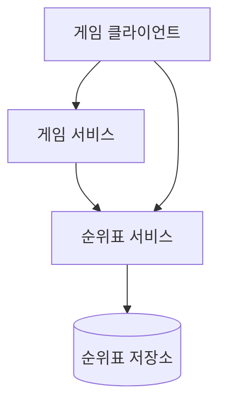
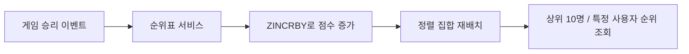
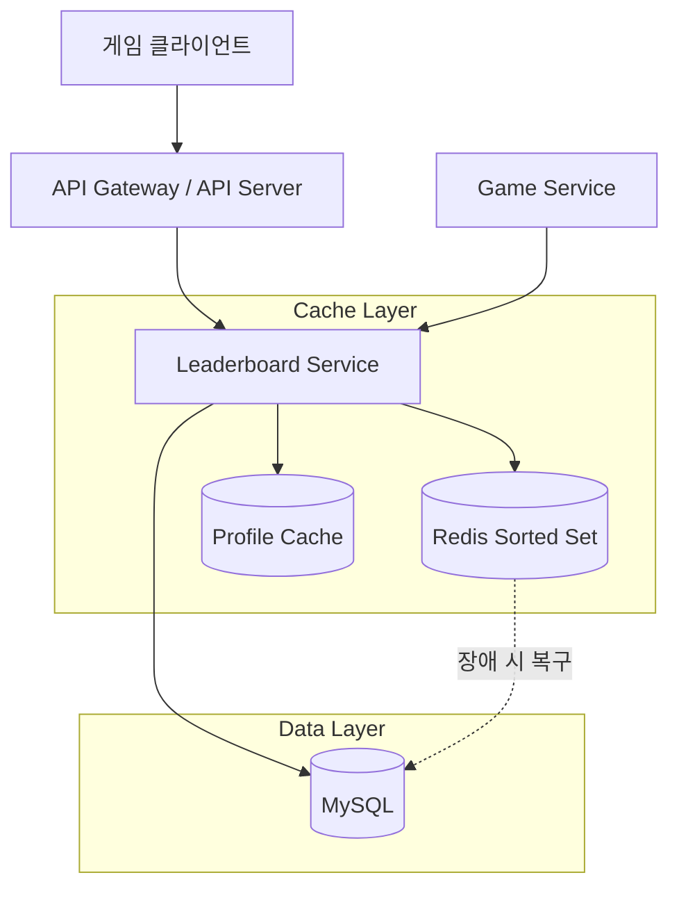
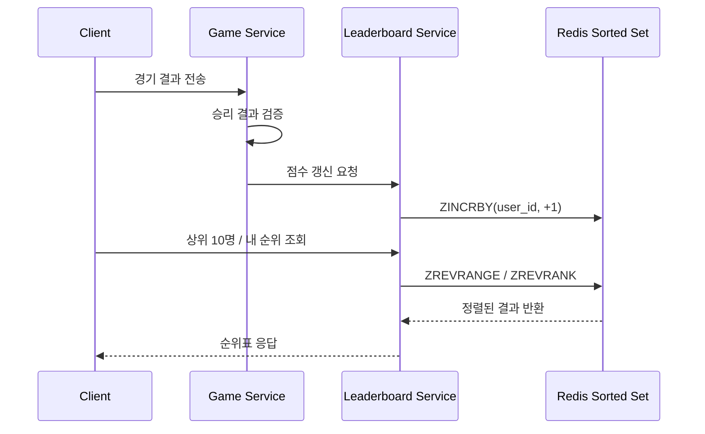

# Chapter 10: 실시간 게임 순위표 (Realtime Leaderboard) 발표 자료

> **발표자**: 길현준  

---

## 목차

1. [1. 1단계: 문제 이해 및 설계 범위 확정](#1-1단계-문제-이해-및-설계-범위-확정)
2. [2. 2단계: 개략적 설계](#2-2단계-개략적-설계)
3. [3. 3단계: 상세 설계](#3-3단계-상세-설계)
4. [4. 면접 질문 Q&A](#4-면접-질문-qa)
5. [5. 토론 주제](#5-토론-주제)
6. [6. 참고 자료](#6-참고-자료)

---

## 1. 1단계: 문제 이해 및 설계 범위 확정

### 실시간 게임 순위표란?

**정의**: 실시간 게임 순위표는 온라인 게임에서 플레이어의 점수를 바탕으로 현재 순위를 보여주는 시스템이다. 단순히 상위권만 보여주는 것이 아니라, 특정 사용자의 현재 위치와 그 주변 순위까지 빠르게 확인할 수 있어야 한다.

**실제 사례**:
- 모바일 게임의 월간 토너먼트 순위표
- 친구 또는 라이벌과의 경쟁 화면
- 특정 플레이어 기준 앞뒤 순위 비교 화면

### ★ 요구사항 도출 (면접 대화 요약)

**지원자**: 순위표 점수는 어떻게 계산하나요?  
**면접관**: 사용자는 경기에서 승리할 때마다 1점씩 획득하고, 그 누적 점수로 순위를 계산합니다.

**지원자**: 상위 사용자만 보여주면 되나요?  
**면접관**: 상위 10명은 반드시 보여줘야 하고, 특정 사용자의 현재 순위도 보여줘야 합니다. 가능하다면 그 사용자보다 4단계 위와 아래 사용자도 함께 보여주면 좋습니다.

**지원자**: 사용자는 어느 정도 규모로 가정하나요?  
**면접관**: DAU 500만, MAU 2,500만 규모를 가정하고, 순위는 실시간에 가깝게 반영되어야 합니다.

### 기능 요구사항

| 요구사항 | 세부 내용 |
|----------|----------|
| 상위 10명 조회 | 가장 높은 점수를 가진 상위 10명의 플레이어를 빠르게 조회해야 한다 |
| 특정 사용자 순위 조회 | 특정 사용자가 현재 몇 위인지 반환해야 한다 |
| 주변 순위 조회 | 특정 사용자 기준 앞뒤 4명 정도의 순위를 보여줄 수 있으면 좋다 |
| 점수 갱신 | 경기 승리 시 점수가 즉시 반영되어야 한다 |

### 비기능 요구사항

- **낮은 지연(Low Latency)**: 점수 갱신과 순위 조회가 거의 실시간으로 반영되어야 한다
- **고가용성(High Availability)**: 순위표 서버 장애가 나더라도 서비스가 계속 가능해야 한다
- **확장성(Scalability)**: DAU 500만에서 더 커지는 경우까지 고려해야 한다
- **정합성(Consistency)**: 사용자의 점수와 순위가 논리적으로 맞아야 하며, 최소한 사용자 관점에서 납득 가능한 결과를 제공해야 한다

### QPS 계산 (Back-of-envelope)

```text
DAU = 5,000,000명
하루 평균 경기 수 = 10회/사용자
평균 동시 활동 사용자 = 5,000,000 / 10^5 ≈ 50
피크 트래픽 = 평균의 5배 = 250

점수 갱신 QPS = 50 × 10 = 500
최대 점수 갱신 QPS = 500 × 5 = 2,500

상위 10명 조회 QPS ≈ 50
```

> ★ **중요**: 이 장의 핵심은 단순한 저장이 아니라, "지속적으로 바뀌는 대규모 순위"를 실시간에 가깝게 계산하고 조회하는 데 있다.

---

## 2. 2단계: 개략적 설계

### ★ 이전 장과의 비교

9장 객체 저장소는 대용량 데이터를 내구성 있게 저장하는 시스템이었다면, 10장 실시간 게임 순위표는 **끊임없이 갱신되는 점수와 순위**를 빠르게 계산하는 시스템이라는 점이 다르다.

| 구분 | 9장 객체 저장소 | 10장 실시간 게임 순위표 |
|------|----------|----------|
| 핵심 데이터 성격 | 대용량 객체 저장 | 빈번하게 갱신되는 점수/순위 |
| 주요 요구사항 | 내구성, 저장 효율 | 실시간 조회, 빠른 갱신 |
| 핵심 자료 구조 | 객체/메타데이터 | 정렬 집합(sorted set) |

### API 설계

**주요 API**

```text
POST /v1/scores
Parameters:
  - user_id (string): 게임에서 승리한 사용자 ID
  - points (int): 사용자가 획득한 점수
```

```text
GET /v1/scores
Parameters:
  - none: 상위 10명 순위표 조회
```

```text
GET /v1/scores/{:user_id}
Parameters:
  - user_id (string): 순위를 조회할 사용자 ID
```

**API 목록**

| Method | Endpoint | 설명 |
|--------|----------|------|
| POST | /v1/scores | 승리한 사용자 점수를 갱신한다 |
| GET | /v1/scores | 상위 10명의 순위표를 조회한다 |
| GET | /v1/scores/{:user_id} | 특정 사용자의 현재 순위를 조회한다 |

### 개략적 아키텍처



| 컴포넌트 | 역할 | 특징 |
|----------|------|------|
| **게임 서비스** | 승리 결과의 유효성을 검증 | 클라이언트가 점수를 직접 조작하지 못하게 막는다 |
| **순위표 서비스** | 점수 갱신 및 순위 조회 처리 | 상위 10명, 특정 사용자 순위, 주변 순위 질의를 담당한다 |
| **순위표 저장소** | 사용자 점수와 정렬 상태 보관 | 실시간 읽기/쓰기 성능이 중요하다 |

### 핵심 알고리즘/데이터 구조

**핵심 개념**: 관계형 데이터베이스는 정렬 비용이 커서 실시간 순위표에 불리하고, 레디스 정렬 집합은 점수 기반 정렬과 순위 조회를 효율적으로 지원한다.

정렬 집합(sorted set)은 각 사용자와 점수를 함께 저장하는 자료 구조다. 여기서 중요한 점은 단순히 값을 저장하는 것이 아니라, 점수 기준 정렬 상태를 유지한다는 것이다. 덕분에 점수 증가, 상위 사용자 조회, 특정 사용자 순위 조회를 모두 일관된 자료 구조에서 처리할 수 있다.

`ZINCRBY`는 사용자의 점수를 증가시키고, `ZREVRANGE`는 높은 점수 순으로 상위권 사용자를 가져오며, `ZREVRANK`는 특정 사용자의 현재 순위를 계산한다. 이 조합이 이 장의 개략적 설계 핵심이다.



### ★ 면접 빈출: 관계형 데이터베이스 vs 레디스 정렬 집합

| 항목 | 관계형 데이터베이스 | 레디스 정렬 집합 |
|------|-------------------|------------------|
| 점수 갱신 | 단순 UPDATE는 가능 | ZINCRBY로 바로 처리 가능 |
| 순위 조회 | 전체 정렬/스캔 부담 큼 | ZREVRANK로 빠르게 계산 가능 |
| 상위 10명 조회 | LIMIT로 일부 최적화 가능 | ZREVRANGE로 자연스럽게 처리 |
| 실시간성 | 대규모일수록 불리 | 메모리 기반이라 유리 |
| 확장성 | 읽기 부하에서 한계 | 단일 서버 또는 샤딩으로 대응 가능 |

---

## 3. 3단계: 상세 설계

### 규모 확장

**단일 레디스 서버 전략**:
- DAU 500만, 최대 점수 갱신 QPS 2,500 정도는 단일 레디스 서버로도 충분히 감당 가능하다
- 월간 순위표 전체를 메모리에 올려도 수백 MB 수준이므로 현실적인 범위다

**샤딩 전략**:
- 5억 DAU처럼 규모가 100배로 커지면 저장 용량과 QPS가 크게 증가하므로 샤딩이 필요하다
- 이때 고정 파티션과 해시 파티션 두 가지 방법을 검토한다

### 캐시 전략

**캐시 필요성**: 이 장에서는 순위표 저장소 자체를 레디스에 두므로, 별도의 읽기 캐시보다 정렬 집합을 핵심 저장소처럼 활용하는 것이 중심 아이디어다. 다만 상위 10명 사용자 상세 정보는 자주 조회되므로 별도 프로필 캐시를 둘 수 있다.

**캐시 키 설계**:

| 키 | 값 | TTL |
|----|----|----|
| leaderboard:{month} | 해당 월 정렬 집합 | 월간 토너먼트 종료 시점까지 |
| leaderboard:{month}:top10_profiles | 상위 10명 프로필 정보 | 짧은 TTL 또는 이벤트 기반 갱신 |

### 최종 아키텍처



**처리 플로우**:
1. 사용자가 승리하면 게임 서비스가 승리 결과를 검증한다
2. 게임 서비스가 순위표 서비스에 점수 갱신을 요청한다
3. 순위표 서비스가 레디스 정렬 집합에 `ZINCRBY`를 적용한다
4. 사용자는 순위표 서비스에서 상위 10명, 특정 사용자 순위, 주변 순위를 조회한다



### ★★ 핵심 개념: 정렬 집합과 스킵 리스트

정렬 집합은 내부적으로 해시 테이블과 스킵 리스트를 조합해 사용한다. 해시 테이블은 사용자와 점수의 대응관계를 빠르게 찾는 데 유리하고, 스킵 리스트는 점수 기준 정렬 상태를 유지하면서 탐색을 빠르게 만든다.

스킵 리스트는 여러 단계의 색인을 둔 연결 리스트라고 볼 수 있다. 기본 연결 리스트만 쓰면 검색 시간이 길어지지만, 중간 노드를 건너뛰는 색인을 추가하면 목표 점수에 더 빨리 도달할 수 있다. 이 설명이 중요한 이유는, 왜 레디스가 단순 저장소가 아니라 "순위 계산에 적합한 저장소"인지를 이해하게 해 주기 때문이다.

### 장애 및 복구 시나리오

| 시나리오 | 문제 | 대응 |
|------|------|------|
| 레디스 주 서버 장애 | 현재 순위표 조회 지연 또는 불가 | 읽기 사본을 승격해 주 서버로 사용 |
| 레디스 전체 장애 | 순위표 데이터 손실 가능성 | MySQL에 기록된 승리 이력을 기준으로 오프라인 복구 |
| 해시 파티션 사용 시 느린 샤드 | 상위 K 조회 지연 증가 | 모든 샤드 질의를 병렬화하되, 가장 느린 샤드가 병목이 됨 |

### 고정 파티션 vs 해시 파티션

| 비교 항목 | 고정 파티션 | 해시 파티션 |
|------|-------------|-------------|
| 기준 | 점수 범위별 샤딩 | 키 해시 슬롯별 샤딩 |
| 상위 10명 조회 | 높은 점수 샤드만 보면 되어 유리 | 모든 샤드 결과를 모아야 하므로 불리 |
| 특정 사용자 순위 계산 | 상위 샤드 사용자 수를 더해 계산 가능 | 상대 순위 계산이 복잡함 |
| 분포 조건 | 점수 분포가 비교적 고르게 퍼져야 함 | 점수 분포 편중에 강함 |
| 이 장의 선택 | 채택 | 비채택 |

### NoSQL 대안

이 장은 DynamoDB 같은 NoSQL도 대안이 될 수 있다고 설명한다. 장점은 관리형 서비스로서 안정적인 확장성을 제공한다는 점이다. 하지만 최신 월 데이터가 특정 파티션으로 몰리면 핫 파티션이 생길 수 있고, 결국 쓰기 샤딩과 분산-수집을 도입해야 한다.

즉, NoSQL도 가능하지만 이 장의 결론은 **실시간 순위표 문제에는 레디스 정렬 집합이 더 직접적이고 단순한 해법**이라는 것이다.

| 항목 | Redis Sorted Set | DynamoDB 기반 대안 |
|------|------------------|--------------------|
| 순위 조회 모델 | 자료 구조 자체가 순위 계산에 적합 | 파티션/정렬 키 설계가 필요 |
| 상위 10명 조회 | 자연스럽게 지원 | 분산-수집 필요 가능 |
| 사용자 상대 순위 | ZREVRANK 계열로 계산 가능 | 구현 복잡도 높음 |
| 운영 방식 | 캐시/메모리 중심 | 관리형 NoSQL 서비스 |

---

## 4. 면접 질문 Q&A

### Q1. 왜 관계형 데이터베이스 대신 레디스를 선택했나요?

> **답변:** 이 문제의 핵심은 점수가 계속 바뀌는 환경에서 순위를 실시간에 가깝게 계산하는 것입니다. 관계형 데이터베이스는 UPDATE 자체는 어렵지 않지만, 특정 사용자의 현재 순위를 계산하려면 사실상 전체 정렬 또는 대규모 스캔이 필요합니다. 반면 레디스 정렬 집합은 점수 갱신, 상위 10명 조회, 특정 사용자 순위 조회를 모두 같은 자료 구조에서 효율적으로 처리할 수 있습니다.
>
> **핵심 포인트:**
> - 실시간 순위 계산이 핵심 요구사항이다
> - 정렬 집합은 이 요구사항에 맞는 전용 자료 구조다

### Q2. 단일 레디스 서버로 충분하다면 왜 샤딩까지 논의하나요?

> **답변:** 현재 가정한 500만 DAU 규모는 단일 레디스 서버로 처리할 수 있지만, 시스템 설계 면접에서는 현재 규모뿐 아니라 성장 이후도 설명해야 합니다. 이 장은 5억 DAU처럼 100배 커진 상황을 가정해 고정 파티션과 해시 파티션을 비교합니다. 즉, 지금 당장 필요하지 않더라도 미래 확장 전략을 준비하는 것이 설계의 완성도를 높입니다.
>
> **핵심 포인트:**
> - 현재 규모와 미래 규모를 분리해서 생각해야 한다
> - 샤딩 논의는 확장 경로를 보여 주기 위한 것이다

### Q3. 해시 파티션 대신 고정 파티션을 선택한 이유는 무엇인가요?

> **답변:** 이 장에서 더 중요한 질의는 상위 10명 조회와 특정 사용자 순위 계산입니다. 해시 파티션은 데이터를 고르게 분산하는 데는 유리하지만, 상위 K명을 구하려면 모든 샤드에서 결과를 받아 다시 정렬해야 합니다. 반면 고정 파티션은 높은 점수 구간이 따로 모여 있으므로 상위권 조회에 더 유리합니다. 또한 특정 사용자 순위도 상위 샤드 사용자 수를 더해 계산할 수 있어 상대적으로 단순합니다.
>
> **핵심 포인트:**
> - 이 문제는 단순 분산보다 순위 질의 효율이 더 중요하다
> - 고정 파티션은 상위권 조회에 더 잘 맞는다

### Q4. 레디스에 장애가 나면 순위표는 어떻게 복구하나요?

> **답변:** 이 장은 사용자가 승리할 때마다 MySQL에 타임스탬프와 함께 그 사실을 기록한다고 가정합니다. 따라서 대규모 장애가 발생하면 이 승리 기록을 다시 읽으면서 사용자별로 ZINCRBY를 반복 호출해 순위표를 재구성할 수 있습니다. 즉, 레디스는 빠른 조회용 핵심 저장소 역할을 하지만, 복구를 위한 이력은 별도 저장소에 남겨 두는 구조입니다.
>
> **핵심 포인트:**
> - 빠른 저장소와 복구용 이력 저장소를 분리한다
> - 장애 대응은 설계에서 반드시 설명해야 한다

### Q5. 동점자 순위는 어떻게 처리할 수 있나요?

> **답변:** 기본 요구사항에서는 동점자의 순위가 동일하다고 가정합니다. 추가 논의로는 레디스 해시를 활용해 사용자 ID와 마지막 승리 시각을 함께 저장하는 방법이 제시됩니다. 그러면 같은 점수일 때 더 먼저 점수를 획득한 사용자를 더 높은 순위로 둘 수 있습니다.
>
> **핵심 포인트:**
> - 기본 요구사항과 확장 요구사항을 분리해서 설명한다
> - 동점자 처리 기준은 추가 메타데이터로 보완할 수 있다

---

## 5. 토론 주제

### 토론 1: 상위 10명만 중요하다면 전체 순위표를 꼭 유지해야 할까?

**질문**: 실제 서비스에서도 모든 사용자의 순위를 유지하는 것이 반드시 필요할까, 아니면 상위권과 내 순위만 빠르게 보여주면 충분할까?

**토론 포인트**:
- 요구사항이 바뀌면 자료 구조 선택도 달라질 수 있다
- 전체 순위 유지 비용과 사용자 경험의 균형을 어떻게 볼 것인가
- “내 주변 순위” 기능이 빠지면 설계가 얼마나 단순해질까

### 토론 2: 고정 파티션은 점수 분포가 치우치면 어떻게 될까?

**질문**: 플레이어 점수가 특정 구간에 몰리면 고정 파티션의 장점이 약해질 수 있는데, 이때도 고정 파티션을 유지하는 것이 맞을까?

**토론 포인트**:
- 점수 분포가 고르지 않을 때 병목이 어디서 생길까
- 애플리케이션이 샤딩 로직을 직접 갖는 것이 운영상 얼마나 부담일까
- 해시 파티션과의 재전환 기준은 무엇일까

### 토론 3: 서버리스 접근은 언제까지 유효할까?

**질문**: API 게이트웨이와 람다 기반 순위표 구조는 초기에는 편하지만, 트래픽이 계속 커져도 같은 방식이 최선일까?

**토론 포인트**:
- 운영 단순성과 성능 제어력 사이의 균형
- 레디스와 MySQL을 함께 쓰는 구조에서 병목은 어디일까
- 초기 설계와 대규모 설계의 분기점을 어떻게 판단할까

---

## 6. 참고 자료

### 공식 문서
- [Lambda](https://aws.amazon.com/lambda/)
- [Google Cloud Functions](https://cloud.google.com/functions)
- [Azure Functions](https://azure.microsoft.com/en-us/services/functions/)
- [Redis INFO command](https://redis.io/commands/INFO)

### 기술 문서 및 글
- [Redis Sorted Set source code](https://github.com/redis/redis/blob/unstable/src/t_zset.c)
- [Why Redis cluster only have 16384 slots](https://stackoverflow.com/questions/36203532/why-redis-cluster-only-have-16384-slots)
- [Using Global Secondary Indexes in DynamoDB](https://docs.aws.amazon.com/amazondynamodb/latest/developerguide/GSI.html)

### 장 내 참고된 사례

| 분류 | 내용 | 특징 |
|------|------|------|
| Redis | 실시간 순위표 구현 | 정렬 집합 기반 순위 계산 |
| DynamoDB | 대안 설계 | 쓰기 샤딩과 분산-수집 필요 |
| 서버리스 | API Gateway + Lambda | 초기 운영 단순성 강조 |

---

## 10장 요약 마인드맵

```text
실시간 게임 순위표
├── 1단계: 요구사항
│   ├── 기능: 상위 10명, 특정 사용자 순위, 주변 순위
│   ├── 비기능: 실시간성, 확장성, 고가용성
│   └── QPS: 최대 점수 갱신 2.5k
├── 2단계: 개략적 설계
│   ├── API: 점수 갱신 / 상위 10명 / 특정 사용자 순위
│   ├── 아키텍처: 게임 서비스 + 순위표 서비스 + 저장소
│   └── 핵심 알고리즘: Redis Sorted Set
├── 3단계: 상세 설계
│   ├── 확장: 단일 Redis → 샤딩
│   ├── 캐시: 순위표와 상위 프로필 캐시
│   └── 대안: DynamoDB 기반 NoSQL
└── 핵심 포인트
    ├── RDB보다 정렬 집합이 문제에 더 잘 맞는다
    └── 대규모 확장에서는 고정 파티션이 핵심 대안이다
```

---

*Last Updated: 2026-03-26*
