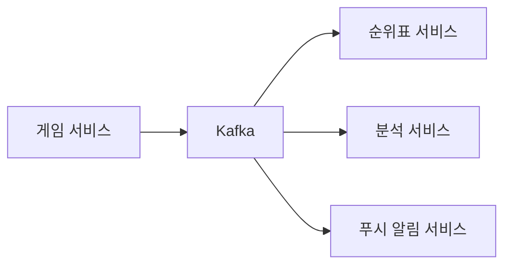

# 1단계: 문제 이해 및 설계 범위 확정
```
순위표의 점수는 어떻게 계산?
>> 사용자는 경기에서 승리하면 포인트가 쌓임
>> 이 포인트로 점수 계산
>> 사용자는 경기에서 이길 때마다 1점의 포인트를 추가로 획득

모든 플레이어가 순위표에 포함?
>> 네

한 순위표는 얼마 동안이나 유효?
>> 매달 새로운 토너먼트를 시작할 때마다 새로운 순위표

상위 10명의 사용자만 신경 써도 가능?
>> 상위 10명의 사용자와 특정 사용자의 순위를 순위표에 표시 가능해야 함
>> 시간이 허락한다면 어떤 사용자보다 4순위 위 또는 아래에 있는 사용자들까지 반환하는 방법도 논의

토넌먼트에 참가하는 사용자는 몇 명?
>> DAU 500만 명, MAU 2,500만 명으로 가정

토넌먼트 기간 동안 평균 몇 경기가 진행?
>> 각 선수는 하루 평균 10경기

두 플레이어의 점수가 같을 경우 어떻게 순위를 결정?
>> 두 사람의 순위는 동일

순위표가 실시간?
>> 네
```

## 기능 요구사항
- 순위표에 상위 10명의 플에이어를 표시
- 특정 사용자의 순위를 표시
- 어떤 사용자보다 4순위 위와 아래에 있는 사용자를 표시 (보너스 문제)

## 비기능 요구사항
- 점수 업데이트는 실시간으로 순위표에 반영
- 일반적인 확장성, 가용성 및 안정성 요구사항

## 개략적 규모 추정
DAU가 500만 명인 게임의 경우 초당 평균 50명의 사용자가 게임을 플레이하게 된다.   
최대 부하는 평균의 다섯 배로 가정하여 초당 최대 250명의 사용자를 감당할 수 있어야 한다.

- 사용자 점수 획득 QPS
    - 한 사용자가 하루 평균 10개의 게임을 플레이한다고 가정
    - 점수를 획득하는 이벤트가 발생하는 QPS는 50 X 10 =~ 500
    - 최대 QPS는 평균의 5배로 가정 -> 500 X 5 - 2,500
- 상위 10명 순위표 가져오기 QPS
    - 각 사용자가 하루에 한 번 게임을 열고 상위 10명 순위표는 사용자가 처음 게임을 열 때만 표시한다고 가정
    - QPS = 약 50

---

# 2단계: 개략적 설계안 제시 및 동의 구하기

## 개략적 설계안

- 게임 서비스: 사용자가 게임을 플레이할 수 있도록 하는 역할
- 순위표 서비스: 순위표를 생성하고 표시하는 역할


1. 사용자가 게임에서 승리 -> 클라이언트는 게임 서비스에 요청
2. 게임 서비스는 해당 승리가 정당하고 유효한 것인지 확인 -> 순위표 서비스에 점수 갱신 요청
3. 순위표 서비스는 순위표 저장소에 기록된 해당 사용자의 점수를 갱신
4. 해당 사용자의 클라이언트는 순위표 서비스에 직접 요청하여 다음과 같은 데이터 조회
    1. 상위 10명 순위표
    2. 해당 사용자 순위

### 클라이언트가 순위표 서비스와 직접 통신해야 하나?
대안 중 하나는 클라이언트가 점수를 정하는 방식이다.   
이 방식은 사용자가 프록시를 설치하고 점수를 마음대로 바꾸는 중간자 공격을 할 수 있기 때문에 보안상 안전하지 않다.   
따라서 점수는 서버가 설정해야 한다.


온라인 포커처럼 서버가 게임 전반을 통솔하는 경우에는 클라이언트가 점수를 설정하기 위해 게임 서버를 명시적으로 호출할 필요가 없을 수도 있음에 유의하자.

게임 서버가 모든 게임 로직을 처리하고, 게임이 언제 끝나는지 알기 때문에 클라이언트의 개입 없이도 점수를 정할 수 있다.

### 게임 서비스와 순위표 서버 사이에 MQ가 필요한가?
해당 데이터가 다른 곳에서도 이용되거나 여러 기능을 지원해야 한다면 카프카에 데이터를 넣는 것이 합리적일 수 있다.



## 데이터 모델

### RDB
규모 확장성이 그다지 중요하지 않고 사용자 수가 많지 않다면 RDBMS를 이용할 가능성이 높다.

SQL DB는 지속적으로 변화하는 대량의 정보를 신속하게 처리하지 못한다.   
수백만 개 레코드에 순위를 매기려면 대략 수십 초 정도가 걸리므로, 실시간성을 요구하는 애플리케이션에는 적합하지 않다.   
데이터가 지속적으로 변경되기 때문에 캐시 도입도 불가능하다.

즉, RDB는 본 시스템에 요구되는 다량의 읽기 부하를 처리하기 어렵다.

index로 최적화를 해도 규모 확장성이 좋지 않다.
1. 특정 사용자의 순위를 알아내려면 기본적으로 전체 테이블을 훑어야 하므로 성능 저하
2. 순위표 상단에 있지 않은 사용자의 순위를 간단히 찾을 수 없음

### Redis
수백만 명의 사용자에 대해서도 예측 가능한 성능을 제공하고 복잡한 DB 쿼리 없이도 일반적인 순위표 작업을 쉽게 수행하기 위해 Redis를 사용한다.

레디스는 메모리 기반 키-값 저장소 시스템이다.   
메모리에서 동작하므로 빠른 읽기/쓰기가 가능하다.

순위표 시스템 설계 문제를 해결하는 데 이상적인 정렬 집합(sorted set)이라는 자료형을 제공한다.

#### 정렬 집합이란?
집합 내 원소는 고유해야 하지만 같은 점수는 있을 수도 있다.   
점수는 정렬 집합 내 원소를 오름차순 정렬하는 데 이용된다.

정렬 집합은 내부적으로 해시 테이블과 스킵 리스트라는 두 가지 자료 구조를 사용한다.   
해시 테이블은 사용자의 점수를 저장하기 위해서, 스킵 리스트는 특정 점수를 딴 사용자들의 목록을 저장하기 위해 쓰인다.

스킵 리스트는 빠른 검색을 가능하게 하는 자료 구조다.   
정렬된 연결 리스트에 다단계 색인을 두는 구조다.   
이 연결 리스트에 삽입, 삭제, 검색 연산을 실행하는 시간 복잡도는 O(n)이다.

이진 검색 알고리즘처럼 중간 지점에 더 빨리 도달할 수 있도록 하기 위해 중간 노드를 하나씩 건너뛰는 1차 색인을 추가한 다음,   
1차 색인 노드를 하나씩 건너뛰는 2차 색인을 추가한다.

즉, 새로운 색인을 추가할 때마다 이전 차수의 노드를 하나씩 건너뛸 수 있도록 한다.

노드 사이의 거리가 n-1이 되면 더 이상의 색인은 추가하지 않는다.   
여기서 n은 노드의 총 개수이다.


데이터의 양이 적을 때는 스킵 리스트의 속도 개선 효과가 분명하지 않다.

정렬 집합은 삽입이나 갱신 연산을 할 때 모든 원소가 올바른 위치에 자동으로 배치되며 새 원소를 추가하거나 기존 원소를 검색하는 연산의 시간 복잡도가 O(log(n))이므로 RDB보다 성능이 좋다.

#### Redis 정렬 집합을 사용한 구현
- ZADD
    - 기존에 없던 사용자를 집합에 삽입
    - 기존 사용자의 경우에는 점수 업데이트
    - O(log(n))
- ZINCRBY
    - 사용자 점수를 지정된 값만큼 증가
    - 집합에 없는 사용자의 점수는 0에서 시작한다고 가정
    - O(log(n))
- ZRANGE/ZREVRANGE
    - 점수에 따라 정렬된 사용자 중에 특정 범위에 드는 사용자들을 조회
    - 순서, 항목 수, 시작 위치 지정 가능
    - O(log(n)+m), m: 가져올 항목 수, n: 정렬 집합의 크기
- ZRANK/ZREVRANK
    - 오름차순/내림차순 정렬했을 때 특정 사용자의 위치 조회
    - O(log(n))

### 저장소 요구사항
최악의 시나리오는 MAU 2,500만 명 모두가 최소 한 번 이상 게임에서 승리하는 바람에 모두 월 순위표에 올라야 하는 경우다.   
ID가 24자 문자열, 점수가 16비트 정수라고 하면 순위표 한 항목당 26바이트가 필요하다.

MAU당 순위표 항목이 하나라는 최악의 시나리오를 가정하면 26 X 2,500 = 6억 5,000만 바이트 또는 약 650MB의 저장공간이 Redis 캐시가 필요하다.   
이 정도라면 스킵 리스트 구현에 필요한 오버헤드와 정렬 집합 해시를 고려해 메모리 사용량을 두 배로 늘린다고 해도 최신 레디스 서버 한 대만으로도 데이터를 충분히 저장할 수 있다.

CPU 및 I/O 사용량도 고려해야 한다.   
개략적 추정치에 따르면 갱신 연산의 최대 QPS는 2500/초 정도였다.   
이는 단일 레디스 서버로도 충분히 감당할수 있는 부하다.

데이터의 영속성이 걱정되는 부분이다.   
레디스에 읽기 사본을 두고, 주 서버에 장애가 생기면 읽기 사본을 승격시켜 주 서버로 만들고, 새로운 읽기 사본을 만들어 연결한다.

MySQL과 같은 RDB를 사용하는 경우에는 사용자 테이블, 점수 테이블이 필요하다.   
쉬운 성능 최적화 방안은 가장 자주 검색되는 상위 10명의 사용자 정보를 캐시하는 것이다.

---

# 3단계: 상세 설계
## 클라우드 서비스 사용 여부
솔루션 배포 방식은 기존 인프라 구성 형태에 따라 일반적으로 두 가지로 나눌 수 있다.

### 자체 서비스를 이용하는 방안
매월 정렬 집합응ㄹ 생성하여 해당 기간의 순위표를 저장한다.   
해당 집합에는 사용자 및 점수 정보를 저장한다.

이름 및 프로필 이미지와 같은 사용자 세부 정보는 MySQL DB에 저장한다.

순위표를 가져올 때 API 서버는 순위 데이터와 더불어 DB에 저장된 사용자 이름과 프로필 이미지도 가져온다.


### 클라우드 서비스를 이용하는 방안
클라우드 인프라를 활용한다.

AWS에 있어서 클라우드로 순위표를 구축하는 것이 자연스러운 상황이라고 가정한다.

람다는 필요할 때만 실행되며 트래픽에 따라 그 규모가 자동으로 확장된다.


## 레디스 규모 확장
5백만 DAU 정도라면 한 대의 레디스 캐시 서버로도 충분히 지원할 수 있다.

그러나 원래 규모의 100배인 5억 DAU를 처리해야 한다고 해 보자.   
이제 최악의 경우 저장 용량은 650 X 100 = 65GB까지 필요하고, 2,500 X 100 = 250,000 QPS의 질의를 처리할 수 있어야 한다.   
이 정도 규모를 감당하려면 샤딩이 필요하다.

### 데이터 샤딩 방안
고정 파티션과 해시 파티션의 두 가지 방식 중 하나를 택하자.

### 고정 파티션
고정 파티션은 순위표에 등장하는 점수의 범위에 따라 파티션을 나누는 방안이다.

이 기능이 제대로 작동하려면 순위표 전반에 점수가 고르게 분포되어야 한다.   
그렇지 않으면 각 샤드에 할당되는 점수 범위를 조정하여 비교적 고른 분포가 되도록 해야 한다.

### 해시 파티션
레디스 클러스터를 사용하는 것으로, 사용자들의 점수가 특정 대역에 과도하게 모여 있는 경우에 효과적이다.

레디스 클러스터는 여러 노드에 데이터를 자동으로 샤딩하는 방법을 제공한다.   
안정 해시는 사용하지 않지만, 각각의 키가 특정한 hash slot에 속하도록 하는 샤딩 기법을 사용한다.

CRC16(key) % 16384(hash slot)의 연산을 수행하여 어떤 키가 어느 슬롯에 속하는지 계산한다.   
따라서 모든 키를 재분배하지 않아도 클러스터에 쉽게 노드를 추가하거나 제거할 수 있다.


상위 10명의 플레이어를 검색하는 것은 좀 까다롭다.   
모든 샤드에서 상위 10명을 받아 애플리케이션 내에서 다시 정렬하는 분산-수집 접근법을 사용해야 한다.

모든 샤드에 사용자를 질의하는 절차를 병렬화하면 지연 시간을 줄일 수 있다.   
이 방법에는 다음과 같은 문제가 있다.

- 상위 k개의 결과를 반환해야 하는 경우, 각 샤드에서 많은 데이터를 읽고 또 정렬해야 하므로 지연 시간이 늘어난다.
- 가장 느린 파티션에서 데이터를 읽고 나서야 질의 결과를 계산할 수 있으므로 지연 시간이 길어진다.
- 특정 사용자의 순위를 결정할 간단한 방법이 없다.

따라서 고정 파티션 방안을 사용할 것이다.


### 레디스 노드 크기 조정
쓰기 작업이 많은 애플리케이션에는 많은 메모리가 필요하다.   
장애에 대비해 스냅숏을 생성할 때 필요한 모든 쓰기 연산을 감당할 수 있어야 하기 때문이다.   
쓰기 연산이 많은 애플리케이션에는 메모리를 두 배 더 할당하는 것이 안전하다.

## 대안: NoSQL
다음과 같은 DB가 이상적이다.
- 쓰기 연산에 최적화
- 같은 파티션 내의 항목을 점수에 따라 효율적으로 정렬 가능

DynamoDB는 안정적인 성능과 뛰어난 확장성을 제공하는 완전 관리형 NoSQL DB다.

기본 키 이외의 속성을 활용하여 데이터를 효과적으로 질의할 수 있도록, 전역 보조 색인을 제공한다.   
전역 보조 색인은 부모 테이블의 속성들로 구성되지만 기본 키는 부모 테이블과는 다르다.

DynamoDB는 안정 해시를 사용하여 여러 노드에 데이터를 분산한다.   
각 항목은 파티션 키에 따라 선정된 노드에 저장된다.

핫 파티션일 때 어떻게 해결하면 좋을까?   
한 가지 방법은 데이터를 n개 파티션으로 분할하고 파티션 번호를 파티션 키에 추가하는 것이다.   
쓰기 샤딩이라고 부르는 패턴이다.   
하지만 읽기 및 쓰기 작업 모두를 복잡하게 만드므로, 장단점을 꼼꼼히 따져봐야 한다.

얼마나 많은 파티션을 둬야 할까?   
쓰기 볼륨 또는 DAU를 기준으로 결정할 수 있다.   
같은 달 데이터를 여러 파티션에 고르게 분산시키면 한 파티션이 받는 부하는 낮아진다.   
하지만 특정한 달의 데이터를 읽으려고 하면 모든 파티션을 질의한 결과를 합쳐야 하므로 구현은 훨씬 복잡하다.

---

# 4단계: 마무리

## 더 빠른 조회 및 동점자 순위 판정 방안
레디스 해시를 사용하면 문자열 필드와 값 사이의 대응관계를 저장해 둘 수 있다.
1. 순위표에 표시할 사용자 ID와 사용자 객체 사이의 대응관계를 저장한다.
    - 이렇게 하면 DB에 질의하지 않아도 빠르게 사용자 정보를 확인할 수 있다.
2. 두 사용자의 점수가 같은 경우 누가 먼저 점수를 받았는지에 따라 순위를 매길 수 있다.
    - 사용자 ID와 해당 사용자가 마지막으로 승리한 경기의 타임스탬프 사이의 대응관계를 저장해 두는 것이다.
    - 동점자가 나오면 기록된 타임스탬프 값이 오래된 사용자 순위가 높다고 하면 된다.

## 시스템 장애 복구
레디스 클러스터에도 대규모 장애는 발생할 수 있다.

사용자별로 모든 레코드를 훑으면서, 레코드당 한 번씩 ZINCRBY를 호출하면 대규모 장애가 발생했을 때 오프라인 상태에서 순위표를 복구할 수 있다.

## 10장 요약

