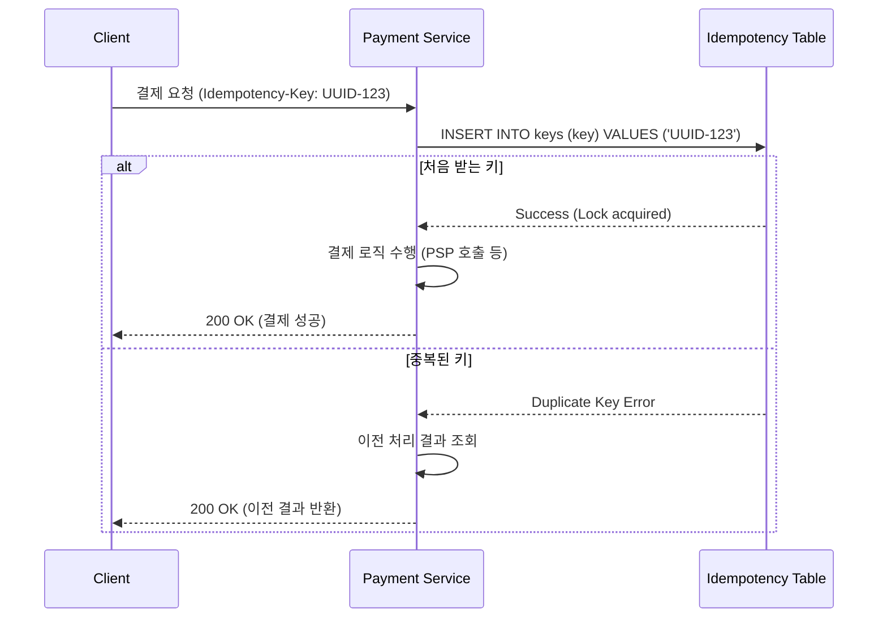
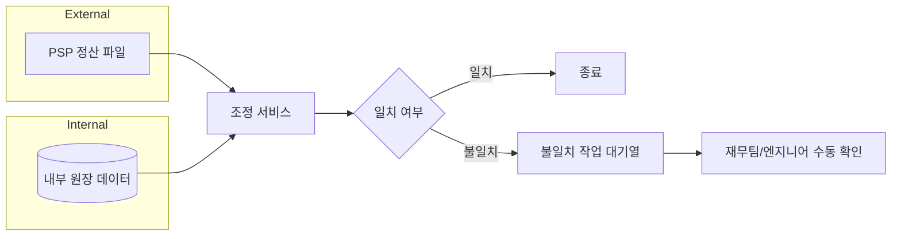
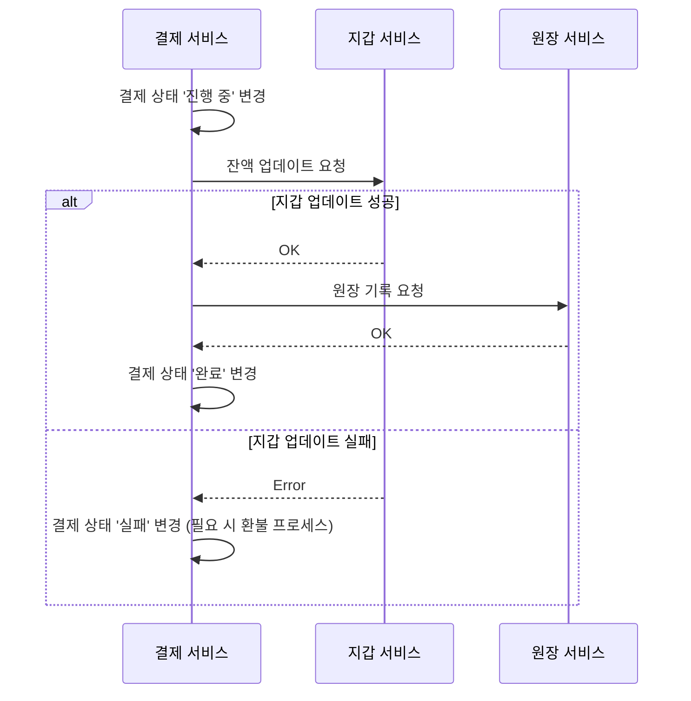

# 11장 결제 시스템: Deep Dive

이 문서는 11장 결제 시스템의 핵심 설계 원칙 중 독파하기 까다롭거나 실무에서 논쟁의 여지가 있는 주제들을 깊게 다룹니다. 모든 참여자가 장의 내용을 숙지했다는 전제하에, 단순 요약을 넘어선 설계의 이면을 탐구합니다.

---

## 핵심 3가지 (이것만 기억하자)

1. **정확히 한 번 전달의 본질**: 분산 시스템에서 '정확히 한 번'은 불가능에 가깝지만, '재시도'와 '멱등성'의 조합을 통해 비즈니스적으로는 완벽하게 구현 가능하다.
2. **조정(Reconciliation)은 구식인가?**: 실시간 일관성을 추구하더라도, 외부 시스템(은행, PSP)과의 최종 상태 일치 여부를 검증하는 비동기 조정 프로세스는 시스템의 최후 방어선이다.
3. **복식부기의 힘**: 원장 시스템에서 모든 거래의 합을 0으로 유지하는 복식부기는 단순한 기록을 넘어 자금 흐름의 무결성을 증명하는 유일한 방법이다.

---

## Topic A: 정확히 한 번 전달 = 재시도 × 멱등성

### 왜 어려운지
네트워크는 언제나 실패할 수 있습니다. 클라이언트가 요청을 보냈을 때 타임아웃이 발생하면, 서버가 요청을 처리하지 못한 것인지, 처리는 했으나 응답만 유실된 것인지 알 수 없습니다. 이때 무작정 재시도하면 이중 결제가 발생하고, 재시도하지 않으면 결제 누락이 발생합니다.

### 동작 원리
'정확히 한 번'은 **최소 한 번(재시도)**과 **최대 한 번(멱등성)**의 곱으로 완성됩니다.

### 함정
*   **키 생성 시점**: 멱등 키를 서버에서 생성해 클라이언트에 내려주면, 그 키를 받으러 가는 요청 자체가 실패할 경우 답이 없습니다. 멱등 키는 반드시 **결제 행위가 시작되는 최전선(클라이언트)**에서 생성해야 합니다.
*   **상태 전이**: 결제가 '진행 중'일 때 동일한 키로 요청이 오면 '이미 성공함'이 아니라 '처리 중'임을 알려야 합니다. 그렇지 않으면 클라이언트는 중복 요청을 계속 보낼 수 있습니다.

### 실무 시사점
실무에서는 장바구니 ID나 주문 ID를 멱등 키로 활용하는 경우가 많습니다. NestJS 기반 서버에서는 인터셉터나 미들웨어 수준에서 Redis를 활용한 분산 락과 멱등성 체크를 결합하여 구현하곤 합니다.

---

## Topic B: 조정(Reconciliation)은 왜 마지막 방어선인가

### 왜 어려운지
아무리 완벽한 멱등성을 갖춰도 외부 PSP나 은행 시스템 내부에서 오류가 발생할 수 있습니다. 또한 시스템 간의 상태 전이가 비동기적으로(웹훅 등) 일어날 때, 메시지가 유실되거나 순서가 뒤바뀌면 데이터 불일치가 발생합니다.

### 동작 원리
매일 밤 PSP가 제공하는 정산 파일과 내부 원장을 전수 비교합니다.

### 함정
조정은 실시간 문제를 해결해주지 않습니다. 조정은 **사후 교정** 도구입니다. 따라서 조정에만 의존하면 사용자에게 몇 시간 동안 잘못된 결제 상태를 보여줄 수 있습니다.

### 실무 시사점
게임 서버 환경에서는 아이템 지급 여부와 결제 완료 상태를 조정 프로세스에서 최종 확인합니다. 불일치가 발견되면 자동으로 아이템을 회수하거나, 지급되지 않은 아이템을 수동으로 지급하는 워크플로우를 갖춥니다.

---

## Topic C: 분산 결제 시스템의 일관성 전략

### 왜 어려운지
결제 서비스, 지갑 서비스, 원장 서비스가 각각 독립된 데이터베이스를 가질 때, 한 곳은 성공하고 한 곳은 실패하는 상황(Partial Failure)이 가장 치명적입니다. 하지만 2PC(Two-Phase Commit)는 성능 저하가 심해 고가용성이 필요한 결제 시스템에서는 기피됩니다.

### 동작 원리
결제 시스템은 강한 일관성(Strong Consistency)보다는 **결과적 일관성(Eventual Consistency)**과 **보상 트랜잭션**을 적절히 섞어서 사용합니다.

### 함정
데이터베이스 복제 지연(Replication Lag)으로 인해 사용자가 결제 직후 자신의 잔액을 조회했을 때 이전 잔액이 보이는 경우가 있습니다. 이를 해결하기 위해 결제와 관련된 중요한 읽기는 반드시 **주 데이터베이스(Primary/Master)**에서 수행해야 합니다.

### 실무 시사점
대규모 트래픽을 처리하는 환경에서는 카프카를 활용한 비동기 이벤트를 통해 서비스 간 상태를 맞춥니다. 이때 각 서비스는 이벤트를 소비할 때 반드시 멱등성을 보장해야 합니다.

---

## 트레이드오프 토론: 동기 vs 비동기 PSP 연동

결제 실행자가 PSP를 호출할 때 동기적으로 응답을 기다릴지, 아니면 요청만 보내고 웹훅을 기다릴지에 대한 선택입니다.

| 비교 축 | 동기 방식 (Direct API) | 비동기 방식 (Webhook) |
| :--- | :--- | :--- |
| **사용자 경험** | 결제 즉시 완료 화면 표시 가능 | 완료까지 대기 시간이 필요함 |
| **시스템 가용성** | PSP 장애 시 결제 서비스도 블로킹됨 | PSP 장애가 내부 시스템으로 전파되지 않음 |
| **복잡도** | 구현이 단순함 | 웹훅 수신, 폴링 로직 등 추가 구현 필요 |
| **적합한 사례** | 빠른 응답이 생명인 단건 결제 | 처리 시간이 긴 해외 결제나 고액 결제 |

**만약 결제 성공률이 99.9%인 PSP와 연동한다면?**
동기 방식을 기본으로 하되, 타임아웃 발생 시에만 비동기로 전환하여 최종 상태를 확인하는 하이브리드 전략이 유효할 수 있습니다.

---

## 실무 연결: NestJS + TypeORM 환경에서의 패턴

실무(NestJS 기반 서버)에서는 위 개념들을 다음과 같이 구현합니다.

1.  **Idempotency-Key 처리**:
    *   Redis를 사용하여 특정 키에 대한 요청을 10~30초간 락을 겁니다.
    *   이미 처리된 키라면 데이터베이스에 저장된 `PaymentResult`를 즉시 반환합니다.
2.  **Outbox 패턴**:
    *   결제 성공 시 지갑 업데이트나 푸시 알림 이벤트를 카프카로 발행할 때, DB 트랜잭션 내에 `outbox` 테이블에 메시지를 함께 저장합니다.
    *   이후 별도 릴레이 프로세스가 이를 카프카로 전송함으로써 DB 업데이트와 이벤트 발행의 원자성을 보장합니다.
3.  **Soft Delete와 불변성**:
    *   원장 데이터는 절대 수정(`UPDATE`)하지 않습니다. 잘못된 기록이 있다면 이를 상쇄하는 반대 거래 기록을 새로 추가(`INSERT`)하여 최종 합을 맞춥니다.

---

## 킬러 질문 3개

1.  **재결제 방지 vs 결제 누락**: 네트워크 불안정 상황에서 시스템은 "이중 결제를 막는 것"과 "결제 성공을 보장하는 것" 중 무엇을 우선해야 할까요? 두 가치를 동시에 달성하기 위한 최소한의 설계 장치는 무엇입니까?
2.  **조정 주기**: 조정 프로세스를 '매일 밤'이 아닌 '실시간'에 가깝게 운영한다면 어떤 기술적 도전 과제가 발생하며, 이를 통해 얻는 비즈니스 이득은 무엇입니까?
3.  **분산 데이터베이스 vs 합의 알고리즘**: 복제 지연 문제를 해결하기 위해 주 DB에서만 읽는 방식과 CockroachDB 같은 합의 기반 DB를 쓰는 방식 중, 결제 시스템의 특성을 고려할 때 어느 쪽이 더 지속 가능한 선택입니까?

---

## 오해하기 쉬운 부분

*   **"PSP가 멱등성을 지원하니 우리 서버는 신경 안 써도 된다"**: 아닙니다. PSP로 가는 요청 자체가 우리 서버 내부의 재시도 로직에 의해 중복 발생할 수 있습니다. 우리 서버 내부에서도 멱등 키를 관리해야 합니다.
*   **"금액을 float으로 써도 소수점 아래 2자리면 괜찮다"**: 아닙니다. 통화 단위에 따라(예: JPY) 소수점이 없거나, 암호화폐처럼 소수점 아래가 매우 긴 경우도 있습니다. 또한 누적 계산 시 오차가 증폭됩니다. 무조건 `string`이나 `long`(최소 단위 기준)을 사용해야 합니다.
