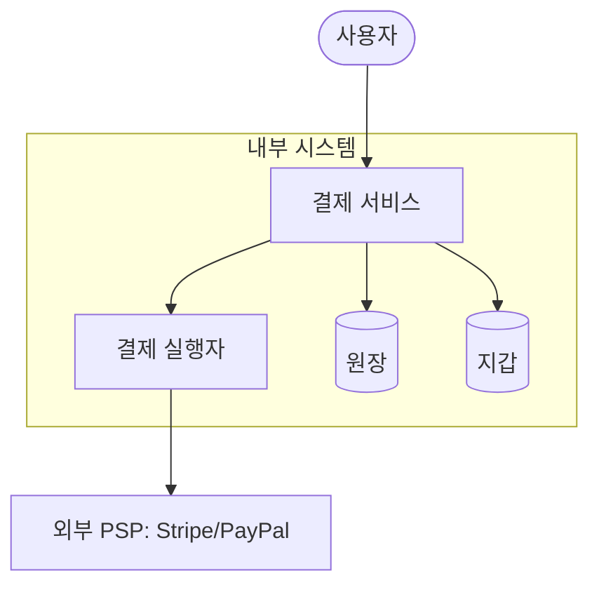
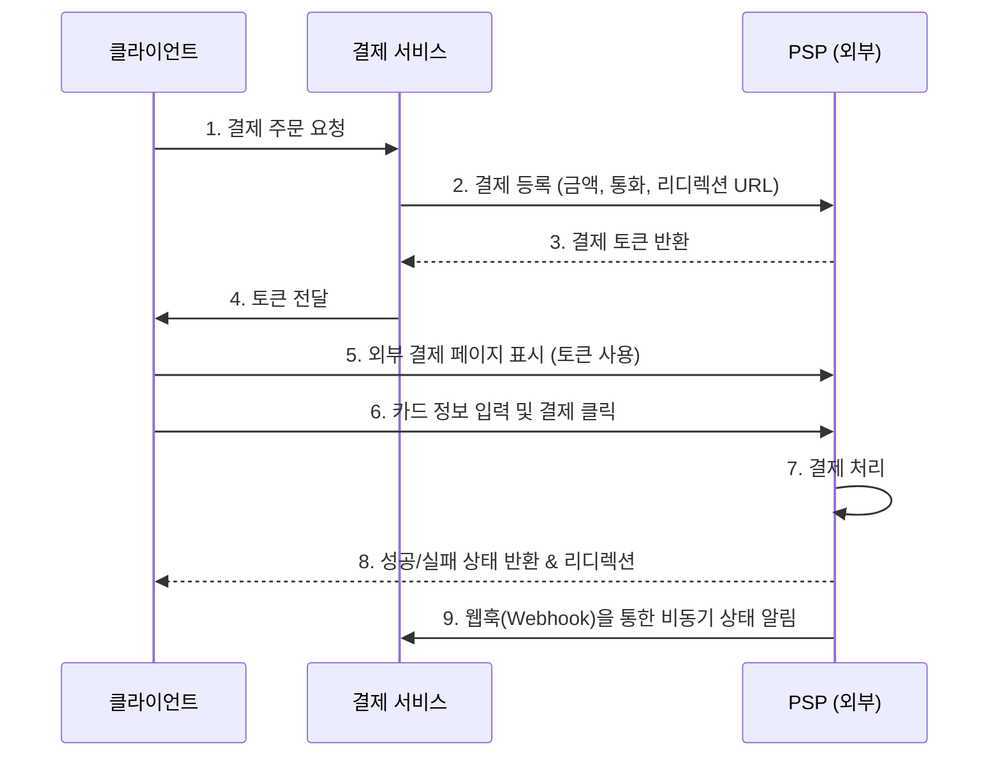

# Chapter 11: 결제 시스템 (Payment System) 발표 자료

> **발표자**: 길현준  

---

## 목차

1. [1단계: 문제 이해 및 설계 범위 확정](#1-1단계-문제-이해-및-설계-범위-확정)
2. [2단계: 개략적 설계](#2-2단계-개략적-설계)
3. [3단계: 상세 설계](#3-3단계-상세-설계)
4. [면접 질문 Q&A](#4-면접-질문-qa)
5. [토론 주제](#5-토론-주제)
6. [참고 자료](#6-참고-자료)

---

## 1. 1단계: 문제 이해 및 설계 범위 확정

### 결제 시스템이란?

**정의**: 금전적 가치의 이전을 통해 금융 거래를 정산하는 데 사용되는 모든 시스템(제도, 도구, 규칙, 절차 포함)을 의미합니다.

**실제 사례**:
- 전자상거래 결제 백엔드 (Amazon)
- 결제 서비스 공급자 (Stripe, PayPal)
- 디지털 지갑 (Apple Pay, Google Pay)

### ★ 요구사항 도출 (면접 대화 요약)

**지원자**: 어떤 결제 시스템을 만들어야 하나요?  
**면접관**: 아마존과 같은 전자상거래 애플리케이션을 위한 결제 백엔드를 구축한다고 가정합니다. 돈의 흐름에 대한 모든 것을 처리해야 합니다.

**지원자**: 어떤 결제 방법을 지원해야 하며, 직접 처리해야 하나요?  
**면접관**: 신용 카드 결제만 지원하며, 스트라이프(Stripe)나 브레인트리(Braintree) 같은 전문 결제 서비스 업체(PSP)를 사용합니다. 보안을 위해 카드 번호를 시스템에 직접 저장하지는 않습니다.

**지원자**: 거래 규모와 다른 필수 요건이 있을까요?  
**면접관**: 하루 100만 건의 거래를 처리해야 합니다. 또한 결제 서비스 간 상태 불일치를 해결하기 위한 조정(reconciliation) 작업이 필수적입니다.

### 기능 요구사항

| 요구사항 | 세부 내용 |
|----------|----------|
| **대금 수신(Pay-in)** | 결제 시스템이 판매자를 대신하여 고객으로부터 대금을 수령 |
| **대금 정산(Pay-out)** | 판매 대금에서 수수료를 제외한 금액을 전 세계 판매자에게 송금 |
| **조정(Reconciliation)** | 내부/외부 시스템 간 결제 정보가 일치하는지 비동기적으로 확인 |
| **장애 처리** | 결제 실패를 신중하게 처리하고 내결함성 확보 |

### 비기능 요구사항

- **신뢰성 및 내결함성**: 자금 흐름을 다루므로 작은 실수도 매출 손실과 신뢰 하락으로 이어짐
- **정확성**: 복식부기 원장 시스템을 통해 모든 거래를 엄격하게 기록
- **일관성**: 내부 서비스(지갑, 원장)와 외부 서비스(PSP) 간의 상태 일관성 보장

### QPS 계산 (Back-of-envelope)

```
일일 트랜잭션 = 1,000,000건
초당 트랜잭션(TPS) = 1,000,000 / 10^5 (약 100,000초) ≈ 10 TPS
```
> **참고**: 10 TPS는 일반적인 데이터베이스로도 충분히 처리 가능한 양입니다. 따라서 이 설계의 핵심은 처리 대역폭보다는 결제 트랜잭션의 **정확한 처리**와 **안전성**에 있습니다.

---

## 2. 2단계: 개략적 설계

### 대금 수신 및 정산 흐름

전자상거래 사이트의 결제는 크게 두 단계로 나뉩니다.
1. **대금 수신(Pay-in)**: 구매자의 돈이 전자상거래 업체의 계좌로 들어오는 과정
2. **대금 정산(Pay-out)**: 수수료를 제외한 돈이 판매자의 계좌로 나가는 과정

### API 설계

**주요 API: 결제 이벤트 실행**

```
POST /v1/payments
Parameters:
  - buyer_info (json): 구매자 정보
  - checkout_id (string): 결제 이벤트를 식별하는 고유 ID
  - credit_card_info (json): 암호화된 카드 정보 또는 결제 토큰
  - payment_orders (list): 결제 주문 목록 (금액, 통화, 판매자 정보 등 포함)
```

> ★ **중요**: 금액(`amount`) 필드는 `double`이 아닌 `string`으로 처리합니다. 프로토콜 간 숫자 정밀도 차이로 인한 반올림 오류를 방지하고, 매우 크거나 작은 숫자를 안전하게 보관하기 위함입니다.

### 개략적 아키텍처 (대금 수신 흐름)



| 컴포넌트 | 역할 | 특징 |
|----------|------|------|
| **결제 서비스** | 결제 이벤트 수락 및 전체 프로세스 조율 | 위험 점검(Risk Check) 수행 |
| **결제 실행자** | PSP를 통해 개별 결제 주문 실행 | 중복 제거 ID(Idempotency Key) 사용 |
| **원장(Ledger)** | 결제 트랜잭션에 대한 금융 기록 저장 | 복식부기 원칙 준수 |
| **지갑(Wallet)** | 판매자의 계정 잔액 관리 | 결제 완료 후 판매자 잔고 업데이트 |

### 핵심 개념: 복식부기 원장 시스템

**핵심 개념**: 모든 결제 거래를 두 개의 별도 계좌에 기록하여 합계를 0으로 만드는 회계 원칙입니다.

| 계정 | 차감(Debit) | 증가(Credit) |
|------|-------------|--------------|
| 구매자 | $1 | |
| 판매자 | | $1 |

- 자금 흐름을 시작부터 끝까지 추적 가능하며 일관성을 보장합니다.

---

## 3. 3단계: 상세 설계

### 외부 결제 페이지 이용 흐름 (Sequence Diagram)

카드 정보를 직접 저장하지 않기 위해 PSP가 제공하는 외부 결제 페이지를 활용합니다.



### 정확히 한 번 전달 (Exactly-once)

결제 시스템에서 가장 중요한 것은 **이중 결제 방지**입니다. 이를 위해 두 가지 메커니즘을 결합합니다.

1. **최소 한 번 실행 (재시도)**: 네트워크 오류 시 지수적 백오프(Exponential Backoff)를 사용하여 성공할 때까지 재시도합니다.
2. **최대 한 번 실행 (멱등성, Idempotency)**: 여러 번 요청해도 결과가 동일하도록 보장합니다.

### ★★ 핵심 개념: 멱등성 (Idempotency)

**멱등 키 설계 전략**:
- 클라이언트가 생성한 고유한 UUID를 HTTP 헤더(`Idempotency-Key`)에 담아 전송합니다.
- 데이터베이스의 **고유 키 제약 조건(Unique Key Constraint)**을 활용하여 중복 요청을 차단합니다.

| 시나리오 | 대응 방법 |
|----------|-----------|
| **버튼 중복 클릭** | 첫 번째 요청 처리 중이거나 완료된 경우, 동일한 멱등 키 요청은 무시하거나 이전 결과를 반환 |
| **네트워크 응답 유실** | 클라이언트가 재시도할 때 동일한 멱등 키를 사용하므로 PSP/서버는 중복 결제를 발생시키지 않음 |

### 조정 (Reconciliation)

분산 시스템에서 메시지 유실이나 장애는 불가피합니다. **조정**은 시스템의 마지막 방어선입니다.
- **정산 파일**: PSP나 은행이 매일 밤 제공하는 거래 내역 파일입니다.
- **비교 작업**: 정산 파일의 내역과 내부 원장의 데이터를 주기적으로 비교합니다.
- **불일치 해결**: 발견된 차이는 수동으로 조사하거나 미리 정의된 절차에 따라 자동 수정합니다.

### 결제 실패 처리 및 모니터링

- **재시도 큐**: 네트워크 일시 오류 등 재시도가 가능한 경우에 사용합니다.
- **실패 메시지 큐 (DLQ)**: 반복 실패하여 정밀 조사가 필요한 메시지를 격리합니다.
- **결제 지연**: PSP에서 위험 검토 등의 이유로 결제가 '대기(Pending)' 상태가 될 수 있으므로, 웹훅이나 폴링을 통해 최종 상태를 추적해야 합니다.

---

## 4. 면접 질문 Q&A

### Q1. 왜 결제 금액을 정밀도가 높은 float/double 대신 string으로 저장하나요?

**Answer**:
> 자료형 `double`은 직렬화/역직렬화 과정에서 하드웨어나 소프트웨어에 따라 정밀도가 달라질 수 있어 미세한 반올림 오류를 유발할 수 있기 때문입니다.

> **핵심 포인트**:
> - 결제 시스템에서 작은 반올림 오류도 허용되기 어렵습니다.
> - 따라서 저장과 전송 단계에서는 문자열로 보관하고, 표시하거나 계산할 때만 숫자로 변환하는 편이 안전합니다.

### Q2. 멱등 키(Idempotency Key)의 만료 시간은 어떻게 정해야 하나요?

**Answer**:
> 책의 핵심은 구체적인 시간값보다 **클라이언트가 생성하고 일정 시간이 지나면 만료되는 고유 값**을 사용한다는 점입니다. 중요한 것은 재시도 구간 동안 같은 결제 요청을 같은 멱등 키로 식별할 수 있어야 한다는 것입니다.

### Q3. 조정(Reconciliation) 과정에서 데이터가 너무 많아 성능 문제가 발생하면 어떻게 하나요?

**Answer**:
> 책에서는 매일 밤 PSP나 은행이 보내는 정산 파일을 읽어 내부 원장과 비교하는 방식을 설명합니다. 핵심은 성능 최적화 자체보다, 불일치를 발견했을 때 이를 자동 수정 가능한 유형, 수동 수정이 필요한 유형, 분류 불가능한 유형으로 나누어 처리하는 운영 절차를 갖추는 것입니다.

### Q4. 신용 카드 정보를 직접 저장하지 않아도 PCI DSS를 준수해야 하나요?

**Answer**:
> 책의 요점은 카드 정보를 내부에 저장하지 않으면 PCI DSS 같은 복잡한 규정을 직접 감당해야 하는 부담을 크게 줄일 수 있다는 것입니다. 그래서 많은 기업이 PSP가 제공하는 외부 결제 페이지를 사용하고, 민감한 카드 정보 수집과 저장은 PSP에 맡깁니다.

---

## 5. 토론 주제

### 토론 1: 동기식 vs 비동기식 결제 처리

**질문**: 결제 완료 응답을 사용자에게 즉시 보여주기 위해 동기식으로 처리하는 것과, 안정성을 위해 비동기로 처리하는 것 중 어떤 것이 더 유리할까요?

**토론 포인트**:
- 동기식: 사용자 경험이 좋지만, 외부 PSP 장애 시 시스템 전체가 마비될 수 있음 (장애 격리 곤란)
- 비동기식: 시스템 확장성이 높고 장애에 강하지만, 사용자가 결제 상태를 확인하기 위해 폴링하거나 기다려야 함
- 절충안: 결제 요청 접수는 빠르게 끝내고, 상태 변경은 웹훅이나 별도 상태 확인 페이지로 반영

### 토론 2: 조정과 실시간 정확성 사이의 균형

**질문**: 결제 시스템이 이미 멱등성, 재시도, 원장 기록을 갖추고 있다면, 왜 여전히 야간 조정 배치가 필요할까요?

**토론 포인트**:
- 실시간 처리 경로만으로는 외부 PSP/은행과의 최종 상태 일치를 보장하기 어려움
- 조정은 사후 교정 수단이므로, 사용자에게 잠시 잘못된 상태가 보일 수 있음
- 자동 수정 가능한 불일치와 재무팀 수동 개입이 필요한 불일치를 어떻게 나눌 것인가

---

## 6. 참고 자료

### 장에서 직접 언급된 참고 링크
- [Payment system](https://en.wikipedia.org/wiki/Payment_system)
- [Stripe API Reference](https://stripe.com/docs/api)
- [Double-entry bookkeeping](https://en.wikipedia.org/wiki/Double-entry_bookkeeping)
- [Books, an immutable double-entry accounting database service](https://developer.squareup.com/blog/books-an-imutable-double-eniry-accounting-database-service/)
- [Payment Card Industry Data Security Standard](https://en.wikipedia.org/wiki/Payment_Card_Industry_Data_Security_Standard)
- [Stripe Webhooks](https://stripe.com/docs/webhooks)
- [Stripe Idempotent Requests](https://stripe.com/docs/api/idempotent_requests)

### 장 내 핵심 연결 포인트

| 항목 | 장에서의 역할 | 발표 때 짚을 포인트 |
|------|------|------|
| **PSP** | 카드 결제 실행 담당 | 민감한 카드 정보 처리를 외부로 위임함 |
| **복식부기 원장** | 거래 무결성 보장 | 모든 거래 항목의 합계는 0이어야 함 |
| **조정** | 최종 상태 검증 | 내부 시스템과 외부 정산 파일을 비교하는 마지막 방어선 |

---

## 11장 요약 마인드맵

```
결제 시스템
├── 1단계: 요구사항
│   ├── 기능: 대금 수신(Pay-in), 대금 정산(Pay-out), 조정
│   ├── 비기능: 신뢰성, 정확성(복식부기), 멱등성
│   └── QPS: 10 TPS (안전성 최우선)
├── 2단계: 개략적 설계
│   ├── API: POST /v1/payments (금액은 string)
│   ├── 아키텍처: 결제 서비스, 실행자, 원장, 지갑, PSP 연동
│   └── 핵심 알고리즘: 복식부기 원장 (합계 0)
├── 3단계: 상세 설계
│   ├── 안전성: 멱등 키 + 고유 키 제약 조건으로 이중 결제 방지
│   ├── 장애 처리: 지수적 백오프 재시도, DLQ
│   └── 검증: 정산 파일을 활용한 외부 시스템과의 조정
└── 핵심 포인트
    ├── 이중 결제 방지는 멱등성이 핵심
    └── 데이터 일관성을 위한 마지막 방어선은 조정
```

---

*Last Updated: 2026-04-02*
