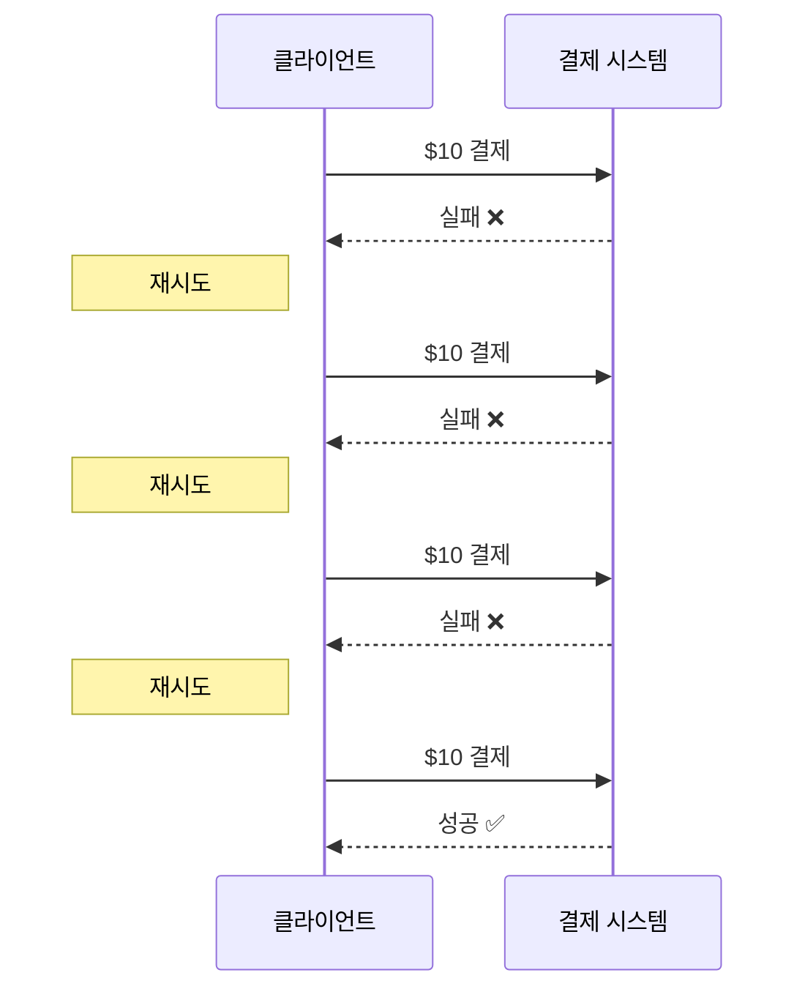

전자상거래를 가능하게 하는 것이 결제 시스템이다.   
안정적이고 확장 가능하며 유연한 결제 시스템은 필수다.

# 1단계: 문제 이해 및 설계 범위 확정
```
어떤 결제 시스템을 만들어야 하나요?
>> 아마존닷컴과 같은 전자상거래 애플리케이션을 위한 결제 백엔드를 구축한다고 가정
>> 고객이 아마존에서 주문을 하면 결제 시스템은 돈의 흐름에 대한 모든 것을 처리

어떤 결제 방법을 지원? 신용 카드, 페이팔, 은행 카드?
>> 결제 시스템은 실생활에서 사용 가능한 모든 옵션 지원
>> 하지만 이번에는 신용 카드 결제만 처리

신용 카드 결제 처리를 직접 해야 하나요?
>> 아니요
>> 스트라이프, 브레인트리, 스퀘어 같은 전문 결제 서비스 업체 사용

신용 카드 데이터를 시스템에 저장해야 하나요?
>> 보안 및 법규 준수에 대한 요건이 아주 까다로운 관계로, 카드 번호를 시스템에 직접 저장X
>> 민감한 신용 카드 데이터 처리는 결제 처리 업체에 의존

전 세계 대상? 다양한 통화 및 국제 결제 지원?
>> 예
>> 하지만 이번에는 하나의 통화만 사용한다고 가정

하루에 몇 건의 결제가 이루어지나요?
>> 하루 100만 건의 거래

아마존과 같은 전자상거래 사이트에서 매월 판매자에게 대금을 지급하는 절차를 지원?
>> 네

다른 주의사항은?
>> 결제 시스템은 많은 내부 서비스(계정, 분석 등) 및 외부 서비스(결제 서비스 공급자)와 연동
>> 한 서비스에 장애가 발생하면 서비스 간 상태가 달라짐
>> 따라서 조정 작업을 수행하고 불일치하는 부분이 발견되면 교정 필수
```

## 기능 요구사항
- 대금 수신(pay-in) 흐름: 결제 시스템이 판매자를 대신하여 고객으로부터 대금 수령
- 대금 정산(pay-out) 흐름: 결제 시스템이 전 세계의 판매자에게 제품 판매 대금 송금

## 비기능 요구사항
- 신뢰성 및 내결함성: 결제 실패는 신중하게 처리
- 내부 서비스(결제 시스템, 회계 시스템)와 외부 서비스(결제 서비스 제공업체) 간의 조정 프로세스: 시스템 간의 결제 정보가 일치하는지 비동기적으로 확인

## 개략적인 규모 추정
하루에 100만 건의 트랜잭션을 처리해야 하는데, 이는 1,000,000건의 트랜잭션/10^5초 = 초당 10건의 트랜잭션(TPS)이다.

10TPS는 일반적인 DB로 별 문제 없이 처리 가능한 양이므로, 처리 대역폭 대신 결제 트랜잭션의 정확한 처리에 초점을 맞춰 진행해야 한다.

---

# 2단계: 개략적 설계안 제시 및 동의 구하기
결제 흐름은 자금의 흐름을 반영하기 위해 크게 두 단계로 세분화 된다.
- 대금 수신 흐름
- 대금 정산 흐름


구매자가 주문을 하면 아마존의 은행계좌로 돈이 들어오는데, 이것이 바로 대금 수신 흐름이다.

이 돈은 아마존의 은행 계좌에 있지만 소유권이 전부 아마존에 있는 것은 아니다.   
판매자가 상당 부분을 소유하며, 아마존은 수수료를 받고 자금 관리자 역할만 수행한다.

나중에 제품이 배송되고 나면, 그때까지 계좌에 묶여 있던 판매 대금에서 수수료를 제외한 잔액이 판매자의 은행 계좌로 지급된다.   
이것이 대금 정산 흐름이다.

## 대금 수신 흐름


1. 사용자가 '주문하기' 버튼을 클릭하면 결제 이벤트가 생성되어 결제 서비스로 전송
2. 결제 서비스는 결제 이벤트를 DB에 저장
3. 때로는 단일 결제 이벤트에 여러 결제 주문 포함 가능
    - 예) 한 번 결제로 여러 판매자의 제품을 처리하는 경우
    - 전자상거래 웹사이트에서 한 결제를 여러 결제 주문으로 분할하는 경우, 결제 서비스는 결제 주문마다 결제 실행자를 호출
4. 결제 실행자는 결제 주문을 DB에 저장
5. 결제 실행자가 외부 PSP를 호출하여 신용 카드 결제 처리
6. 결제 실행자가 결제를 성공적으로 처리하고 나면 결제 서비스는 지갑을 갱신하여 특정 판매자의 잔고를 기록
7. 지갑 서버는 갱신된 잔고 정보를 DB에 저장
8. 지갑 서비스가 판매자 잔고를 성공적으로 갱신하면 결제 서비스는 원장을 호출
9. 원장 서비스는 새 원장 정보를 DB에 추가

### 결제 서비스
사용자로부터 결제 이벤트를 수락하고 결제 프로세스를 조율한다.

일반적으로 가장 먼저 하는 일은 AML/CFT와 같응ㄴ 규정을 준수하는지, 자금 세탁이나 테러 자금 조달과 같은 범죄 행위의 증거가 있는지 평가하는 risk check이다.

결제 서비스는 이 위험 확인을 통과한 결제만 처리한다.   
일반적으로 위험 확인 서비스는 매우 복잡하고 고도로 전문화되어 있기 때문에 제3자 제공업체를 이용한다.

### 결제 실행자
결제 실행자는 결제 서비스 공급자(PSP)를 통해 결제 주문 하나를 실행한다.   
하나의 결제 이벤트에는 여러 결제 주문이 포함될 수 있다.

### 결제 서비스 공급자
결제 서비스 공급자(PSP, Payment Service Provider)는 A 계정에서 B 계정으로 돈을 옮기는 역할을 담당한다.

### 카드 유형
카드사는 신용 카드 업무를 처리하는 조직이다.

### 원장
원장(ledger)은 결제 트랜잭션에 대한 금융 기록이다.

예를 들어 사용자가 판매자에게 1달러를 결제하면 사용자로부터 1달러를 인출하고 판매자에게 1달러를 지급하는 기록을 남긴다.

원장 시스템은 전자상거래 웹사이트의 총 수익을 계산하거나 향후 수익을 예측하는 등, 결제 후 분석에서 매우 중요한 역할을 한다.

### 지갑
지갑(wallet)에는 판매자의 계정 잔액을 기록한다.   
특정 사용자가 결제한 총 금액을 기록할 수도 있다.

## 결제 서비스 데이터 모델
결제 서비스에는 결제 이벤트와 결제 주문의 두 개 테이블이 필요하다.   
결제 시스템용 저장소 솔루션을 고를 때 성능보다 다음 사항에 중점을 둔다.

1. 안정성이 검증되었는가? 즉, 다른 대형 금융 회사에서 수년동안 긍정적인 피드백을 받으며 사용된 적이 있는가?
2. 모니터링 및 데이터 탐사에 필요한 도구가 풍부하게 지원되는가?
3. DBA 채용 시장이 성숙했는가? 다시 말해 숙련된 DBA를 쉽게 채용할 수 있는가?

일반적으로는 NoSQL/NewSQL보다는 ACID 트랜잭션을 지원하는 전통적인 RDB를 선호한다.

결제 이벤트 테이블에는 자세한 결제 이벤트 정보가 저장된다.
- 한 번의 결제 행위는 하나의 결제 이벤트를 만들고, 하나의 결제 이벤트에는 여러 개의 결제 주문 포함 가능
- 구매자의 신용카드에서 금액 공제 시 타사 PSP를 호출하면, 판매자 대신 전자상거래 웹사이트의 은행 계좌에서 이체 후 대금 수신
- 제품이 배송되는 등 대금 정산 조건이 충족되면 해당 대금을 판매자에게 정산하는 절차를 시자갛여, 전자상거래 웹사이트의 은행 계좌에서 판매자의 은행 계좌로 금액 이체
    - 사용자의 결제를 처리하는 중에는 판매자의 은행 계좌가 아닌, 구매자의 카드 정보만 필요

결제 주문의 실행 상태의 ENUM 업데이트 로직은 다음과 같다.

1. 초깃값은 NOT_STARTED
2. 결제 서비스는 결제 실행자에 주문을 전송하면 EXECUTING으로 변경
3. 결제 서비스는 결제 처리자의 응답에 따라 SUCCESS 또는 FAIL로 변경

일반적으로 종결되지 않은 결제 주문을 모니터링 하기 위해 주기적으로 실행되는 작업을 마련해둔다.   
해당 작업은 임계값 형태로 설정된 기간이 지나도록 완료되지 않은 결제 주문이 있을 경우 살펴보도록 엔지니어에게 경보를 보낸다.

## 복식부기 원장 시스템
원장 시스템에는 복식부기(double-entry)라는 아주 중요한 설계 원칙이 있다.

복식부기는 모든 결제 시스템에 필수 요소이며 정확한 기록을 남기는 데 핵심적 역할을 한다.   
모든 결제 거래를 두 개의 별도 원장 계좌에 같은 금액으로 기록한다.   
한 계좌에서는 차감이 이루어지고 다른 계좌에는 입금이 이루어진다.

복식부기 시스템에서 모든 거래 항목의 합계는 0이어야 한다.   
이 시스템을 확용하면 자금의 흐름을 시작부터 끝까지 추적할 수 있으며 결제 주기 전반에 걸쳐 일관성을 보장할 수 있다.

## 외부 결제 페이지
웹사이트의 경우 이 외부 신용 카드 페이지는 위젯 또는 iframe이며, 모바일 애플리케이션의 경우에는 결제 SDK에 포함된 사전에 구현된 페이지다.

여기서 중요한 점은 우리 결제 서비스가 아니라 PSP가 제공하는 외부 결제 페이지가 직접 고객 카드 정보를 수집한다는 것이다.

## 대금 정산 흐름
대금 정산(pay-out) 흐름의 구성 요소는 대금 수신 흐름과 아주 유사하다.

한 가지 차이는 PSP를 사용하여 구매자의 신용 카드에서 전자상거래 웹사이트 은행 계좌로 돈을 이체하는 대신,   
정산 흐름에서는 타사 정산 서비스를 사용하여 전자상거래 웹사이트 은행 계좌에서 판매자 은행 계좌로 돈을 이체한다는 점이다.

---

# 3단계: 상세 설계
시스템을 더 빠르고 강력하며 안전하게 만드는 데 초점을 맞춘다.   
분산 시스템에서 오류와 장애는 피할 수 없을 뿐만 아니라 흔한 일이다.

## PSP 연동
다음 두 가지 방법 중 하나로 결제 시스템을 PSP와 연동한다.
1. 회사가 민감한 결제 정보를 안전하게 저장할 수 있다면 API를 통해 PSP와 연동하는 방법을 택할 수 있다.
    - 회사는 결제 웹페이지를 개발하고 민감한 결제 정보를 수집하며, PSP는 은행 연결, 다양한 카드 유형을 지원하는 역할을 한다.
2. 복잡한 규정 및 보안 문제로 인해 민감한 결제 정보를 저장하지 않기로 결정한 경우, PSP는 카드 결제 세부 정보를 수집하여 PSP에 안전하게 저장할 수 있도록 외부 결제 페이지를 제공한다. (대부분 이 방법을 채택)


1. 사용자가 클라이언트 브라우저에서 '결제' 버튼을 클릭하고, 클라이언트는 결제 주문 정보를 담아 결제 서비스를 호출
2. 결제 주문 정보를 수신한 결제 서비스는 결제 등록 요청을 PSP로 전송
    - 이 등록 요청에는 결제 금액, 통화, 결제 요청 만료일, 리디렉션 URL 등의 결제 정보 포함
    - 결제 주문이 정확히 한 번만 등록될 수 있도록 UUID 필드를 두고, 결제 주문의 ID로 사용
3. PSP는 결제 서비스에 토큰을 반환
    - 토큰은 등록된 결제 요청을 유일하게 식별하는, PSP가 발급한 UUID이고, 결제 등록 및 결제 실행 상태 확인 가능
4. 결제 서비스는 PSP가 제공하는 외부 결제 페이지를 호출하기 전에 토큰을 DB에 저장
5. 토큰을 저장하고 나면 클라이언트는 PSP가 제공하는 외부 결제 페이지를 표시
    - 모바일 애플리케이션은 일반적으로 이를 위해 PSP SDK를 연동
    - 외부 결제 페이지는 일반적으로 다음 두 가지 정보 필요
        1. 4단계에서 받은 토큰
        2. 리디렉션 URL
6. 사용자는 신용 카드 번호, 소유자 이름, 카드 유효기간 등의 결제 세부 정보를 PSP의 웹 페이지에 입력한 다음 결제 버튼을 클릭
    - PSP가 결제 처리 시작
7. PSP가 결제 상태 반환
8. 이제 사용자는 리디렉션 URL 가리키는 웹 페이지로 보내지며, 이때 보통 7단계에서 수신된 결제 상태가 URL에 추가
9. 비동기적으로 PSP는 웹훅을 통해 결제 상태와 함께 결제 서비스를 호출
    - 웹훅은 결제 시스템 측에서 PSP를 처음 설정할 때 등록한 URL
    - 결제 시스템이 웹훅을 통해 결제 이벤트를 다시 수신하면 결제 상태를 추출하여 결제 주문 DB 테이블의 payment_order_status 필드를 최신 상태로 갱신

실제로 장애가 발생하면 체계적으로 처리할 수 있는 방법은 조정(reconciliation)이다.

## 조정
시스템 구성 요소가 비동기적으로 통신하는 경우 메시지가 전달되거나 응답이 반환된다는 보장이 없다.   
이는 시스템 성능을 높이기 위해 비동기 통신을 자주 사용하는 결제 관련 사업에 일반적인 문제다.   
PSP나 은행 같은 외부 시스템도 비동기 통신을 선호한다.

관련 서비스 간의 상태를 주기적으로 비교하여 일치하는지 확인한다.   
일반적으로 결제 시스템의 마지막 방어선으로 받아들여진다.

매일 밤 PSP나 은행은 고객에게 정산 파일을 보낸다.   
정산 파일에는 은행 계좌의 잔액과 하루 동안 해당 계좌에서 발생한 모든 거래 내역이 기재되어 있다.

조정 시스템은 정산 파일의 세부 정보를 읽어 원 장 시스템과 비교한다.


조정은 결제 시스템의 내부 일관성을 확인할 때도 사용된다.   
예를 들어, 원장과 지갑의 상태가 같은지 확인할 수 있다.

조정 중에 발견된 차이는 일반적으로 재무팀에 의뢰하여 수동으로 고친다.   
발생 가능한 불일치 문제 및 해결 방안은 다음 세 가지 범주로 나눌 수 있다.

1. 어떤 유형의 문제인지 알고 있으며 문제 해결 절차를 자동화할 수 있는 경우
    - 원인과 해결 방법을 알고 있으며, 자동화 프로그램을 작성하는 것이 비용 효율적인 경우
    - 엔지니어는 발생한 불일치 문제의 분류와 조정 작업을 모두 자동화 가능
2. 어떤 유형의 문제인지는 알지만 문제 해결 절차를 자동화할 수는 없는 경우
    - 불일치의 원인과 해결 방법을 알고는 있지만 자동 조정 프로그램의 작성 비용이 너무 높음
    - 발생한 불일치 문제는 작업 대기열에 넣고 재무팀에서 수동으로 수정
3. 분류할 수 없는 유형의 문제인 경우
    - 불일치가 어떻게 발생했는지 알지 못하는 경우
    - 이런 불일치 문제는 특별 작업 대기열에 넣고 재무팀에서 조사

## 결제 지연 처리
결제 요청은 많은 컴포넌트를 거치며, 내부 및 외부의 다양한 처리 주체와 연동한다.   
다음은 결제 요청이 평소보다 오래 걸리게 되는 몇가지 사례다.
- PSP가 해당 결제 요청의 위험성이 높다고 보고 담당자 검토를 요구하는 경우
- 신용 카드사가 구매 확인 용도로 카드 소유자의 추가 정보를 요청하는 3D 보안 인증 같은 추가 보호 장치를 요구하는 경우

결제 서비스는 처리하는 데 시간이 오래 걸리는 이런 요청도 처리할 수 있어야 한다.   
구매 페이지가 외부 PSP에 호스팅 되는 경우 PSP는 다음과 같이 처리한다.
- PSP는 결제가 pending 상태임을 알리는 상태 정보를 클라이언트에 반환하고, 클라이언트는 이를 사용자에게 표시
    - 클라이언트는 또한 고객이 현재 결제 상태를 확인할 수 있는 페이지도 제공
- PSP는 우리 회사를 대신하여 대기 중인 결제의 진행 상황을 추적하고, 상태가 바뀌면 PSP에 등록된 웹훅을 통해 결제 서비스에 알림

결제 요청이 최종적으로 완료되면 PSP는 방금 언급한 사전에 등록된 웹훅을 호출한다.   
결제 서비스는 내부 시스템에 기록된 정보를 업데이트하고 고객에게 배송을 완료한다.

어떤 PSP는 웹훅을 통해 결제 서비스에 결제 상태 변경을 알리는 대신,   
결제 서비스로 하여금 대기 중인 결제 요청의 상태를 주기적으로 polling하도록 하기도 한다.

## 내부 서비스 간 커뮤니케이션
### 동기식 통신
HTTP와 같은 동기식 통신은 소규모 시스템에서는 잘 동작하지만 규모가 커지면 단점이 분명해진다.
- 성장 저하
- 장애 격리 곤란
- 높은 결합도
- 낮은 확장성

### 비동기 통신
비동기 통신은 크게 두 가지 범주로 나눌 수 있다.

#### 단일 수신자
각 메시지는 하나의 수신자 또는 서비스가 처리한다.


#### 다중 수신자
각 메시지는 여러 수신자 또는 서버가 처리한다.   
카프카는 이런 시나리오를 잘 처리할 수 있다.

소비자가 수신한 메시지는 카프카에서 바로 사라지지 않는다.   
따라서 동일한 메시지를 여러 서비스가 받아 처리할 수 있다.   
따라서 결제 시스템 구현에 적합한데, 하나의 요청이 푸시 알림 전송, 재무 보고 업데이트, 분석 결과 업데이트 등의 다양한 용도에 쓰일 수 있다.

카프카에 발행된 하나의 결제 이벤트가 결제 시스템, 분석 서비스, 결제 청구(billing) 서비스 등에 입력으로 활용된다.


## 결제 실패 처리
모든 결제 시스템은 실패한 결제를 적절히 처리할 수 있어야 한다.   
안정성 및 결함 내성은 결제 시스템의 핵심적 요구사항이다.

### 결제 상태 추적
결제 주기의 모든 단계에서 결제 상태를 정확하게 유지하는 것은 매우 중요하다.   
실패가 일어날 때마다 결제 거래의 현재 상태를 파악하고 재시도 또는 환불이 필요한지 여부를 결정한다.   
결제 상태는 데이터 추가만 가능한 DB 테이블에 보관한다.

### 재시도 큐 및 실패 MQ
실패를 우아하게 처리하기 위해서는 retry queue와 dead letter queue를 두는 것이 바람직하다.


1. 재시도가 가능한지 확인
    1. 재시도 가능 실패는 재시도 큐로 전송
    2. 잘못된 입력과 같이 재시도가 불가능한 실패는 오류 내역을 DB에 저장
2. 결제 시스템은 재시도 큐에 쌓인 이벤트를 읽어 실패한 결제를 재시도
3. 결제 거래가 다시 실패하는 경우에는 다음과 같이 처리
    1. 재시도 횟수가 임계값 이내라면 해당 이벤트를 다시 재시도 큐로 전송
    2. 재시도 횟수가 임계값을 넘으면 해당 이벤트를 실패 MQ에 넣고, 이런 이벤트에 대해서는 별도 조사가 필요할 수도 있음

## 정확히 한 번 전달
결제 시스템에 발생 가능한 가장 심각한 문제 중 하나는 고객에게 이중으로 청구하는 것이다.   
결제 주문이 정확히 한 번만 실행되도록 결제 시스템을 설계하는 것이 중요하다.

문제를 두 부분으로 나누면 훨씬 쉽게 해결할 수 있다.   
다음의 요건이 충족되면 주어진 연산은 정확히 한 번 실행된다.
1. 최소 한 번은 실행된다.
2. 최대 한 번 실행된다.

재시도를 통해 최소 한 번 실행을 보증하는 방법과,   
멱등성 검사를 통해 최대 한 번 실행을 보증하는 방법을 알아보자.

### 재시도
재시도 메커니즘을 활용하면 어떤 결제가 최소 한 번은 실행되도록 보장 가능하다.



재시도 메커니즘을 도입할 때는 얼마나 간격을 두고 재시도할지 정하는 것이 중요하다.

- 즉시 재시도(immediate retry)
    - 클라이언트는 즉시 요청을 다시 전송
- 고정 간격(fixed interval)
    - 재시도 전에 일정 시간 기다리는 방안
- 증분 간격(incremental interval)
    - 재시도 전에 기다리는 시간을 특정한 양 만큼 점진적으로 늘려 나가는 방안
- 지수적 백오프(exponential backoff)
    - 재시도 전에 기다리는 시간을 직전 재시도 대비 두 배씩 늘려 나가는 방안
- 취소(cancel)
    - 요청을 철회하는 방안
    - 실패가 영구적이거나 재시도를 하더라도 성공 가능성이 낮은 경우에 흔히 사용되는 방안

'모든 상황에 맞는' 해결책은 없다.

일반적으로 적용 가능한 지침은, 네크워크 문제가 단시간 내에 해결 될 것 같지 않다면 지수적 백오프를 사용하라는 것이다.

재시도 시 발생할 수 있는 잠재적 문제는 이중 결제다.
- 시나리오 1
    - 결제 시스템이 외부 결제 페이지를 통해 PSP와 연동하는 환경에서 클라이언트가 결제 버튼을 두 번 중복 클릭
- 시나리오 2
    - PSP가 결제를 성공적으로 했으나 네트워크 오류로 인해 응답이 결제 시스템에 도달X
    - 사용자가 '결제' 버튼을 다시 클릭하거나 클라이언트가 결제를 재시도

이중 결제를 방지하려면 결제는 '최대 한 번' 이루어져야 한다.   
'최대 한 번 실행'은 다른 말로 멱등성(idempotency)이라고도 부른다.

### 멱등성
멱등성은 최대 한 번 실행을 보장하기 위한 핵심 개념으로,   
연산을 여러 번 실행해도 최초 실행 결과가 그대로 보존되는 특성을 일컫는다.

#### 시나리오 1: 고객이 '결제' 버튼을 빠르게 두 번 클릭하는 경우
사용자가 '결제'를 클릭하면 멱등 키가 HTTP 요청의 일부로 결제 시스템에 전송된다.

결제 시스템은 두 번째 요청을 재시도로 처리하는데, 요청에 포함된 멱등 키를 이전에 받은 적이 있기 때문이다.   
그런 경우 결제 시스템은 이전 결제 요청의 가장 최근 상태를 반환한다.


동일한 멱등 키로 동시에 많은 요청을 받으면 결제 서비스는 그 가운데 하나만 처리하고 나머지에 대해서는 **429 Too Many Requests** 상태 코드를 반환한다.

멱등성을 지원하는 한 가지 방법은 DB의 고유 키 제약 조건을 활용하는 것이다.
1. 결제 시스템은 결제 요청을 받으면 DB 테이블에 새 레코드를 넣으려 시도
2. 새 레코드 추가에 성공했다는 것은 이전에 처리한 적이 없는 결제 요청이라는 뜻
3. 새 레코드 추가에 실패했다는 것은 이전에 받은 적이 있는 결제 요청이라는 뜻

#### 시나리오 2: PSP가 결제를 성공적으로 처리했지만 네트워크 오류로 응답이 결제 시스템에 전달되지 못하여, 사용자가 '결제' 버튼을 다시 클릭하는 경우
결제 서비스는 PSP에 비중복 난수를 전송하고 PSP는 해당 난수에 대응되는 토큰을 반환하다.   
이 난수는 결제 주문을 유일하게 식별하는 구실을 하며, 해당 토큰은 그 난수에 일대일로 대응된다.   
따라서 토큰 또한 결제 주문을 유일하게 식별 가능하다.

사용자가 '결제' 버튼을 다시 누른다 해도 결제 주문이 같으니 PSP로 전송되는 토큰도 같다.   
PSP는 이 토큰을 멱등 키로 사용하므로, 이중 결제로 판단하고 종전 실행 결과를 반환한다.

## 일관성
결제 실행 과정에서 상태 정보를 유지 관리하는 여러 서비스가 호출된다.
1. 결제 서비스는 비중복 난수, 토큰, 결제 주문, 실행 상태 등의 결제 관련 데이터를 유지 관리
2. 원장은 모든 회계 데이터를 보관
3. 지갑은 판매자의 계정 잔액을 유지
4. PSP는 결제 실행 상태를 유지
5. 데이터는 안정성을 높이기 위해 여러 DB 사본에 복제 가능

데이터를 다중화하는 경우에는 복제 지연으로 인해 기본 DB와 사본 데이터가 불일치하는 일이 생길 수 있다.   
일반적으로 이 문제에는 두 가지 해결 방법이 있다.
1. 주 DB에서만 읽기와 쓰기 연산을 처리한다.
    - 이 접근법은 설정하기는 쉽지만 규모 확장성이 떨어진다는 단점
    - 사본은 데이터 안정성 보장에만 활용되고 트래픽은 처리X
    - 따라서 자원 낭비
2. 모든 사본이 항상 동기화
    - 합의 알고리즘을 사용하거나, 합의 기분 분산 DB 사용

---

# 4단계: 마무리

언급할 가치가 있는 주제가 많이 남아 있다.

- 모니터링
- 경보
- 디버깅 도구
- 환율
- 지역
- 현금 결제
- 구글/애플 페이 연동

## 11장 요약

