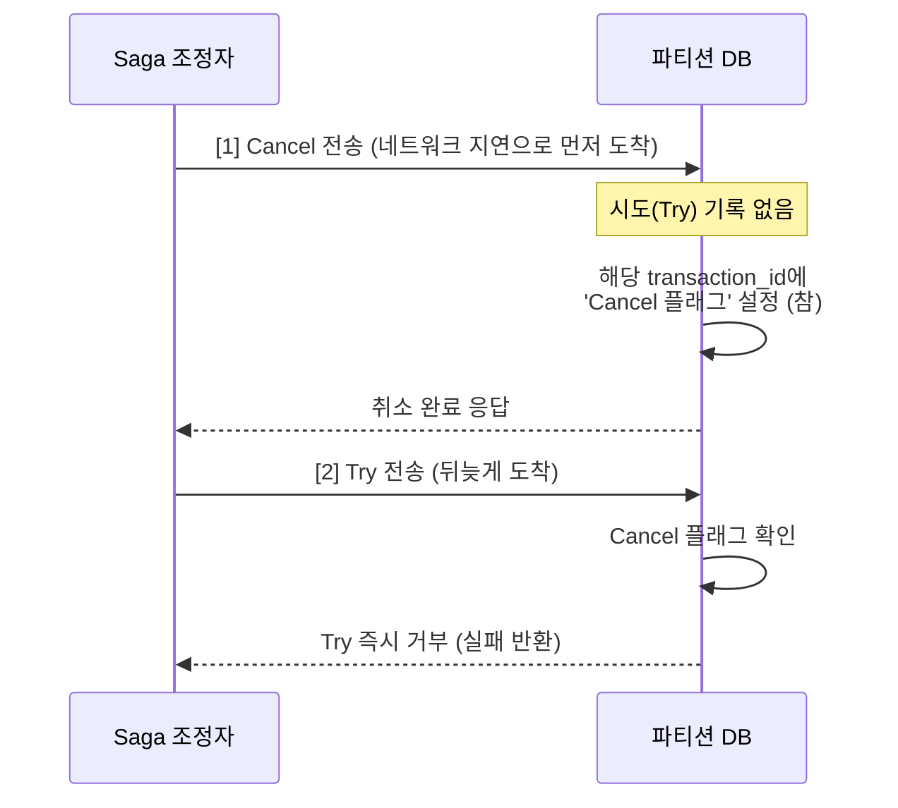
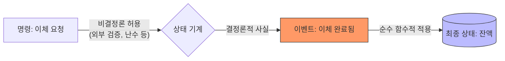
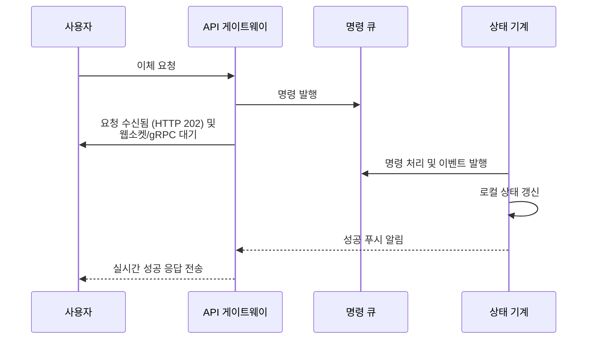

# 12장 전자 지갑 (Digital Wallet) Deep Dive

본 문서는 전자 지갑 시스템의 핵심 메커니즘인 분산 트랜잭션과 이벤트 소싱의 심층적인 동작 원리 및 실무적 고려사항을 다룹니다.

---

## 핵심 3가지 (이것만 기억하자)

1.  **TC/C는 원자성이 아닌 '보상'의 미학**: 2PC와 달리 각 단계가 독립된 커밋이며, 실패 시 비즈니스 로직으로 상쇄(Undo) 트랜잭션을 실행합니다.
2.  **이벤트 소싱의 결정론(Determinism)**: 명령(의도)에는 무작위성이 있을 수 있지만, 이벤트(사실)를 상태에 반영하는 과정에는 절대 난수나 외부 I/O가 개입해서는 안 됩니다.
3.  **성능과 동기성 사이의 가교**: 비동기적인 이벤트 소싱 구조에서도 푸시(Push) 모델을 결합하면 사용자에게 실시간에 가까운 동기적 응답 경험을 줄 수 있습니다.

---

## 1. TC/C의 숨겨진 지뢰밭: 불균형 상태와 순서 역전

분산 트랜잭션을 구현할 때 TC/C는 성능 면에서 우수하지만, 시스템 설계자가 직접 핸들링해야 하는 복잡한 예외 상황들이 존재합니다.

### 왜 어려운지
TC/C는 중간 상태(Try 완료 후)가 외부에 노출됩니다. 또한 네트워크 지연으로 인해 명령의 순서가 뒤바뀔 수 있어, 단순히 '성공하면 확정, 실패하면 취소'라는 로직만으로는 데이터 정합성을 지킬 수 없습니다.

### 동작 원리: 잘못된 순서(Out-of-order) 대응
취소(Cancel) 명령이 시도(Try) 명령보다 먼저 도착하는 경우를 대비해 **지연된 취소(Delayed Cancel)** 플래그를 사용합니다.

### 함정
*   **불균형 상태(Inconsistency)**: 시도 단계가 끝나면 A의 잔액은 줄었으나 C의 잔액은 늘지 않은 '사라진 돈' 상태가 됩니다. 이는 오류가 아니라 분산 시스템의 필연적인 중간 과정임을 이해하고 감사(Audit) 시스템이 이를 정상으로 인식하게 설계해야 합니다.
*   **유효하지 않은 순서**: 인출 전 입금을 먼저 하거나(선택 2), 입출금을 동시에 시도하는(선택 3) 방식은 자금 세탁 방지나 규제 준수 실패 시 되돌릴 수 없는 문제를 만듭니다. 반드시 **인출 시도 -> 입금 확인** 순서를 지켜야 합니다.

### 실무 시사점
게임 서버나 대규모 커머스 환경에서는 TC/C를 사용할 때 '단계별 상태 테이블'을 반드시 별도의 영속성 저장소(보통 인출 측 DB)에 기록해야 합니다. 조정자 노드가 재시작되어도 이 테이블을 보고 중단된 지점부터 Resume할 수 있기 때문입니다.

---

## 2. 이벤트 소싱의 결정론 경계선: 명령 vs 이벤트

이벤트 소싱 시스템의 신뢰성은 '재현성'에서 나오며, 이는 결정론적인 설계에서만 보장됩니다.

### 왜 어려운지
개발자는 습관적으로 로직 중간에 `new Date()`, `Math.random()`, 혹은 외부 API 호출을 넣기 쉽습니다. 하지만 이런 요소들은 상태 재구성을 불가능하게 만듭니다.

### 동작 원리: 비결정론의 분리
명령 처리 단계(Command Side)와 이벤트 적용 단계(Event Side)의 역할을 엄격히 분리합니다.

### 함정
*   **명령의 비결정론**: 명령을 검증할 때는 외부 시스템(예: 블랙리스트 조회)과 통신하거나 현재 시간을 참조할 수 있습니다.
*   **이벤트의 결정론**: 한 번 생성된 이벤트는 '과거의 사실'입니다. 이를 상태에 반영할 때는 오직 이벤트 객체에 담긴 정보와 이전 상태값만을 활용해야 합니다. 1년 뒤에 다시 돌려도 똑같은 잔액이 나와야 하기 때문입니다.

### 실무 시사점
NestJS 기반 서버에서 이벤트 소싱을 구현할 때, 애그리거트(Aggregate) 내부의 `applyEvent` 메서드에서는 절대로 `Inject`된 서비스를 호출하거나 비동기 작업을 수행해서는 안 됩니다.

---

## 3. 비동기 이벤트 소싱의 사용자 경험 최적화: Pull에서 Push로

이벤트 소싱과 CQRS는 구조상 결과적 일관성(Eventual Consistency)을 가지므로 클라이언트가 응답을 기다리는 방식이 까다롭습니다.

### 왜 어려운지
사용자는 이체 버튼을 누른 즉시 성공 여부를 알고 싶어 하지만, 이벤트 소싱 시스템은 명령이 큐에 들어가고 실제 상태가 갱신되기까지 시차가 존재합니다.

### 동작 원리: 푸시 모델로의 진화
전통적인 폴링(Pull) 방식 대신 웹소켓이나 역방향 프락시를 통한 푸시(Push) 모델을 결합합니다.

### 함정
푸시 알림이 유실될 가능성이 항상 존재합니다. 따라서 실무에서는 푸시를 기본으로 하되, 클라이언트가 일정 시간 응답을 못 받으면 '잔액 조회 API'를 통해 상태를 재확인하는 폴백(Fallback) 로직을 갖춰야 합니다.

### 실무 시사점
게임 서버 환경에서는 성능 극대화를 위해 명령-이벤트를 로컬 디스크의 `mmap`으로 관리하고, 래프트(Raft) 알고리즘으로 노드 간 합의를 이룹니다. 이때 푸시 알림은 래프트 리더(Leader)가 과반수 복제를 확인한 시점에 수행하여 안정성을 확보합니다.

---

## 트레이드오프 토론: 분산 트랜잭션 vs 이벤트 소싱

전자 지갑 시스템을 구축할 때 어떤 모델을 선택할 것인가에 대한 핵심 비교입니다.

| 비교 축 | 분산 트랜잭션 (TC/C) | 이벤트 소싱 (Event Sourcing) |
| :--- | :--- | :--- |
| **정확성 검증** | 조정(Reconciliation) 단계에서 사후 확인 | 처음부터 재생하여 실시간 확인 가능 |
| **성능 (Latency)** | 병렬 실행 가능하나 서비스 간 통신 발생 | 순차적 로그 처리로 인한 쓰기 속도 극대화 |
| **운영 복잡도** | 보상 로직 구현 부담 | 상태 재구성 및 스냅숏 관리 부담 |
| **감사(Audit)** | 로그 테이블을 별도 관리해야 함 | 시스템 자체가 강력한 감사 기록임 |

**토론 거리**: "초당 100만 건의 TPS가 필요한 게임 화폐 시스템에서, 거래의 취소(Rollback)가 빈번하다면 어떤 아키텍처가 더 유리할까요?"

---

## 실무 연결: NestJS + Redis + Raft 아키텍처

책의 추상적인 내용을 실제 서버 스택으로 구현할 때의 패턴입니다.

*   **상태 저장소**: 네트워크 오버헤드를 줄이기 위해 외부 DB 대신 각 파티션 노드 내부에 **RocksDB**를 내장(Embedded)하여 사용합니다.
*   **고가용성**: 3~5개의 노드를 하나의 **래프트 그룹(Raft Group)**으로 묶어 리더가 쓰기를 전담하고 팔로워가 실시간 복제본을 유지합니다.
*   **성능 최적화**: 1M TPS 달성을 위해 Java/Node.js의 가비지 컬렉션(GC) 부하를 고려해야 하며, 실무에서는 메모리 할당을 최소화하는 **Zero-copy** 기법이나 `mmap`을 활용한 파일 처리가 권장됩니다.

---

## 킬러 질문 3개

1.  **"TC/C에서 Confirm 명령이 네트워크 장애로 유실되었을 때, 지갑 서비스는 어떻게 복구 프로세스를 시작해야 할까요?"**
    *   *의도*: 단계별 상태 테이블의 필요성과 재시도(Retry) 메커니즘 이해 확인.
2.  **"이벤트 소싱 시스템에서 '코드 로직' 자체가 변경되어 과거 이벤트를 재생했을 때 결과가 달라진다면, 이를 어떻게 해결해야 할까요?"**
    *   *의도*: 이벤트 버전 관리(Versioning)와 스냅숏 호환성 전략 확인.
3.  **"래프트 리더가 이벤트를 과반수 노드에 복제했지만, 클라이언트에게 응답을 주기 전에 죽었다면 새로운 리더는 이 중복 명령을 어떻게 처리해야 할까요?"**
    *   *의도*: 멱등성(Idempotency) 보장을 위한 `transaction_id` 처리 로직 확인.

---

## 오해하기 쉬운 부분

*   **"2PC는 항상 안전하다?"**: 조정자가 죽으면 모든 참여 DB가 무기한 락에 걸릴 수 있는 위험이 있습니다. 현대의 고가용성 시스템에서는 2PC보다 사가나 TC/C를 선호하는 이유입니다.
*   **"이벤트 소싱은 DB가 필요 없다?"**: 최종 상태(잔액)를 빠르게 조회하기 위해, 그리고 재생 속도를 높이기 위한 스냅숏 저장을 위해 고성능 키-값 저장소(RocksDB 등)는 필수적입니다.
*   **"Saga와 TC/C는 같다?"**: 사가는 단계별 실행(선형적)이 기본이고, TC/C는 여러 자원을 동시에 예약(병렬적)할 수 있다는 점이 가장 큰 차이입니다. 지연 시간이 중요한 지갑 시스템에서는 TC/C가 더 유리할 수 있습니다.
