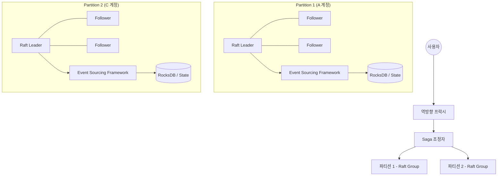
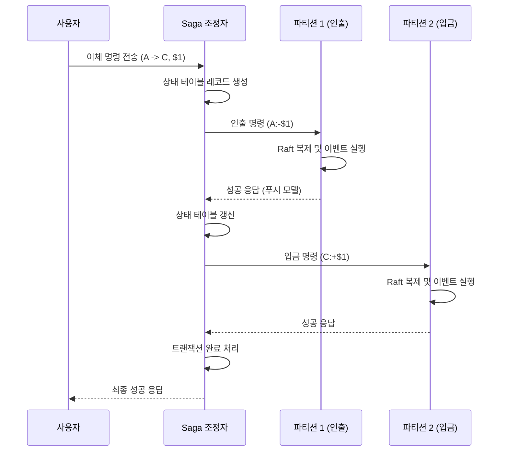

# 12장 전자 지갑 (Digital Wallet) 발표 자료

> **발표자**: 길현준

---

## 목차

1. [1단계: 문제 이해 및 설계 범위 확정](#1-1단계-문제-이해-및-설계-범위-확정)
2. [2단계: 개략적 설계](#2-2단계-개략적-설계)
3. [3단계: 상세 설계](#3-3단계-상세-설계)
4. [면접 질문 Q&A](#4-면접-질문-qa)
5. [토론 주제](#5-토론-주제)
6. [참고 자료](#6-참고-자료)

---

## 1. 1단계: 문제 이해 및 설계 범위 확정

### 전자 지갑이란?

**정의**: 결제 플랫폼에서 고객에게 제공하는 가상 계좌 서비스로, 자금을 예치해 두고 결제나 송금에 사용할 수 있도록 하는 시스템입니다.

**실제 사례**:
- PayPal (페이팔)
- WeChat Pay (위챗페이)
- Kakao Pay (카카오페이)

### ★ 요구사항 도출 (면접 대화 요약)

**지원자**: 시스템이 지원해야 하는 초당 트랜잭션 수(TPS)는 얼마인가요?  
**면접관**: 1,000,000 TPS로 가정하겠습니다.

**지원자**: 데이터베이스가 제공하는 트랜잭션 보증(ACID)만으로 정확성 요건을 충족할 수 있을까요?  
**면접관**: 좋습니다. 다만, 우리는 단순한 데이터 일관성을 넘어 '재현성(reproducibility)'을 갖춘 시스템을 설계하고자 합니다. 처음부터 데이터를 재생하여 과거 잔액을 언제든 재구성할 수 있어야 합니다.

**지원자**: 가용성 요구사항은 어느 정도로 설정할까요?  
**면접관**: 99.99%의 가용성을 목표로 합시다.

### 기능 요구사항

| 요구사항 | 세부 내용 |
|----------|----------|
| 지갑 간 이체 | 사용자 간의 실시간 자금 이체 지원 |
| 트랜잭션 보장 | 원자성(Atomicity)을 가진 이체 처리 |
| 재현성(Audit) | 과거 잔액 이력 추적 및 재구성 가능 |

### 비기능 요구사항

- **초고성능(1M TPS)**: 수백만 건의 트랜잭션을 짧은 지연 시간 내에 처리.
- **고가용성(99.99%)**: 장애 시에도 중단 없는 서비스 제공.
- **정확성 및 감사성**: 금융 서비스로서 데이터 오류가 없어야 하며 감사가 가능해야 함.

### QPS 계산 (Back-of-envelope)

```
목표 TPS = 1,000,000 TPS
이체 연산 당 DB 접근 = 2회 (A 인출, B 입금)
DB 노드 당 성능 = 1,000 TPS 가정
필요 DB 노드 수 = (1,000,000 * 2) / 1,000 = 2,000 노드
```

---

## 2. 2단계: 개략적 설계

### API 설계

**주요 API**

```
POST /v1/wallet/balance_transfer
Parameters:
  - from_account (string): 자금을 인출할 계좌 ID
  - to_account (string): 자금을 이체할 계좌 ID
  - amount (string): 이체 금액 (정밀도를 위해 string 사용)
  - currency (string): 통화 단위 (ISO 4217)
  - transaction_id (uuid): 중복 제거용 ID
```

**API 목록**

| Method | Endpoint | 설명 |
|--------|----------|------|
| POST | /v1/wallet/balance_transfer | 한 지갑에서 다른 지갑으로 자금 이체 |

### 개략적 아키텍처

#### 인메모리 샤딩 (In-memory Sharding)
- 레디스(Redis)를 이용한 키-값 저장소 기반 설계.
- 주키퍼(ZooKeeper)를 이용해 샤딩 정보를 관리.
- **문제점**: 노드 장애 시 데이터 유실 위험 및 분산 노드 간 원자적 트랜잭션 보장 불가.

#### 분산 트랜잭션 (Distributed Transaction)
- 관계형 데이터베이스로 교체하여 원자성 확보.
- **2PC (2-Phase Commit)**: 데이터베이스 계층의 원자적 처리. 성능 저하 및 조정자(Coordinator) SPOF 문제 존재.
- **TC/C (Try-Confirm/Cancel)**: 애플리케이션 계층의 보상 트랜잭션. 병렬 실행이 가능하여 지연 시간이 낮음.
- **Saga**: 마이크로서비스 표준. 선형적 실행 모델로 구현이 비교적 단순하나 지연 시간이 늘어날 수 있음.

**2PC vs TC/C vs Saga 비교**

| 구분 | 2PC | TC/C | Saga |
|------|-----|------|------|
| **구현 계층** | 데이터베이스(저수준) | 애플리케이션(고수준) | 애플리케이션(고수준) |
| **병렬성** | 낮음 (락 장기간 유지) | 높음 (병렬 실행 가능) | 낮음 (선형적 실행) |
| **유연성** | 특정 DB 표준(XA) 의존 | DB 무관 | DB 무관 |
| **복잡성** | 낮음 (자동 처리) | 높음 (보상 로직 구현 필요) | 중간 |

---

## 3. 3단계: 상세 설계

### 이벤트 소싱 (Event Sourcing)

재현성과 감사성을 위해 상태(잔액)가 아닌 **이벤트(사실)**를 저장하는 방식입니다.

1. **명령(Command)**: 외부의 이체 의도 요청.
2. **이벤트(Event)**: 유효성이 검증된 확정된 사실 (과거 시제).
3. **상태(State)**: 이벤트가 적용되어 나타나는 결과물(잔액).
4. **상태 기계(State Machine)**: 명령을 검증하고 이벤트를 생성하며, 이벤트를 적용해 상태를 갱신.

#### CQRS (명령-질의 책임 분리)
- **쓰기 경로**: 상태 기계가 명령을 받아 이벤트를 생성하고 로그에 기록.
- **읽기 경로**: 이벤트 로그를 읽어 질의용 상태 뷰(View)를 구축. 결과적 일관성(Eventual Consistency) 모델.

### 고성능 고신뢰성 설계

#### 로컬 파일 기반 최적화
- **RocksDB/mmap**: 네트워크 오버헤드를 줄이기 위해 로컬 디스크의 추가 전용(Append-only) 파일에 로그 저장.
- **스냅숏(Snapshot)**: 이벤트 재생 속도를 높이기 위해 주기적으로 현재 상태를 저장.

#### 합의 알고리즘 (Raft)
- 단일 장애 지점(SPOF) 문제를 해결하기 위해 **래프트(Raft)** 알고리즘 기반 복제 적용.
- 리더 노드가 명령을 수신하여 과반수 노드에 이벤트를 동기화한 후 실행.

### 아키텍처 다이어그램



### 시퀀스 다이어그램 (지갑 간 이체 흐름)



---

## 4. 면접 질문 Q&A

### Q1. 2PC를 사용하지 않고 TC/C나 Saga를 고려하는 주된 이유는 무엇인가요?

> **답변:** 2PC는 데이터베이스 노드 간에 강한 결합을 만들고, 한 노드라도 응답이 늦으면 전체 시스템의 락이 길어져 가용성이 떨어집니다. 반면 TC/C나 Saga는 각 단계를 독립적인 로컬 트랜잭션으로 처리하므로 시스템 자원을 점유하는 시간이 짧아 대규모 분산 환경에서 훨씬 더 나은 확장성과 가용성을 제공합니다.

### Q2. 이벤트 소싱에서 결정론적(Deterministic) 동작이 왜 중요한가요?

> **답변:** 이벤트 소싱의 핵심은 동일한 이벤트 목록을 재생했을 때 항상 동일한 결과 상태가 도출되어야 한다는 것입니다. 만약 상태 기계에 난수나 외부 API 호출 같은 비결정론적 요소가 포함되면, 노드 간 상태가 불일치하거나 장애 복구 시 다른 잔액이 계산되는 심각한 문제가 발생할 수 있습니다.

### Q3. CQRS 모델에서 발생할 수 있는 데이터 지연 문제는 어떻게 해결하나요?

> **답변:** 읽기 경로가 쓰기 경로보다 약간 뒤처지는 결과적 일관성 문제는 푸시 모델을 통해 개선할 수 있습니다. 상태 기계가 이벤트를 처리하자마자 역방향 프락시에 결과를 푸시함으로써 사용자는 실시간에 가까운 응답을 받을 수 있습니다.

### Q4. TC/C에서 취소(Cancel) 명령이 시도(Try) 명령보다 먼저 도착하면 어떻게 처리하나요?

> **답변:** 이를 잘못된 순서로 실행된 경우라고 합니다. 시스템은 아직 존재하지 않는 트랜잭션에 대한 취소 명령을 받으면, 취소 플래그를 미리 저장해 둡니다. 이후에 도착한 시도 명령은 이 플래그를 확인하고 즉시 실패를 반환함으로써 데이터 일관성을 지킵니다.

---

## 5. 토론 주제

### 토론 1: 거래의 일시적 불균형을 어떻게 다뤄야 할까?

**질문**: TC/C의 시도 단계가 끝나면 인출은 되었지만 입금은 되지 않은 상태가 발생할 수 있습니다. 금융 서비스에서 이런 공중에 뜬 돈 상태를 사용자나 감사 시스템에 어떻게 보여주는 것이 가장 합리적일까요?

**토론 포인트**:
- 중간 상태를 사용자에게 그대로 보여줄지, 내부 상태로만 숨길지
- 회계 원칙과 사용자 경험 중 무엇을 우선해야 할지
- 단계별 상태 테이블이 운영 관점에서 얼마나 중요한지

### 토론 2: 이벤트 소싱은 언제까지 정당화되는가?

**질문**: 1,000,000 TPS가 아니라 1,000 TPS 수준의 소규모 시스템이라면, 이벤트 소싱의 복잡성을 감수할 가치가 있을까요? 아니면 단순한 DB 트랜잭션이 더 나은 선택일까요?

**토론 포인트**:
- 재현성과 감사 가능성이 작은 시스템에서도 필수인지
- 구현 복잡도와 운영 비용을 어떤 기준으로 비교할지
- 단순한 상태 저장에서 이벤트 소싱으로 전환하는 시점은 언제인지

---

## 6. 참고 자료

- 책: 가상 면접 사례로 배우는 대규모 시스템 설계 기초 2 (12장)
- Raft 합의 알고리즘 (raft.github.io)
- RocksDB: A Persistent Key-Value Store for Fast Storage

---

*Last Updated: 2026-04-09*
