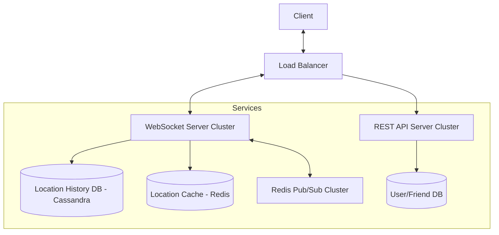

# Chapter 2: 주변 친구 (Nearby Friends) 발표 자료

> **발표자**: 길현준  

---

## 목차

1. [1단계: 문제 이해 및 설계 범위 확정](#1-1단계-문제-이해-및-설계-범위-확정)
2. [2단계: 개략적 설계](#2-2단계-개략적-설계)
3. [3단계: 상세 설계](#3-3단계-상세-설계)
4. [면접 질문 Q&A](#4-면접-질문-qa)
5. [토론 주제](#5-토론-주제)
6. [참고 자료](#6-참고-자료)

---

## 1. 1단계: 문제 이해 및 설계 범위 확정

### 주변 친구(Nearby Friends)란?

**정의**: 본인 위치 정보 접근 권한을 허락한 사용자에 한해, 인근(설정된 거리 이내)에 있는 친구 목록을 실시간으로 보여주는 서비스

**실제 사례**:
- 페이스북 (Nearby Friends)
- 젠리 (Zenly)
- 위치 공유 기반 SNS 기능들

### ★ 요구사항 도출 (면접 대화 요약)

**지원자**: 지리적으로 얼마나 가까워야 '주변에 있다'고 할 수 있나요?  
**면접관**: 5마일(8km)입니다. 이 수치는 설정 가능해야 하며, 직선거리를 가정합니다.

**지원자**: 얼마나 많은 사용자가 이 앱을 사용하나요?  
**면접관**: 10억 명 중 10% 정도가 이 기능을 활용(DAU 1억 명)한다고 가정합시다. 동시 접속자는 DAU의 10%(천만 명)로 가정합니다.

**지원자**: 사용자의 이동 이력을 보관해야 하나요?  
**면접관**: 네, 기계 학습 등 다양한 용도로 사용될 수 있으므로 보관이 필요합니다.

**지원자**: 비활성 사용자는 어떻게 처리하나요?  
**면접관**: 친구가 10분 이상 비활성 상태면 목록에서 사라지게 합니다.

**지원자**: GDPR이나 CCPA 같은 사생활 보호법도 고려해야 할까요?  
**면접관**: 설계의 복잡성을 줄이기 위해 일단은 고려하지 않기로 합시다.

### 기능 요구사항

| 요구사항 | 세부 내용 |
|----------|----------|
| **주변 친구 목록 확인** | 거리 및 마지막 갱신 시각(timestamp) 표시 |
| **실시간 위치 갱신** | 몇 초마다 한 번씩 친구 목록 정보가 자동 갱신됨 |
| **상태 관리** | 10분 이상 비활성 시 목록에서 제외 |

### 비기능 요구사항

- **낮은 지연(Low Latency)**: 주변 친구의 위치 변화가 실시간에 가깝게 반영되어야 함
- **안정성**: 전반적으로 안정적이어야 하나, 간혹 발생하는 데이터 유실은 용인 가능
- **결과적 일관성(Eventual Consistency)**: 위치 데이터를 저장할 때 강한 일관성은 불필요함

### QPS 계산 (Back-of-envelope)

- **DAU**: 1억 명
- **동시 접속 사용자 (10%)**: 1,000만 명
- **위치 갱신 주기**: 30초
- **위치 정보 갱신 QPS**: $10,000,000 / 30 \approx 334,000$ QPS
- **위치 정보 전송(Push) QPS**: $334,000 \times 400(친구 수) \times 10\%(\text{인근 활성}) \approx 1,400$만 QPS

---

## 2. 2단계: 개략적 설계

### ★ 이전 장과의 비교 (1장 근접성 서비스 vs 2장 주변 친구)

| 구분 | 1장: 근접성 서비스 | 2장: 주변 친구 |
|------|----------|----------|
| **데이터 성격** | **정적(Static)** (사업장 위치) | **동적(Dynamic)** (친구 위치) |
| **갱신 빈도** | 거의 없음 (데이터베이스에 고정) | 매우 빈번 (30초마다 갱신) |
| **통신 방식** | 일반적인 HTTP (Request/Response) | **WebSocket** (Bi-directional/Real-time) |
| **핵심 기술** | 지오해시(Geohash), 쿼드트리 | **Pub/Sub**, WebSocket, Redis |

### API 설계

**주요 API (WebSocket 중심)**

| 구분 | API 명칭 | 설명 |
|--------|----------|------|
| **Server API** | 주기적인 위치 정보 갱신 | 클라이언트가 위도, 경도, 시각 정보를 전송 |
| **Client API** | 친구 위치 수신 | 갱신된 친구 위치와 타임스탬프를 수신 |
| **Server API** | 웹소켓 초기화 API | 초기 접속 시 위치 전송 및 주변 친구 위치 수신 |
| **Client API** | 새 친구 구독 API | 새로 추가된 친구의 채널 구독 및 위치 수신 |
| **Client API** | 구독 해지 API | 친구 관계 끊김 또는 비공개 전환 시 구독 해지 |

*참고: HTTP API(친구 추가/삭제, 프로필 관리 등)는 일반적인 REST API를 사용함*

### 개략적 아키텍처



### 핵심 컴포넌트

1. **로드밸런서**: REST API 및 유상태(Stateful) 웹소켓 서버 앞단에서 트래픽 분산
2. **RESTful API 서버**: 무상태 서버로 친구 추가/삭제, 사용자 정보 관리 등 수행
3. **웹소켓 서버**: 실시간 위치 갱신 및 전송을 담당하는 유상태 서버
4. **레디스 위치 정보 캐시**: 활성 사용자의 최신 위치를 TTL과 함께 저장 (읽기/쓰기 성능 극대화)
5. **사용자 데이터베이스**: 사용자 프로필 및 친구 관계 정보 저장
6. **위치 이동 이력 DB**: 사용자의 과거 경로 기록 (Cassandra 등 NoSQL 권장)
7. **레디스 펍/섭 서버**: 초경량 메시지 버스로서 위치 변경 이벤트를 구독자에게 라우팅

---

## 3. 3단계: 상세 설계

### ★ 웹소켓 서버 규모 확장
- **유상태 서버 주의점**: 서버 제거 시 기존 연결을 안전하게 종료하는 **Draining** 과정이 필요함
- **Draining**: 로드밸런서에서 해당 노드를 '연결 종료 중'으로 설정하여 신규 연결을 차단하고 기존 연결이 모두 종료될 때까지 대기

### 클라이언트 초기화 절차 (7단계)
1. 웹소켓 연결 수립
2. **위치 정보 캐시**에 사용자 현재 위치 갱신
3. 연결 핸들러(변수)에 사용자 위치 저장
4. **사용자 DB**에서 모든 친구 정보 조회
5. **위치 정보 캐시**에 일괄(Batch) 요청하여 활성 친구 위치 획득
6. 모든 친구의 **레디스 펍/섭 채널** 구독 (활성/비활성 여부 관계없이 일괄 구독하여 단순화)
7. 본인의 현재 위치를 펍/섭 채널을 통해 친구들에게 전송

### ★★ 레디스 펍/섭 클러스터 상세
- **메모리 계산**: 1억 채널(10% 활성) × 100명 친구 × 20바이트(포인터 등) $\approx$ **200GB** 필요
- **CPU 계산**: 초당 1,400만 건 메시지 전송 $\rightarrow$ 서버당 10만 건 처리 가정 시 **약 140대** 필요
- **샤딩**: 사용자 ID를 기준으로 채널을 여러 펍/섭 서버로 분산 (안정 해시 사용)
- **서비스 탐색**: ZooKeeper/etcd를 통해 가용한 펍/섭 서버 목록 및 해시 링 관리
- **확장 시 고려사항**: 클러스터 크기 조정 시 수많은 재구독(Resubscription) 요청이 발생하므로 부하가 적은 시간에 수행 필요

### 기타 설계 결정
- **친구가 많은 사용자(Whale)**: 친구 수 상한(예: 5,000명)이 존재하므로 부하가 여러 웹소켓 서버에 분산되어 핫스팟 문제가 크지 않음
- **주변의 임의 사용자**: 지오해시(Geohash) 기반의 펍/섭 채널 풀을 구성하여 해당 격자의 사용자끼리 메시지 교환
- **얼랭(Erlang) 대안**: 레디스 펍/섭 대신 경량 프로세스 모델을 가진 얼랭/OTP를 사용하면 수백만 개의 사용자 프로세스를 효율적으로 관리 가능 (단, 개발자 확보의 어려움 존재)

---

## 4. 면접 질문 Q&A

**Q1. 왜 HTTP 롱 폴링이 아닌 웹소켓을 사용하나요?**
> **Answer**: 2장 시스템은 위치 정보를 **양방향**으로 실시간 교환해야 합니다. HTTP는 클라이언트가 요청을 보내야만 응답을 받을 수 있는 구조라 실시간성이 떨어지고 헤더 오버헤드가 크지만, 웹소켓은 한번 연결되면 저비용으로 양방향 통신이 가능하기 때문입니다.

**Q2. 레디스 펍/섭 서버가 다운되면 데이터가 유실되지 않나요?**
> **Answer**: 유실될 수 있습니다. 하지만 비기능 요구사항에서 **결과적 일관성**과 **일부 유실 용인**을 정의했으므로, 서버 교체 후 다음 위치 갱신 주기(30초)가 지나면 자연스럽게 최신 상태로 복구됩니다.

**Q3. 레디스 펍/섭의 병목 지점은 어디인가요?**
> **Answer**: 계산 결과 메모리보다는 **CPU 사용량(메시지 전송량)**이 병목이 됩니다. 따라서 수백 대 규모의 분산 클러스터 구성이 필수적입니다.

**Q4. 사용자 위치를 매번 DB에 저장하지 않고 캐시를 쓰는 이유는?**
> **Answer**: 현재 위치 정보는 수명이 짧고 빈번하게 갱신됩니다. DB의 영속성보다는 메모리 기반 캐시의 빠른 읽기/쓰기 성능이 이 서비스의 지연 시간을 낮추는 데 훨씬 유리하기 때문입니다.

**Q5. 서비스 탐색(Service Discovery)이 왜 필요한가요?**
> **Answer**: 수백 대의 펍/섭 서버가 존재할 때, 웹소켓 서버가 어떤 서버의 채널을 구독해야 할지 알아야 합니다. 이를 중앙에서 관리하고 서버 추가/삭제 시 해시 링 정보를 전파하기 위해 필요합니다.

---

## 5. 토론 주제

### 토론 1: 대규모 재구독(Resubscription) 사태 방지
**질문**: 펍/섭 클러스터를 확장할 때 발생하는 엄청난 양의 재구독 요청을 어떻게 제어하면 좋을까요?
**토론 포인트**:
- 지수적 백오프(Exponential Backoff) 적용
- 클러스터 크기 조정 시 점진적 전파 (Canary 방식)
- 펍/섭 서버의 여유 용량(Over-provisioning) 확보 수준

### 토론 2: 배터리 소모와 갱신 주기의 트레이드오프
**질문**: 30초라는 갱신 주기는 사용자 경험과 배터리 소모 측면에서 적절할까요?
**토론 포인트**:
- 사용자의 이동 속도(걷기 vs 자동차)에 따른 동적 주입
- 배터리 잔량에 따른 갱신 빈도 조절
- 포그라운드/백그라운드 상태에 따른 차등 적용

---

## 6. 참고 자료

### 공식 문서
- [Redis Pub/Sub 공식 가이드](https://redis.io/topics/pubsub)
- [Cassandra Architecture Overview](https://cassandra.apache.org/_/architecture.html)

### 기술 블로그 및 사례
- [Facebook: Nearby Friends Launch News](https://techcrunch.com/2014/04/17/facebook-nearby-friends/)
- [Erlang/OTP: Distributed Programming](https://www.erlang.org/doc/design_principles/des_princ.html)

---

## 2장 요약 마인드맵

```
주변 친구 시스템
├── 1단계: 요구사항
│   ├── 기능: 5마일 이내 친구 위치 실시간 갱신 (30초 주기)
│   ├── 비기능: 낮은 지연, 결과적 일관성, 유실 허용
│   └── 규모: DAU 1억, 동시접속 1,000만, 1,400만 Push QPS
├── 2단계: 개략적 설계
│   ├── 통신: WebSocket (유상태)
│   ├── 저장소: Redis(위치 캐시), Cassandra(이력), Redis Pub/Sub(라우팅)
│   └── 핵심: 사용자별 펍/섭 채널을 통한 위치 전파
├── 3단계: 상세 설계
│   ├── 확장: 유상태 서버 Draining, 펍/섭 서버 샤딩(안정 해시)
│   ├── 최적화: 친구 상태와 무관한 일괄 구독으로 로직 단순화
│   └── 대안: 얼랭(Erlang) 기반의 고가용성 프로세스 모델
└── ★ 핵심 포인트
    ├── 1장(정적) vs 2장(동적)의 설계 패러다임 차이
    └── Redis Pub/Sub의 CPU 병목 해결을 위한 분산 클러스터
```

---

*Last Updated: 2026-01-22*
