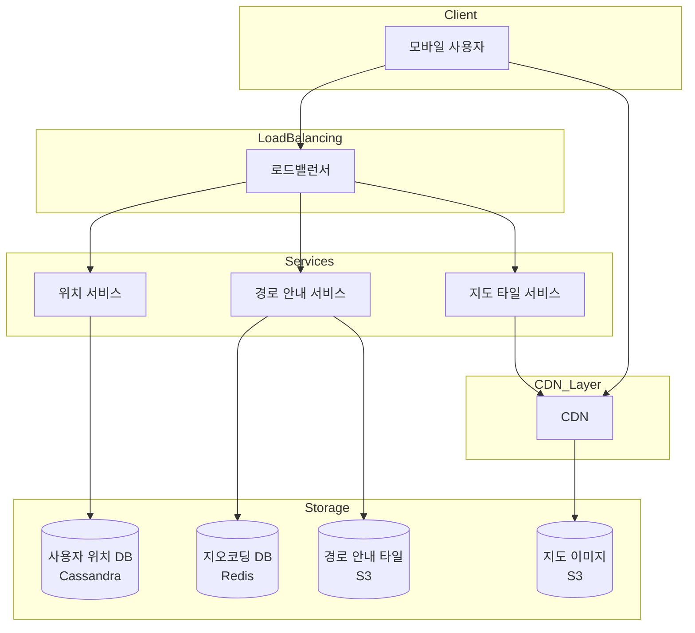
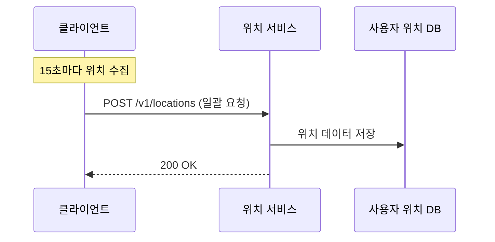
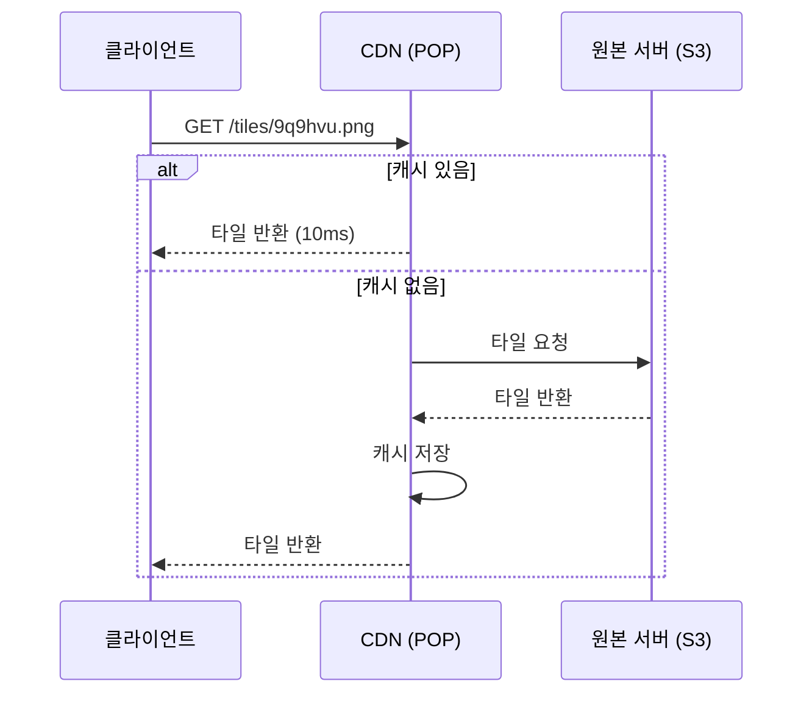
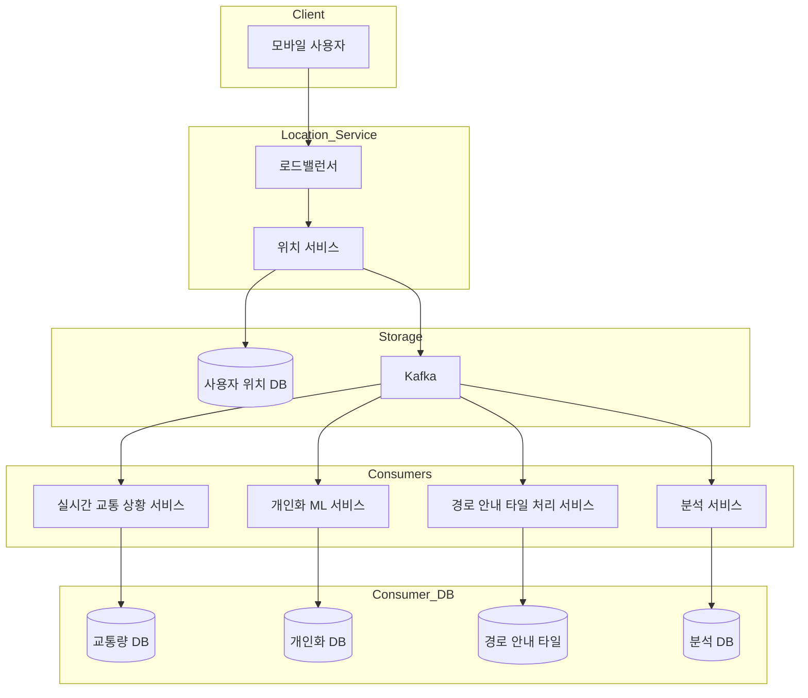
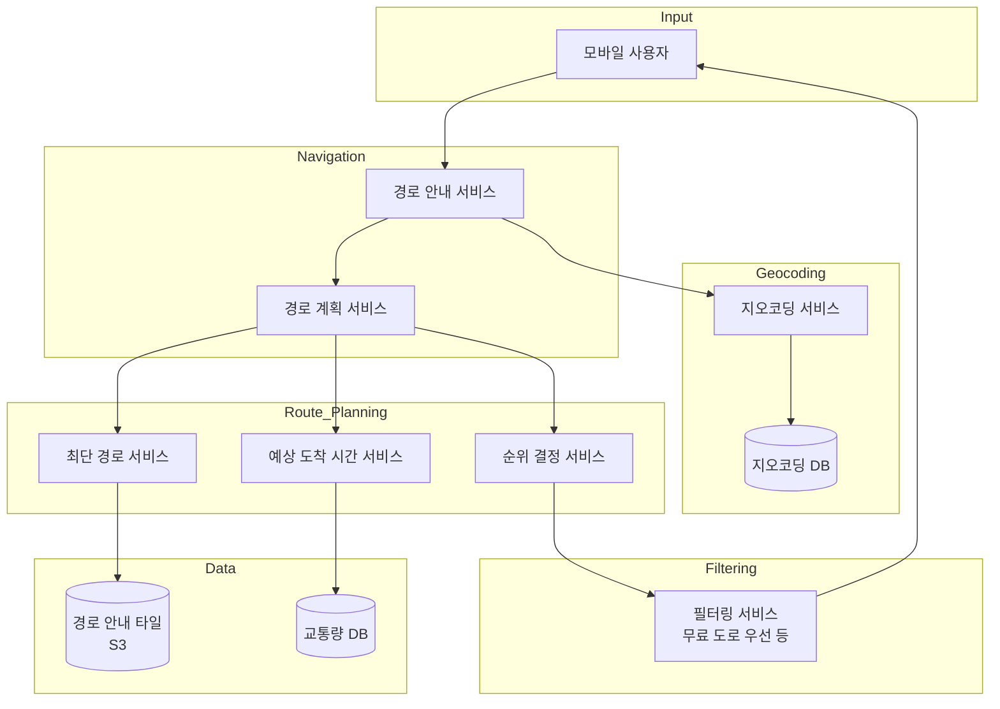
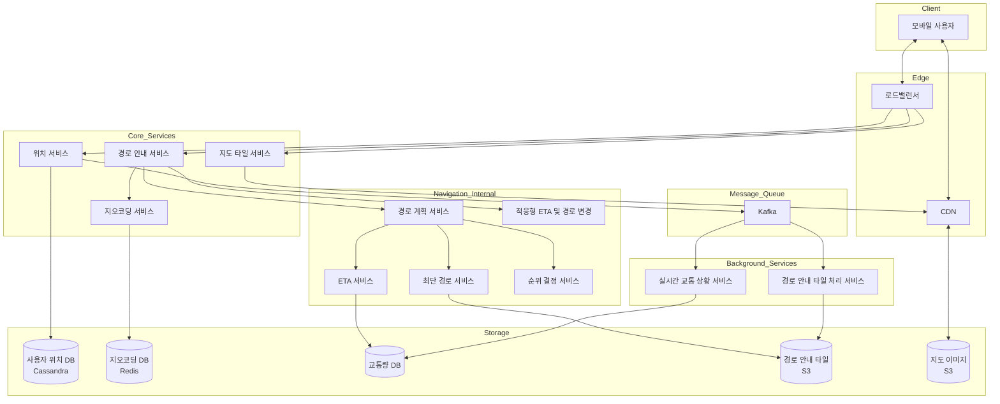

# Chapter 3: 구글 맵 (Google Maps) 발표 자료

> **발표자**: 길현준  
> **Last Updated**: 2026-01-31

---

## 목차

1. [1단계: 문제 이해 및 설계 범위 확정](#1-1단계-문제-이해-및-설계-범위-확정)
2. [2단계: 개략적 설계](#2-2단계-개략적-설계)
3. [3단계: 상세 설계](#3-3단계-상세-설계)
4. [면접 질문 Q&A](#4-면접-질문-qa)
5. [토론 주제](#5-토론-주제)
6. [참고 자료](#6-참고-자료)

---

## 1. 1단계: 문제 이해 및 설계 범위 확정

### 구글 맵이란?

**정의**: 2005년 구글이 개발한 웹 기반 지도 서비스로, 위성 이미지, 거리 뷰, 실시간 교통 상황, 경로 계획 등 다양한 서비스 제공

**규모**:
- DAU 10억 명 (2021년 3월 기준)
- 전 세계 99% 지역 지도 제공
- 매일 2,500만 건의 업데이트 반영

### 면접관-지원자 대화

> **지원자**: 일간 능동 사용자 수는 어느 정도로 가정해야 합니까?
>
> **면접관**: 10억 DAU를 가정하시면 됩니다.
>
> **지원자**: 어떤 기능에 초점을 맞추어야 합니까? 방향 안내, 경로 안내, ETA 등 생각해야 할 기능이 많습니다만.
>
> **면접관**: 위치 갱신, 경로 안내, ETA, 지도 표시 등에 초점을 맞추도록 합시다.
>
> **지원자**: 도로 데이터는 어느 정도 규모입니까?
>
> **면접관**: 수 TB 수준의 가공되지 않은 데이터입니다.
>
> **지원자**: 교통 상황도 고려해야 할까요?
>
> **면접관**: 네. 도착 시간을 정확하게 추정하는 데 아주 중요합니다.

### 기능 요구사항

| 요구사항 | 세부 내용 |
|----------|----------|
| **사용자 위치 갱신** | 클라이언트가 주기적으로 위치 정보를 서버에 전송 |
| **경로 안내 서비스** | A에서 B 지점으로 가는 최적 경로 + ETA 계산 |
| **지도 표시** | 확대/축소 수준에 맞는 지도 타일 렌더링 |

### 비기능 요구사항

| 요구사항 | 설명 |
|----------|------|
| **정확도** | 잘못된 경로 안내 방지 |
| **부드러운 경로 표시** | 화면에 부드럽게 표시/갱신 |
| **데이터/배터리 절약** | 모바일 단말에서 최소한의 자원 사용 |
| **고가용성 및 규모 확장성** | 10억 DAU 처리 가능 |

### 지도 기본 개념 (지도 101)

#### 측위 시스템 (Positioning System)
- **위도 (Latitude)**: 북쪽/남쪽 위치 표현
- **경도 (Longitude)**: 동쪽/서쪽 위치 표현

#### 지도 투영법 (Map Projection)
3차원 구 위의 위치를 2차원 평면에 대응시키는 방법

| 도법 | 특징 |
|------|------|
| 메르카토르 도법 | 구글 맵이 사용 (웹 메르카토르) |
| 퍼스 퀸쿤셜 도법 | 정사각형 형태로 투영 |
| 갈-페터스 도법 | 면적 정확도 유지 |
| 빈켈 트리펠 도법 | 왜곡 최소화 |

#### 지오코딩 (Geocoding)
주소 → 좌표 변환

```
"1600 Amphitheatre Parkway, Mountain View, CA"
    ↓
(위도: 37.423021, 경도: -122.083739)
```

**역 지오코딩**: 좌표 → 주소 변환

#### 지오해싱 (Geohashing)
지도 영역을 영문자+숫자 문자열로 인코딩하는 체계

```
20,000km × 10,000km 영역
    ↓ 분할
10,000km × 5,000km (00, 01, 10, 11)
    ↓ 분할
5,000km × 2,500km
    ↓ 반복...
```

**용도**: 맵 타일 관리, 위치 기반 검색

### QPS 계산 (Back-of-envelope)

```
DAU: 10억 명
주당 경로 안내 사용: 35분/사용자
일일 사용: 50억 분

GPS 좌표 전송 (매초):
- 50억 분 × 60초 = 3,000억 건/일
- QPS = 3,000억 / 10^5초 = 3백만 QPS

최적화 (15초마다 일괄 전송):
- QPS = 3백만 / 15 = 20만 QPS
- 최대 QPS = 20만 × 5 = 1백만 QPS
```

### 저장소 사용량 추정

| 확대 수준 | 필요 타일 수 |
|----------|-------------|
| 0 | 1 |
| 1 | 4 |
| 10 | 약 100만 |
| 21 | 약 4.4조 |

```
최대 확대 시 저장 공간:
- 4.4조 × 100KB = 440PB

실제 필요 (90% 자연지역 압축):
- 약 50PB (최대 확대)
- 전체 확대 수준: ~100PB
```

---

## 2. 2단계: 개략적 설계

### 개략적 아키텍처



### API 설계

| Method | Endpoint | 설명 | 요청/응답 |
|--------|----------|------|----------|
| POST | `/v1/locations` | 위치 정보 일괄 갱신 | `locs: [(lat, lng, timestamp), ...]` |
| GET | `/v1/nav` | 경로 안내 요청 | `origin, destination` → 경로 JSON |
| GET | `/v1/tiles/{geohash}.png` | 지도 타일 요청 | CDN을 통해 타일 반환 |

#### 경로 안내 API 응답 예시

```json
{
  "distance": {"text": "0.2 mi", "value": 259},
  "duration": {"text": "1 min", "value": 83},
  "end_location": {"lat": 37.4038943, "lng": -121.9410454},
  "start_location": {"lat": 37.4027165, "lng": -121.9435809},
  "html_instructions": "Head northeast on Brandon St...",
  "polyline": {"points": "_fhcFjbhgVuAwDsCal"},
  "travel_mode": "DRIVING"
}
```

### 핵심 서비스 개요

#### 1. 위치 서비스 (Location Service)



**일괄 요청 패턴**:
- 매초 위치 측정, 15초마다 서버 전송
- 요청량 15배 감소 (3백만 → 20만 QPS)

#### 2. 경로 안내 서비스 (Navigation Service)

A→B 지점 경로 계산 (약간의 지연 허용, 정확도 중요)

#### 3. 지도 표시 서비스 (Map Rendering)

| 선택지 | 설명 | 문제점/장점 |
|--------|------|-------------|
| **선택지 1** | 위치+확대수준으로 즉석 생성 | 서버 부하, 캐시 어려움 |
| **선택지 2 (채택)** | 미리 만든 타일 제공 | 규모 확장 용이, CDN 활용 |

### 경로 안내 타일 (Routing Tiles)

도로망을 그래프로 변환하여 타일 단위로 분할

```
전 세계 도로망 → 경로 안내 타일
- 교차로 = 노드 (Node)
- 도로 = 선 (Edge)
- 각 타일은 인접 타일 참조 포함
```

#### 계층적 경로 안내 타일

| 구체성 | 커버 영역 | 포함 도로 |
|--------|----------|----------|
| **상 (High)** | 작음 | 지방도 |
| **중 (Medium)** | 중간 | 간선 도로 |
| **하 (Low)** | 큼 | 고속도로 |

→ 국토 종단 여행: 지방도(상) → 고속도로(하) → 지방도(상)

### CDN 기반 지도 타일 서비스



**CDN 데이터 사용량 추정**:
```
분당 데이터: 1.25MB (30km/h 이동 시)
일일 데이터: 50억 분 × 1.25MB = 6.25PB
초당 전송량: 62,500MB/s
POP당 부하 (200개): ~312MB/s
```

---

## 3. 3단계: 상세 설계

### 데이터 모델

| 데이터 | 저장소 | 특징 |
|--------|--------|------|
| **경로 안내 타일** | S3 (객체 저장소) | 이진 파일, 지오해시 기준 분류 |
| **사용자 위치** | Cassandra | 높은 쓰기 처리량, (user_id, timestamp) 키 |
| **지오코딩** | Redis | 빠른 읽기, 주소→좌표 변환 |
| **지도 타일** | S3 + CDN | 확대 수준별 PNG/벡터 이미지 |

#### 사용자 위치 테이블 (Cassandra)

```sql
-- 파티션 키: user_id, 클러스터링 키: timestamp
| user_id | timestamp  | lat  | long | user_mode | navigation_mode |
|---------|------------|------|------|-----------|-----------------|
| 51      | 132053000  | 21.9 | 89.8 | active    | driving         |
```

### 위치 서비스 상세 설계



**위치 데이터 활용**:
- 실시간 교통 상황 모니터링
- 새로 개설/폐쇄된 도로 탐지
- 사용자 행동 분석 → 개인화
- ETA 정확도 향상

### 지도 표시 최적화

#### 지도 타일 사전 계산

| 확대 수준 | 타일 해상도 | 전체 해상도 |
|----------|------------|------------|
| 0 | 256×256 (1장) | 256×256 |
| 1 | 256×256 (4장) | 512×512 |
| 2 | 256×256 (16장) | 1024×1024 |
| n | 256×256 (4^n장) | 256×2^n |

#### 벡터 타일 최적화 (WebGL)

| 방식 | 특징 |
|------|------|
| **래스터 (PNG)** | 이미지 기반, 확대 시 픽셀화 |
| **벡터** | 경로/다각형 정보, 높은 압축률, 부드러운 확대 |

### 경로 안내 서비스 상세 설계



#### 서비스별 역할

| 서비스 | 역할 |
|--------|------|
| **지오코딩 서비스** | 주소 → 위도/경도 변환 |
| **최단 경로 서비스** | A* 알고리즘으로 k개 최단 경로 반환 (교통 미고려) |
| **예상 도착 시간 서비스** | ML 기반 ETA 계산 (현재+미래 교통 예측) |
| **순위 결정 서비스** | 필터링 후 소요 시간 순 정렬 |

#### 최단 경로 알고리즘 동작

```
1. 출발지/목적지 위도경도 → 지오해시 변환
2. 출발지 타일에서 그래프 탐색 시작
3. 필요 시 주변 타일 로드 (캐시 또는 S3)
4. 다른 확대 수준 타일로 전환 가능 (고속도로 진입 등)
5. 최단 경로 k개 확보까지 반복
```

### 적응형 ETA와 경로 변경

**문제**: 경로 안내 중 교통 상황 변화 → ETA 업데이트, 경로 재설정 필요

#### 방법 1: 단순 검색 (비효율)

```
user_1: r_1, r_2, r_3, ..., r_k
user_2: r_4, r_6, r_9, ..., r_n
...
```
- r_2에서 사고 발생 시 전체 테이블 스캔
- 시간 복잡도: O(n × m)

#### 방법 2: 계층적 타일 활용 (효율)

```
user_1, r_1, super(r_1), super(super(r_1)), ...
```
- 출발지~목적지 포함하는 상위 타일까지 저장
- 시간 복잡도: O(n)

### 전송 프로토콜 선택

| 프로토콜 | 장단점 | 채택 |
|----------|--------|------|
| 모바일 푸시 | 메시지 크기 제한 (4KB), 웹 미지원 | X |
| 롱 폴링 | 서버 부담 | X |
| SSE | 단방향 | X |
| **웹소켓** | 양방향, 실시간 | O |

### 최종 아키텍처



---

## 4. 면접 질문 Q&A

### Q1. 왜 위치 데이터 저장에 Cassandra를 선택했나요?

> **답변**: 세 가지 이유가 있습니다:
> 1. **높은 쓰기 처리량**: 최대 100만 QPS의 위치 업데이트 처리 필요
> 2. **수평 확장성**: 노드 추가로 쉽게 확장 가능
> 3. **CAP 정리**: 위치 데이터는 일관성보다 가용성이 중요 (AP 시스템)
>
> 파티션 키로 `user_id`, 클러스터링 키로 `timestamp`를 사용하여 특정 사용자의 최근 위치를 효율적으로 조회합니다.

### Q2. 지도 타일을 즉석 생성하지 않고 미리 만들어 두는 이유는?

> **답변**:
> - **서버 부하 감소**: 위치+확대수준 조합이 무한대 → 동적 생성 시 서버 과부하
> - **CDN 활용**: 정적 타일은 캐싱에 적합, 전세계 POP에서 빠르게 서비스
> - **일관성**: 같은 영역은 같은 타일 → 디버깅, 품질 관리 용이
>
> 단점으로는 저장 공간(~100PB)이 필요하지만, CDN의 성능 이점이 압도적입니다.

### Q3. 벡터 타일의 장점은 무엇인가요?

> **답변**:
> 1. **압축률**: 이미지 대비 월등히 작은 크기 → 대역폭 절감
> 2. **부드러운 확대**: 래스터는 확대 시 픽셀화, 벡터는 수학적 스케일링
> 3. **동적 스타일링**: 클라이언트에서 다크모드, 색상 변경 가능
> 4. **선택적 렌더링**: 필요한 레이어만 표시 가능

### Q4. 경로 안내 타일을 계층화하는 이유는?

> **답변**: 경로의 길이에 따라 필요한 상세도가 다르기 때문입니다.
> - **국토 종단 여행**: 지방도 수준 타일로 전국을 탐색하면 그래프가 거대해짐
> - **해결책**: 고속도로만 있는 큰 타일(하) + 지방도가 있는 작은 타일(상)
> - 알고리즘이 출발지(상) → 고속도로(하) → 도착지(상)로 전환하며 탐색

### Q5. 실시간 교통 변화에 어떻게 대응하나요?

> **답변**: 적응형 ETA 시스템을 사용합니다.
> 1. **효율적 검색**: 사용자 경로를 계층적 타일로 저장 → O(n) 검색
> 2. **웹소켓 통신**: 서버에서 클라이언트로 실시간 푸시
> 3. **주기적 재계산**: 더 빠른 경로 발견 시 알림
>
> 단순 전수 조사 O(n×m)에서 계층적 타일 활용으로 O(n)으로 개선됩니다.

### Q6. 위치 데이터를 Kafka로 스트리밍하는 이유는?

> **답변**: 위치 데이터의 다양한 활용을 위해서입니다:
> - **실시간 교통**: 현재 도로별 차량 밀도 계산
> - **지도 개선**: 새 도로 탐지, 폐쇄 도로 감지
> - **개인화**: 사용자 이동 패턴 분석
> - **분석**: 비즈니스 인텔리전스
>
> Kafka를 사용하면 각 서비스가 독립적으로 같은 데이터를 소비할 수 있습니다.

---

## 5. 토론 주제

### 1. 오프라인 지도 지원

**상황**: 네트워크가 불안정한 지역에서의 경로 안내

**논점**:
- 어떤 범위의 타일을 미리 다운로드할 것인가?
- 오프라인 경로 계산을 클라이언트에서 수행?
- 온라인 복귀 시 경로 재계산 전략

### 2. 배터리 최적화 전략

**현재**: 15초마다 위치 일괄 전송

**추가 고려사항**:
- 이동 속도에 따른 동적 전송 주기
- 정지 시 GPS 비활성화
- 가속도계로 이동 감지 후 GPS 활성화

### 3. 프라이버시와 위치 데이터

**문제**: 10억 사용자의 실시간 위치 저장

**논점**:
- 위치 이력 보관 기간
- 익명화/집계 처리 방법
- 사용자 동의 및 데이터 삭제 요청 처리

---

## 6. 참고 자료

- [구글 맵 API](https://developers.google.com/maps?hl=en_US)
- [구글 맵 플랫폼](https://cloud.google.com/maps-platform/)
- [더 부드러운 지도 표시 방안](https://medium.com/google-design/google-maps-cb0326d165f5)
- [지오코딩 위키피디아](https://en.wikipedia.org/wiki/Address_geocoding)
- [지오해싱 상세](https://kousiknath.medium.com/system-design-design-a-geo-spatial-index-for-real-time-location-search-10968fe62b9c)
- [경로 안내 타일](https://www.mapzen.com/blog/valhalla-why_tiles/)
- [GNN을 통한 ETA 계산](https://deepmind.com/blog/article/traffic-prediction-with-advanced-graph-neural-networks)
- [구글 맵 101: AI 교통 예측](https://blog.google/products/maps/google-maps-101-how-ai-helps-predict-traffic-and-determine-routes/)
