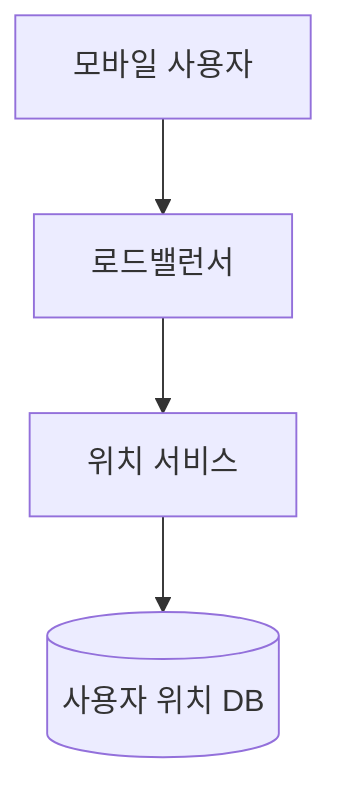
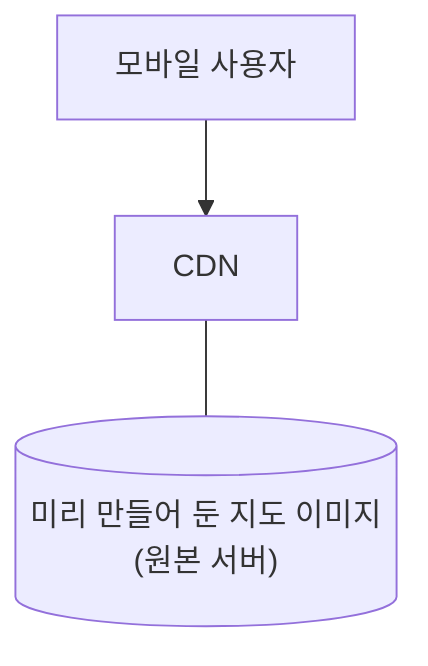
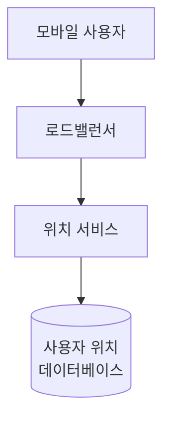

# 1단계: 문제 이해 및 설계 범위 확정
```
DAU는 어느 정도로 가정?
>> 10억 DAU

어떤 기능에 초점을 맞추나요? 방향 안내, 경로 안내, 예상 도착 시간, 등 생각할 기능이 많습니다.
>> 위치 갱신, 경로 안내, 예상 도착 시간, 지도 표시 등에 초점

도로 데이터는 어느 정도 규모인가요? 도로 데이터는 확보했다고 가정해도 될까요?
>> 좋은 질문 > 도로 데이터는 다양한 경로로 확보해 두었다고 가정
>> 수 TB 수준의 가공되지 않은 데이터

교통 상황도 고려해야 할까요?
>> 네, 교통 상황은 도착 시간을 최대한 정확하게 추정하는 데 아주 중요

어떻게 이동하는지도 고려해야 할까요?
>> 다양한 이동 방법을 지원

경로를 안내할 때 경유지를 여러 곳 설정할 수 있도록 해야 할까요?
>> 경유지를 여러 곳 설정할 수 있으면 좋기는 하지만, 일단 은 신경쓰지 않도록 해도 될 것 같습니다.

사업장 위치 및 사진도 표시할 수 있어야 할까요? 그래야 한다면 사진은 최대 몇 장이나 허용해야 할까요?
>> 이번에는 고려하지 않습니다.
```

## 기능 요구사항
아래 세 가지 기능에 집중
* 사용자 위치 갱신
* 경로 안내 서비스(ETA 서비스 포함)
* 지도 표시

## 비기능 요구사항 및 제약사항
* 정확도
    * 사용자에게 잘못된 경로를 안내 X
* 부드러운 경로 표시
    * 클라이언트를 통해 제공되는 경로 안내 용도의 지도는 화면에 아주 부드럽게 표시되고 갱신
* 데이터 및 배터리 사용량
    * 클라이언트는 가능한 한 최소한의 데이터와 배터리를 사용
    * 모바일 단말에 아주 중요한 요구사항
* 일반적으로 널리 통용되는 가용성 및 규모 확장성 요구사항을 만족

## 지도 101
### 측위 시스템
이 세계는 축을 중심으로 회전하는 구다.   
측위 시스템은 이 구 표면 상의 위치를 표현하는 체계를 말한다.

이 시스템에서 위도는 주어진 위치가 얼마나 북/남쪽인지를 나타내며,   
경도는 얼마나 동/서쪽인지를 나타낸다.

### 3차원 위치의 2차원 변환
3차원 구 위의 위치를 2차원 평면에 대응시키는 절차를 '지동 투영법' 또는 '도법'이라고 부른다.

거의 모든 투영법은 실제 지형의 기하학적 특성을 왜곡한다는 공통점을 갖는다.

### 지오코딩
GeoCoding은 주소를 지리적 측위 시스템의 좌표로 변환하는 프로세스다.

지오코딩 결과를 반대로 주소로 변환하는 프로세스는 역 지오코딩이라 부른다.

지오코딩을 수행하는 한 가지 방법은 인터폴레이션(interpolation)이다.   
GIS(Geographic Information System)와 같은 다양한 시스템이 제공하는 데이터를 결합한다는 뜻이다.

> 인터폴레이션: 알려진 데이터 지점들 사이의 값을 추정하여 채워 넣는 기술   
> GIS: 도로망을 지리적 좌표 공간에 대응시키는 방법을 제공하는 여러 시스템 가운데 하나

### 지오해싱
Geohashing은 지도 위 특정 영역을 영문자와 숫자로 구성된 짧은 문자열에 대응시키는 인코딩 체계다.

지오해싱은 2차원의 평면 공간으로 표현된 지리적 영역 위의 격자를 더 작은 격자로 재귀적으로 분할해 나간다.(1장 참고)   
어떤 격자를 재귀적으로 분할한 결과로 생성된 더 작은 격자에는 0~3까지의 번호를 부여한다.

본 설계안은 맵 타일 관리에 지오해싱을 적용한다.

### 지도 표시
지도를 화면에 표시(rendering)하는데 가정 기본이 되는 개념은 타일(tile)이다.   
지도 전부를 하나의 이미지로 표시하는 대신, 작은 타일로 쪼개어 표시하는 것이다.   
클라이언트는 사용자가 보려는 영역에 관계된 타일만 다운받아 모자이크처럼 이어 붙인 다음 화면에 뿌린다.

지도의 확대/축소를 지원하려면 확대 수준에 따른 다른 종류의 타일을 준비해야 한다.

사용자가 전체 지도를 한눈에 다 보려는 경우 수십만 타일을 전부 다운로드할 필요없이 전세계를 256X256픽셀 이미지 하나로 표현하는 지도 한장만 다운받으면 충분하다.

### 경로 안내 알고리즘을 위한 도로 데이터 처리
대부분의 경로 탐색 알고리즘은 데이크스트라 알고리즘이나 A* 경로 탐색 알고리즘의 변종이다.

중요한 것은 모든 경로 탐색 알고리즘은 **교차로를 node**로, **도로는 edge**로 표현하는 **그래프 자료 구조**를 가정한다는 것이다.

전 세계 도로망을 더 작은 단위로 분할하는 방법 가운데 하나는 지도 표시에 사용하는 타일 기반 분할법과 아주 유사하다.   
지오해싱과 비슷한 분할 기술을 적용하여 세계를 작은 격자로 나눈고, 각 격자 안의 도로망을 노드(교차로)와 선(도로)으로 구성된 그래프 자료 구조로 변환한다.

이때 각 격자는 경로 안태 타일(routing tile)이라 부른다.   
각 타일은 도로로 연결된 다른 타일에 대한 참조를 유지한다.

도로망을 언제든 불러올 수 있는 **경로 안내 타일로 분할**해 놓으면,   
경로 탐색 알고리즘이 동작하는 데 필요한 **메모리 요구량을 낮출 수** 있을 뿐 아니라,   
한번에 처리해야 하는 경로의 양이 줄어들고, 필요한 만큼만 불러오면 되기 때문에 **경로 탐색 성능도 좋아진다.**


> 지도 타일: PNG 이미지   
> 경로 안내 타일: binary 파일

### 계층적 경로 안내 타일
보통 도로 데이터의 구체성 정도를 상, 중, 하로 구분하여 세 가지 종류의 경로 안내 타일을 준비한다.
* 상
    * 가장 구체성이 높은 타일
    * 아주 작은 크기
    * 지방도(local roads) 데이터만 둠
* 중
    * 더 넓은 지역을 커버
    * 규모가 비교적 큰 관할구(district)를 잇는 간선 도로(arterial roads) 데이터만 둠
* 하
    * 구체적이 가장 낮은 타일
    * 더 큰 영역을 커버
    * 도시와 주를 연결하는 주요 고속 도로 데이터만 둠
    * 각 타일에는 다른 정밀도 타일로 연결되는 선(edge)이 있음


## 개략적 규모 추정
설계 초점이 모바일 단말이므로, 데이터 사용량과 배터리 효율을 중요하게 따져 봐야 한다.
* 1피트 = 0.3048m
* 1km = 0.6214mile
* 1km = 1,000m

### 저장소 사용량
다음 세 가지 종류의 데이터를 저장해야 한다.
* 세계 지도
    * 지구 표면 가운데 인간이 살지 않는 자연 그대로인 지역의 이미지는 아주 높은 비율로 압축하여 저장 용량 절감
* 메타데이터
    * 각 지도 타일의 메타데이터는 크기가 아주 작아서 무시해도 지장이 없을 정도
* 도로 정보
    * 외부에서 받은 수 TB 용량의 도로 데이터를 보유
    * 이 데이터를 경로 안내 타일로 변환 필요
    * 변환 결과의 용량 비슷

### 서버 대역폭
서버가 처리해야 하는 요청은 크게 두 가지다.
* 경로 안내 요청
    * 클라이언트가 경로 안내 세션을 시작할 때 전송하는 메시지
* 위치 갱신 요청
    * 클라이언트가 경로 안내를 진행하는 동안 변경된 사용자 위치를 전송하는 메시지

얼마자 자주 요청을 보내면 좋을지는 사용자의 이동 속도 등 다야한 요건에 좌우된다.   
가령 사용자가 꽉 막히 도로 한가운데 있다면 GPS 위치 업데이트를 그렇게 자주 보낼 필요는 없으며,   
쓰기 QPS도 낮출 수 있다.

---

# 2단계: 개략적 설계안 제시 및 동의 구하기
## 개략적 설계안


### 위치 서비스
위치 서비스는 사용자의 위치를 기록하는 역할을 담당한다.


주기적으로 위치 정보를 전송하면 몇 가지 좋은 점이 있다.
1. 해당 데이터 스트림을 활용하여 시스템을 점차 개선할 수 있다
    * 실시간 교통 상황 모니터링
    * 새로 만들어진 도로나 폐쇄된 도로 탐지
    * 사용자 행동 양태를 분석하여 개인화된 경험 제공
2. 클라이언트가 보내는 위치 정보가 거의 실시간 정보에 가깝다.
    * ETA를 좀 더 정확하게 산출
    * 교통 상황에 따라 다른 경로를 안내

사용자 위치가 바뀔 때마다 그 즉시 서버로 전송하기 보다는 위치 이력을 클라이언트에 버퍼링해 두었다고 일괄 요청하면 전송 빈도를 줄일 수 있다.

위치 갱신 요청 빈도를 줄여도 여전히 많은 쓰기 요청을 처리해야만 한다.   
따라서 아주 높은 쓰기 요청 빈도에 최적화되어 있고 규모 확장이 용이한 카산드라 같은 DB가 필요하다.   
또한 카프카 같은 스트림 처리 엔진을 활용하여 위치 데이터를 로깅해야 할 수도 있다.

## 경로 안내 서비스
이 컴폰넌트는 A에서 B 지점으로 가는 합리적으로 빠른 경로를 찾아 주는 역할을 담당한다.

계산된 경로는 최단 시간 경로일 필요는 없으나 **정확도는 보장**되어야 한다.

## 지도 표시
확대 수준별로 한벌씩 지도 타일을 저자하려면 수백 PB가 필요하다.   
클라이언트의 위치 및 현재 클라이언트가 보는 확대 수준에 따라 필요한 타일을 서버에서 가져오는 접근법이 바람직하다.

클라이언트가 언제 지도 타일을 서버에서 가져오는지 시나리오를 보자.
* 사용자가 지도를 확대 또는 이동시키며 주변을 탐색
* 경로 안내가 진행되는 동안 사용자의 위치가 현재 지도 타일을 벗어나 인접한 타일로 이동

### 선택지 1
클라이언트의 위치, 현재 클라이언트가 보는 지도의 확대 수준에 근거하여 필요한 지도 타일을 즉석에서 만드는 방안이다.

사용자 위치 및 확대 수준의 조합은 무한하다는 점을 감안하면, 심각한 문제가 있다.
* 모든 지도 타일을 동적으로 만들어야 하는 서버 클러스터에 심각한 부하가 걸린다.
* 캐시를 활용하기가 어렵다.

### 선택지 2
확대 수준별로 미리 만들어 둔 지도 타일을 클라이언트에 전달하기만 하는 방법이다.



모바일 단말 사용자가 지도 타일 요청을 CDN에 보낸다.
* 해당 타일이 CDN을 통해 서비스 된 적 없는 경우
    * CDN은 원본 서버에서 해당 파일을 가져와 그 사본을 캐시에 보관한 다음 사용자에게 반환
* 해당 타일이 CDN을 통해 서비스 된 적 있는 경우
    * 캐시에 보관한 사본을 서비스
    * 원본 서버는 다시 접촉 X

이 접근법은 규모 확장이 용이하고 성능 측면에서도 유리하다.   
사용자에게 가장 가까운 POP(Point of Presence)에서 파일을 서비스하기 때문이다.

**지도 타일은 정적**이므로 **캐시**를 통해 서비스하기에 아주 적합하다.


* 데이터 사용량
    * 30km/h 속도로 이동중
    * 한 이미지가 200m X 200m 영역을 표현하도록 확대하여 지도를 표시하고 있는 상황
    * 1km X 1km 영역을 표현 -> 이미지 25장 필요(저장 용량: 25 X 100KB = 2.5MB)
    * 시간당 데이터 소진 용량 = 30km X 2.5MB = 75MB
    * 분당 1.25MB 소진
* CDN을 통해 서비스되는 트래픽 규모
    * 매일 50억 가량의 경로 안내 처리
    * 50억 X 1.25MB = 6.25PB/일
    * 초당 전송해야 하는 지도 데이터의 양: 6.25PB/(10^5초/하루) = 62,500MB
    * 전 세계에 200개의 POP 가정: 62,500 / 200 = 31,25
    * 각 POP는 수백 MB 정도의 트래픽만 처리

클라이언트는 CDN에서 지도 타일을 가져올 URL을 어떻게 결정할까?

사용자가 새로운 위치로 이동하거나 확대 수준을 변경하면 지도 타일 서비스는 어떤 타일이 필요한지 결정하여,   
해당 타일들을 가져오는 데 필요한 URL 집합을 계산해 낸다.


1. 모바일 사용자가 타일 URL들을 가져오기 위해 지도 타일 서비스를 호출하고, 로드밸런서로 전달
2. 로드밸런서는 해당 요청을 지도 타일 서비스로 전달
3. 지도 타일 서비스는 클라이언트의 위치와 확대 수준을 입력으로 삼아 9개의 타일 URL을 계산한 다음 클라이언트에 반환
    * 표시할 타일 하나와 8개의 주변 타일이 응답에 포함
4. 모바일 클라이언트는 해당 타일을 CDN을 통해 다운로드

---

# 3단계: 상세 설계
## 데이터 모델
1. 경로 안내 타일
2. 사용자 위치
3. 지오코딩 데이터
4. 미리 계산해 둔 지도

### 경로 안내 타일
그래프 데이터는 메모리에 인접 리스트 형태로 보관하는 것이 일반적이지만 위 타일 데이터는 메모리에 두기에는 양이 너무 많다.   
그래프의 노드아 선을 DB record로 저장하는 것도 방법이겠지만 비용이 많이 든다.   
게다가 경로 안내 타일의 경우 DB가 제공하는 기능이 필요없다.

경로 안내 타일을 저장하는 효율적 방법은 S3 같은 객체 저장소에 파일을 보관하고 그 파일을 이용할 경로 안내 서비스에서 적극적으로 **캐싱**하는 것이다.

타일을 객체 저장소에 보관할 때는 지오해시 기준으로 분류해 두는 것이 좋다.   
그러면 위도와 경도가 주어졌을 때 타일을 신속하게 찾을 수 있다.

### 사용자 위치 데이터
사용자 위치 데이터는 도로 데이터 및 경로 안내 타일을 갱신하는 데 이용되며, 실시간 교통 상황 데이터나 교통 상황 이력 DB를 구축하는 데도 활용된다.

아울러 데이터 스트림 프로세싱 서비스는 이 위치 데이터를 처리하여 지도 데이터를 갱신한다.

사용자 위치 데이터를 저장하려면 엄청난 양의 쓰기 연산을 잘 처리할 수 있으면서 수평적 규모 확장이 가능한 DB가 필요하다.   
카산드라는 그 기준을 잘 만족시키는 후보다.

### 지오코딩 DB
이 DB에는 주소를 위도/경도 쌍으로 변환하는 정보를 보관한다.

redis처럼 빠른 읽기 연산을 제공하는 키-값 저장소가 이 용도에 적당한데, 읽기 연산은 빈번한 반면 쓰기 연산은 드물게 발생하기 때문이다.

출발지 주소와 목적지 주소는 경로 계획 서비스에 전달하기 전에 이 DB를 통해 위도/경도 쌍으로 변환되어야 한다.

### 미리 만들어 둔 지도 이미지
계산 자원을 많이 사용할 뿐만 아니라 같은 이미지를 중복 요청하는 경우가 많으므로   
이미지는 한 번만 계산하고 그 결과는 **캐시**해 두는 전략을 쓰는 것이 좋다.

이미지는 지도 표시에 사용하는 확대 수준별로 미리 만들어 두고 CDN을 통해 전송한다.(CDN 원본 서버: AWS S3같은 클라우드 저장소 활용)

## 서비스
### 위치 서비스
사용자 위치 데이터 저장에는 키-값 저장소를 활용한다.


한다는 점을 감안하면 하다.   
NoSQL 키-값 DB나 열-중심 DB가 그런 요구사항에 적합하다.

* 유의사항
    * 초당 백만 건의 위치 정보 업데이트가 발생
        * 쓰기 연산 지원에 탁월한 DB 필요
        * NoSQL 키-값 DB 적합
        * 열-중심 DB 적합
    * 사용자 위치는 계속 변화하며 일단 변경되고 나면 이전 정보는 바로 무용지물
        * 데이터 일관성보다는 가용성이 더 중요

CAP 이론에 따르면 일관성(Consistency), 가용성(Availability), 분한 내성(Partition tolerance) 모두를 만족시킬 방법은 없다.   
그러므로 주어진 요구사항에 근거하여, 가용성과 분할 내성 두 가지를 만족시키는 데 집중한다.

이 요구사항에 가장 적합한 DB 가운데 하나는 카산드라다.   
높은 가용성을 보장하면서도 막대한 규모의 연산을 감당할 수 있도록 해 줄 것이다.

### 사용자 위치 데이터는 어떻게 이용되는가
사용자 위치를 DB에 기록하는 것과 별도로 카프카와 같은 MQ에 로깅한다.   
따라서 사용자 위치 데이터는 카프카를 통해 전달되어 사용자 위치 데이터 스트림이 각 서비스 용도에 맞게 활용된다.


## 지도 표시
### 지도 타일 사전 계산
사용자가 보는 지도 크기나 확대 수준에 맞는 세부사항을 보여주기 위해서는 확대 수준별 지도 타일을 미리 만들어 둘 필요가 있다.(구글 맵은 21단계로 지도를 확대할 수 있다.)

확대 수준을 1단계 올릴 때마다 해당 수준을 위한 전체 타일 수는 동서 방향으로 두 배, 남북 방향으로 두 배 늘어난다.   
따라서 이전 수준 대비 4배씩 늘어난다.

늘어난 해상도 덕에 더 상세한 정보를 제공할 수 있다.


### 최적화: 벡터 사용
* 벡터 타일의 장점
    * 이미지에 비해 월등한 압축률이다.
        * 따라서 네트워크 대역폭을 많이 아낄 수 있다.
    * 훨씬 매끄러운 지도 확대 경험
    * 클라이언트가 각 요소 크기를 적절하게 조정할 수 있다.
* 벡터 타일의 단점
    * 래스터 방식 이미지 사용
        * 클라이언트가 확대 수준을 높이는 순간에 이미지가 늘어지고 픽셀이 도드라져 보인다.
        * 시각 효과 측면에서는 상당히 거슬릴 수 있다.

## 경로 안내 서비스
이 서비스는 가장 빠른 경로를 안내하는 역할을 담당한다.


### 지오코딩 서비스
주소를 위도와 경도 쌍으로 바꿔주는 서비스가 필요하다.

주소의 표현 방식은 다양할 수 있다는 점을 고려해야 한다.   
즉, 장소 이름으로 나타낸 주소도 있을 수 있고, 지번 형태로 나타낸 주소도 있을 수 있다.

경로 안내 서비스는 이 서비스를 호출하여 출발지와 목적지 주소를 위도/경로 쌍으로 변환한 뒤 추후 다른 서비스 호출에 이용된다.

### 경로 계획 서비스
경로 계획 서비스는 현재 교통 상황과 도로 상태에 입각하여 이동 시간 측면에서 최적화된 경로를 제안하는 역할을 담당한다.   
뒤에 나오는 다른 서비스들과 통신하여 결과를 만들어 낸다.

### 최단 경로 서비스
최단 경로 서비스는 출발지와 목적지 위도/경도를 입력으로 받아 k개 최단 경로를 반환하는 서비스다.   
이때 교통이나 도로 상황은 고려하지 않는다.   
다시 말해 도로 구조에만 의존하여 계산을 수행한다.

**도로망 그래프는 거의 정적**이므로 **캐시**해 두면 좋다.

최단 경로 서비스는 객체 저장소에 저장된 경로 안내 타일에 대해 A* 경로 탐색 알고리즘의 한 형태를 실행한다.
* 입력으로 출발지와 목적지의 위도/경도를 받는다.
    * 이 위치 정보를 지오해시로 변환한 다음 출발지와 목적지 경로 안내 타일을 얻는다.
* 출발지 타일에서 시작하여 그래프 자료 구조를 탐색해 나간다.
    * 탐색 범위를 넓히는 과정에서 필요한 주변 타일은 객체 저장소에서 가져온다.
    * 최단 경로가 충분히 확보될 떄까지 알고리즘은 검색 범위를 계속 확대해 나가면서 필요한 만큼 타일을 가져오는 작업을 반복한다.


### 예상 도착 시간 서비스
경로 계획 서비스는 최단 경로 목록을 수신하면 예상 도착 시간 서비스(ETA service)를 호출하여 그 경로 각각에 대한 소요 시간 추정치를 구한다.

예상 도착 시간 서비스는 기계 학습을 활용해 현재 교통 상황 및 과거 이력에 근거하여 예상 도착 시간을 계산한다.

### 순위 결정 서비스
경로 계획 서비스는 ETA 예상치를 구하고 나면 순위 결정 서비스(ranker)에 관련 정보를 모두 전달하여 사용자가 정의한 필터링 조건을 적용한다.(필터링 조건의 사례: 유료 도로 제외, 고속도로 제외 등)

순위 결정 서비스는 필터링이 끝나고 남은 경로를 소요 시간 순으로 정렬하여 최단 시간 경로 k개를 구한 다음 경로 안내 서비스에 결과를 반환한다.

### 중요 정보 갱신 서비스들
카프카 위치 데이터 스트림을 구독하고 있다가 중요 데이터를 비동기적으로 업데이트하여 그 상태를 항상 최신으로 유지하는 역할을 담당한다.(사례: 실시간 교통 정보 DB, 경로 안내 타일 등)

### 적응형 ETA와 경로 변경
현 설계안은 적응형 ETA와 경로 변경을 허용하지 않는다.

이 문제를 해결하려면 서버는 현재 경로 안내를 받고 있는 모든 사용자를 추적하면서 교통 상황이 달라질 때마다 각 사용자의 ETA를 변경해 주어야 한다.

**[효율적이지 않은 방법]**


경로 안내 서비스를 받고 있는 사용자와 그 경로 정보를 DB에 저장한다고 하면 그 형상은 다음과 같다.

```
user_1: r_1, r_2, r_3, ..., r_k
user_2: r_4, r_6, r_9, ..., r_n
user_3: r_2, r_8, r_9, ..., r_m
...
user_n: r_2, r_10, r_21, ..., r_l
```

이때 경로 안내 타일 r_2에서 교통사고가 발생했다고 하자.   
어떤 사용자가 영향을 받는지 알아내야 한다.

레코드 수가 n이고 안내되는 경로의 평균 길이가 m이라고 하면   
교통 상황 변화에 영향 받는 모든 사용자 검색의 시간 복잡도는 O(n X m)이다.

**[효율적인 방법]**

경로 안내를 받는 사용자 각각의 현재 경로 안내 타일, 그 타일을 포함하는 상위 타일, 그 상위 타일의 상위 타일을 출발지와 목적지가 모두 포함된 타일을 찾을 때까지 재귀적으로 더하여 보관한다.

그 결과를 DB에 보관한다고 하면 레코드 하나의 형태는 다음과 같다.
```
user_1, r_1, super(r_1), super(super(r_1)), ...
```


어떤 타일의 교통 상황이 변했을 때 경로 안내 ETA가 달리지는 사용자는,   
해당 사용자의 DB 레코드 마지막 타일에 그 타일이 속하는 사용자이기 때문에 그 이외의 사용자에게는 아무 영향이 없다.

검색 시간 복잡도가 O(n)으로 줄어들기 때문에 좀 더 효율적이다.

해당 접근법은 교통 상황이 개선되었을 때 해야 하는 일까지 해결해주지는 않기 떄문에 경로 재설정이 가능하다는 사실을 감지하고 알려야 한다.

한 가지 방안은 현재 경로 안내를 받는 사용자가 이용 가능한 경로의 ETA를 주기적으로 재계산하여 더 짧은 ETA를 갖는 경로가 발견되면 알리는 것이다.

### 전송 프로토콜
경로 안내 중에 경로의 상황이 변경될 수 있으므로, 데이터를 모바일 클라이언트에 전송할 안정적인 방법이 필요하다.   
이 경우에 서버에서 클라이언트로 데이터를 보내는 데 활용할 수 있는 프로토콜로는 모바일 푸시 알림, 롱 폴링, 웹소켓, 서버 전송 이벤트 등이 있다.

* 모바일 푸시 알림
    * 보낼 수 있는 메시지 크기가 매우 제한적이므로 사용X
    * 게다가 웹 애플리케이션은 지원X
* 웹소켓
    * 서버에 주는 부담이 크지 않아서 일반적으로 롱 폴링보다 좋은 방안
    * 패키지나 상품이 목적지에 가까워졌을 때 실시간 양방향 통신이 필요


---

# 4단계: 마무리
이 시스템의 확장에 관심이 있다면, 기업 고객 대상으로 중간 경유지 설정 기능을 제공하는 것도 좋다.(실시간 교통 상황 고려)


