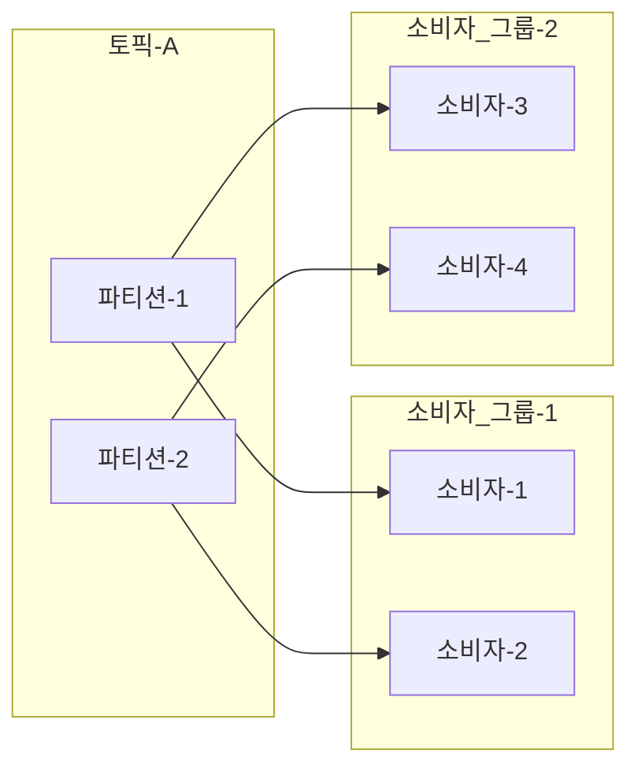
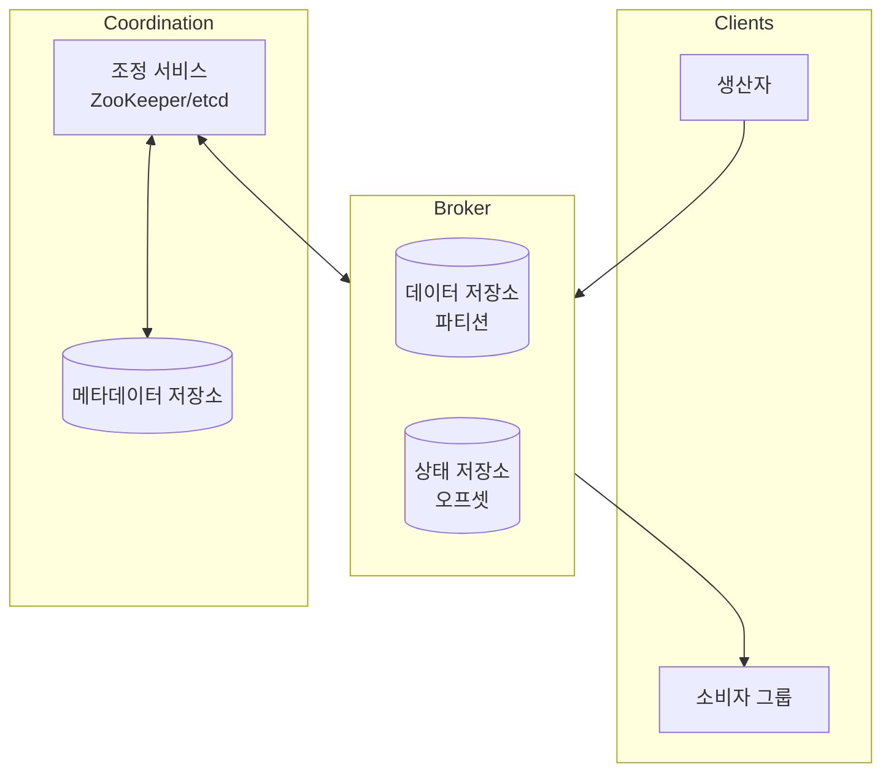
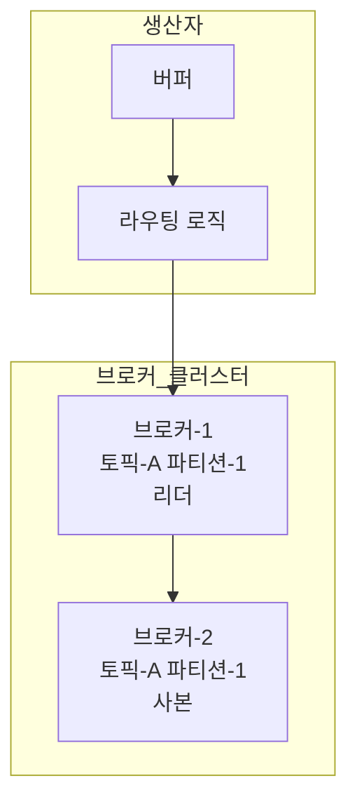
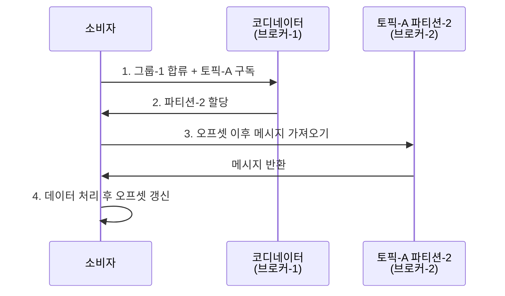
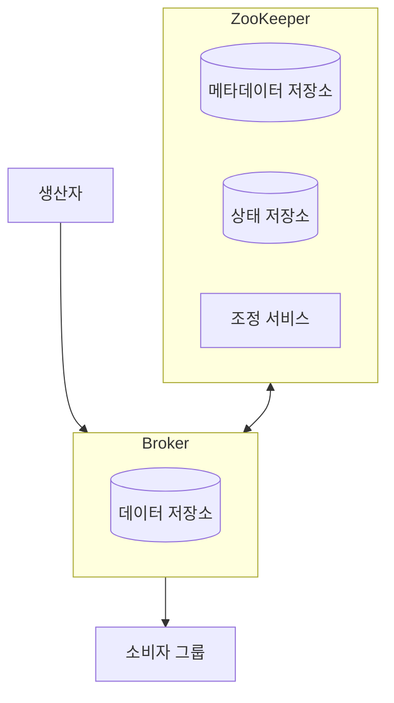
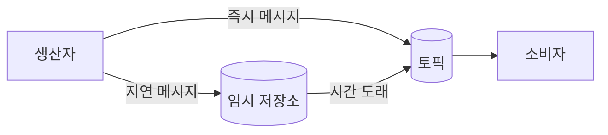

# Chapter 4: 분산 메시지 큐 (Distributed Message Queue) 발표 자료

> **발표자**: 길현준  
> **Last Updated**: 2026-02-05

---

## 목차

1. [1단계: 문제 이해 및 설계 범위 확정](#1-1단계-문제-이해-및-설계-범위-확정)
2. [2단계: 개략적 설계](#2-2단계-개략적-설계)
3. [3단계: 상세 설계](#3-3단계-상세-설계)
4. [면접 질문 Q&A](#4-면접-질문-qa)
5. [토론 주제](#5-토론-주제)
6. [참고 자료](#6-참고-자료)

---

## 1. 1단계: 문제 이해 및 설계 범위 확정

### 분산 메시지 큐란?

**정의**: 생산자(Producer)와 소비자(Consumer) 사이에서 메시지를 중개하는 분산 시스템. 컴포넌트 간 결합도를 낮추고 비동기 통신을 가능하게 함

**대표 시스템**:
- Apache Kafka, Apache Pulsar (이벤트 스트리밍 플랫폼)
- RabbitMQ, ActiveMQ, RocketMQ, ZeroMQ (전통적 메시지 큐)

**메시지 큐의 이점**:

| 이점 | 설명 |
|------|------|
| **결합도 완화** | 컴포넌트를 독립적으로 갱신 가능 |
| **규모 확장성** | 생산자/소비자를 트래픽에 맞게 독립적으로 확장 |
| **가용성 개선** | 일부 장애 시에도 다른 컴포넌트는 계속 동작 |
| **성능 개선** | 비동기 통신으로 서로 기다릴 필요 없음 |

### 메시지 큐 vs 이벤트 스트리밍 플랫폼

둘의 경계는 점차 희미해지고 있음 (RabbitMQ도 스트리밍 기능 추가, Pulsar도 큐 기능 지원)

| 구분 | 전통적 메시지 큐 | 이벤트 스트리밍 플랫폼 |
|------|-----------------|---------------------|
| **데이터 보관** | 소비 후 즉시 삭제 | 장기 보관 가능 |
| **반복 소비** | 불가 | 가능 |
| **순서 보장** | 보통 미보장 | 파티션 내 보장 |
| **예시** | RabbitMQ, ActiveMQ | Kafka, Pulsar |

> **본 설계안**: 데이터 장기 보관 + 메시지 반복 소비 + 순서 보장까지 지원하는 **고급 분산 메시지 큐** 설계

### 면접관-지원자 대화

> **지원자**: 메시지의 형태와 평균 크기를 알려주실 수 있나요?
>
> **면접관**: 텍스트 형태만 지원하면 되고, 크기는 수 KB 수준입니다.
>
> **지원자**: 메시지는 반복적으로 소비될 수 있어야 하나요?
>
> **면접관**: 네. 하나의 메시지를 여러 소비자가 수신할 수 있어야 합니다.
>
> **지원자**: 메시지 순서가 보장되어야 하나요?
>
> **면접관**: 생산된 순서 그대로 소비되어야 합니다.
>
> **지원자**: 데이터 보관 기간은요?
>
> **면접관**: 2주로 가정합시다.
>
> **지원자**: 어떤 메시지 전달 방식을 지원해야 하나요?
>
> **면접관**: '최소 한 번'은 반드시, 이상적으로는 모두 지원하고 설정 가능해야 합니다.

### 기능 요구사항

| 요구사항 | 세부 내용 |
|----------|----------|
| **메시지 생산** | 생산자가 메시지 큐에 메시지를 보낼 수 있어야 함 |
| **메시지 소비** | 소비자가 큐를 통해 메시지를 수신할 수 있어야 함 |
| **반복/단일 수신** | 반복 수신 또는 단일 수신 설정 가능 |
| **순서 보장** | 메시지가 생산된 순서대로 소비자에게 전달 |
| **데이터 보관** | 오래된 이력 데이터 삭제 가능 (2주 보관) |
| **메시지 크기** | 킬로바이트 수준 |
| **전달 방식** | at-most-once, at-least-once, exactly-once 설정 가능 |

### 비기능 요구사항

| 요구사항 | 설명 |
|----------|------|
| **높은 대역폭 / 낮은 지연** | 용도에 따라 선택 가능 |
| **규모 확장성** | 메시지 양 급증에도 처리 가능한 분산 시스템 |
| **지속성 및 내구성** | 디스크에 지속적으로 보관 + 여러 노드에 복제 |

---

## 2. 2단계: 개략적 설계

### 메시지 모델

#### 일대일 (Point-to-Point) 모델

```
생산자 → 메시지 큐 → 메시지 A → 소비자 1 (수신)
                              → 소비자 2 (수신 못함)
```
- 메시지를 **오직 한 소비자만** 가져감
- 소비자가 메시지 수신 확인(acknowledge)하면 큐에서 삭제
- 데이터 보관 미지원

#### 발행-구독 (Publish-Subscribe) 모델

```
생산자 → 메시지 큐(토픽) → 메시지 A → 소비자 1 (수신)
                                    → 소비자 2 (수신)
```
- **토픽(Topic)**: 메시지를 주제별로 정리하는 논리적 채널
- 토픽을 구독하는 **모든 소비자**에게 메시지 전달

> **본 설계안**: 발행-구독 모델을 기본으로, 소비자 그룹을 통해 일대일 모델도 지원

### 토픽, 파티션, 브로커

```
토픽-A
├── 파티션-1 (브로커-1) → | 0 | 1 | 2 | 3 | 4 | 5 | ... |
└── 파티션-2 (브로커-2) → | 0 | 1 | 2 | 3 | ... |
```

| 개념 | 설명 |
|------|------|
| **토픽** | 메시지를 주제별로 분류하는 논리적 단위 |
| **파티션** | 토픽을 여러 조각으로 분할 (=샤딩). FIFO 큐처럼 동작 |
| **오프셋** | 파티션 내 메시지의 위치 |
| **브로커** | 파티션을 유지하는 서버 노드 |

**메시지 라우팅**:
- 키가 있는 메시지: `hash(key) % numPartitions` → 같은 키는 같은 파티션
- 키가 없는 메시지: 무작위 파티션 선택

### 소비자 그룹



**핵심 제약**: 한 파티션의 메시지는 같은 그룹 안에서 **오직 한 소비자만** 읽을 수 있음

| 효과 | 설명 |
|------|------|
| **순서 보장** | 파티션 내 메시지 소비 순서가 보장됨 |
| **일대일 모델** | 모든 소비자를 같은 그룹에 두면 각 메시지는 한 소비자만 소비 |
| **발행-구독 모델** | 여러 그룹이 같은 토픽을 구독하면 모든 그룹이 메시지 수신 |
| **주의사항** | 그룹 내 소비자 수 > 파티션 수이면 유휴 소비자 발생 |

### 개략적 아키텍처



| 컴포넌트 | 역할 |
|----------|------|
| **생산자** | 메시지를 특정 토픽으로 전송 |
| **소비자 그룹** | 토픽을 구독하고 메시지를 소비 |
| **브로커** | 파티션을 유지하는 서버 |
| **데이터 저장소** | 메시지를 파티션 내에 보관 |
| **상태 저장소** | 소비자 오프셋 등 상태 정보 유지 |
| **메타데이터 저장소** | 토픽 설정, 속성 정보 보관 |
| **조정 서비스** | 서비스 탐색 + 리더 선출 (ZooKeeper/etcd) |

---

## 3. 3단계: 상세 설계

### 세 가지 핵심 설계 결정

| 결정 | 이유 |
|------|------|
| **디스크 기반 자료 구조 (WAL)** | 순차 접근 시 높은 성능 + OS 디스크 캐시 활용 |
| **무복사 메시지 자료 구조** | 생산자→큐→소비자 전달 과정에서 불필요한 복사 제거 |
| **일괄 처리 우선** | 네트워크 왕복 비용 절감 + 순차 쓰기 대역폭 극대화 |

### 데이터 저장소: WAL (Write-Ahead Log)

**왜 데이터베이스가 아닌가?**

| 선택지 | 문제점 |
|--------|--------|
| 관계형 DB | 읽기/쓰기가 동시에 대규모로 발생 → 병목 |
| NoSQL DB | 여전히 메시지 큐의 접근 패턴에 최적화되지 않음 |
| **WAL (채택)** | Append-only 파일, 순차 접근 → 높은 디스크 성능 |

```
토픽-A 파티션-1
| 0 | 1 | 2 | 3 | 4 | 5 | 6 | 7 | 8 | ... |
←--- 세그먼트-1 ---→←--- 세그먼트-2 ---→

세그먼트 관리:
- 활성 세그먼트: 새 메시지 추가 (append)
- 비활성 세그먼트: 읽기 전용
- 보관 기한 만료 시 삭제
```

**디스크 성능 참고**: 순차 접근 패턴을 활용하면 RAID 디스크에서 **수백 MB/sec** 읽기/쓰기 달성 가능. OS의 적극적 디스크 캐시도 활용.

### 메시지 자료 구조

| 필드 | 자료형 | 설명 |
|------|--------|------|
| **key** | byte[] | 파티션 결정에 사용 |
| **value** | byte[] | 메시지 페이로드 |
| **topic** | string | 소속 토픽 이름 |
| **partition** | integer | 소속 파티션 ID |
| **offset** | long | 파티션 내 위치 |
| **timestamp** | long | 저장 시각 |
| **size** | integer | 메시지 크기 |
| **crc** | integer | 무결성 검증 (CRC) |

> **핵심**: 메시지 구조는 생산자-큐-소비자 간의 **계약(contract)**. 이 구조를 전 과정에서 그대로 유지하여 불필요한 복사를 방지

### 일괄 처리 (Batching)

| 적용 구간 | 효과 |
|-----------|------|
| 생산자 → 브로커 | 여러 메시지를 한 번의 네트워크 요청으로 전송 |
| 브로커 디스크 쓰기 | 큰 규모의 순차 쓰기 → 디스크 캐시 효율 극대화 |
| 브로커 → 소비자 | 메시지 일괄 수신으로 네트워크 왕복 감소 |

```
         높은 대역폭 ←────────→ 낮은 응답 지연
              ↑                      ↑
        일괄 처리 양 많음         일괄 처리 양 적음
```

> **트레이드오프**: 일괄 처리 양 ↑ → 대역폭 ↑, 지연 ↑ / 일괄 처리 양 ↓ → 대역폭 ↓, 지연 ↓

### 생산자 측 작업 흐름



**라우팅 계층을 생산자 내부로 편입한 이유**:

| 장점 | 설명 |
|------|------|
| **지연 감소** | 네트워크 노드 하나 줄어듦 |
| **유연한 라우팅** | 생산자가 자체 파티션 선택 로직 보유 |
| **일괄 처리** | 버퍼에 메시지를 모아 일괄 전송 가능 |

**전송 흐름**:
1. 생산자가 메시지를 버퍼에 축적
2. 라우팅 로직이 메타데이터로부터 리더 사본 위치 확인
3. 리더 사본에 메시지 전송
4. 다른 사본이 리더로부터 데이터 동기화
5. 충분한 사본이 동기화되면 리더가 디스크에 기록(commit)
6. 생산자에게 ACK 응답

### 소비자 측 작업 흐름 (풀 모델)

| 모델 | 장점 | 단점 |
|------|------|------|
| **푸시** | 낮은 지연 | 소비자 과부하 위험, 생산자가 속도 좌우 |
| **풀 (채택)** | 소비자가 속도 결정, 일괄 처리에 적합 | 메시지 없을 때 자원 낭비 (→ 롱 폴링으로 해결) |



### 소비자 재조정 (Consumer Rebalancing)

어떤 소비자가 어떤 파티션을 담당하는지 **재결정**하는 프로세스

**트리거 조건**:
- 새 소비자 합류 / 기존 소비자 이탈
- 소비자 장애 (박동 메시지 중단)
- 파티션 수 변경

**코디네이터 역할**: 소비자 그룹을 관리하는 전담 브로커 노드

```
소비자 합류 흐름:
1. 소비자 A만 존재 → 모든 파티션 소비 중
2. 소비자 B가 그룹 합류 요청
3. 코디네이터가 A에게 "재합류 필요" 통지 (박동 응답 시)
4. A, B 모두 그룹에 재합류 → 리더 선출
5. 리더가 파티션 배치 계획 생성 → 코디네이터 경유 전달
6. 각 소비자가 배정된 파티션에서 소비 시작
```

```
소비자 장애 흐름:
1. 소비자 A의 박동 메시지가 일정 시간 동안 도착하지 않음
2. 코디네이터가 장애로 판단 → 재조정 개시
3. 남은 소비자들에게 파티션 재배분
```

### 상태 저장소 / 메타데이터 저장소

| 저장소 | 보관 내용 | 특성 | 기술 선택 |
|--------|-----------|------|----------|
| **상태 저장소** | 소비자-파티션 배치 관계, 그룹별 마지막 오프셋 | 빈번한 읽기/쓰기, 높은 일관성 필요 | ZooKeeper |
| **메타데이터 저장소** | 토픽 설정, 파티션 수, 사본 배치 정보 | 변경 드묾, 높은 일관성 | ZooKeeper |



### 복제 (Replication)

```
토픽-A 파티션-1:
  브로커-1 [리더]  ← 생산자가 여기에만 메시지 전송
  브로커-2 [사본]  ← 리더로부터 동기화
  브로커-3 [사본]  ← 리더로부터 동기화
```

**사본 분산 계획**: 브로커 컨트롤러(조정 서비스를 통해 선출)가 생성하여 메타데이터 저장소에 보관

### ISR (In-Sync Replicas)

```
사본-1 (리더):     | 10 | 11 | 12 | 13 | 14 | 15 |
사본-2 (단순 사본): | 10 | 11 | 12 | 13 | 14 |      ← ISR ✓
사본-3 (단순 사본): | 10 | 11 | 12 | 13 |           ← ISR ✓
사본-4 (단순 사본): | 10 | 11 |                      ← ISR ✗ (뒤처짐)

합의 오프셋(committed offset) = 13
ISR = {사본-1, 사본-2, 사본-3}
```

**ISR의 역할**: 성능과 영속성(durability) 사이의 **타협점**

### ACK 설정

| ACK 값 | 동작 | 영속성 | 지연 | 사용 사례 |
|--------|------|--------|------|----------|
| **ACK=all** | 모든 ISR이 수신해야 ACK | 최고 | 높음 | 데이터 손실 불가 환경 |
| **ACK=1** | 리더만 저장하면 ACK | 중간 | 중간 | 낮은 지연 우선 |
| **ACK=0** | ACK 기다리지 않음 | 낮음 | 최저 | 지표 수집, 로그 등 |

### 규모 확장성

| 컴포넌트 | 확장 방법 |
|----------|----------|
| **생산자** | 생산자 추가/삭제 (그룹 조정 불필요) |
| **소비자** | 소비자 추가 → 재조정 메커니즘이 자동 처리 |
| **브로커** | 노드 추가 → 한시적으로 사본 수 초과 허용 → 동기화 완료 후 불필요 사본 삭제 |
| **파티션** | 파티션 추가 → 기존 데이터 이동 없음, 새 메시지만 분산 |

#### 브로커 추가 시 안전한 확장

```
1단계: 브로커 1, 2, 3 (각 파티션 사본 3개)
   ↓ 브로커-4 추가
2단계: 브로커-4에 새 사본 생성 → 한시적으로 사본 수 > 3
   ↓ 새 사본이 리더 상태를 따라잡으면
3단계: 기존 불필요한 사본 삭제 → 사본 수 = 3
```

#### 파티션 추가/삭제

| 작업 | 동작 |
|------|------|
| **추가** | 새 파티션 생성, 이후 메시지만 분산 (기존 데이터 이동 없음) |
| **삭제** | 퇴역(decommission) 후 일정 기간 유지 → 소비자가 읽은 후 실제 삭제 |

### 메시지 전달 방식

#### 최대 한 번 (At-Most Once)

```
생산자 → 메시지 소실 가능 → 메시지 큐 → 메시지 소실 가능 → 소비자
```
- 생산자: ACK=0, 재시도 없음
- 소비자: 처리 전에 오프셋 갱신 → 장애 시 메시지 유실
- **적합**: 지표 모니터링 등 소량 데이터 손실 허용

#### 최소 한 번 (At-Least Once)

```
생산자 → 중복 전송 가능 → 메시지 큐 → 중복 전송 가능 → 소비자
```
- 생산자: ACK=1 또는 all, 실패 시 재시도
- 소비자: 처리 완료 후에만 오프셋 갱신 → 장애 시 중복 소비 가능
- **적합**: 중복 처리가 큰 문제 아닌 환경, 소비자가 멱등성(idempotency) 보장

#### 정확히 한 번 (Exactly Once)

```
생산자 → 정확히 한 번 전송 → 메시지 큐 → 정확히 한 번 전송 → 소비자
```
- 구현이 가장 까다로움 (성능 및 복잡도 비용 큼)
- **적합**: 결제, 회계 등 금융 관련 응용

### 고급 기능

#### 메시지 필터링

| 방법 | 장단점 |
|------|--------|
| 소비자가 불필요한 메시지 버림 | 유연하지만 불필요한 트래픽 발생 |
| 브로커에서 메시지 내용 기반 필터링 | 복호화/역직렬화 필요 → 성능 저하, 보안 우려 |
| **태그 기반 필터링 (채택)** | 메타데이터 영역에 태그 → 브로커가 효율적 필터링 |

```
메시지: | 1 | 2 | 3 | 4 | 5 | ... |
         (각 메시지에 태그 첨부)
              ↓
         태그 필터 → 특정 태그를 구독한 소비자만 수신
```

#### 메시지 지연/예약 전송



- **지연 전송**: 주문 30분 후 결재 확인 메시지 등
- **구현**: 임시 저장소에 보관 → 타이밍 기능으로 정시에 토픽으로 이동
- **예약 전송**: 지정 시각에 소비자에게 전달 (설계 철학은 지연 전송과 유사)

---

## 4. 면접 질문 Q&A

### Q1. 왜 데이터베이스가 아닌 WAL을 선택했나요?

> **답변**: 메시지 큐의 트래픽 패턴은 데이터베이스에 적합하지 않습니다:
> 1. **읽기/쓰기가 동시에 대규모로 발생** → DB는 이 패턴에 병목
> 2. **갱신/삭제 없이 순차적 추가만** → WAL의 append-only 패턴에 완벽히 부합
> 3. **순차적 접근 패턴** → 회전식 디스크에서도 수백 MB/sec 성능
> 4. OS의 디스크 캐시를 적극 활용하여 별도 캐시 레이어 불필요

### Q2. ISR은 무엇이고 왜 필요한가요?

> **답변**: ISR(In-Sync Replicas)은 리더와 충분히 동기화된 사본 집합입니다.
> - **성능 vs 영속성**의 타협점: 모든 사본 동기화까지 기다리면 안전하지만, 느린 사본 하나가 전체를 지연시킴
> - ISR 내 사본만 합의에 참여하므로, 느린 사본이 있어도 시스템 전체가 멈추지 않음
> - ACK 설정(all/1/0)과 조합하여 영속성과 성능의 균형을 사용자가 조절 가능

### Q3. 소비자 그룹이 필요한 이유는?

> **답변**: 소비자 그룹은 두 가지 메시지 모델을 동시에 지원하는 핵심 메커니즘입니다:
> - **발행-구독**: 여러 그룹이 같은 토픽 구독 → 모든 그룹에 메시지 전달
> - **일대일**: 모든 소비자를 하나의 그룹에 배치 → 메시지당 하나의 소비자만 소비
> - 그룹별 오프셋을 독립 관리하므로, 과금/회계/분석 등 용도별 그룹 분리 가능

### Q4. 풀 모델을 선택한 이유는?

> **답변**: 대부분의 메시지 큐가 풀 모델을 채택하는 이유:
> 1. **소비자가 속도 결정**: 처리 능력에 맞춰 메시지를 가져감
> 2. **일괄 처리에 적합**: 소비자가 마지막 오프셋 이후 모든 메시지를 한 번에 가져갈 수 있음
> 3. **과부하 방지**: 푸시 모델은 생산 속도가 소비 속도를 넘어서면 소비자에 과부하
> 4. **롱 폴링**: 메시지가 없을 때의 자원 낭비는 롱 폴링으로 해결

### Q5. 소비자 재조정은 어떻게 동작하나요?

> **답변**: 코디네이터(전담 브로커 노드)가 주도합니다:
> 1. 코디네이터는 소비자의 **박동 메시지**를 모니터링
> 2. 소비자 합류/이탈/장애 감지 시 재조정 개시
> 3. 모든 소비자에게 그룹 재합류를 지시 (박동 응답을 통해 수동적 통지)
> 4. 새 리더를 선출 → 리더가 파티션 배치 계획 생성 → 코디네이터가 배포
>
> 소비자 그룹명을 해싱하여 코디네이터를 결정하므로, 같은 그룹의 소비자는 항상 같은 코디네이터에 연결됩니다.

### Q6. exactly-once 전달 방식은 왜 어려운가요?

> **답변**: 네트워크 장애, 프로세스 장애 등 분산 환경의 불확실성 때문입니다:
> - 생산자가 메시지를 보냈으나 ACK을 받지 못해 재전송 → 중복 발생
> - 소비자가 메시지를 처리했으나 오프셋 갱신 전 장애 → 재처리 발생
> - 이를 방지하려면 **트랜잭션**, **멱등성 보장**, **중복 제거 메커니즘** 등이 필요
> - 성능과 구현 복잡도 측면에서 큰 비용을 수반함

---

## 5. 토론 주제

### 1. 카프카의 ZooKeeper 의존성 제거 (KRaft)

**배경**: 카프카는 최근 ZooKeeper 의존성을 제거하고 자체 합의 프로토콜(KRaft)을 도입

**논점**:
- ZooKeeper 제거의 운영상 이점은 무엇인가?
- 메타데이터 관리를 브로커 자체에서 처리하면 아키텍처가 어떻게 단순화되는가?
- 외부 조정 서비스 vs 내부 합의 프로토콜의 트레이드오프

### 2. 대역폭 vs 지연 시간의 실제 선택

**상황**: 동일 시스템을 로그 수집(높은 대역폭)과 실시간 알림(낮은 지연)에 동시 사용

**논점**:
- 하나의 클러스터에서 두 가지 워크로드를 모두 처리할 수 있는가?
- 토픽/파티션 단위로 일괄 처리 설정을 다르게 가져가는 방안
- 전용 클러스터 분리 vs 단일 클러스터 내 QoS 적용

### 3. 정확히 한 번 전달의 현실적 구현

**문제**: exactly-once는 이론적으로 완벽하지만 현실에서는 한계가 있음

**논점**:
- 카프카의 트랜잭셔널 API로 어디까지 보장 가능한가?
- 소비자 측에서 멱등성을 보장하는 것이 더 현실적인가?
- 메시지 키 기반 중복 제거 전략의 장단점

---

## 6. 참고 자료

- [RabbitMQ 큐 길이 제한](https://www.rabbitmq.com/maxlength.html)
- [Apache ZooKeeper](https://en.wikipedia.org/wiki/Apache_ZooKeeper)
- [etcd](https://etcd.io/)
- [디스크와 메모리 성능 비교](https://deliveryimages.acm.org/10.1145/1570000/1563874/jacobs3.jpg)
- [카프카 Push vs Pull](https://kafka.apache.org/documentation/#design_pull)
- [카프카 소비자 설정](https://kafka.apache.org/20/documentation.html#consumerconfigs)
- [카프카 ZooKeeper 의존성 제거](https://towardsdatascience.com/kafka-no-longer-requires-zookeeper-ebfbf3862104)
- [ISR in Apache Kafka](https://www.cloudkarafka.com/blog/what-does-in-sync-in-apache-kafka-really-mean.html)
- [Kafka Protocol Guide](https://kafka.apache.org/protocol)
- [AMQP](https://en.wikipedia.org/wiki/Advanced_Message_Queuing_Protocol)
- [HDFS](https://hadoop.apache.org/docs/r1.2.1/hdfs_design.html)
