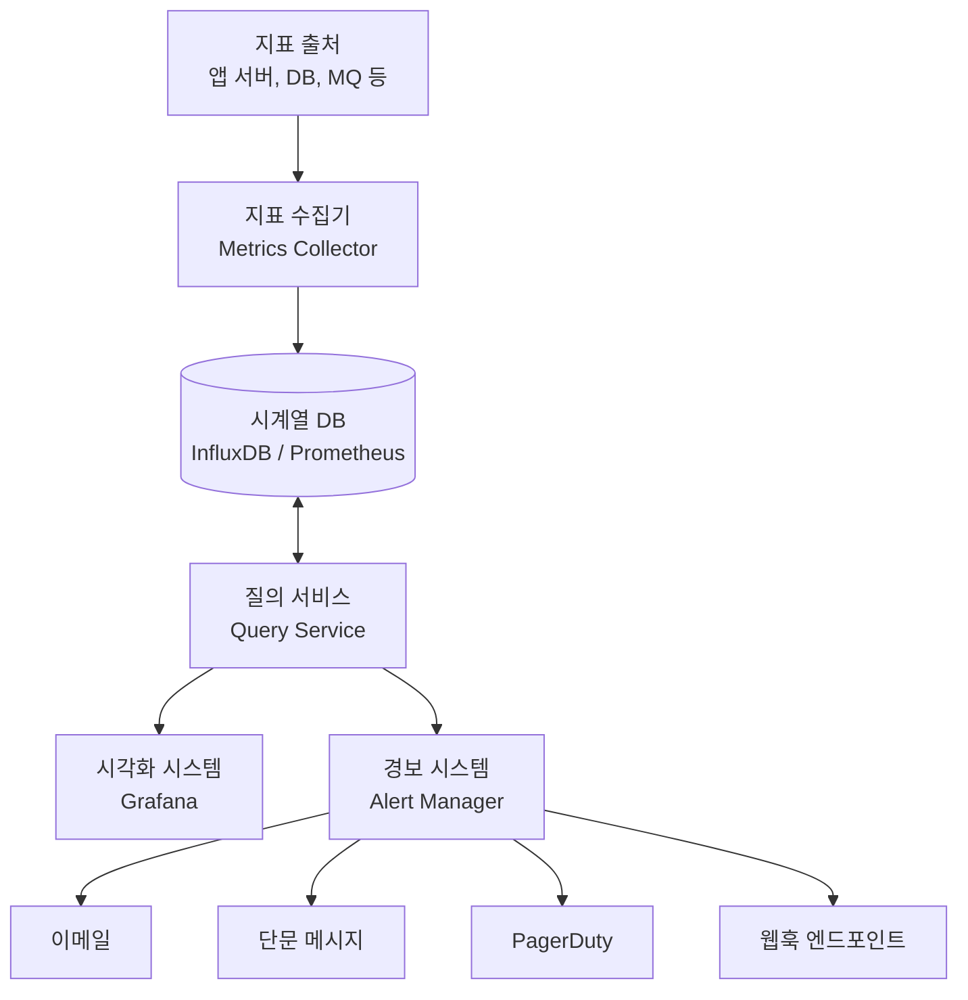
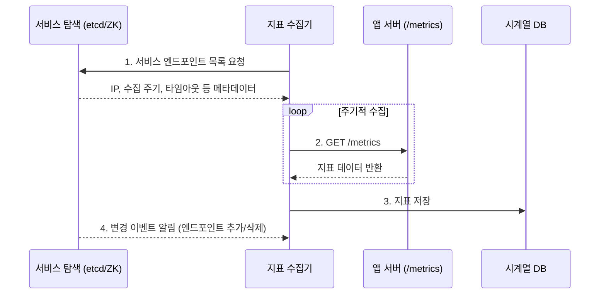
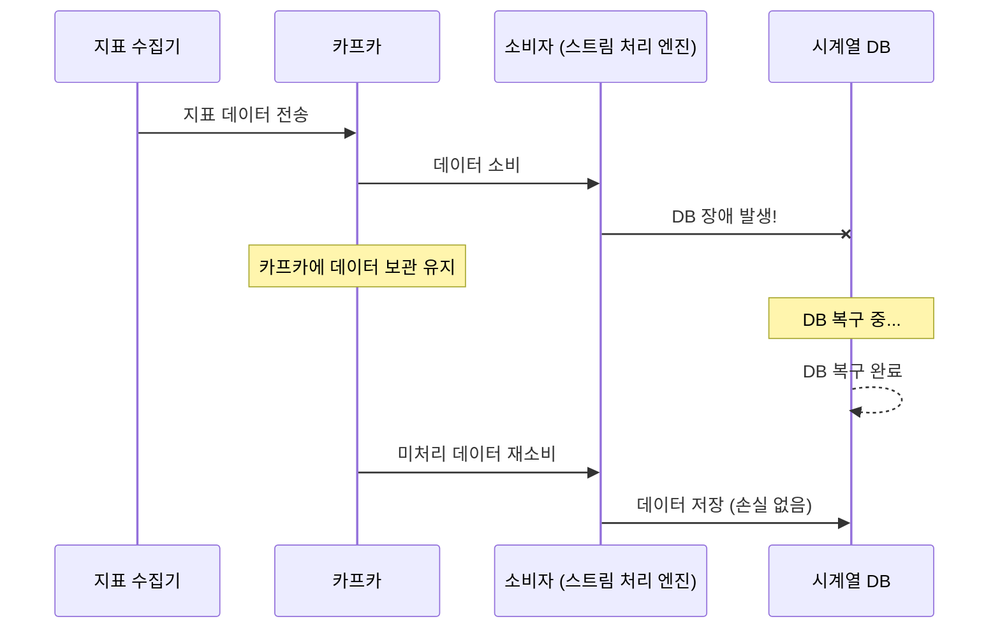
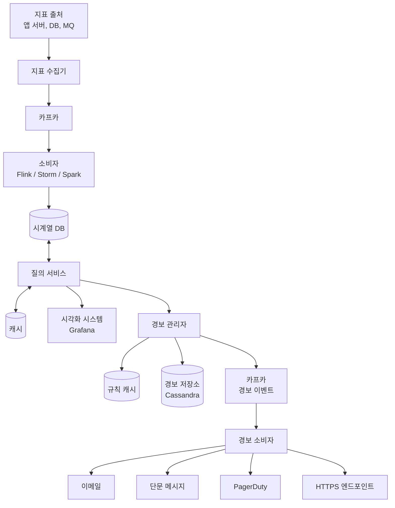

# Chapter 5: 지표 모니터링 및 경보 시스템 (Metrics Monitoring and Alerting System) 발표 자료

> **발표자**: 길현준

---

## 목차

1. [1단계: 문제 이해 및 설계 범위 확정](#1-1단계-문제-이해-및-설계-범위-확정)
2. [2단계: 개략적 설계](#2-2단계-개략적-설계)
3. [3단계: 상세 설계](#3-3단계-상세-설계)
4. [면접 질문 Q&A](#4-면접-질문-qa)
5. [토론 주제](#5-토론-주제)
6. [참고 자료](#6-참고-자료)

---

## 1. 1단계: 문제 이해 및 설계 범위 확정

### 지표 모니터링 및 경보 시스템이란?

**정의**: 대규모 인프라의 상태를 실시간으로 수집·저장·분석하여 이상 징후를 감지하고 경보를 발생시키는 시스템. 높은 가용성과 안정성을 달성하는 데 중추적 역할을 한다.

**실제 사례**:
- **Datadog**: SaaS 기반 통합 모니터링 플랫폼
- **Prometheus**: 오픈소스 시계열 모니터링 시스템 (풀 모델 기반)
- **Grafana**: 시계열 데이터 시각화 도구
- **InfluxDB**: 시계열 데이터 저장 및 분석에 특화된 데이터베이스

### ★ 요구사항 도출 (면접 대화 요약)

**지원자**: 시스템의 고객은 누구인가요? 대형 IT 업체가 내부에서 사용할 시스템인가요, 아니면 Datadog 같은 SaaS 제품인가요?  
**면접관**: 회사 내부에서 사용할 시스템이라고 합시다.

**지원자**: 어떤 지표를 수집해야 하나요?  
**면접관**: CPU 부하, 메모리 사용률, 디스크 사용량 같은 저수준 운영체제 지표나, 초당 요청 수(RPS)·웹 서버 프로세스 개수 같은 고차원 지표를 수집해야 합니다. 단, 사업 지표(business metrics)는 대상이 아닙니다.

**지원자**: 데이터를 장기 보관 전용 저장소로 옮길 때 해상도를 낮추어도 괜찮을까요?  
**면접관**: 새로 수집한 데이터는 7일 동안 원본 보관, 7일 뒤에는 1분 단위로 30일 보관, 그 뒤에는 1시간 단위로 1년 보관하는 것으로 합시다.

**지원자**: 경보 채널로는 어떤 것들을 지원해야 할까요?  
**면접관**: 이메일, 전화, PagerDuty(개발팀에 장애 알림을 자동 전달하고 온콜 담당자를 호출하는 사고 관리 서비스), 웹훅(특정 이벤트 발생 시 지정된 HTTP 엔드포인트로 자동 알림을 보내는 방식) 등을 지원하는 것으로 합시다.

**지원자**: 에러 로그나 액세스 로그 등에 대한 수집 기능도 제공해야 하나요?  
**면접관**: 아닙니다.

**지원자**: 분산 시스템 추적(distributed system tracing) 기능도 제공해야 하나요?  
**면접관**: 필요 없습니다.

### 기능 요구사항

| 요구사항 | 세부 내용 |
|----------|----------|
| **지표 수집** | 여러 출처(서버, DB, 메시지 큐 등)로부터 운영 지표 데이터를 수집 |
| **경보(Alerting)** | 수집된 지표를 분석하여 이상 징후 감지 시 이메일, 전화, PagerDuty, 웹훅 등으로 경보 발송 |
| **시각화(Visualization)** | 수집된 지표를 차트/그래프 형태의 대시보드로 시각화 |

### 비기능 요구사항

- **규모 확장성(Scalability)**: 늘어나는 지표 수와 경보 양에 맞게 확장 가능해야 한다
- **낮은 응답 지연(Low Latency)**: 대시보드 질의와 경보를 신속하게 처리해야 한다
- **안정성(Reliability)**: 높은 안정성을 제공하여 중요 경보를 놓치지 않아야 한다
- **유연성(Flexibility)**: 미래의 신기술을 쉽게 통합할 수 있도록 유연한 파이프라인으로 구축해야 한다

> ★ **참고**: 로그 모니터링(ELK 스택)과 분산 시스템 추적(Dapper, Zipkin)은 이 시스템의 범위에서 제외한다.

### 규모 추정 (Back-of-envelope)

```
서버 풀 = 1,000개
풀당 서버 수 = 100대
서버당 지표 수 = 100개
총 모니터링 지표 = 1,000 × 100 × 100 = 10,000,000개 (천만 개)

지표 수집 주기 = 10초 (가정)
초당 쓰기 연산 = 10,000,000 / 10 = 1,000,000 writes/sec

데이터 보관 정책:
  - 7일: 원본 그대로
  - 30일: 1분 해상도로 다운샘플링
  - 1년: 1시간 해상도로 다운샘플링
```

---

## 2. 2단계: 개략적 설계

### 시스템의 다섯 가지 컴포넌트

지표 모니터링 및 경보 시스템은 일반적으로 다음 다섯 가지 컴포넌트로 구성된다.

| 컴포넌트 | 역할 | 특징 |
|----------|------|------|
| **데이터 수집(Data Collection)** | 여러 출처로부터 지표 데이터를 수집 | 풀/푸시 모델 선택 가능 |
| **데이터 전송(Data Transmission)** | 지표 데이터를 모니터링 시스템으로 전송 | 카프카 등 큐 활용 가능 |
| **데이터 저장소(Data Storage)** | 전송된 데이터를 정리하고 저장 | 시계열 DB 사용 |
| **경보(Alerting)** | 데이터 분석 → 이상 징후 감지 → 경보 발생 | 다양한 채널 지원 |
| **시각화(Visualization)** | 차트/그래프로 데이터 시각화 | Grafana 등 활용 |

### 데이터 모델 — 시계열 데이터

지표 데이터는 **시계열(time series) 데이터** 형태로 기록한다. 시계열 데이터란 값 집합에 타임스탬프가 붙은 형태의 데이터를 말하며, 각 시계열에는 고유한 이름과 선택적 레이블(label)이 부여된다.

**시계열 데이터 구성**:

| 이름 | 자료형 |
| :--- | :--- |
| 지표 이름 | 문자열 |
| 태그/레이블 집합 | `<키:값>` 쌍의 리스트 |
| 지표 값 및 타임스탬프 배열 | `<값, 타임스탬프>` 쌍의 배열 |

**사례: 서버 i631의 CPU 부하**

| 항목 | 값 |
| :--- | :--- |
| metric_name | cpu.load |
| labels | host:i631, env:prod |
| timestamp | 1613707265 |
| value | 0.29 |

**행 프로토콜(line protocol)**: 시장의 많은 모니터링 소프트웨어(Prometheus, OpenTSDB 등)가 준수하는 공통 입력 형식이다.

```
CPU.load host=webserver01,region=us-west 1613707265 50
CPU.load host=webserver02,region=us-west 1613707265 43
```

### ★★ 데이터 접근 패턴

> ★ **핵심**: 이 시스템의 트래픽은 **쓰기가 압도적**이다.

- **쓰기**: 매일 천만 개 운영 지표가 기록되며, 상당수 지표의 발생 빈도도 높다 → **항상 높은 쓰기 부하**
- **읽기**: 시각화와 경보 서비스가 읽기 연산을 발생시키지만, 그래프나 경보를 확인하는 패턴에 따라 **일시적으로 치솟았다(spiky) 사라지는** 특성을 보인다

### ★ 데이터 저장소 — 왜 시계열 DB인가?

| 저장소 유형 | 적합성 | 이유 |
|------------|--------|------|
| **관계형 DB (MySQL 등)** | ❌ 부적합 | 시계열 연산(지수 이동 평균 등) SQL이 복잡, 태그마다 인덱스 필요, 대량 쓰기에 성능 부족 |
| **NoSQL (Cassandra, Bigtable)** | △ 가능하나 비추천 | 확장 용이한 스키마 설계에 NoSQL 내부 구조 해박한 지식 필요 |
| **시계열 DB (InfluxDB, Prometheus)** | ✅ 최적 | 시계열 데이터에 최적화된 저장·질의 인터페이스, 데이터 보관/집계 기능 내장 |

> **InfluxDB 벤치마크**: 8CPU 코어 + 32GB RAM 서버 한 대로 **초당 250,000회 쓰기 연산** 처리 가능

> ★ **카디널리티 주의**: 좋은 시계열 DB는 레이블 기반의 신속한 질의를 위해 레이블별 인덱스를 구축한다. 이때 핵심 지침은 **각 레이블이 가질 수 있는 값의 가짓수(cardinality)가 낮아야 한다**는 것이다. 예를 들어 `env:prod`처럼 몇 가지 값만 갖는 레이블은 좋지만, `user_id`처럼 수백만 개 값을 갖는 레이블은 인덱스 폭발을 유발하여 DB에 과부하를 일으킨다. 이 기능은 데이터 시각화에 특히 중요하며, 범용 DB로 구축하기 매우 까다롭다.

### 개략적 아키텍처



| 컴포넌트 | 역할 |
|----------|------|
| **지표 출처** | 지표 데이터가 만들어지는 곳 (앱 서버, DB, MQ 등) |
| **지표 수집기** | 지표 데이터를 수집하고 시계열 DB에 기록 |
| **시계열 DB** | 지표를 시계열 형태로 보관, 분석에 적합한 질의 인터페이스 제공 |
| **질의 서비스** | DB에 보관된 데이터를 질의하고 가져오는 중간 계층 |
| **경보 시스템** | 다양한 채널로 경보 알림 전송 |
| **시각화 시스템** | 지표를 그래프/차트로 시각화 |

---

## 3. 3단계: 상세 설계

### 3.1 지표 수집 — 풀 모델 vs 푸시 모델

지표 수집 방법에는 **풀(Pull) 모델**과 **푸시(Push) 모델** 두 가지가 있다. 어느 쪽이 더 나은가는 논쟁적인 주제이며 정답은 없다.

#### 풀 모델

지표 수집기가 실행 중인 애플리케이션의 HTTP 엔드포인트(예: `/metrics`)에서 **주기적으로 데이터를 가져오는** 방식이다.

- **서비스 탐색(Service Discovery)**: 대규모 운영 환경에서는 서버가 수시로 추가되거나 삭제되므로, 수집 대상 목록을 수동으로 관리하기 어렵다. **서비스 탐색 서비스(SDS)**는 이 문제를 해결한다 — 각 서비스가 자신의 IP·포트·상태 정보를 SDS에 등록하면, 지표 수집기가 SDS에서 현재 활성화된 서비스 목록을 동적으로 가져오는 것이다. **etcd**와 **주키퍼(ZooKeeper)**는 이런 SDS 역할을 하는 분산 키-값 저장소로, 클러스터 설정 정보를 안정적으로 관리하고 변경 시 즉시 알림을 보내는 것이 특징이다.
- **안정 해시 링(Consistent Hash Ring)**: 수집기 서버를 여러 대 둘 때, 여러 수집기가 같은 서버에서 데이터를 중복으로 가져오는 문제가 생긴다. 안정 해시 링은 이를 방지하는 기법으로, 모든 수집 대상 서버를 원형 링 위에 배치한 뒤 각 수집기가 링의 특정 구간만 담당하도록 분배한다. 예를 들어 수집기 서버 2는 서버 1과 5에서 나오는 지표만 수집하고, 수집기 서버 3은 서버 2와 6만 담당하는 식이다. 서버가 추가/삭제되어도 전체 재배치 없이 인접 구간만 조정하면 된다.



#### 푸시 모델

지표 출처 서버에 설치된 **수집 에이전트(collection agent)**가 지표 데이터를 모아서 주기적으로 수집기에 전송하는 방식이다.

- 에이전트가 간단한 카운터 집계 등을 미리 처리하여 전송 데이터 양을 줄일 수 있다
- 수집기 오류 시 에이전트의 내부 버퍼에 일시 보관 후 재전송 가능
- 단, 오토스케일링 환경에서 서버 삭제 시 버퍼 데이터 소실 가능성 있음
- 수집기 클러스터 앞에 **로드밸런서**를 두고 CPU 부하에 따라 자동 규모 확장

#### ★ 풀 vs 푸시 비교표

| 비교 축 | 풀 모델 | 푸시 모델 |
|---------|---------|----------|
| **디버깅 용이성** | `/metrics` 엔드포인트로 언제든 직접 확인 가능. 랩톱에서도 가능. **풀 우세** | — |
| **상태 진단** | 풀 요청에 응답 없음 = 서버 장애로 즉시 진단 가능. **풀 우세** | 지표 미수신 시 네트워크 장애인지 서버 장애인지 구분 어려움 |
| **짧은 생존 프로세스** | 수집기가 미처 가져가기 전에 프로세스가 종료될 수 있음 | 에이전트가 직접 전송하므로 **푸시 우세**. 풀도 푸시 게이트웨이(짧은 수명 프로세스가 종료 전에 지표를 밀어 넣어두면 수집기가 나중에 가져가는 중간 저장소)로 해결 가능 |
| **네트워크/방화벽** | 모든 `/metrics` 엔드포인트가 접근 가능해야 함. 다중 데이터센터에서 복잡 | 로드밸런서 + 오토스케일 클러스터면 어디서든 수집 가능. **푸시 우세** |
| **성능** | 일반적으로 TCP 사용 | 보통 UDP 사용하여 전송 지연이 더 낮음. 반론: TCP 오버헤드도 낮다 |
| **데이터 신뢰성** | 수집 대상 목록이 사전 정의되어 신뢰 가능. **풀 우세** | 아무나 데이터를 보낼 수 있는 문제. 인증 강제로 해결 가능 |

> **대표 사례**: 풀 모델 — Prometheus / 푸시 모델 — Amazon CloudWatch, Graphite  
> 서버리스(serverless) 환경이 확산되면서 많은 조직이 **두 모델을 모두** 지원하는 추세다.

### 3.2 지표 전송 파이프라인의 규모 확장

시계열 DB에 장애가 생기면 데이터 손실이 발생할 수 있다. 이를 해결하기 위해 **카프카(Kafka) 같은 메시지 큐**를 지표 수집기와 시계열 DB 사이에 배치한다. **메시지 큐**란 생산자(producer)가 보낸 데이터를 임시로 보관했다가, 소비자(consumer)가 자기 속도에 맞춰 꺼내 가는 중간 버퍼 시스템이다. 생산자와 소비자가 직접 연결되지 않으므로 한쪽이 장애를 겪어도 다른 쪽에 영향을 주지 않는다. **카프카**는 이런 메시지 큐 중에서도 대용량·고가용성에 특화된 분산 메시지 플랫폼이다.

카프카에서 데이터를 꺼내 시계열 DB에 저장하는 역할은 **스트림 처리 엔진**이 맡는다. **스트림 처리**란 데이터가 도착하는 즉시(실시간으로) 처리하는 방식을 말하며, 대량의 데이터를 모아서 한꺼번에 처리하는 배치(batch) 방식과 대비된다. **Apache Flink**, **Storm**, **Spark Streaming** 등이 대표적인 스트림 처리 엔진으로, 카프카에서 지표 데이터를 소비하여 필요한 변환·집계를 수행한 뒤 시계열 DB에 기록한다.

**카프카 도입의 장점**:
- 고도로 안정적이고 규모 확장성이 뛰어난 분산 메시지 플랫폼
- 수집 컴포넌트와 처리 컴포넌트 사이의 **결합도를 낮춤**
- DB 장애 시에도 카프카에 데이터를 보관하여 **데이터 소실 방지**

**카프카 파티션을 통한 규모 확장**:
- 대역폭 요구사항에 따라 파티션 수 설정
- 지표 이름별 파티션 배치 → 소비자가 지표 이름별 집계 가능
- 태그/레이블에 따라 더 세분화된 파티션 분할
- 중요 지표에 우선순위 부여하여 먼저 처리

**카프카의 대안 — Gorilla**:
페이스북의 메모리 기반 시계열 DB 시스템인 **고릴라(Gorilla)**는 네트워크 장애가 발생해도 높은 수준의 쓰기 가용성을 유지한다. 이런 시스템을 쓴다면 카프카 없이도 동등한 안정성을 확보할 수 있다는 주장도 있다.

#### ★ 장애 시나리오: 시계열 DB 다운 시



> 카프카가 버퍼 역할을 하여 DB 장애 시에도 데이터가 소실되지 않는다.

### 3.3 데이터 집계 지점

지표 집계는 **세 가지 지점**에서 실행 가능하다. 각각 트레이드오프가 다르다.

| 집계 지점 | 방식 | 장점 | 단점 |
|----------|------|------|------|
| **수집 에이전트** | 클라이언트 측에서 카운터를 분 단위로 집계 후 전송 | 전송 데이터 양 감소 | 복잡한 집계 로직 지원 어려움 |
| **데이터 수집 파이프라인** | Flink 등 스트림 엔진이 저장 전에 집계 | DB 기록량 대폭 감소 | 늦게 도착하는 데이터 처리 어려움, 원본 미보관으로 정밀도 손해 |
| **질의 시점** | 원본 그대로 저장, 질의할 때 집계 | 데이터 손실 없음, 유연한 분석 가능 | 전체 데이터세트 대상 계산이라 속도 느림 |

### 3.4 질의 서비스 및 캐시 계층

**질의 서비스**는 질의 서버 클러스터 형태로 구현되어, 시각화/경보 시스템의 요청을 시계열 DB를 통해 처리한다. 별도의 질의 서비스를 두면 시계열 DB를 자유롭게 교체할 수 있다(결합도 감소).

**캐시 계층**: 질의 결과를 캐시하면 DB 부하를 줄이고 질의 성능을 높일 수 있다. 단, 대부분의 상용 시각화/경보 시스템은 이미 유명 시계열 DB와의 연동 플러그인을 갖추고 있으므로, 별도 질의 서비스가 불필요할 수도 있다.

#### ★ 시계열 DB 질의어 — SQL vs Flux

시계열 데이터를 SQL로 질의하면 복잡하지만, 시계열 DB 전용 질의어를 쓰면 간결해진다. **지수 이동 평균(Exponential Moving Average)**을 예로 들어보자. 이동 평균이란 일정 기간의 데이터 평균을 구간을 옮겨가며 계산하는 것이고, "지수" 이동 평균은 최근 값에 더 큰 가중치를 부여하는 방식이다. 서버 지표의 급격한 변동(노이즈)을 완화하면서도 최신 추세를 빠르게 반영하므로, 모니터링에서 자주 사용된다.

**SQL로 지수 이동 평균 계산** (복잡):

```sql
select id,
       temp,
       avg(temp) over (partition by group_nr order by time_read)
       as rolling_avg
from (
    select id, temp, time_read, interval_group,
           id - row_number() over (partition by interval_group
           order by time_read) as group_nr
    from (
        select id, time_read,
               "epoch"::timestamp + "900 seconds"::interval
               * (extract(epoch from time_read)::int4 / 900)
               as interval_group, temp
        from readings
    ) t1
) t2
order by time_read;
```

**Flux(InfluxDB 질의어)로 동일 계산** (간결):

```flux
from(db:"telegraf")
  |> range(start:-1h)
  |> filter(fn: (r) => r._measurement == "foo")
  |> exponentialMovingAverage(size:-10s)
```

> 이것이 범용 DB 대신 시계열 DB를 선택하는 핵심 이유 중 하나다.

### 3.5 저장소 계층 — 용량 최적화

> ★ **Facebook 논문 인사이트**: 운영 데이터 저장소에 대한 질의의 **85%는 지난 26시간 내에 수집된 데이터**를 대상으로 한다. 이 사실을 잘 활용하는 시계열 DB를 고르면 — 예를 들어 최근 데이터를 메모리에 적극 캐싱하는 제품 — 성능 면에서 큰 이득을 볼 수 있다.

#### 데이터 인코딩 및 압축 (이중-델타 인코딩)

타임스탬프 값은 인접한 데이터 포인트 간 차이가 매우 작다는 점을 활용한다.

```
원본 타임스탬프:
  T0: 1610087371        (32비트 필요)
  T1: 1610087381        (32비트 필요)
  T2: 1610087391        (32비트 필요)

이중-델타 인코딩 후:
  기준값: 1610087371    (32비트)
  차이: 10, 10, 9, 11   (각 4비트면 충분!)
```

> 32비트 → 4비트로 **87.5% 저장 공간 절감**. 좋은 시계열 DB는 이 기능을 내장하고 있다.

#### 다운샘플링(Downsampling)

데이터의 해상도를 시간이 지남에 따라 낮추어 저장 공간을 절약하는 기법이다.

| 보관 기간 | 해상도 | 예시 |
|----------|--------|------|
| 7일 이내 | 원본 그대로 | 10초 간격 데이터 |
| 30일 이내 | 1분 해상도 | 6개 데이터 → 1개 평균값 |
| 1년 이내 | 1시간 해상도 | 360개 데이터 → 1개 평균값 |

**구체 사례**: 10초 해상도 → 30초 해상도 집계

| 타임스탬프 | 원본 값 | → | 타임스탬프 | 집계 값(avg) |
|-----------|---------|---|-----------|-------------|
| 19:00:00 | 10 | | 19:00:00 | **15.3** |
| 19:00:10 | 16 | | | |
| 19:00:20 | 20 | | | |
| 19:00:30 | 30 | | 19:00:30 | **26.7** |
| 19:00:40 | 20 | | | |
| 19:00:50 | 30 | | | |

#### 냉동 저장소(Cold Storage)

잘 사용되지 않는 비활성 데이터를 저비용 저장소에 보관한다. 냉동 저장 비용은 일반 저장소에 비해 훨씬 낮다.

### 3.6 ★ 경보 시스템 — 7단계 처리 흐름

경보 시스템은 다음 7단계로 경보를 처리한다.

**1단계 — 설정 파일 로드**: 경보 규칙을 YAML 파일로 정의하고 캐시 서버에 보관한다.

```yaml
- name: instance_down
  rules:
    - alert: instance_down
      expr: up == 0
      for: 5m
      labels:
        severity: page
```

**2단계 — 경보 관리자 초기화**: 경보 관리자(Alert Manager)가 캐시에서 경보 설정을 가져온다.

**3단계 — 규칙 평가 및 이벤트 생성**: 설정된 규칙에 근거하여 주기적으로 질의 서비스를 호출하고, 임계값(threshold) 위반 시 경보 이벤트를 생성한다. 이 과정에서:
- **경보 필터링/병합(merge)/중복 제거(dedupe)**: 짧은 시간 내 같은 인스턴스의 동일 경보를 병합
- **접근 제어(access control)**: 특정 경보 관리 작업을 특정 개인만 수행하도록 제한
- **재시도(retry)**: 알림이 최소 한 번은 전달됨을 보장

**4단계 — 경보 저장소 기록**: **카산드라(Cassandra)**는 대량의 쓰기 연산에 강하고 수평 확장이 용이한 분산 NoSQL 데이터베이스다. 이런 키-값 저장소에 경보 상태(비활성화, 응답 대기, 경보 발령, 문제 해결 등)를 기록한다.

**5단계 — 카프카 전달**: 경보 이벤트를 카프카에 전달한다. 지표 전송 파이프라인(3.2절)과 마찬가지로, 경보 처리에도 카프카를 사이에 두는 이유는 동일하다 — 알림 채널(이메일, SMS 등)에 장애가 생겨도 경보 이벤트가 카프카에 보관되므로 복구 후 재처리가 가능하고, 채널별 소비자를 독립적으로 확장할 수 있다.

**6단계 — 경보 소비자**: 카프카에서 경보 이벤트를 읽는다.

**7단계 — 알림 전송**: 읽은 이벤트를 처리하여 이메일, 단문 메시지, PagerDuty, HTTP 엔드포인트 등 다양한 채널로 알림을 전송한다. 알림이 최소 한 번은 전달됨을 보장하기 위해, 4단계의 경보 저장소에 전달 상태를 기록하고 미전달 건을 재시도한다.

> ★ **실무 관점**: 기업 규모를 바로 지원하는 경보 시스템은 시장에 많고, 대부분 유명 시계열 DB와 통합되어 있다. 따라서 밑바닥부터 구현하기보다 상용품을 활용하는 것이 바람직하며, 면접에서는 본인 선택을 정당화할 수 있도록 준비해야 한다.

### 3.7 시각화 시스템

시각화 시스템은 데이터 계층 위에서 지표 대시보드(다양한 시간 범위의 지표)와 경보 대시보드(경보 상태)를 제공한다. **그라파나(Grafana)**가 대표적이며, 인기 있는 시계열 DB와의 궁합도 좋다. 품질 좋은 시각화 시스템은 구현이 어려우므로 상용품을 구입하는 것이 바람직하다.

### ★ 최종 아키텍처



**처리 플로우**:
1. 지표 출처에서 수집기가 지표 데이터를 수집 (풀/푸시)
2. 카프카를 통해 안정적으로 전달
3. 소비자(스트림 처리 엔진)가 데이터를 시계열 DB에 저장
4. 질의 서비스가 캐시 계층과 함께 데이터를 제공
5. 시각화 시스템(Grafana)이 대시보드를 렌더링
6. 경보 관리자가 규칙에 따라 경보 이벤트를 생성하고 카프카 → 소비자 → 채널로 알림 발송

---

## 4. 면접 질문 Q&A

### Q1. 왜 관계형 DB 대신 시계열 DB를 사용하는가?

**Answer**:
> 시계열 데이터에 대한 연산(지수 이동 평균, 시간 범위 집계 등)을 SQL로 작성하면 매우 복잡해진다. 또한 관계형 DB는 태그/레이블 기반 질의를 위해 태그마다 인덱스를 지정해야 하며, 대량의 쓰기 연산이 지속적으로 발생하는 환경에서 좋은 성능을 보이지 못한다.
>
> 시계열 DB(InfluxDB, Prometheus)는 이런 연산에 최적화되어 있고, SQL보다 사용하기 쉬운 질의 인터페이스(Flux 등)를 제공하며, 데이터 보관 기간 설정과 집계 기능을 내장하고 있다.
>
> **핵심 포인트**:
> - 동일 질의가 SQL은 20줄, Flux는 4줄
> - 8코어/32GB InfluxDB 서버 한 대로 초당 25만 쓰기 처리 가능
> - 레이블 기반 인덱스로 빠른 데이터 시각화 지원

### Q2. 풀 모델과 푸시 모델 중 어떤 것을 선택하겠는가?

**Answer**:
> 정답은 없으며, 환경에 따라 다르다. 서버가 안정적으로 운영되는 환경이라면 **풀 모델**이 디버깅과 상태 진단에 유리하다(Prometheus 사례). 서버리스나 오토스케일링 환경이라면 **푸시 모델**이 네트워크 구성이 단순하고 짧은 생존 프로세스도 지원한다(CloudWatch 사례).
>
> 실제로 많은 조직이 **두 모델을 모두 지원**하는 추세이며, 면접에서는 각 모델의 장단점을 비교할 수 있는 능력을 보이는 것이 중요하다.

### Q3. 카프카를 도입하는 이유는 무엇인가?

**Answer**:
> 지표 수집기와 시계열 DB 사이에 카프카를 두는 핵심 이유는 세 가지다:
>
> 1. **데이터 손실 방지**: DB 장애 시에도 카프카에 데이터가 보관되어 복구 후 재처리 가능
> 2. **결합도 감소**: 수집과 처리 컴포넌트를 분리하여 독립적 확장 가능
> 3. **규모 확장**: 파티션 메커니즘으로 지표 이름/태그별 분산 처리, 우선순위 설정 가능
>
> 단, 상용 규모 카프카 운영이 부담스럽다면 페이스북의 **Gorilla** 같은 메모리 기반 시계열 DB를 대안으로 제시할 수 있다.

### Q4. 데이터 집계는 어느 시점에 하는 것이 좋은가?

**Answer**:
> 세 가지 선택지가 있으며, 각각 트레이드오프가 다르다:
>
> - **수집 에이전트**: 간단한 카운터 집계만 가능. 전송량은 줄지만 복잡한 집계 불가
> - **수집 파이프라인**: Flink 등으로 저장 전 집계. DB 기록량 대폭 감소하지만 늦게 도착하는 데이터 처리가 어렵고 원본이 없어 정밀도 손해
> - **질의 시점**: 원본 보관 후 질의할 때 집계. 유연하지만 대규모 데이터세트 집계 시 느림
>
> 실무에서는 **에이전트의 간단한 사전 집계 + 질의 시점 집계**를 조합하여 유연성과 효율성을 모두 확보하는 경우가 많다.

### Q5. 다운샘플링이란 무엇이며, 왜 필요한가?

**Answer**:
> **다운샘플링(downsampling)**은 시간이 지남에 따라 데이터의 해상도를 낮추어 저장 공간을 절약하는 기법이다. 1년 치 데이터를 원본 해상도로 보관하면 저장 비용이 막대하므로, 오래된 데이터는 해상도를 낮춰도 분석 목적에는 충분하다.
>
> 예를 들어 10초 간격으로 수집된 CPU 지표를 30초 평균으로 집계하면 데이터 양이 1/3로 줄어들고, 1시간 평균으로 집계하면 1/360으로 줄어든다.
>
> **핵심 포인트**:
> - 7일 이내: 원본 보관
> - 30일 이내: 1분 해상도
> - 1년 이내: 1시간 해상도

---

## 5. 토론 주제

### 토론 1: 경보 시스템 — Build vs Buy

**질문**: 경보 시스템을 직접 구현할 것인가, 상용품을 구매할 것인가?

**토론 포인트**:
- 시장에는 기업 규모를 바로 지원하는 경보 시스템이 많고, 대부분 유명 시계열 DB와 통합되어 있다
- 직접 구현 시 필터링/병합/중복 제거/재시도/접근 제어 등 복잡한 로직을 모두 만들어야 한다
- 면접에서는 "왜 직접 만들지 않는지" 또는 "왜 직접 만드는지"를 정당화할 수 있어야 한다
- 시각화 시스템도 마찬가지: Grafana 같은 상용품이 품질과 비용 면에서 유리

### 토론 2: 카프카 없는 아키텍처는 가능한가?

**질문**: 모든 지표 모니터링 시스템에 카프카가 필수인가? 카프카 없이도 안정적인 시스템을 구축할 수 있는가?

**토론 포인트**:
- 페이스북의 Gorilla는 카프카 없이도 높은 쓰기 가용성을 유지한다
- 카프카 도입 시 운영 복잡도(클러스터 관리, 파티션 설계 등)가 증가한다
- 소규모 시스템에서는 오버엔지니어링일 수 있다
- 반면 대규모 시스템에서는 DB 장애 대비와 결합도 감소가 필수적

### 토론 3: 풀 모델의 미래 — 서버리스 시대에도 유효한가?

**질문**: 서버리스 환경이 확산되면서 풀 모델의 입지가 줄어들고 있는가?

**토론 포인트**:
- 서버리스(Lambda, Cloud Functions)에서는 에이전트를 설치할 서버가 없으므로 풀 모델 적용이 어렵다
- OpenTelemetry 같은 표준이 푸시 모델을 기본으로 채택하는 추세
- 하지만 쿠버네티스 환경에서는 Prometheus(풀 모델)가 여전히 사실상 표준
- 결국 두 모델을 모두 지원하는 하이브리드 접근이 현실적

### 토론 4: 실무 적용 — 게임 서버의 확률 지표 파이프라인

**질문**: 게임 서버에서 아이템 드롭·가챠 등 확률 이벤트의 실제 발생 비율을 모니터링하려면, 5장 아키텍처를 어떻게 적용할 수 있을까?

**시나리오**: 게임 서버에서 확률 기반 이벤트(아이템 드롭, 뽑기 등)가 발생할 때마다 시도 횟수·성공 횟수·기대 확률을 로그로 남기고, 이를 집계하여 "실제 확률이 설계 확률과 일치하는지" 대시보드로 확인하고 싶다.

**5장 아키텍처와의 1:1 매핑**:

| 5장 컴포넌트 | 실무 적용 | 역할 |
|-------------|----------|------|
| **수집 에이전트 (푸시 모델)** | 게임 서버 내 로그 버퍼 | 확률 이벤트 발생 시 내부 버퍼에 적재, 주기적으로 배치 전송 |
| **카프카 (메시지 큐)** | Kinesis Data Streams | 대량 로그를 안정적으로 수신·보관하는 스트리밍 큐 |
| **스트림 처리 엔진 (Flink)** | Kinesis Firehose | 스트림에서 데이터를 소비하여 저장 포맷으로 변환 |
| **시계열 DB (저장소)** | S3 + Parquet 포맷 | 컬럼 기반 압축 저장. 이중-델타 인코딩과 유사한 효율 |
| **질의 서비스** | Athena (서버리스 SQL) | Parquet 파일을 직접 SQL로 질의. 별도 DB 없이 분석 |

**토론 포인트**:
- 이 파이프라인은 **푸시 모델 + 카프카 패턴**을 그대로 따른다. 게임 서버는 짧은 생존 프로세스가 아니지만, 서버가 직접 DB에 쓰면 게임 로직에 영향을 주므로 푸시 모델이 적합하다
- Parquet 포맷은 책의 "이중-델타 인코딩"과 같은 맥락 — 컬럼 단위 압축으로 저장 비용을 대폭 절감한다
- 질의 시점 집계(3.3절)를 채택: 원본 로그를 그대로 저장하고, Athena에서 SQL로 집계한다. 유연하지만 대규모 데이터셋 질의 시 비용이 증가하는 트레이드오프가 있다
- **카프카 도입 이유(3.2절)와 동일**: 게임 서버 → Kinesis 사이에 버퍼를 두어, 다운스트림 장애 시에도 로그 손실을 방지한다

---

## 6. 참고 자료

### 딥다이브 보충 자료
- [풀/푸시 모델 심층 분석 & 시계열 DB 비교](./DEEP-DIVE.md)

### 공식 문서
- [Prometheus - Overview](https://prometheus.io/docs/introduction/overview/)
- [InfluxDB Documentation](https://www.influxdata.com/)
- [Grafana Demo](https://play.grafana.org/)
- [etcd Documentation](https://etcd.io/)

### 기술 블로그
- [Gorilla: A Fast, Scalable, In-Memory Time Series Database (Facebook)](http://www.vldb.org/pvldb/vol8/p1816-teller.pdf)
- [Why We're Building Flux (InfluxData)](https://www.influxdata.com/blog/why-were-building-flux-a-new-data-scripting-and-query-language/)
- [Push vs Pull in Monitoring Systems](https://giedrius.blog/2019/05/11/push-vs-pull-in-monitoring-systems/)
- [Pull doesn't scale - or does it? (Prometheus Blog)](https://prometheus.io/blog/2016/07/23/pull-does-not-scale-or-does-it/)

### 실무 사례

| 기업 | 기술 | 특징 |
|------|------|------|
| **Facebook** | Gorilla (자체 시계열 DB) | 메모리 기반, 카프카 없이 높은 쓰기 가용성 |
| **X (구 Twitter)** | MetricsDB | 자체 지표 저장 시스템 |
| **Amazon** | CloudWatch + Timestream | 푸시 모델 기반 + 관리형 시계열 DB |

---

## 5장 요약 마인드맵

```
지표 모니터링 및 경보 시스템
├── 1단계: 요구사항
│   ├── 기능: 지표 수집, 경보, 시각화
│   ├── 비기능: 확장성, 낮은 지연, 안정성, 유연성
│   └── 규모: 천만 개 지표, 1년 보관
├── 2단계: 개략적 설계
│   ├── 5가지 컴포넌트: 수집/전송/저장/경보/시각화
│   ├── 데이터 모델: 시계열 (이름 + 레이블 + 타임스탬프 + 값)
│   └── 저장소: 시계열 DB (RDB/NoSQL 부적합)
├── 3단계: 상세 설계
│   ├── 수집: 풀 vs 푸시 모델
│   ├── 전송: 카프카 파이프라인 (파티션 확장)
│   ├── 집계: 에이전트/파이프라인/질의 시점
│   ├── 질의: 캐시 계층 + Flux 질의어
│   ├── 저장소: 인코딩/다운샘플링/냉동 저장소
│   ├── 경보: YAML 규칙 → 관리자 → 카프카 → 소비자 → 채널
│   └── 시각화: Grafana (상용품 활용)
└── 핵심 포인트
    ├── 쓰기 압도적, 읽기 spiky한 접근 패턴
    └── Build vs Buy 판단 능력이 면접 핵심
```

---

*Last Updated: 2026-02-12*
