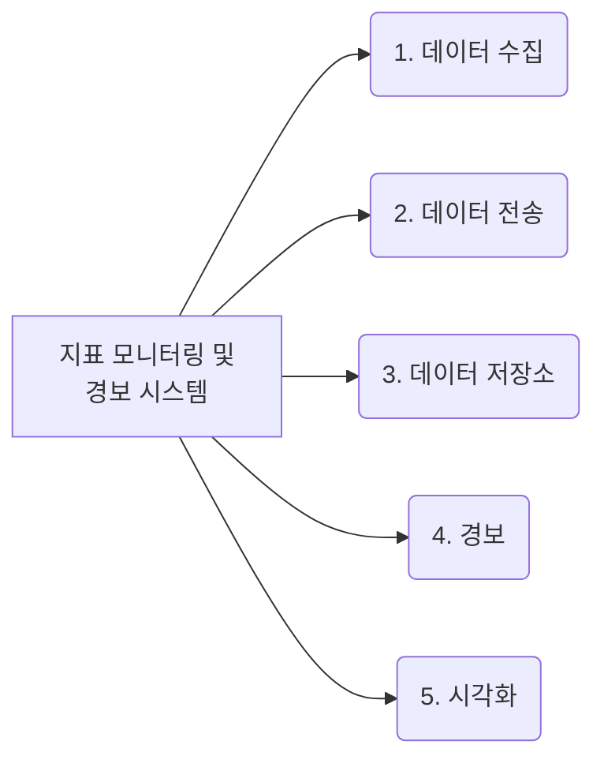

잘 설계된 지표 모니터링 및 경보 시스템은 인프라의 상태를 선명하게 볼 수 있도록 하여 높은 가용성과 안정성을 달성하는 데 중추적 역할을 한다.

# 1단계: 문제 이해 및 설계 범위 확정
```
시스템의 고객은 누구인가요?
페이스북이나 구글 같은 대형 IT 업체가 회사 내부에서 사용할 시스템을 설계하는 것인가요?
아니면 데이터독이나 스플렁크 같은 Saas 제품을 설계하는 것인가요?
>> 회사 내부에서 사용할 시스템

어떤 지표를 수집?
>> 시스템 운영 지표를 수집
>> 이 운영 지표는 CPU 부하, 메모리 사용률, 디스크 사용량 같은 저수준의 운영체제 사용률 지표일 수도 있고,
>> 서버가 처리하는 초당 요청 수나 웹 서버 프로세스 개수 같은 고차원적 개념에 관계된 지표일 수도 있음
>> 사업 지표는 이 시스템이 처리해야 할 지표 X

이 시스템으로 모니터링할 인프라 규모는?
>> DAU는 1억 명
>> 1000개의 서버 풀이 있고, 풀마다 100개의 서버 하드웨어를 유지하고 있음

지표 데이터는 얼마나 오래 유지?
>> 1년 동안은 보관

데이터를 장기 보관 전용 저장소로 옮길 때 지표의 해상도를 낮춰도 괜찮을까요?
>> 새로 수집한 데이터는 7일 동안 보관
>> 7일 뒤에는 1분 단위 데이터로 만들어 30일 동안 보관
>> 그 뒤에는 1시간 단위 데이터로 변환해서 보관

경보 채널로는 어떤 것들을 지원?
>> 이메일, 전화, PagerDuty, Webhook 등을 지원

에러 로그나 엑세스 로그 등에 대한 수집 기능도 제공?
>> X

분산 시스템 추적 기능도 제공?
>> X
```

## 개략적 요구사항 및 가정
요구사항을 다시 정리하면 다음과 같다.

- 대규모 인프라 모니터링
    - DAU 1억 명
    - 서버 풀 1,000개, 풀당 서버 수 100개.
        - 서버당 100개의 운영 지표를 수집한다고 치면 모니터링 해야 하는 지표의 수는 천만 개 수준
    - 데이터 보관 기간: 1년
    - 수집한 그대로 데이터를 보관하는 기간: 1주일
        - 그 뒤에는 1분 단위 데이터로 변환한 후 30일 보관
        - 그 뒤에는 1시간 단위 데이터로 변환한 뒤에 1년간 보관
- 모니터링할 지표는 다양
    - CPU 사용률
    - 요청 수
    - 메모리 사용량
    - 메시지 큐 내의 메시지 수

## 비기능 요구사항

- 규모 확장성
    - 시스템은 늘어나는 지표 수와 경보의 양에 맞게 확장
- 낮은 응답 지연
    - 대시보드와 경보를 신속하게 처리할 수 있도록, 질의에 대한 낮은 응답 지연을 보장
- 안정성
    - 높은 안정성을 제공하여 중요 경보를 놓치지 않도록 해야 함
- 유연성
    - 기술은 계속 변화하므로, 미래의 신기술을 쉽게 통합할 수 있도록 유연하게 변경 가능한 파이프라인을 이용해 구축한 시스템

고려하지 않아도 되는 요구사항은 다음과 같다.

- 로그 모니터링
    - Elasticsearch, Logstash, Kibana 등
- 분산 시스템 추적
    - 서비스에 대한 요청이 분산 시스템 내부를 어떻게 흘러 다니는지 추적할 수 있도록 하는 시스템
    - 요청이 한 서비스에서 다른 서비스로 이동할 때마다 데이터를 수집

---

# 2단계: 개략적 설계안 제시 및 동의 구하기
## 기본적 사항
지표 모니터링 및 경보 시스템은 일반적으로 다섯 가지 컴포넌트를 이용한다.



- 데이터 수집: 여러 출처로부터 지표 데이터를 수집
- 데이터 전송: 지표 데이터를 지표 모니터링 시스템으로 전송
- 데이터 저장소: 전송되어 오는 데이터를 정리하고 저장
- 경보: 밀려오는 데이터를 분석하고, 이상 징후를 감지하고, 경보를 발생시킴. 이 시스템은 다양한 통신 채널로 경보를 발송할 수 있어야 함.
- 시각화: 데이터를 차트나 그래프 등으로 제공.

## 데이터 모델
지표 데이터는 통상 시계열 데이터 형태로 기록한다.   
값 집합에 타임스탬프가 붙은 형태로 기록한다는 뜻이다.   
시계열 각각에는 고유한 이름이 붙고, 선택적으로 label을 붙이기도 한다.

모든 시계열 데이터는 다음 정보로 구성된다.

| 이름                 | 자료형                     |
|--------------------|-------------------------|
| 지표 이름              | 문자열                     |
| 태그/레이블 집합          | <키:값> 쌍의 리스트(List)      |
| 지표 값 및 그 타임스탬프의 배열 | <값, 타임스탬프> 쌍의 배열(Array) |

### 데이터 접근 패턴


이 시스템은 언제나 많은 양의 쓰기 연산 부하를 감당해야 하지만, 읽기 연산의 부하는 잠시 급증했다가 곧 사라진다.

## 데이터 저장소 시스템
데이터 저장소 시스템은 본 설계안의 핵심이다.

본 설계안이 감당하려는 연산 규모에 맞추려면 DB 튜닝에 상당한 노력을 기울여야만 할 것이고, 설사 그렇게 하더라도 만족할 만한 성능이 나오지 않을 수도 있다.

기업에 필요한 규모를 지원하는 시계열 DB가 시장에 나와 있는 만큼 범용 NoSQL DB를 사용하는 방안은 그다지 매력적이지 않다.

시계열 데이터에 최적화된 저장소 시스템은 시장에 많다.   
잘 최적화된 덕에, 같은 양의 시계열 데이터를 더 적은 서버에 보관할 수 있다.

- OpenTSDB: Hadoop/HBase
- X: MetricsDB
- Amazon: Timestream

시장에서 가장 인기있는 시계열 DB 두 가지는 InfluxDB, Prometheus다.   
다량의 시계열 데이터를 저장하고 빠른 실시간 분석을 지원하는 것이 특징이다.   
두 제품 모두 메모리 캐시와 디스크 저장소를 함께 사용한다.   
영속성 요건과 높은 성능 요구사항도 잘 만족한다.

핵심은 각 label이 가질 수 있는 값의 가짓수가 낮아야 한다는 것이다.   
이 기능은 데이터 시각화에 특히 중요하며, 범용 DB로 구축하기는 매우 까다롭다.

## 개략적 설계안


- 지표 출처: 지표 데이터가 만들어지는 곳으로 애플리케이션 서버, SQL DB, MQ 등 어떤 것이든 가능
- 지표 수집기: 지표 데이터를 수집하고 시계열 데이터에 기록하는 역할
- 시계열 DB: 지표 데이터를 시계열 데이터 형태로 보관하는 저장소. 다량의 시계열 데이터를 분석하고 요약하는 데 적합하도록 설계된 질의 인터페이스 제공
- 질의 서비스: 시계열 DB에 보관된 데이터를 질의하고 가져오는 과정을 돕는 서비스
- 경보 시스템: 경보를 받아야 하는 다양한 대상으로 경보 알림을 전송하는 역할을 하는 시스템
- 시각화 시스템: 지표를 다양한 형태의 그래프/차트로 시각화 하는 기능을 제공하는 시스템

---

# 3단계: 상세 설계
시스템 설계 면접을 보는 지원자는 몇 가지 핵심적 컴포넌트나 처리 흐름에 대한 상세 설계안을 제시할 수 있어야 한다.

## 지표 수집
counter나 CPU 사용량 같은 지표를 수집할 때는 때로 데이터가 소실되어도 아주 심각한 문제는 아니다.   
지표를 보내는 클라이언트는 성공적으로 데이터가 전송되었는지 신경 쓰지 않아도 상관없다.

이번 절에서 다룰 부분은 아래 그림의 점선 표시 사각형 안쪽이다.


## 풀 vs 푸시 모델
지표 데이터 수집 방법에는 두 가지 모델이 있다.

### 풀 모델
아래 그림은 HTTP 기반 풀 모델을 이용하는 지표 수집 흐름을 보여 준다.   
실행중인 애플리케이션에서 주기적으로 지표 데이터를 가져오는 지표 수집기가 이 흐름의 중심이다.


이 접근법에서 지표 수집기는 데이터를 가져올 서비스 목록을 알아야 한다.

각 서비스는 자신의 가용성 관련 정보를 서비스 탐색 서비스(SDS)에 기록하고, SDS는 서비스 엔드포인트 목록에 변화가 생길 때마다 지표 수집기에 통보한다.

아래 그림은 서비스 탐색 기술을 사용하는 풀 모델 기반 지표 수집 흐름을 좀 더 상세히 보여 준다.


1. 지표 수집기는 SDS에서 서비스 엔드포인트 설정 메타데이터 목록을 가져온다.
    - 각 메타데이터에는 지표 수집 주기(pulling interval), IP 주소, timeout, retry parameter 등이 기록되어 있다.
2. 지표 수집기는 사전에 합의된 HTTP 엔드포인트에서 지표 데이터를 가져온다.
    - 이런 엔드포인트를 수집기에 노출하기 위해서, 통상 서비스에 특정 클라이언트 라이브러리를 추가한다.
3. 지표 수집기는 서비스 엔드포인트 목록의 변화를 통지 받기 위한 변경 이벤트 알림 콜백을 서비스 탐색 컴포넌트에 등록할 수 있다.

지표 수집기 서버를 여러 대 둘 때 흔히 빚어지는 문제는 여러 서버가 같은 출처에서 데이터를 중복해서 가져올 가능성이 있다는 것이다.   
따라서 지표 수집 서버 간에 모종의 중재 메커니즘이 존재해야 한다.

이 메커니즘을 구현하는 한 가지 방안은 안정 해시 링을 사용하는 것이다.   
즉, 해시 링 구간마다 해당 구간에 속한 서버로부터 생상되는 지표의 수집을 담당하는 수집기 서버를 지정하는 것이다.   
이렇게 하면 특정 서버의 지표 데이터는 항상 하나의 수집 서버가 처리함을 보장할 수 있다.


### 푸시 모델
푸시 모델은 지표 출처에 해당하는 서버, 즉 웹 서버나 DB 서버 같은 서버가 직접 지표를 수집기에 전송하는 모델이다.


푸시 모델의 경우, 모니터링 대상 서버에 통상 수집 에이전트라고 부르는 소프트웨어를 설치한다.   
수집 에이전트는 해당 장비에서 실행되는 서비스가 생산하는 지표 데이터를 받아 모은 다음 주기적으로 수집기에 전달한다.

데이터 집계(aggregation)는 수집기에 보내는 데이터의 양을 줄이는 효과적인 방법이다.   
데이터 전송 트래픽의 양이 막대하여 수집기가 일시적으로 전송되는 데이터를 처리하지 못하게 되어 오류를 반환하면,   
에이전트는 내부의 소규모 버퍼에 데이터를 일시적으로 보관한 다음 나중에 재전송할 수도 있다.   
하지만 만일 에이전트가 위치한 서버 클러스터가 auto scaling이 가능하도록 설정되어 있다면 서버가 동적으로 추가되거나 삭제되는 과정에서 해당 데이터는 소실될 수도 있다.

푸시 모델을 채택한 지표 수집기가 밀려드는 지표 데이터를 제때 처리하지 못하는 일을 방지하려면,   
지표 수집기 클러스터 자체도 **auto scaling**이 가능하도록 구성하고 그 앞에 **로드밸런서**를 두는 것이 바람직하다.   
이때 클러스터의 크기는 지표 수집기 서버 CPU 부하에 따라 자동으로 자동으로 늘어나거나 줄어들도록 설정한다.


### 풀 모델 vs 푸시 모델 장단점 비교

- 풀 모델을 채택한 유명한 사례로는 Prometheus가 있다.
- 푸시 모델을 채택한 유명한 사례로는 아마존 CloudWatch, Graphite 등이 있다.

오히려 면접에서는 두 모델의 장단점을 비교할 수 있는 능력을 보이는 것이 더 중요하다.

| 구분                   | 풀 모델                                                                                                                   | 푸시 모델                                                                                                                      |
|----------------------|------------------------------------------------------------------------------------------------------------------------|----------------------------------------------------------------------------------------------------------------------------|
| 손쉬운 디버깅              | 애플리케이션 서버에 `/metrics` 엔드포인트를 두도록 강제하므로 필요할 때 언제든 지표 데이터를 볼 수 있으며, 심지어 랩톱에서도 가능하다. **풀 모델이 더 낫다.**                      | -                                                                                                                          |
| 상태 진단 (health check) | 애플리케이션 서버가 풀 요청에 응답하지 않으면 바로 해당 서버에 장애가 발생한 것으로 진단할 수 있다. **풀 모델 쪽이 쉽다.**                                              | 지표 수집기가 지표를 받지 못하면 네트워크 장애가 원인인지 서버 장애가 원인인지 알기 어렵다.                                                                       |
| 생존 기간이 짧은 프로세스       | -                                                                                                                      | 생명 주기가 짧은 일괄 작업 프로세스의 경우 수집기가 미처 지표를 끌어가기도 전에 종료될 수 있다. 그런 점에서는 **푸시 모델이 낫다.** 풀 모델도 푸시 게이트웨이(push gateway)를 도입하면 해결 가능하다. |
| 방화벽 등의 복잡한 네트워크 구성   | 수집기 서버가 지표 데이터를 제대로 끌어가려면 모든 `/metrics` 엔드포인트가 접근 가능하도록 구성해야 한다. 데이터센터를 여러 개 사용하는 경우 문제가 될 수 있어 네트워크 인프라를 세심히 설계해야 한다. | 지표 수집기가 로드밸런서 및 자동 규모 확장 클러스터 형태로 구성되었다면 어디서 오는 지표라도 수집 가능하다. **푸시 모델이 낫다.**                                               |
| 성능                   | 일반적으로 TCP를 사용한다.                                                                                                       | 보통 UDP를 사용한다. 전송 지연이 더 낮다. 다만 TCP 연결 오버헤드가 지표 데이터 전송보다 작다는 반론도 있다.                                                         |
| 데이터 신빙성              | 지표 데이터를 가져올 애플리케이션 서버 목록이 이미 정의되어 있으므로 해당 서버에서 수집된 데이터는 신뢰할 수 있다.                                                      | 누구나 수집기에 데이터를 보낼 수 있다는 문제가 있다. 전송 허용 서버 목록 유지 또는 인증(authentication) 강제로 해결할 수 있다.                                          |

## 지표 전송 파이프라인의 규모 확장


풀 모델과 무시 모델 가운데 무엇을 채택할지 여부에 관계없이,   
지표 수집기는 서버 클러스터 형태이며 엄청난 양의 데이터를 받아 처리해야 한다.   
아울러 이 클러스터는 자동으로 규모 확장이 가능하도록 설정하여 언제나 데이터 처리에 충분한 수집기 서버가 존재하도록 해야 한다.

하지만 시계열 DB에 장애가 생기면 데이터 손실이 발생할 가능성이 있다.   
아래 그림과 같이 큐를 두면 그런 문제를 해소할 수 있다.


지표 수집기는 지표 데이터를 카프카와 같은 큐 시스템에 전송한다.   
그러면 아파치 Storm이나 Flink, Spark 같은 소비자, 즉 스트림 처리 서비스가 해당 데이터를 받아 시계열 DB에 저장한다.   
이 접근법에는 몇 가지 장점이 있다.

- 카프카는 고도로 안정적이고 규모 확장성이 뛰어난 분산 메시지 플랫폼이다.
- 데이터 수집 컴포넌트와 처리 컴포넌트 사이의 결합도를 낮춘다.
- DB에 장애가 생겨도 카프카에 보관해 두면 되기에 데이터는 소실되지 않는다.

### 카프카를 통한 규모 확장
카프카에 내장된 파티션 메커니즘을 사용하면 시스템의 규모를 다양한 방법으로 확장할 수 있다.

- 대역폭 요구사항에 따라 파티션의 수를 설정한다.
- 지표 이름에 따라 어떤 지표를 어느 파티션에 배치할지 결정하면 소비자는 지표 이름에 따라 데이터를 집계할 수 있다.
- 태그/레이블에 따라 지표 데이터를 더욱 세분화한 파티션으로 나눈다.
- 중요 지표가 먼저 처리될 수 있도록 지표를 분류하고 우선순위를 지정한다.


### 카프카의 대안
사용 규모의 카프카 시스템 구축은 쉽지 않다.

페이스북의 메모리 기반 시계열 DB 시스템 Gorilla가 있다.   
고릴라는 일부에 네트워크 장애가 발생해도 높은 수준의 쓰기 연산 가용성을 유지한다.   
이런 시스템을 쓴다면 카프카 같은 MQ가 없어도 같은 수준의 안정성을 제공할 수 있다고 주장 가능하다.

## 데이터 집계 지점
지표 집계는 다양한 지점에서 실행 가능하다.

### 수집 에이전트가 집계하는 방안
클라이언트에 설치된 수집 에이전트는 복잡한 집계 로직은 지원하기 어렵다.   
어떤 카운터 값을 분 단위로 집계하여 지표 수집기에 보내는 정도는 가능하다.

### 데이터 수집 파이프라인에서 집계하는 방안
데이터를 저장소에 기록하기 전에 집계할 수 있으려면 보통 플링크 같은 스트림 프로세싱 엔진이 필요하다.

DB에는 계산 결과만 기록하므로, 실제로 기록되는 양은 엄청나게 줄어들 것이다.   
하지만 이 방안은 늦게 도착하는 지표 데이터의 처리가 어렵고, 원본 데이터를 보관하지 않기 때문에 정밀도나 유연성 측면에서 손해를 보게 된다는 문제가 있다.

### 질의 시에 집계하는 방안
데이터를 날것 그대로 보관한 다음 질의할 때 필요한 시간 구간에 맞게 집계한다.

데이터 손실 문제는 없으나 질의를 처리하는 순간에 전체 데이터세트를 대상으로 집계 결과를 계산해야 하므로 속도는 느릴 것이다.

## 질의 서비스
질의 서비스는 질의 서버 클러스터 형태로 구현되며, 시각화 또는 경보 시스템에서 접수된 요청을 시계열 DB를 통해 처리하는 역할을 담당한다.

이런 질의 처리 전담 서비스를 두면 클라이언트와 시계열 DB 사이의 결합도를 낮출 수 있다.(자유로운 시계열 DB 교체 가능)

### 캐시 계층
질의 결과를 저장할 캐시 서버를 도입하면 시계열 DB에 대한 질의 부하를 낮추고 질의 서비스의 성능을 높일 수 있다.


### 질의 서비스를 두면 곤란한 경우
별도 캐시를 도입할 필요가 없는 시계열 DB가 있다는 것도 고려할 사항이다.

### 시계열 DB 질의어
시계열 데이터는 SQL로 질의하기가 까다롭다.

하지만 시계열 DB 분석에 최적화된 Flux라는 언어로 작성하면 질의문에 간단해진다.

## 저장소 계층

### 시계열 DB는 신중하게 선택할 것
페이스북 연구 논문에 따르면 운영 데이터 저장소에 대한 질의 85%는 26시간 내에 수집도니 데이터를 대상으로 한다.   
이 사실을 잘 활용하는 시계열 DB를 고르면 성능 측면에서 큰 이득을 볼 수 있다.

### 저장 용량 최적화
지표 모니터링 시스템에 저장할 데이터의 양은 막대하다.   
이 문제를 공략하는 몇 가지 전략을 살펴보자.

**[데이터 인코딩 및 압축]**

데이터를 인코딩하고 압축하면 크기를 상당히 줄일 수 있다.   
좋은 시계열 DB는 대부분 이 기능을 내장하고 있다.

데이터를 완전한 현태로 저장하는 대신 기준 값과의 차이를 1610087371, 10, 10, 9, 11과 같이 저장한다.

**[다운샘플링]**

downsampling은 데이터의 해상도를 낮춰 저장소 요구량을 줄이는 기법이다.

아래와 같이 기간별로 규칙을 정할 수도 있다.

- 7일 이내 데이터: 샘플링 X
- 30일 이내 데이터: 1분 해상도로 낮춰 보관
- 1년 이내 데이터: 1시간 해상도로 낮춰 보관

**[냉동 저장소]**

잘 사용되지 않는 비활성 상태 데이터를 보관하는 곳이다.

대체적으로 시각화 경보 시스템은 직접 만들기보다 상용품을 가져다 쓰는 편이 훨씬 낫다.

## 경보 시스템
면접 대비를 위해 경보 시스템의 구성 방법은 한번 살펴보자.


1. 설정 파일을 가져와 캐시 서버에 보관
    - 경보 규칙은 디스크에 파일 상태로 보관하며, 규칙을 정의하는 데는 YAML이 널리 사용됨
2. 경보 관리자는 경보 설정 내역을 캐시에서 조회
3. 설정된 규칙에 근거하여 경보 관리자는 지정된 시간마다 질의 서비스를 호출
    - 질의 결과가 설정된 임계값을 위반하면 경보 이벤트 생성
    - 경보 관리자의 작업
        - 경보 필터링, merge, 중복 제거: 짧은 시간 동안 같은 인스턴스에서 발생한 경보는 merge 가능
        - 접근 제어: 특정한 경보 관리 작업은 반드시 특정한 개인만이 수행할 수 있도록 제한
        - 재시도: 경보 상태를 확인하고 알림이 최소 한 번은 전달됨을 보장
4. 경보 저장소는 카산드라 같은 형태의 키-값 저장소
    - 모든 경보의 상태 보관
    - 알림이 적어도 한 번 이상 전달되도록 보장하는 구실
5. 경보 이벤트를 카프카에 전달
6. 경보 소비자는 카프카에서 경보 이벤트를 소비
7. 경보 소비자는 카프카에서 읽은 경보 이벤트를 처리하여 이메일, 단문 메시지, PagerDuty, HTTP 서비스 엔드포인트 등의 다양한 채널로 알림 전송

## 시각화 시스템
품질 좋은 시각화 시스템은 구현하기 어렵다.   
따라서 상용품을 구입해서 쓰자고 주장하는 것이 바람직하다.   
예를 들어 Grafana는 그런 용도에 아주 잘 맞는 시스템이다.

---

# 4단계: 마무리

