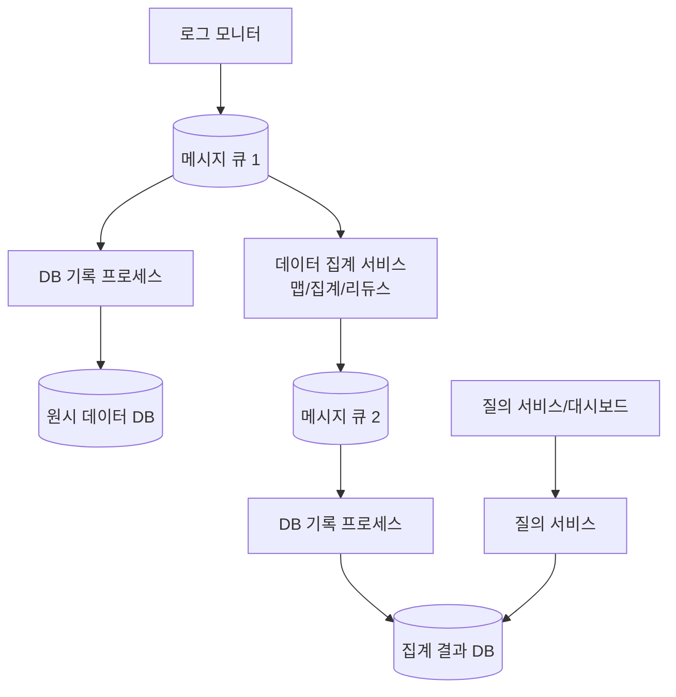
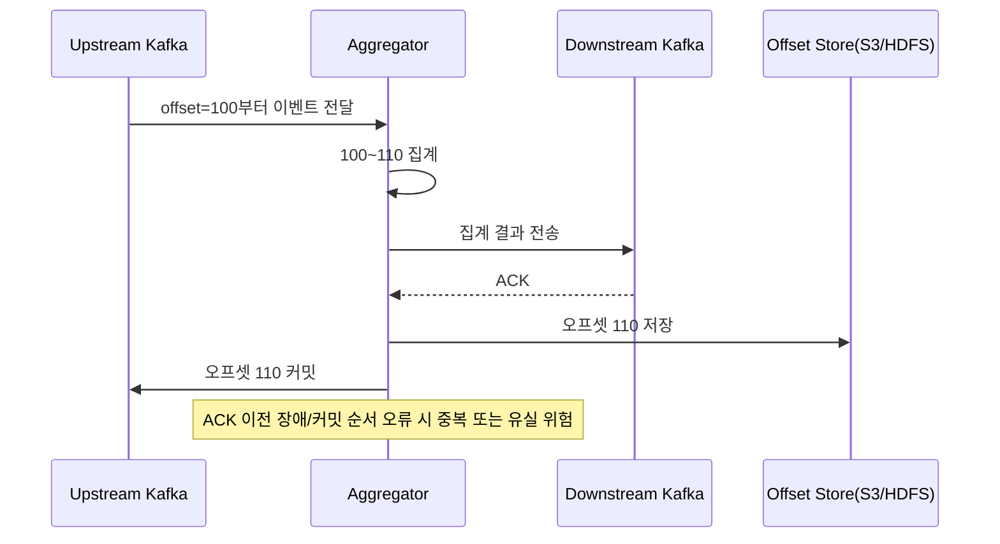
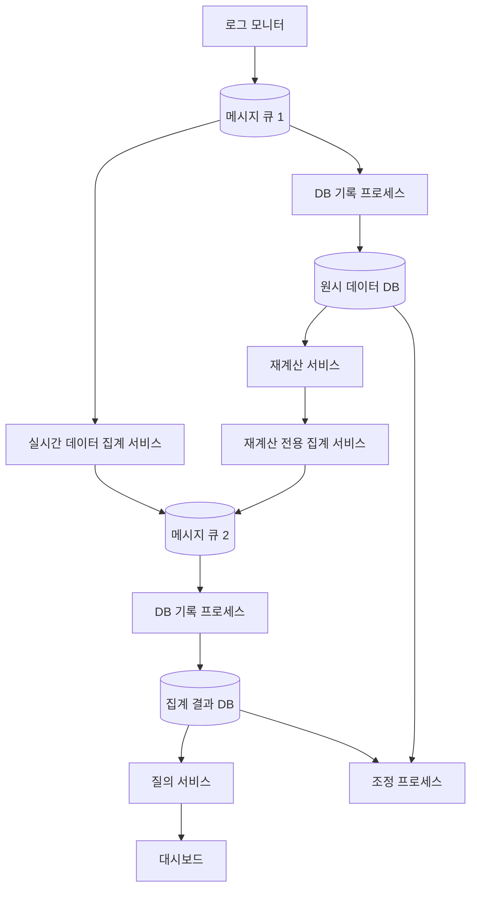

# 6장 광고 클릭 이벤트 집계 (Ad Click Event Aggregation) 발표 자료

> **발표자**: 길현준

---

## 목차

1. [1단계: 문제 이해 및 설계 범위 확정](#1-1단계-문제-이해-및-설계-범위-확정)
2. [2단계: 개략적 설계](#2-2단계-개략적-설계)
3. [3단계: 상세 설계](#3-3단계-상세-설계)
4. [면접 질문 Q&A](#4-면접-질문-qa)
5. [토론 주제](#5-토론-주제)
6. [참고 자료](#6-참고-자료)

---

## 1. 1단계: 문제 이해 및 설계 범위 확정

### 광고 클릭 이벤트 집계 시스템이란?

**정의**: 온라인 광고에서 발생한 클릭 이벤트를 실시간에 가깝게 수집하고, 분 단위로 집계하여 과금/리포팅/최적화에 사용하는 시스템이다.

**실제 사례**:
- **RTB(Real-Time Bidding, 실시간 경매)**: 광고 지면을 실시간으로 거래하며, 클릭 집계 결과는 광고 효율 판단과 예산 배분에 직접 사용된다.
- **CTR(Click-Through Rate, 클릭률)**: 노출 대비 클릭 비율을 계산하는 핵심 지표로, 집계 정확도가 낮으면 지표 자체가 왜곡된다.
- **CVR(Conversion Rate, 전환률)**: 클릭 이후 전환 비율을 보는 지표로, 클릭 집계 데이터가 상위 분석 체인의 기반이 된다.

### ★ 요구사항 도출 (면접관-지원자 대화)

**지원자**: 입력 데이터는 어떤 형태인가요?  
**면접관**: 여러 서버에 분산된 로그 파일이며, 클릭 이벤트가 append 된다. 이벤트는 `ad_id`, `click_timestamp`, `user_id`, `ip`, `country` 등을 포함한다.

**지원자**: 어떤 질의를 반드시 지원해야 하나요?  
**면접관**: (1) 특정 광고의 지난 M분 클릭 수, (2) 지난 1분 상위 100개 광고(윈도/개수 가변), (3) `ip`, `user_id`, `country` 등 속성 필터링이다.

**지원자**: 엣지 케이스와 지연 시간 목표는요?  
**면접관**: 늦게 도착하는 이벤트, 중복 이벤트, 부분 장애를 고려해야 하며 전체 처리는 수 분 이내면 된다. RTB 자체의 1초 미만 지연과는 요구사항이 다르다.

### 기능 요구사항

| 요구사항 | 세부 내용 |
|---|---|
| 지난 M분 클릭 수 집계 | `ad_id` 기준 분 단위 집계 결과를 조회한다. |
| 상위 N개 광고 조회 | 지난 M분 구간에서 가장 많이 클릭된 광고 목록을 반환한다. |
| 속성 기반 필터링 | `ip`, `user_id`, `country` 등 차원별 필터를 적용할 수 있어야 한다. |
| 데이터 재계산 | 집계 버그/정책 변경 시 원시 데이터 기반 재집계를 지원한다. |
| 정확한 전달/중복 처리 | 과금 영향이 크므로 데이터 중복/유실 최소화가 필수다. |

### 비기능 요구사항

- **정확성(Accuracy)**: 광고 과금과 전략 조정에 사용되므로 오차 허용 범위가 매우 작아야 한다.
- **지연 시간(Latency)**: 전체 파이프라인 지연은 수 분 이내.
- **견고성(Reliability)**: 일부 노드 장애가 전체 장애로 번지지 않아야 한다.
- **확장성(Scalability)**: 페이스북/구글 규모 트래픽 증가(연 30% 성장)를 감당해야 한다.

### QPS/스토리지 계산 (Back-of-envelope)

```text
DAU = 1,000,000,000
사용자당 하루 클릭 = 1
일일 클릭 이벤트 = 1,000,000,000

평균 QPS = 10^9 / 10^5 = 10,000
최대 QPS(피크 5배 가정) = 50,000

이벤트 크기 = 0.1 KB
일 저장량 = 0.1 KB * 10^9 = 100 GB/day
월 저장량 = 약 3 TB/month
```

### 1단계 면접용 1분 요약

- 문제의 본질은 "정확한 과금 지표를 수 분 내 제공"하는 대규모 집계다.
- 핵심 요구사항은 `M분 클릭 수`, `Top N`, `속성 필터링`이며 지연/중복/부분 장애를 반드시 고려해야 한다.
- 규모 가정(평균 10K QPS, 피크 50K QPS)이 이후 아키텍처 선택의 기준점이 된다.

---

## 2. 2단계: 개략적 설계

### ★ 이전 장과의 비교 (4장 분산 메시지 큐)

| 구분 | 4장 분산 메시지 큐 | 6장 광고 클릭 집계 |
|---|---|---|
| 주 관심사 | 메시지 전달/내구성/순서 보장 | 집계 정확성/윈도/중복 제거/질의 성능 |
| 데이터 형태 | 범용 메시지 | 시계열 클릭 이벤트 + 집계 결과 |
| 핵심 연산 | 생산/소비 | 맵-집계-리듀스, top N, 필터링 |
| 성공 지표 | 안정적 전달 | 정확한 집계 + 수 분 내 반영 |

### API 설계

> 이 장에서 외부 사용자(대시보드)에게 공개되는 API는 **조회 API 2개**가 핵심이며, 입력은 애플리케이션 로그 스트림으로 유입된다.

#### API 1: 특정 광고의 집계 클릭 수

`GET /v1/ads/{ad_id}/aggregated_count`

| 인자명 | 의미 | 타입 |
|---|---|---|
| `from` | 집계 시작 시각 (기본: 현재-1분) | long |
| `to` | 집계 종료 시각 (기본: 현재) | long |
| `filter` | 필터 전략 ID | long |

응답 예시:

```json
{
  "ad_id": "ad001",
  "count": 12345
}
```

#### API 2: 지난 M분 상위 N개 광고

`GET /v1/ads/popular_ads`

| 인자명 | 의미 | 타입 |
|---|---|---|
| `count` | 반환할 상위 광고 개수 | integer |
| `window` | 분 단위 윈도 크기 | integer |
| `filter` | 필터 전략 ID | long |

응답 예시:

```json
{
  "ad_ids": ["ad3", "ad1", "ad2"]
}
```

#### API/데이터 계약 전체 목록

| 구분 | 이름 | 용도 |
|---|---|---|
| External Query API | `GET /v1/ads/{ad_id}/aggregated_count` | 광고별 클릭 수 조회 |
| External Query API | `GET /v1/ads/popular_ads` | 상위 N 광고 조회 |
| Internal Stream Schema | Raw Click Event (`ad_id`, `click_timestamp`, `user_id`, `ip`, `country`) | 1차 메시지 큐 입력 |
| Internal Stream Schema | Aggregated Count (`ad_id`, `click_minute`, `count`) | 2차 메시지 큐 입력 |
| Internal Stream Schema | Top N (`update_time_minute`, `most_clicked_ads`) | 2차 메시지 큐 입력 |

**용어 정리**:
- **External Query API**: 대시보드/분석 도구 같은 외부 클라이언트가 직접 호출하는 조회 API다.
- **Internal Stream Schema**: 스트림 메시지의 필드 구조를 정의한 내부 데이터 계약이다. 생산자/소비자가 같은 형식으로 데이터를 해석하도록 맞춰 준다.

### 데이터 모델

#### 원시 데이터 (Raw Data)

원시 데이터는 이벤트의 원본 형태를 그대로 보관하는 데이터다. 재계산과 디버깅의 근거 자료가 된다.

| ad_id | click_timestamp | user_id | ip | country |
|---|---|---|---|---|
| ad001 | 2021-01-01 00:00:01 | user1 | 207.148.22.22 | USA |

#### 집계 결과 데이터 (Aggregated Data)

집계 결과 데이터는 대시보드 조회 성능을 위해 미리 계산해 둔 활성 데이터다.

| ad_id | click_minute | filter_id | count |
|---|---|---|---|
| ad001 | 202101010001 | 0012 | 1 |
| ad001 | 202101010001 | 0023 | 6 |

상위 N 조회를 위한 별도 구조:

| window_size | update_time_minute | most_clicked_ads |
|---|---|---|
| 1 | 202101010001 | `[ad3, ad1, ad2, ...]` |

#### 원시만 저장 vs 집계만 저장 vs 둘 다 저장

| 방안 | 장점 | 단점 | 결론 |
|---|---|---|---|
| 원시만 저장 | 재계산/디버깅에 유리, 정보 손실 없음 | 질의 성능 낮고 저장량 큼 | 단독 사용 비권장 |
| 집계만 저장 | 질의 빠름, 저장 효율 높음 | 원본 손실로 재계산/검증 어려움 | 단독 사용 비권장 |
| 둘 다 저장 | 정확성+성능+복구성 균형 | 운영 복잡도 증가 | **권장** |

### ★ 데이터베이스 선택

원시 데이터와 집계 데이터 각각에 적합한 DB를 선택하려면 워크로드 특성을 먼저 파악해야 한다.

**원시 데이터**: 평균 쓰기 QPS 10,000 / 최대 50,000으로 **쓰기 중심** 워크로드다. 읽기는 재계산·디버깅 시에만 발생하므로 빈도가 낮다. 관계형 DB로도 가능하지만 이 규모의 쓰기를 안정적으로 처리하기 어렵다. 쓰기 및 시간 범위 질의에 최적화된 **카산드라(Cassandra)** 또는 InfluxDB가 적합하다. S3에 ORC/Parquet/AVRO 같은 칼럼형 포맷으로 저장하는 방법도 있으나, 본 설계안에서는 카산드라를 채택한다.

**집계 데이터**: 본질적으로 시계열 데이터이며 읽기·쓰기 모두 빈번하다. 200만 개 광고에 대해 매분 집계 결과를 기록(쓰기)하고, 대시보드가 최신 결과를 조회(읽기)하기 때문이다. 원시 데이터와 같은 유형의 DB(카산드라)를 사용하면 운영 복잡도를 줄일 수 있다.

| 데이터 | 워크로드 | DB 선택 | 선택 근거 |
|---|---|---|---|
| 원시 데이터 | 쓰기 중심 (10K~50K QPS) | 카산드라 | 높은 쓰기 처리량, 시간 범위 질의 최적화 |
| 집계 데이터 | 읽기+쓰기 혼합 | 카산드라 | 시계열 특성, 운영 일관성 |

### 맵리듀스 기반 집계 서비스

**DAG(Directed Acyclic Graph, 유향 비순환 그래프)** 기반으로 `맵 -> 집계 -> 리듀스`를 연결한다.

- **맵 노드**: 입력 이벤트를 분배/정규화한다. 예: `ad_id % N` 분배.
- **집계 노드**: 분 단위 클릭 수를 메모리에서 집계한다.
- **리듀스 노드**: 각 집계 노드 결과를 합쳐 최종 top N을 계산한다.

### 스타 스키마 필터링

**스타 스키마(star schema)**는 집계 테이블(사실 테이블)과 필터 차원(예: `country`, `ip`, `user_id`)을 결합해 빠른 필터 질의를 지원하는 모델이다.

| 관점 | 장점 | 한계 |
|---|---|---|
| 운영 | 이해/구현이 단순하고 기존 집계 파이프라인 재사용 가능 | 차원이 많아지면 버킷/레코드가 급증 |
| 성능 | 미리 계산해 둔 결과를 조회하므로 빠름 | 저장 비용 증가 |
| 확장 | 차원 추가가 비교적 쉬움 | 필터 조합 폭증 시 관리 복잡도 상승 |

### 개략적 아키텍처



**왜 비동기 큐를 두는가?**
- 생산자/소비자 결합을 끊어 트래픽 급증 시 완충(buffer) 역할을 한다.
- 장애 전파를 줄이고 각 계층을 독립적으로 확장할 수 있다.
- 두 번째 큐를 통해 집계 결과 반영 과정을 분리하여 정확히 한 번 처리 설계를 단순화한다.

### 2단계 면접용 1분 요약

- API는 조회 API 2개로 단순화하고, 필터링은 파라미터로 확장성을 확보했다.
- 저장 전략은 "원시 + 집계" 병행으로 정확성(재계산)과 조회 성능을 동시에 챙겼다.
- 아키텍처는 큐 기반 비동기 파이프라인으로 스파이크 완충과 장애 격리를 달성했다.

---

## 3. 3단계: 상세 설계

### 스트리밍 vs 일괄 처리, 람다 vs 카파

| 항목 | 일괄 처리 | 스트리밍 처리 |
|---|---|---|
| 입력 | 유한한 데이터 묶음 | 무한 이벤트 스트림 |
| 목표 | 높은 처리량 | 처리량 + 낮은 지연 |
| 본 장 역할 | 이력 백업/오프라인 검증 | 실시간 집계 경로 |

| 아키텍처 | 개념 | 장단점 |
|---|---|---|
| 람다 | 배치 경로 + 스트리밍 경로를 별도 운영 | 유연하지만 코드/운영 이중화 비용 큼 |
| 카파 | 단일 스트리밍 엔진으로 실시간 + 재처리 | 단순성 높음, 재처리 시 별도 실행 전략 필요 |

**왜 카파인가?**

람다 아키텍처는 "배치 경로(정확하지만 느림)"와 "스트리밍 경로(빠르지만 근사치)"를 동시에 운영한다. 결과적으로 같은 비즈니스 로직을 두 벌의 코드로 유지해야 하고, 두 경로의 결과가 일치하는지 검증하는 부담까지 생긴다.

카파 아키텍처는 이 문제를 **단일 스트리밍 엔진 하나로** 해결한다. 실시간 집계도, 과거 데이터 재처리도 같은 스트리밍 경로를 재사용하므로 코드가 한 벌이면 충분하다. 재처리가 필요하면 카프카의 오프셋을 과거 시점으로 되감아(rewind) 같은 파이프라인에 다시 흘려보내면 된다.

본 장은 **카파 아키텍처**를 채택한다. 광고 클릭 집계는 로직이 단일 스트리밍 경로로 충분히 표현 가능하고, 유지보수 부담을 줄이는 것이 운영상 유리하기 때문이다.

### 데이터 재계산 (Historical Replay)

재계산은 집계 버그나 정책 변경 시 과거 원시 데이터로 집계를 다시 만드는 절차다.

1. 재계산 서비스가 원시 데이터 저장소에서 기간 데이터를 읽는다.
2. 실시간 경로와 간섭하지 않도록 **재계산 전용 집계 서비스**로 입력한다.
3. 결과를 두 번째 메시지 큐와 DB 기록 프로세스를 통해 집계 DB에 반영한다.

### 시간: 이벤트 시각 vs 처리 시각 + 워터마크

| 기준 | 장점 | 단점 |
|---|---|---|
| 이벤트 시각(event time) | 실제 클릭 시점 기반이라 집계 정확도 높음 | 늦게 도착한 이벤트 처리가 어려움 |
| 처리 시각(processing time) | 서버 시각 기준으로 구현 단순 | 네트워크 지연 시 집계 왜곡 가능 |

본 장은 정확성을 위해 **이벤트 시각**을 채택한다.

**워터마크(watermark)**란 "이 시점 이전에 발생한 이벤트는 이제 모두 도착했다고 간주한다"는 선언이다. 비유하자면 시험 감독이 "시험 종료 후 5분까지 추가 제출을 받겠습니다"라고 유예 시간을 주는 것과 같다.

**구체적 예**: 윈도 [00:00, 00:01)에 속해야 할 클릭 이벤트가 네트워크 지연으로 00:01:05에 도착했다고 하자.
- **워터마크 없이**: 윈도는 00:01에 닫히므로 이 이벤트는 누락된다.
- **워터마크 15초 적용**: 윈도는 00:01:15까지 열려 있으므로 이 이벤트를 흡수하여 집계에 포함한다.

워터마크 길이는 **정확도 vs 지연** 트레이드오프다.
- 워터마크가 길수록 정확도는 올라가지만 집계 결과 반영이 늦어진다.
- 워터마크가 짧을수록 응답은 빨라지지만 늦게 도착한 이벤트를 놓칠 가능성이 커진다.

### 집계 윈도: 텀블링 vs 슬라이딩

| 윈도 | 정의 | 본 장 적용 |
|---|---|---|
| 텀블링 윈도 | 겹치지 않는 고정 구간 | 분 단위 클릭 수 집계 |
| 슬라이딩 윈도 | 겹치는 이동 구간 | 지난 M분 상위 N 광고 계산 |

### 전달 보장과 중복 제거 (Exactly-Once)

| 전달 방식 | 의미 | 본 장 적합성 |
|---|---|---|
| At-most once | 유실 가능, 중복 거의 없음 | 과금 시스템에 부적합 |
| At-least once | 유실 적지만 중복 가능 | 과금 오차 위험 |
| Exactly once | 유실/중복을 모두 최소화 | **권장** |

**용어 정리**:
- **오프셋(offset)**: 메시지 큐에서 소비자가 어디까지 읽었는지 나타내는 위치 정보다.
- **오프셋 커밋(commit)**: "이 지점까지는 처리 완료"라고 상태를 기록하는 동작이다.
- **ACK(acknowledgement)**: 다운스트림이 결과를 정상 수신했음을 알리는 확인 응답이다.

중복이 생기는 대표 시나리오:
- **클라이언트 측 중복 전송**: 네트워크 재시도나 악의적 트래픽으로 같은 이벤트가 여러 번 유입될 수 있다. 이 경우 ad fraud/risk control 계층에서 별도 방어가 필요하다.
- **서버 장애로 인한 재소비**: 집계 노드가 다운스트림 전송 후 업스트림 오프셋 반영 전에 장애가 나면 같은 이벤트를 다시 소비해 중복 집계할 수 있다.



핵심은 **결과 전송 + 오프셋 저장 + 업스트림 커밋**을 원자적으로 다루는 것이다.

| 실패 지점/순서 | 결과 | 리스크 |
|---|---|---|
| 오프셋을 ACK 전에 먼저 저장 | 재시작 시 이벤트를 건너뛸 수 있음 | **유실** |
| 결과 전송 후 ACK/저장 전에 장애 | 복구 시 같은 이벤트 재전송 가능 | **중복** |
| ACK 후 저장/커밋 사이 장애 | 경계 구간에서 재처리 가능 | **중복** |
| 전송·저장·커밋을 분산 트랜잭션으로 묶음 | 처리 경계가 일관되게 관리됨 | 중복/유실 최소화 |

### 시스템 규모 확장

| 계층 | 확장 방법 | 설계 근거 |
|---|---|---|
| 메시지 큐 | 파티션/컨슈머 그룹 확장, 토픽 물리 샤딩 | 생산/소비를 분리해 처리량을 선형에 가깝게 증가 |
| 집계 서비스 | 노드 수평 확장, 맵-리듀스 병렬화 | ad_id 해시 분배로 작업 분산 가능 |
| 데이터베이스 | 카산드라 수평 확장(가상 노드) | 안정 해시 기반 자동 리밸런싱, 수동 샤딩 불필요 |

#### 메시지 큐 브로커 설정

- **파티션(partition)**: 하나의 토픽을 병렬 처리 가능한 여러 조각으로 나눈 단위다.
- **컨슈머 그룹(consumer group)**: 여러 소비자가 파티션을 나눠 읽도록 묶는 단위로, 처리량 확장과 장애 복구의 기본 단위다.
- **해시 키**: 같은 `ad_id`를 갖는 이벤트를 같은 파티션에 저장하기 위해 `ad_id`를 해시 키로 사용한다. 집계 서비스가 동일 `ad_id` 이벤트를 한 파티션에서 구독할 수 있어 정합성이 보장된다.
- **파티션 수 사전 확보**: 파티션 수가 변하면 같은 `ad_id` 이벤트가 다른 파티션에 기록될 수 있다. 프로덕션 환경에서 파티션이 동적으로 늘어나는 일을 피하기 위해 사전에 충분한 파티션을 확보한다.
- **토픽 물리적 샤딩**: 지역별(`topic_north_america`, `topic_europe`) 또는 사업 유형별(`topic_web_ads`, `topic_mobile_ads`)로 토픽을 분리하면 처리 대역폭이 높아지고, 단일 토픽 소비자 수가 줄어 재조정 시간도 단축된다. 다만 복잡성과 유지 관리 비용이 증가한다.

#### 집계 서비스 처리량 향상

| 방안 | 설명 | 장단점 |
|---|---|---|
| 다중 스레드 | `ad_id`마다 별도 스레드를 두어 한 노드 내에서 병렬 집계 | 구현 간단, 자원 공급자 의존 없음. 단일 노드 자원 한계 |
| 자원 공급자 배포 (YARN 등) | 집계 노드를 YARN 같은 자원 공급자에 배포하여 다중 프로세싱 활용 | 컴퓨팅 자원 동적 추가로 확장성 우수. 실무에서 더 많이 사용 |

### 핫스팟 문제

핫스팟은 특정 `ad_id`에 트래픽이 몰려 일부 노드가 과부하되는 현상이다.

완화 방식:
1. 과부하 감지 시 자원 관리자에 추가 집계 노드 할당 요청
2. 단일 키 트래픽을 하위 그룹으로 분할 처리
3. 부분 집계 결과를 리듀스 노드에서 재축약

### 결함 내성: 스냅숏 기반 복구

집계 상태는 메모리에 있으므로 장애 시 손실될 수 있다. 카프카에서 원점부터 재생하면 복구는 가능하지만 시간이 오래 걸린다. 따라서 주기적으로 **스냅숏**을 외부 저장소에 저장하고, 마지막 스냅숏부터 복구한다.

**스냅숏에 저장되는 데이터**:
- 업스트림 카프카 오프셋 (어디까지 소비했는지)
- 분 단위 클릭 수 집계 상태
- top N 상태: 슬라이딩 윈도 내부의 분별 카운트 배열. 예를 들어 "지난 5분간 top 3" 스냅숏은 `ad1: [1, 3, 2, 3, 3]`, `ad3: [1, 1, 3, 0, 0]` 형태로 각 분의 카운트를 보관한다.

**복구 절차**:
1. 장애 발생한 집계 노드를 새 노드로 대체
2. 마지막 스냅숏에서 상태 복원
3. 스냅숏 이후 도착한 이벤트는 카프카 브로커에서 재소비하여 처리

### 데이터 모니터링 및 정확성(조정)

지속 모니터링 지표:
- 단계별 **latency** (타임스탬프 차이)
- 메시지 큐 **lag** (생산된 메시지 대비 아직 소비되지 않은 지연량)
- 집계 노드 자원(CPU/디스크/JVM)

**조정(reconciliation)**은 배치 결과와 실시간 결과를 비교해 데이터 무결성을 검증하는 절차다.
- 원시 데이터를 이벤트 시각 기준 정렬/배치 집계
- 실시간 집계 테이블과 주기적으로 비교
- 차이가 임계값을 넘으면 경보/재계산 수행
- 단, 늦게 도착한 이벤트 때문에 배치 결과와 실시간 결과가 항상 완전히 일치하지는 않는다.

### 최종 아키텍처



### 대안적 설계안

책에서 제시한 대안: `로그 -> 메시지 큐 -> Risk Control Engine -> Hive/Elasticsearch/ClickHouse(Druid)` 파이프라인을 두는 방식이다. 빠른 질의는 Elasticsearch 계층, 대규모 집계는 ClickHouse/Druid 같은 OLAP DB가 담당한다.

| 관점 | 기본 설계(카파 + 맵리듀스) | 대안 설계(Hive/ES/OLAP) |
|---|---|---|
| 장점 | 흐름 일관성, 재처리 경로 단순 | 도구 생태계가 성숙, 분석 쿼리 유연성 |
| 단점 | 정확히 한 번 구현 난이도 높음 | 시스템 구성요소 증가, 운영 복잡도 상승 |
| 적합 상황 | 실시간 집계 일관성이 최우선 | 분석 워크로드 다양성이 큰 조직 |

### 3단계 면접용 1분 요약

- 이벤트 시각 + 워터마크 조합으로 정확도와 지연 시간의 균형을 맞춘다.
- 정확히 한 번 처리는 ACK/오프셋 저장/커밋의 경계를 원자적으로 다루는 것이 핵심이다.
- 확장은 메시지 큐·집계 노드·DB를 독립 스케일하고, 핫스팟은 키 분할+재축약으로 완화한다.

---

## 4. 면접 질문 Q&A

### Q1. 왜 원시 데이터와 집계 데이터를 둘 다 저장하나요?

> **답변**:
> 원시 데이터는 재계산과 디버깅의 근거 데이터이고, 집계 데이터는 빠른 조회를 위한 활성 데이터다. 집계만 저장하면 오류 복구가 어렵고, 원시만 저장하면 질의 성능이 떨어진다. 따라서 정확성과 성능을 동시에 만족하려면 둘 다 필요하다.

### Q2. 이벤트 시각과 처리 시각 중 무엇을 선택해야 하나요?

> **답변**:
> 광고 과금 정확도가 중요하므로 이벤트 시각 기반 집계가 유리하다. 다만 늦게 도착하는 이벤트를 처리하기 위해 워터마크를 도입해야 하고, 워터마크 크기는 정확도와 지연 시간의 트레이드오프로 결정한다.

### Q3. 광고 클릭 집계에서 exactly-once가 어려운 이유는 무엇인가요?

> **답변**:
> 집계 결과 전송, 오프셋 저장, 업스트림 커밋이 서로 다른 시스템에서 일어나기 때문이다. 이 순서 중간에 장애가 나면 중복 또는 유실이 발생할 수 있다. 그래서 단계들을 원자적 단위로 묶는 분산 트랜잭션 또는 동등한 보장 메커니즘이 필요하다.

### Q4. top N 광고 집계를 매분 빠르게 계산하는 핵심 아이디어는?

> **답변**:
> 맵 노드에서 키를 분배하고 각 집계 노드가 로컬 top K를 힙으로 유지한 뒤, 리듀스 노드가 로컬 결과를 다시 축약해 글로벌 top N을 만든다. 전체 데이터를 매번 전역 정렬하지 않아도 되어 계산량이 줄어든다.

### Q5. 핫스팟 문제를 어떻게 완화하나요?

> **답변**:
> 특정 광고 키로 트래픽이 쏠리면 자원 관리자를 통해 집계 노드를 추가하고, 키 단위 이벤트를 더 작은 단위로 분할 집계한 뒤 리듀스에서 재축약한다. 즉, 병렬도를 동적으로 늘려 단일 노드 과부하를 피한다.

### Q6. 실시간 결과의 정확성은 어떻게 검증하나요?

> **답변**:
> 조정(reconciliation) 프로세스로 검증한다. 원시 데이터를 배치로 다시 집계해 실시간 집계 테이블과 비교하고, 차이가 기준치를 넘으면 경보를 발생시키거나 재계산 경로를 실행한다.

---

## 5. 토론 주제

### 1. 워터마크를 길게 잡을 것인가, 짧게 잡을 것인가?

**배경**: 워터마크는 늦게 도착한 이벤트를 흡수해 정확도를 높이지만 지연도 늘린다.

**토론 포인트**:
- 과금 시스템에서 허용 가능한 지연 상한은 얼마인가?
- 지연 증가 대비 정확도 개선 폭을 어떻게 수치화할 것인가?
- 광고주별로 워터마크 정책을 다르게 둘 수 있는가?

### 2. 카파 단일 경로가 항상 람다보다 나은가?

**배경**: 카파는 단순하지만, 재처리나 백필(backfill) 시 운영 전략이 중요해진다.

**토론 포인트**:
- 단일 경로 단순성 vs 배치 경로 독립성 중 무엇이 더 중요한가?
- 조직의 운영 성숙도가 아키텍처 선택에 어떤 영향을 주는가?
- 장애 격리 관점에서 두 아키텍처의 차이는?

### 3. 필터 차원 증가(스타 스키마)와 비용 통제

**배경**: 필터 차원이 늘수록 버킷/레코드가 급격히 증가할 수 있다.

**토론 포인트**:
- 어떤 차원만 사전 계산하고 어떤 차원은 on-demand로 계산할 것인가?
- 저장 비용과 질의 속도의 균형점은 어디인가?
- 고빈도 필터와 저빈도 필터를 분리 운영할 필요가 있는가?

---

## 6. 참고 자료

### 공식 문서

- [Apache Kafka Documentation](https://kafka.apache.org/documentation/)
- [Apache Flink: End-to-End Exactly-Once](https://flink.apache.org/features/2018/03/01/end-to-end-exactly-once-apache-flink.html)
- [Cassandra Data Distribution and Virtual Nodes](https://docs.datastax.com/en/cassandra-oss/3.0/cassandra/architecture/archDataDistributeDistribute.html)
- [Microsoft Learn: Star Schema Guidance](https://learn.microsoft.com/power-bi/guidance/star-schema)
- [ClickHouse Documentation](https://clickhouse.com/docs)
- [Apache Druid Documentation](https://druid.apache.org/docs/latest/)

### 기술/실무 자료

- [Display Advertising with Real-Time Bidding and Behavioural Targeting](https://arxiv.org/pdf/1610.03013.pdf)
- [Real-Time Exactly-Once Ad Event Processing (Uber Engineering)](https://eng.uber.com/real-time-exactly-once-ad-event-processing/)
- [End-to-end Exactly-once Aggregation Over Ad Streams (Yelp)](https://www.youtube.com/watch?v=hzxytnPcAUM)

---

*Last Updated: 2026-02-26*
