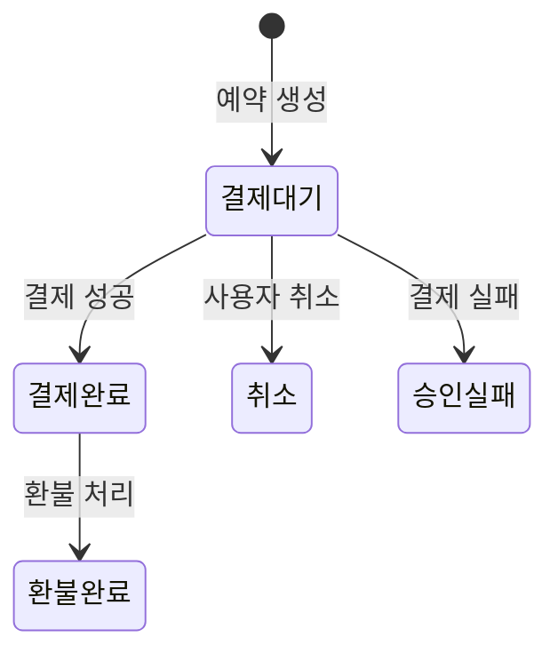
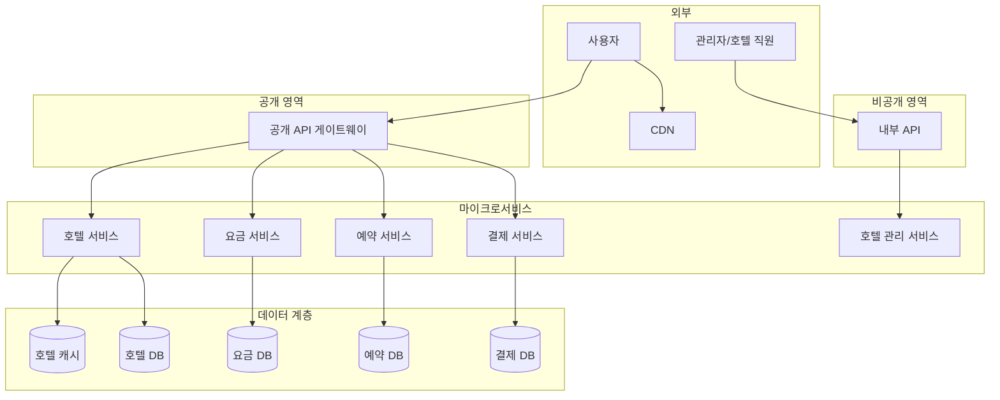
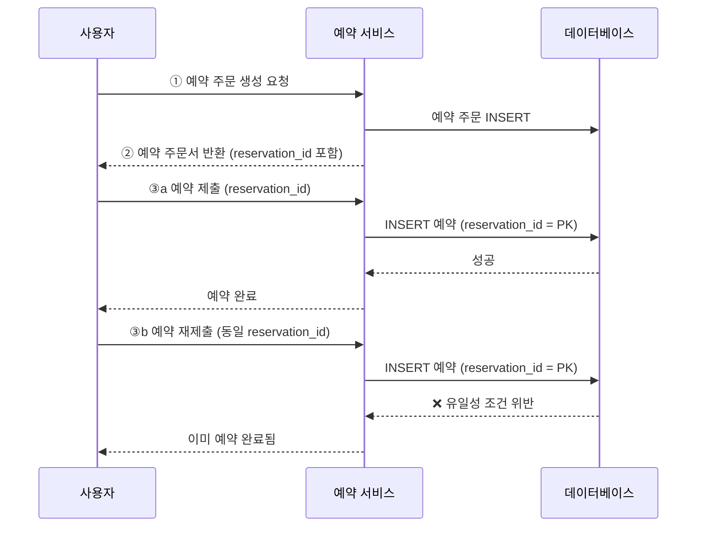

# 7장 호텔 예약 시스템 (Hotel Reservation System) 발표 자료

> **발표자**: 길현준

---

## 목차

1. [1단계: 문제 이해 및 설계 범위 확정](#1-1단계-문제-이해-및-설계-범위-확정)
2. [2단계: 개략적 설계](#2-2단계-개략적-설계)
3. [3단계: 상세 설계](#3-3단계-상세-설계)
4. [면접 질문 Q&A](#4-면접-질문-qa)
5. [토론 주제](#5-토론-주제)
6. [참고 자료](#6-참고-자료)

---

## 1. 1단계: 문제 이해 및 설계 범위 확정

### 호텔 예약 시스템이란?

**정의**: 메리어트 인터내셔널 같은 호텔 체인의 객실 예약을 온라인으로 처리하는 시스템이다. 사용자가 호텔과 객실 유형을 선택하고, 날짜를 지정하여 예약·결제·취소까지 수행할 수 있도록 지원한다.

**실제 사례**:
- **에어비앤비 시스템 설계**: 숙소 유형은 다르지만, 날짜 기반 예약·재고 관리·동시성 제어 등 핵심 설계 요소가 유사하다.
- **항공권 예약 시스템 설계**: 좌석을 객실로 바꾸면 예약 흐름과 초과 예약(overbooking) 개념이 거의 동일하다.
- **영화 티켓 예매 시스템 설계**: 특정 시간대의 한정된 좌석을 동시에 예약하려는 문제는 호텔의 동시성 문제와 본질이 같다.

### ★ 요구사항 도출 (면접관-지원자 대화)

**지원자:** 시스템 규모는 어느 정도입니까?
**면접관:** 5,000개 호텔에 100만 개 객실을 갖춘 호텔 체인을 위한 웹사이트를 구축한다고 가정합시다.

**지원자:** 대금은 예약 시에 지불하나요, 아니면 호텔에 도착했을 때 지불하나요?
**면접관:** 시간 제한이 있으니 예약할 때 전부 지불한다고 합시다.

**지원자:** 고객은 객실을 호텔의 웹사이트에서만 예약할 수 있나요, 아니면 전화 같은 다른 시스템으로도 할 수 있나요?
**면접관:** 호텔 웹사이트나 앱에서만 가능하다고 합시다.

**지원자:** 예약을 취소할 수도 있어야 하나요?
**면접관:** 물론입니다.

**면접관:** 10% 초과 예약이 가능해야 합니다. 즉, 실제 객실 수보다 더 많은 객실을 판매할 수 있어야 합니다. 호텔은 일부 고객이 예약을 취소할 것을 예상하여 초과 예약을 허용하곤 합니다.

**면접관:** 한 가지 잊은 게 있네요. 객실 가격은 유동적입니다. 그날 객실에 여유가 얼마나 있는지에 따라 달라진다고 하겠습니다.

### 기능 요구사항

| 요구사항 | 세부 내용 |
|----------|----------|
| 호텔 정보 페이지 표시 | 호텔 이름, 주소, 위치 등 상세 정보를 사용자에게 제공한다 |
| 객실 정보 페이지 표시 | 객실 유형, 가격, 편의시설 등 상세 정보를 제공한다 |
| 객실 예약 지원 | 사용자가 날짜를 지정하여 특정 유형의 객실을 예약할 수 있다 |
| 관리자 페이지 지원 | 호텔 직원이 호텔/객실 정보를 추가·삭제·갱신할 수 있다 |
| 초과 예약(Overbooking) 지원 | 실제 객실 수의 110%까지 예약을 허용한다 |
| 예약 취소 | 고객이 기존 예약을 취소할 수 있다 |

### 비기능 요구사항

- **높은 수준의 동시성(Concurrency) 지원**: 성수기나 대규모 이벤트 기간에 특정 호텔의 인기 객실에 예약이 집중될 수 있다. 동시에 같은 객실 유형을 예약하려는 여러 사용자 간의 경쟁 조건(race condition)을 안전하게 처리해야 한다.
- **적절한 지연 시간**: 예약 요청 처리에 몇 초 정도 걸리는 것은 허용 가능하다. 다만 사용자가 불쾌하지 않을 정도의 응답 시간을 유지해야 한다.

### QPS 계산 (Back-of-envelope)

```
총 호텔 수 = 5,000개
총 객실 수 = 1,000,000개
평균 가동률 = 70%, 평균 투숙 기간 = 3일

일일 예약 건수 = (1,000,000 × 0.7) / 3 ≈ 233,333 → 약 240,000건/일
초당 예약 TPS = 240,000 / 10^5 ≈ 3 TPS (매우 낮음)

── QPS 역산 (예약 TPS = 3에서 역산) ──
객실 예약 페이지 QPS = 3    (10%의 사용자만 최종 예약 완료)
예약 상세 페이지 QPS = 30   (10%의 사용자만 다음 단계로 진행)
객실 상세 페이지 QPS = 300  (대부분의 사용자가 조회만 함)
```

> ★ **핵심**: TPS 자체는 3으로 매우 낮다. 그러나 성수기·이벤트 기간의 트래픽 급증과, 같은 객실 유형에 대한 **동시성 문제**가 이 시스템의 진짜 도전 과제다.

### 📌 면접용 1분 요약
- 5,000개 호텔·100만 개 객실 규모의 예약 시스템으로, 예약 TPS는 약 3이지만 성수기에 동시성 문제가 핵심 과제다.
- 10% 초과 예약을 허용해야 하며, 객실 가격은 날짜·수요에 따라 유동적이다.
- 읽기 비율이 압도적(QPS 300 vs TPS 3)이므로 캐시·읽기 최적화가 중요하다.

---

## 2. 2단계: 개략적 설계

### API 설계

호텔 예약 시스템의 API를 RESTful 관례에 따라 설계한다. 예약 시스템의 핵심 기능에 집중하며, 객실 검색 등의 부가 기능은 기술적으로 도전적이지 않으므로 범위에서 제외한다.

#### 호텔 관련 API

| Method | Endpoint | 설명 |
|--------|----------|------|
| GET | /v1/hotels/:id | 호텔의 상세 정보 반환 |
| POST | /v1/hotels | 신규 호텔 추가 (호텔 직원 전용) |
| PUT | /v1/hotels/:id | 호텔 정보 갱신 (호텔 직원 전용) |
| DELETE | /v1/hotels/:id | 호텔 정보 삭제 (호텔 직원 전용) |

#### 객실 관련 API

| Method | Endpoint | 설명 |
|--------|----------|------|
| GET | /v1/hotels/:id/rooms/:id | 객실 상세 정보 반환 |
| POST | /v1/hotels/:id/rooms | 신규 객실 추가 (호텔 직원 전용) |
| PUT | /v1/hotels/:id/rooms/:id | 객실 정보 갱신 (호텔 직원 전용) |
| DELETE | /v1/hotels/:id/rooms/:id | 객실 정보 삭제 (호텔 직원 전용) |

#### 예약 관련 API

| Method | Endpoint | 설명 |
|--------|----------|------|
| GET | /v1/reservations | 로그인 사용자의 예약 이력 반환 |
| GET | /v1/reservations/:id | 특정 예약의 상세 정보 반환 |
| POST | /v1/reservations | 신규 예약 생성 |
| DELETE | /v1/reservations/:id | 예약 취소 |

#### ★ POST /v1/reservations 인자 상세

```json
{
  "startDate": "2021-04-28",
  "endDate": "2021-04-30",
  "hotelID": "245",
  "roomID": "U12354673389",
  "reservationID": "13422445"
}
```

여기서 `reservationID`는 **멱등 키(idempotent key)**로 사용된다. 같은 `reservationID`로 여러 번 요청해도 예약이 한 번만 생성되도록 보장하는 역할이다. 이를 통해 사용자가 실수로 예약 버튼을 두 번 누르는 이중 예약 문제를 방지한다. 자세한 동작 원리는 3단계 "동시성 문제" 절에서 다룬다.

> ★ **참고**: 3단계에서 데이터 모델이 개선되면서 `roomID`는 `roomTypeID`로 변경된다. 사용자는 특정 객실이 아니라 특정 **객실 유형**을 예약하기 때문이다.

### 데이터 모델

#### DB 선택: 관계형 데이터베이스

호텔 예약 시스템에는 관계형 데이터베이스를 선택한다. 이유는 세 가지다.

1. **읽기 중심 워크로드에 적합**: 호텔 웹사이트를 방문하여 조회만 하는 사용자가 실제 예약하는 사용자보다 압도적으로 많다. 관계형 DB는 이런 읽기 중심 워크로드를 잘 지원한다. (NoSQL은 대체로 쓰기 연산에 최적화되어 있다.)
2. **ACID 속성 보장**: 예약 시스템에서는 원자성(Atomicity), 일관성(Consistency), 격리성(Isolation), 영속성(Durability)이 필수다. ACID가 보장되지 않으면 이중 청구, 이중 예약, 마이너스 잔액 등의 문제를 방지하기 어렵다.
3. **데이터 모델링 용이**: 호텔, 객실, 객실 유형, 예약 등 엔티티 간 관계를 명확하게 표현할 수 있다.

#### 초기 스키마

**hotel 테이블** (호텔 서비스)

| 컬럼명 | 설명 |
|--------|------|
| **hotel_id** (PK) | 호텔 식별자 |
| name | 호텔명 |
| address | 주소 |
| location | 위치 |

**room 테이블**

| 컬럼명 | 설명 |
|--------|------|
| **room_id** (PK) | 객실 식별자 |
| room_type_id | 객실 유형 ID |
| floor | 층수 |
| number | 호수 |
| hotel_id | 호텔 ID (FK) |
| name | 객실명 |
| is_available | 이용 가능 여부 |

**room_type_rate 테이블** (요금 서비스)

| 컬럼명 | 설명 |
|--------|------|
| **hotel_id** (PK) | 호텔 식별자 |
| **date** (PK) | 일자 |
| rate | 요금 |

**guest 테이블** (투숙객 서비스)

| 컬럼명 | 설명 |
|--------|------|
| **guest_id** (PK) | 투숙객 식별자 |
| first_name | 이름 |
| last_name | 성 |
| email | 이메일 |

**reservation 테이블** (예약 서비스)

| 컬럼명 | 설명 |
|--------|------|
| **reservation_id** (PK) | 예약 식별자 (멱등 키) |
| hotel_id | 호텔 ID |
| room_id | 객실 ID |
| start_date | 체크인 날짜 |
| end_date | 체크아웃 날짜 |
| status | 예약 상태 |
| guest_id | 투숙객 ID |

#### 예약 상태 머신

reservation 테이블의 `status` 필드는 다섯 가지 상태를 가진다. 상태 천이 흐름은 다음과 같다.



- **결제 대기(pending_payment)**: 예약이 생성되었으나 아직 결제가 완료되지 않은 초기 상태다.
- **결제 완료(paid)**: 결제가 성공적으로 처리된 상태다.
- **환불 완료(refunded)**: 결제 완료 후 환불이 처리된 상태다.
- **취소(canceled)**: 사용자가 결제 전에 예약을 취소한 상태다.
- **승인 실패(rejected)**: 결제가 실패한 상태다.

> ★ **주의**: 이 초기 스키마에는 `room_id`를 사용하는데, 이는 에어비앤비처럼 특정 객실을 지정해서 예약하는 시스템에 적합하다. 호텔의 경우에는 특정 객실이 아니라 **객실 유형**을 예약하므로 3단계에서 데이터 모델을 개선한다.

### 개략적 아키텍처

이 시스템에는 **마이크로서비스 아키텍처**를 사용한다. 아마존, 넷플릭스, 우버, 에어비앤비, X(구 트위터) 등이 이 아키텍처를 채택하고 있다.



| 컴포넌트 | 역할 | 특징 |
|----------|------|------|
| **사용자** | 휴대폰이나 컴퓨터로 객실을 예약하는 당사자 | 웹사이트/앱을 통해 접근 |
| **관리자(호텔 직원)** | 고객 환불, 예약 취소, 객실 정보 갱신 등의 관리 작업을 수행 | VPN 등으로 보호되는 내부 API 사용 |
| **CDN** | 자바스크립트, 이미지, 동영상, HTML 등 정적 콘텐츠를 캐시 | 웹사이트 로드 성능 개선 |
| **공개 API 게이트웨이** | 처리율 제한(rate limiting), 인증 등을 지원하는 완전 관리형 서비스 | 엔드포인트 기반으로 요청을 적절한 서비스로 라우팅 |
| **내부 API** | 승인된 호텔 직원만 사용 가능한 API | VPN으로 외부 공격으로부터 보호 |
| **호텔 서비스** | 호텔과 객실의 상세 정보를 제공 | 데이터가 정적이므로 캐시하기 용이 |
| **요금 서비스** | 특정 날짜의 객실 유형별 요금 정보를 제공 | 수요에 따라 가격이 유동적으로 변동 |
| **예약 서비스** | 예약 요청 접수 및 처리, 잔여 객실 정보 갱신 | 동시성 제어가 핵심 |
| **결제 서비스** | 고객 결제 처리, 성공 시 예약 상태를 "결제 완료"로 갱신 | 실패 시 "승인 실패"로 갱신 |
| **호텔 관리 서비스** | 임박한 예약 확인, 객실 예약/취소 등의 관리 기능 제공 | 호텔 직원 전용 |

> 서비스 간 통신에는 gRPC 같은 고성능 RPC 프레임워크를 사용한다. 예를 들어 예약 서비스는 총 객실 요금 계산을 위해 요금 서비스에 질의해야 하고, 호텔 관리 서비스의 데이터 변경은 해당 데이터를 담당하는 실제 서비스로 전달되어 갱신된다.

### 📌 면접용 1분 요약
- API는 호텔·객실·예약 각각 CRUD 4개씩 총 12개이며, 예약 생성 시 `reservationID`를 멱등 키로 사용한다.
- 관계형 DB를 선택한 이유는 읽기 중심 워크로드, ACID 보장, 데이터 모델링 용이성이다.
- 마이크로서비스 아키텍처로 호텔·요금·예약·결제·관리 서비스를 분리하고, 공개/비공개 API 게이트웨이로 접근을 제어한다.

---

## 3. 3단계: 상세 설계

### 개선된 데이터 모델

#### roomID → roomTypeID 변경

초기 스키마에서는 `room_id`를 사용하여 특정 객실을 예약하도록 설계했다. 이는 에어비앤비처럼 "특정 집"을 예약하는 시스템에는 적합하지만, 호텔의 경우에는 사용자가 **특정 객실이 아니라 특정 객실 유형**(스탠다드 룸, 킹 사이즈 룸, 퀸 사이즈 룸 등)을 예약한다. 실제 객실 번호는 예약 시점이 아닌 **체크인 시점**에 부여된다.

이 요구사항을 반영하여 API의 호출 인자에서 `roomID`를 `roomTypeID`로 변경한다.

```json
{
  "startDate": "2021-04-28",
  "endDate": "2021-04-30",
  "hotelID": "245",
  "roomTypeID": "U12354673389",
  "reservationID": "13422445"
}
```

#### room_type_inventory 테이블

스키마에서 가장 중요하게 추가된 테이블이다. 호텔의 모든 객실 유형별 재고를 날짜 단위로 관리한다.

| 컬럼명 | 설명 |
|--------|------|
| **hotel_id** (PK) | 호텔 식별자 |
| **room_type_id** (PK) | 객실 유형 식별자 |
| **date** (PK) | 일자 |
| total_inventory | 총 객실 수 (유지보수용 제외분 차감) |
| total_reserved | 해당 날짜에 예약된 객실 수 |

기본 키는 `(hotel_id, room_type_id, date)`의 복합 키다. 날짜당 하나의 레코드를 사용하면 날짜 범위 내에서 예약을 쉽게 관리하고 질의할 수 있다. 이 테이블은 2년 이내 모든 미래 날짜에 대한 가용 객실 데이터를 미리 채워 놓고, 새로 추가해야 하는 객실 정보는 매일 한 번씩 일괄 작업으로 반영한다.

**데이터 예시**:

| hotel_id | room_type_id | date | total_inventory | total_reserved |
|----------|-------------|------|-----------------|----------------|
| 211 | 1001 | 2021-06-01 | 100 | 80 |
| 211 | 1001 | 2021-06-02 | 100 | 82 |
| 211 | 1001 | 2021-06-03 | 100 | 86 |
| 211 | 1002 | 2021-06-01 | 200 | 164 |
| 2210 | 101 | 2021-06-01 | 30 | 23 |

**저장 용량 추정**: 5,000개 호텔 × 20개 객실 유형 × 2년 × 365일 = **약 7,300만 레코드**. 많은 양이 아니므로 단일 DB로 충분하지만, SPOF를 피하려면 여러 가용성 구역에 복제해야 한다.

#### 예약 가능 여부 확인 프로세스

**1단계: 잔여 객실 현황 조회**

```sql
SELECT date, total_inventory, total_reserved
FROM room_type_inventory
WHERE room_type_id = ${roomTypeId} AND hotel_id = ${hotelId}
AND date BETWEEN ${startDate} AND ${endDate}
```

**2단계: 예약 가능 여부 판단**

```
if ((total_reserved + numberOfRoomsToReserve) <= total_inventory) → 예약 가능
```

**초과 예약 10% 지원** 시에는 조건을 다음과 같이 변경한다:

```
if ((total_reserved + numberOfRoomsToReserve) <= 110% * total_inventory) → 예약 가능
```

이 새로운 스키마 덕분에 초과 예약을 비율 값 하나만 바꿔서 간단하게 구현할 수 있다.

### 동시성 문제

이 시스템에서 가장 중요한 과제는 **이중 예약 방지**다. 두 가지 시나리오를 해결해야 한다.

#### 시나리오 1: 같은 사용자의 이중 클릭

같은 사용자가 "예약" 버튼을 여러 번 누르면 같은 예약이 중복 생성될 수 있다. 이를 방지하는 두 가지 접근법이 있다.

**클라이언트 측 구현**: 요청 전송 후 "예약" 버튼을 비활성화하거나 숨긴다. 대부분의 이중 클릭 문제를 해결할 수 있지만, 사용자가 자바스크립트를 비활성화하면 우회할 수 있어 안정적이지 않다.

**멱등(Idempotent) API**: 예약 API 요청에 `reservation_id`를 멱등 키로 포함시키는 방안이다. 몇 번을 호출해도 같은 결과를 내는 API를 멱등 API라고 한다.



동작 원리:
1. 고객이 예약 세부 정보를 입력하고 "계속"을 누르면 예약 서비스가 예약 주문을 생성한다.
2. 예약 주문서를 반환할 때 전역적 유일성을 보증하는 `reservation_id`를 포함시킨다.
3. 사용자가 예약을 제출하면 `reservation_id`가 예약 테이블의 **기본 키(PK)**로 사용된다.
4. 같은 `reservation_id`로 재요청하면 기본 키의 유일성 조건 위반으로 새 레코드가 생성되지 않아 이중 예약을 방지한다.

#### 시나리오 2: 여러 사용자의 동시 예약 (경쟁 조건)

잔여 객실이 하나밖에 없는 상황에서 두 사용자가 동시에 예약하려 하면 어떻게 될까? 트랜잭션 격리 수준이 직렬화 가능(serializable)이 아닌 경우, 다음과 같은 문제가 발생한다.

1. 현재 100개 객실 중 99개가 예약된 상태다.
2. 트랜잭션 1(사용자 1)이 잔여 객실을 확인한다 → `total_reserved(99) + 1 <= total_inventory(100)` → True.
3. 트랜잭션 2(사용자 2)도 동시에 잔여 객실을 확인한다 → 역시 True (트랜잭션 1의 변경이 아직 커밋되지 않아 보이지 않음).
4. 트랜잭션 1이 객실을 예약하고 `total_reserved`를 100으로 갱신한다.
5. 트랜잭션 2도 예약을 완료하고 `total_reserved`를 100으로 갱신한다 (트랜잭션 1의 결과가 보이지 않으므로 99 + 1 = 100으로 갱신).
6. 결과: **한 객실에 이중 예약이 발생**한다.

이 문제를 해결하기 위한 세 가지 락 메커니즘을 살펴보자.

#### ★★ 동시성 제어 3종 비교

| 구분 | 비관적 락 (Pessimistic Lock) | 낙관적 락 (Optimistic Lock) | DB 제약 조건 (Constraint) |
|------|---------------------------|--------------------------|-------------------------|
| **원리** | `SELECT ... FOR UPDATE`로 레코드를 즉시 잠금. 다른 트랜잭션은 락 해제까지 대기 | 버전 번호(version)를 두고, 갱신 시 버전이 일치할 때만 커밋 허용 | 테이블에 CHECK 제약 조건을 걸어 조건 위반 시 자동 롤백 |
| **SQL 예시** | `SELECT ... FROM room_type_inventory WHERE room_type_id = ? AND hotel_id = ? AND date BETWEEN ? AND ? FOR UPDATE` | `UPDATE room_type_inventory SET total_reserved = total_reserved + 1, version = version + 1 WHERE ... AND version = ${currentVersion}` | `CONSTRAINT check_room_count CHECK(total_inventory - total_reserved >= 0)` |
| **장점** | 구현이 쉽고 모든 갱신을 직렬화하여 충돌 방지. 경쟁이 심할 때 유용 | DB에 락을 걸지 않아 비관적 락보다 빠름. 경쟁이 심하지 않을 때 적합 | 구현이 가장 쉬움. 경쟁이 심하지 않을 때 잘 동작 |
| **단점** | 교착 상태(deadlock) 발생 가능. 확장성이 낮고 트랜잭션이 길면 성능에 심각한 영향 | 동시성이 높으면 성공률이 급감하여 대부분의 클라이언트가 재시도해야 함 | 경쟁이 심하면 실패 연산이 급증. DB 제약 조건은 버전 통제가 어려움. 일부 DB는 지원하지 않음 |
| **적합 상황** | 데이터 경쟁이 매우 심한 경우. 하지만 예약 시스템에서는 **비권장** | 호텔 예약처럼 QPS가 낮은 시스템에 **적합** | 구현 간편성이 중요하고 QPS가 낮은 경우에 **적합** |

> ★ **결론**: 호텔 예약 시스템의 경우 예약 QPS가 3으로 매우 낮아 데이터 경쟁이 심하지 않으므로, **낙관적 락** 또는 **DB 제약 조건** 방식이 적합하다. 비관적 락은 교착 상태와 확장성 문제로 권장하지 않는다.

### 시스템 규모 확장

일반적으로 호텔 예약 시스템의 부하는 높지 않다. 하지만 booking.com이나 expedia.com 같은 여행 예약 사이트와 연동된다면 QPS가 천 배 이상 늘어날 수 있다.

#### 데이터베이스 샤딩

시스템의 모든 서비스는 무상태(stateless)이므로 서버 추가만으로 수평 확장이 가능하다. 하지만 데이터베이스는 단순히 서버를 늘리는 것만으로는 해결되지 않으므로 **샤딩(sharding)**을 적용한다.

대부분의 질의가 `hotel_id`를 필터링 조건으로 사용하므로, `hotel_id`가 샤딩 키로 적합하다. 데이터는 `hash(hotel_id) % number_of_servers`로 분배한다. 예를 들어 QPS가 30,000이고 16개 샤드를 사용하면 각 샤드는 약 1,875 QPS를 처리하게 되는데, MySQL 서버 한 대로 충분히 감당 가능하다.

추가로 예약 데이터가 너무 커지면 현재 및 향후 예약 데이터만 저장하고, 이력 데이터는 아카이빙하거나 냉동 저장소(cold storage)로 옮기는 방안도 있다.

#### 캐시 (Redis)

호텔 잔여 객실 데이터에는 재미있는 특성이 있다. **오직 현재와 미래의 데이터만 중요**하다는 것이다. 고객이 과거 날짜의 객실을 예약하지는 않기 때문이다. 따라서 TTL(Time-To-Live)을 설정하여 낡은 데이터를 자동 소멸시킬 수 있다.

Redis는 이런 상황에 적합하다. TTL과 LRU(Least Recently Used) 캐시 교체 정책으로 메모리를 최적으로 활용할 수 있기 때문이다.

데이터 로딩 속도와 DB 확장성이 문제가 되면 DB 앞에 캐시 계층을 두고, 잔여 객실 확인 및 예약 로직을 캐시에서 실행하도록 한다. 대부분의 읽기 요청은 캐시가 처리하고, 일부만 DB가 처리한다.

**캐시 키-값 구조**:
- 키: `hotelID_roomTypeID_{날짜}`
- 값: 해당 호텔/객실 유형/날짜의 잔여 객실 수

> ★ **중요**: 캐시에 잔여 객실이 있다고 나와도, **최종적으로는 반드시 DB에서 확인**해야 한다. 잔여 객실 수에 대한 최종 진실(source of truth)은 DB에 있기 때문이다.

### 캐시가 주는 새로운 과제 (장애 시나리오)

캐시 계층을 추가하면 처리량은 대폭 증가하지만, **DB와 캐시 사이의 데이터 일관성 유지**라는 새로운 도전에 직면한다.

사용자가 객실을 예약할 때 정상적으로는 두 가지 작업이 이루어진다.
1. 잔여 객실 수 확인 → 캐시에서 실행
2. 잔여 객실 데이터 갱신 → DB가 먼저 갱신되고, 캐시에는 비동기적으로 반영

비동기적 갱신 방법으로는 두 가지가 있다.
- **애플리케이션 측 갱신**: DB 저장 후 캐시를 직접 수정
- **CDC(Change Data Capture)**: DB에서 발생한 변화를 감지하여 다른 시스템에 적용하는 메커니즘이다. Debezium이 대표적인 솔루션으로, DB 변경을 감지하는 소스 커넥터가 Redis 같은 캐시 시스템에 변경을 반영한다.

**장애 시나리오: 캐시-DB 불일치**

DB에 먼저 데이터를 반영하므로 캐시에 최신 데이터가 없을 수 있다. 예를 들어:
- DB 기준으로는 잔여 객실이 없는데 캐시에는 남은 객실이 있다고 나오는 경우
- 사용자가 캐시 결과를 보고 예약을 시도하지만, DB에서 유효성 검사 시 잔여 객실이 없음이 확인되어 "다른 사람이 방금 마지막 객실을 예약했습니다"라는 오류 메시지를 받는다.
- 사용자가 웹사이트를 새로 고침하면 그 시점에는 캐시와 DB의 동기화가 완료되어 잔여 객실이 없음을 확인할 수 있다.

결론적으로 DB가 최종 유효성 검사를 수행하므로, 캐시 불일치가 있어도 **데이터 정합성은 유지**된다. 다만 사용자 경험에는 영향을 줄 수 있다.

### 서비스 간 데이터 일관성

#### 하이브리드 접근법 (본 설계안의 선택)

본 설계안은 예약 서비스가 예약 및 잔여 객실 API를 모두 담당하고, 예약 테이블과 잔여 객실 테이블을 **동일한 관계형 DB에 저장**하는 하이브리드 접근법을 택했다. 이렇게 하면 관계형 DB의 ACID 속성을 활용하여 동시성 문제를 효과적으로 처리할 수 있다.

#### 마이크로서비스 순수주의 접근법

마이크로서비스 아키텍처에서 각 서비스가 독자적인 DB를 가져야 한다고 보는 순수주의적 접근에서는, 논리적으로 하나의 원자적 연산이 **여러 DB에 걸쳐 실행**되는 일을 피할 수 없다. 예를 들어 예약 DB 갱신이 실패하면 잔여 객실 DB의 예약 객실 수를 원래 값으로 되돌려야 한다. 정상 경로(happy path)는 하나뿐이지만, 실패 시 데이터 불일치가 발생할 수 있는 경로는 많다.

#### ★ 서비스 간 일관성 해결 방안 비교

| 구분 | 2PC (2-Phase Commit) | Saga |
|------|---------------------|------|
| **원리** | 여러 노드에 걸친 원자적 트랜잭션 실행을 보증하는 프로토콜. 모든 노드가 성공하거나 모두 실패 | 각 노드에 국지적 트랜잭션을 순차 실행하고, 실패 시 이전 트랜잭션의 결과를 되돌리는 보상 트랜잭션을 실행 |
| **일관성 수준** | 강한 일관성 (Strong Consistency) | 결과적 일관성 (Eventual Consistency) |
| **블로킹** | 비중단 실행이 불가능한 블로킹 프로토콜. 한 노드 장애 시 전체 진행이 중단 | 비블로킹. 각 단계가 독립적인 트랜잭션 |
| **성능** | 느림 (동기적 커밋 대기) | 빠름 (비동기적 실행) |
| **구현 복잡도** | 중간 (프로토콜이 정형화되어 있음) | 높음 (보상 트랜잭션 설계가 복잡) |

> ★ **본 설계안의 결론**: 마이크로서비스 간 데이터 불일치 해결을 위한 복잡한 메커니즘은 시스템 전체 설계의 복잡성을 크게 증가시킨다. 본 설계에서는 그만한 가치가 없다고 판단하여, 예약 및 잔여 객실 정보를 **동일한 관계형 DB에 저장**하는 실용적 접근을 선택했다.

### 📌 면접용 1분 요약
- `roomID` → `roomTypeID`로 변경하고 `room_type_inventory` 테이블을 추가하여 객실 유형 기반 예약을 지원한다.
- 이중 예약 방지에는 클라이언트 비활성화 + `reservation_id` 멱등 키를 사용하고, 동시성 제어에는 낙관적 락 또는 DB 제약 조건을 권장한다.
- 규모 확장은 `hotel_id` 기반 샤딩 + Redis 캐시이며, 서비스 간 일관성은 하이브리드 접근(같은 DB에 저장)으로 실용적으로 해결한다.

---

## 4. 면접 질문 Q&A

### Q1. 왜 관계형 데이터베이스를 선택했나요?

> **답변**: 세 가지 이유가 있습니다. 첫째, 호텔 예약 시스템은 읽기 연산이 쓰기 연산보다 압도적으로 많은 워크로드입니다(QPS 300 vs TPS 3). 관계형 DB는 이런 읽기 중심 패턴을 잘 지원합니다. 둘째, ACID 속성이 보장되어야 이중 예약, 이중 청구, 마이너스 잔액 같은 문제를 방지할 수 있습니다. 셋째, 호텔-객실-객실 유형-예약 간의 관계를 명확하게 모델링할 수 있습니다.
>
> **핵심 포인트**:
> - NoSQL은 쓰기 최적화에 강하지만, 이 시스템은 읽기 중심
> - ACID 없이는 예약 시스템의 데이터 정합성을 코드로 보장해야 하므로 복잡도가 폭증
> - 관계형 모델이 비즈니스 엔티티 간 관계를 가장 자연스럽게 표현

### Q2. 동시성 제어 3종(비관적 락, 낙관적 락, DB 제약) 중 어떤 것을 선택하겠습니까?

> **답변**: 호텔 예약 시스템은 예약 TPS가 약 3으로 데이터 경쟁이 심하지 않습니다. 따라서 **낙관적 락** 또는 **DB 제약 조건**이 적합합니다. 비관적 락은 교착 상태(deadlock) 위험과 확장성 문제 때문에 권장하지 않습니다. 낙관적 락은 버전 번호를 통해 충돌을 감지하고, DB 제약 조건은 `CHECK` 문으로 재고 위반을 자동 방지합니다. 두 방식 모두 QPS가 낮은 환경에서 잘 동작합니다.
>
> **핵심 포인트**:
> - 비관적 락: 확장성↓, 교착 상태 위험 → 비권장
> - 낙관적 락: 경쟁이 심하면 재시도 폭주 → 낮은 QPS에서 적합
> - DB 제약: 구현 가장 간단하지만 버전 통제 어려움

### Q3. roomID 대신 roomTypeID를 사용하는 이유는?

> **답변**: 호텔 예약은 에어비앤비와 달리 사용자가 특정 객실(203호, 405호 등)을 지정하지 않습니다. 사용자는 "킹 사이즈 룸" 같은 **객실 유형**을 선택하고, 실제 객실 번호는 체크인 시점에 부여됩니다. `roomTypeID`를 사용하면 `room_type_inventory` 테이블로 객실 유형별 재고를 날짜 단위로 관리할 수 있어, 잔여 객실 확인과 초과 예약 구현이 훨씬 간단해집니다.

### Q4. 캐시-DB 간 데이터 불일치는 어떻게 해결하나요?

> **답변**: DB에 먼저 데이터를 반영하고 캐시에는 비동기적으로 갱신하므로, 일시적으로 캐시에 최신 데이터가 없을 수 있습니다. 하지만 이는 의도된 설계입니다. 캐시는 빠른 읽기를 위한 1차 필터 역할이고, **최종 유효성 검사는 반드시 DB에서 수행**합니다. 캐시에 잔여 객실이 있다고 나와도 DB에서 없으면 예약이 거부되므로 데이터 정합성은 유지됩니다. CDC(Debezium 등)를 통해 DB 변경을 캐시에 자동 반영하면 불일치 시간을 최소화할 수 있습니다.

### Q5. 서비스 간 데이터 일관성 문제는 어떻게 해결하나요?

> **답변**: 이론적으로는 2PC나 Saga를 사용할 수 있지만, 본 설계에서는 **하이브리드 접근법**을 선택했습니다. 예약 서비스가 예약과 잔여 객실을 모두 담당하고, 두 테이블을 같은 관계형 DB에 저장합니다. 이렇게 하면 단일 트랜잭션으로 ACID를 보장할 수 있어 복잡한 분산 트랜잭션 메커니즘이 불필요합니다. 2PC는 블로킹 프로토콜이라 성능이 떨어지고, Saga는 보상 트랜잭션 설계가 복잡합니다. 설계의 복잡성 증가가 그만한 가치가 없다고 판단했습니다.

### Q6. 초과 예약(Overbooking)은 어떻게 구현하나요?

> **답변**: `room_type_inventory` 테이블의 예약 가능 여부 판단 조건을 수정하면 됩니다. 기존 조건 `total_reserved + numberOfRoomsToReserve <= total_inventory`에서 `total_inventory`에 110%를 곱하면 10% 초과 예약을 허용할 수 있습니다. DB 제약 조건 방식을 쓰는 경우에는 `CHECK(total_inventory * 1.1 - total_reserved >= 0)`으로 변경하면 됩니다. 초과 예약 비율은 비즈니스 요구에 따라 조정 가능합니다.

---

## 5. 토론 주제

### 토론 1: 낙관적 락 vs DB 제약 조건 — 실무에서 어떤 것을 선택할 것인가?

**배경**: 책에서는 낙관적 락과 DB 제약 조건 모두 호텔 예약 시스템에 적합하다고 결론짓는다. 두 방식 모두 QPS가 낮은 환경에서 잘 동작하지만, 실무에서는 선택 기준이 더 복잡하다.

**토론 포인트**:
- 낙관적 락은 애플리케이션 코드에서 버전 관리를 하므로 **코드 리뷰와 테스트**로 검증 가능하다. 반면 DB 제약 조건은 DDL로 관리되어 **버전 통제가 어렵다**.
- DB 제약 조건을 허용하지 않는 DB 엔진(예: 일부 NoSQL)으로 전환해야 한다면 어떻게 될까?
- 초과 예약 비율을 동적으로 변경해야 하는 경우, 낙관적 락은 애플리케이션 설정만 바꾸면 되지만 DB 제약은 ALTER TABLE이 필요하다.

### 토론 2: 마이크로서비스 순수주의 vs 하이브리드 접근 — 어디까지 분리할 것인가?

**배경**: 본 설계안은 예약 서비스와 잔여 객실 관리를 하나의 서비스·하나의 DB로 묶는 하이브리드 접근을 택했다. 마이크로서비스 원칙상 각 서비스가 독립 DB를 가져야 하지만, 그러면 분산 트랜잭션이 필요해진다.

**토론 포인트**:
- 서비스 규모가 작을 때는 하이브리드가 합리적이지만, 팀이 50명 이상으로 커지면 서비스 경계가 명확해야 독립 배포가 가능하다. 이 시점에 분리할 것인가?
- 2PC는 성능이 나쁘고 Saga는 보상 트랜잭션이 복잡하다. 실무에서 Saga를 쓴다면 어떤 오케스트레이션 도구(예: Temporal, AWS Step Functions)를 사용할 것인가?
- "그만한 가치가 없다"는 판단은 비즈니스 규모에 따라 달라진다. booking.com 수준의 규모라면 어떤 선택을 해야 할까?

### 토론 3: 캐시 복잡도 vs 성능 — Redis 캐시 계층은 언제 도입할 것인가?

**배경**: 호텔 예약 시스템의 기본 QPS는 300으로 낮아서 캐시 없이도 운영 가능하다. 하지만 외부 여행 사이트(booking.com, expedia.com)와 연동되면 QPS가 천 배 이상 늘어날 수 있다.

**토론 포인트**:
- 캐시 도입 시 CDC/Debezium 기반 동기화 파이프라인의 운영 복잡도가 추가된다. 이 복잡도를 감수할 만한 QPS 임계값은 어느 정도인가?
- 캐시-DB 불일치로 인해 "객실이 있다고 보여서 예약했는데 사실 없었다"는 사용자 경험 문제가 발생한다. 이를 줄이기 위한 추가 전략은?
- 캐시 없이 DB 읽기 복제본(Read Replica)만으로 해결할 수 있는 규모는 어디까지인가?

---

## 6. 참고 자료

### 공식 문서
- [MySQL SELECT ... FOR UPDATE](https://dev.mysql.com/doc/refman/8.0/en/innodb-locking-reads.html) — 비관적 락 구현의 기반이 되는 MySQL 공식 문서
- [Debezium 공식 사이트](https://debezium.io/) — CDC(Change Data Capture) 구현을 위한 오픈소스 플랫폼
- [gRPC 공식 문서](https://www.grpc.io/docs/what-is-grpc/introduction/) — 마이크로서비스 간 통신에 사용되는 고성능 RPC 프레임워크

### 기술 블로그
- [마이크로서비스 아키텍처의 장점](https://www.appdynamics.com/topics/benefits-of-microservices) — 마이크로서비스 아키텍처를 선택한 배경
- [Saga Pattern](https://microservices.io/patterns/data/saga.html) — 마이크로서비스 간 데이터 일관성을 위한 Saga 패턴
- [2-Phase Commit Protocol](https://en.wikipedia.org/wiki/Two-phase_commit_protocol) — 분산 트랜잭션의 전통적 해결책
- [Optimistic vs Pessimistic Locking](https://ibm.co/3Eb293O) — 동시성 제어 방안 비교
- [Monolithic Architecture](https://microservices.io/patterns/monolithic.html) — 모노리스 vs 마이크로서비스 비교의 기반

---

*Last Updated: 2026-03-05*
