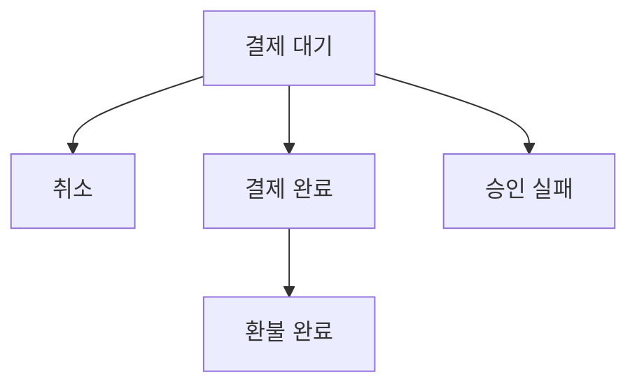
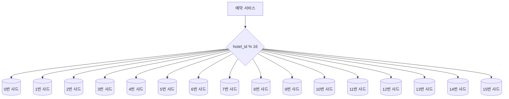

이 장에서 다루는 설계와 기법은 다른 인기 면접 문제에 활용될 수도 있다.
- 에어비엔비 시스템 설계
- 항공권 에약 시스템 설계
- 영화 티켓 예매 시스템 설계

# 1단계: 문제 이해 및 설계 범위 확정

```
시스템 규모는?
>> 5000개 호텔에 100만 개 객실을 갖춘 호텔 체인을 위한 웹사이트를 구축한다고 가정

대금은 예약 시 지불? 아니면 호텔에 도착했을 때 지불?
>> 시간 제한이 있으니 예약할 때 전부 지불

고객은 객실을 호텔의 웹사이트에서만 예약 가능? 아니면 전화 같은 다른 시스템으로도 가능?
>> 호텔 웹사이트나 앱에서만 가능하다고 가정

예약 취소 가능?
>> 물론

고려할 다른 사항은?
>> 10% 초과 예약 가능
>> 호텔은 일부 고객이 예약을 취소할 것을 예상하여 초과 예약을 허용하곤 함

시간이 제한되어 있으므로, 객실 검색은 범위에 포함X
다음과 같은 사항에만 집중
    - 호텔 정보 페이지 표시
    - 객실 정보 페이지 표시
    - 객실 예약 지원
    - 호텔이나 객실 정보를 추가/삭제/갱신하는 관리자 페이지 지원
    - 초과 예약 지원
>> 굳

>> 객실 가격은 유동적
>> 그날 객실에 여유가 얼마나 있는지에 따라 달라지고, 매일 달라질 수 있다고 가정
유념
```

## 비기능 요구사항
- 높은 수준의 동시성 지원
    - 성수기, 대규모 이벤트 기간에는 일부 인기 호텔의 특정 객실을 예약하려는 고객이 많이 몰릴 수 있음
- 적절한 지연 시간
    - 사용자가 예약을 할 때는 응답 시간이 빠르면 이상적이겠으나 예약 요청 처리에 몇 초 정도 걸리는 것은 괜찮음

## 개략적 규모 추정
- 총 5000개 호텔, 100만 개의 객실 가정
- 평균적으로 객실의 70% 사용 중, 평균 투숙 기간은 3일 가정
- 일일 예약 예약 건수: 1백만X0.7 / 3 = 233,333 =~ 240,000
- 초당 예약 건수 = 240,000 / 하루에 10^5초 =~ 3
    - 따라서 초당 예약 TPS는 그다지 높지 않음

시스템 내 모든 페이지의 QPS를 계산해 보자.   
일반적으로 고객이 이 웹사이트를 사용하는 흐름에는 세 가지 단계가 있다.
1. 호텔/객실 상세 페이지: 사용자가 호텔/객실 정보 확인 (조회 발생)
2. 예약 상세 정보 페이지: 사용자가 날짜, 투숙 인원, 결제 방법 등의 상세 정보를 예약 전에 확인 (조회 발생)
3. 객실 예약 페이지: 사용자가 '예약' 버튼을 눌러 객실을 예약 (트랜잭션 발생)

대략 10%의 사용자가 다음 단계로 진행하고 90%의 사용자가 최종 단계에 도달하기 전에 흐름을 이탈한다고 가정하면, 단계별 QPS는 아래 결과와 유사하다.


---

# 2단계: 개략적 설계안 제시 및 동의 구하기
## API 설계
- 호텔 관련 API
    - 호텔의 상세 정보 반환
    - 신규 호텔 추가, 호텔 직원만 사용 가능
    - 호텔 정보 갱신, 호텔 직원만 사용 가능
    - 호텔 정보 삭제, 호텔 직원만 사용 가능
- 객실 관련 API
    - 객실 상세 정보 반환
    - 신규 객실 추가, 호텔 직원만 사용 가능
    - 객실 정보 갱신, 호텔 직원만 사용 가능
    - 객실 정보 삭제, 호텔 직원만 사용 가능
- 예약 관련 API
    - 로그인 사용자의 예약 이력 반환
    - 특정 예약의 상세 정보 반환
    - 신규 예약
    - 예약 취소

신규 예약 접수는 아주 중요한 기능이다.   
reservationID는 이중 예약을 방지하고 동일한 예약은 단 한 번만 이루어지도록 보증하는 멱등 키(idempotent key)다.

```json
{
    "startDate": "2021-04-28",
    "endDate": "2021-04-30",
    "hotelID": "245",
    "roomID": "U12345673389",
    "reservationID": "13422445"
}
```

## 데이터 모델
어떤 DB를 사용할지 결정하기 전에 데이터 접근 패턴부터 자세히 살펴보자.   
호텔 예약 시스템은 다음 질의를 지원해야 한다.
1. 호텔 상세 정보 확인
2. 지정된 날짜 범위에 사용 가능한 객실 유형 확인
3. 예약 정보 기록
4. 예약 내역 또는 과거 예약 이력 정보 조회

대략적인 추정 과정을 통해 시스템 규모가 크지 않은 것은 알았으나 대규모 이벤트가 있는 경우에는 트래픽이 급증할 수도 있으니 대비해야 한다.   
이런 요구사항을 종합적으로 고려했을 때 본 설계안에서는 RDB를 선택할 것이다.   
이유는 다음과 같다.

- RDB는 읽기 빈도가 쓰기 연산에 비해 높은 작업 흐름을 잘 지원
    - 호텔 웹사이트/앱을 방문하는 사용자의 수는 실제로 객실을 예약하는 사용자에 비해 압도적으로 많음
    - NoSQL DB는 대체로 쓰기 연산에 최적화
    - RDB는 읽기가 압도적인 작업 흐름은 충분히 잘 지원
- RDB는 ACID 속성(원자성, 일관성, 격리성, 영속성)을 보장
    - ACID 속성은 예약 시스템을 만드는 경우 중요
    - 이 속성이 만족되지 않으면 잔액이 마이너스가 되는 문제, 이중 청구 문제, 이중 예약 문제 등 방지 어려움
    - ACID 속성이 충족되는 DB를 사용하면 애플리케이션 코드는 훨씬 단순해지고 이해하기 쉬워짐
    - RDB는 일반적으로 ACID 속성 보장
- RDB를 사용하면 데이터를 쉽게 모델링 가능
    - 비즈니스 데이터의 구조를 명확하게 표현할 수 있을 뿐 아니라 엔티티(호텔, 객실, 객실 유형 등) 간의 관계를 안정적으로 지원 가능

많은 지원자가 호텔 예약 시스템을 설계할 때 선택하는 가장 자연스럽고 단순하게 설계한 스키마를 살펴보자.


status 필드는 pending(결제 대기), paid(결제 완료), refunded(환불 완료), canceled(취소), rejected(승인 실패)의 다섯 상태 가운데 하나를 값으로 가질 수 있다.   
이를 상태 천이도 다이어그램으로 표현하면 아래와 같다.


이 스키마 디자인에는 문제가 있다.   
room_id가 있으므로 에어비앤비 같은 회사에는 적합하지만, 호텔의 경우에는 그렇지 않다.   
사용자는 특정 객실을 예약하는 것이 아니라 특정 호텔의 특정 객실 유형을 예약하기 때문이다.

객실 번호는 예약할 때가 아닌, 투숙객이 체크인 하는 시점에 부여된다.

## 개략적 설계안
이 호텔 예약 시스템에는 MSA를 사용한다.


- 사용자
    - 휴대폰이나 컴퓨터로 객실을 예약하는 당사자
- 관리자(호텔 직원)
    - 고객 환불, 예약 취소, 객실 정보 갱신 등의 관리 작업을 수행할 권한이 잇는 호텔 직원
- CDN
    - JS code bundle, 이미지, 동영상, HTML 등 모든 정적 콘텐츠를 캐시
    - 웹사이트 로드 성능 개선
- 공개 API 게이트웨이
    - 처리율 제한, 인증 등의 기능을 지원하는 완전 관리형 서비스
    - 엔드포인트 기반으로 특정 서비스에 요청을 전달할 수 있도록 구성됨
- 내부 API
    - 승인된 호텔 직원만 사용 가능한 API
    - 내부 소프트웨어나 웹사이트를 통해서 사용 가능
    - VPN 등의 기술을 사용해 외부 공격으로부터 보호
- 호텔 서비스
    - 호텔과 객실에 대한 상세 정보 제공
    - 호텔과 객실 데이터는 일반적으로 정적이라서 쉽게 캐시 가능
- 요금 서비스
    - 미래의 어떤 날에 어떤 요금을 받아야 하는지 데이터를 제공하는 서비스
    - 재미있는 것은 객실의 요금은 해당 날짜에 호텔에 얼마나 많은 손님이 몰리느냐에 따라 달라짐
- 예약 서비스
    - 예약 요청을 받고 객실을 예약하는 과정을 처리
    - 객실이 예약되거나 취소될 때 잔여 객실 정보를 갱신하는 역할도 담당
- 결제 서비스
    - 고객의 결제를 맡아 처리하고, 절차가 성공적으로 마무리되면 예약 상태를 결제 완료로 갱신
    - 실패한 경우에는 승인 실패로 업데이트
- 호텔 관리 서비스
    - 승인된 호텔 직원만 사용 가능한 서비스
    - 임박한 예약 기록 확인, 고객 객실 예약, 예약 취소 등의 기능 제공

예약 서비스는 총 객실 요금을 계산하기 위해 요금 서비스에 질의할 필요가 있으므로,   
예약 서비스와 요금 서비스 사이에는 화살표가 있어야 한다.


---

# 3단계: 상세 설계

## 개선된 데이터 모델
호텔 객실을 예약할 때는 틀정 객실이 아니라 특정한 객실 유형을 예약하게 된다.   
이 요구사항을 수용하려면 API와 스키마의 어떤 부분을 변경하는 것이 좋을까?

roomID는 roomTypeID로 변경한다.

```json
{
    "startDate": "2021-04-28",
    "endDate": "2021-04-30",
    "hotelID": "245",
    "roomTypeID": "U12345673389",
    "reservationID": "13422445"
}
```


가장 중요하게 바뀐 부분은 다음과 같다.
- room: 객실에 관계된 정보
- room_type_rate: 특정 객실 유형의 특정 일자 요금 정보
- reservation: 투숙객 예약 정보
- room_type_inventory: 호텔의 모든 객실 유형을 담는 테이블 (예약 시스템에 아주 중요)
    - hotel_id: 호텔 식별자
    - room_type_id: 객실 유형 식별자
    - date: 일자
    - total_inventory: 총 객실 수에서 일시적으로 제외한 객실 수를 뺀 값 (일부 객실은 유지보수를 위해 예약 가능 목록에서 빼 둘수 있어야 함)
    - total_reserved: 지정된 hotel_id, room_type_id, date에 예약된 모든 객실의 수

날짜당 하나의 레코드를 사용하면 날짜 범위 내에서 예약을 쉽게 관리하고 질의할 수 있다.   
room_type_inventory 테이블은 2년 이내 모든 미래 날짜에 대한 가용 객실 데이터 질의 결과를 토대로 미리 채워 놓고,   
시간이 흐름에 따라 새로 추가해야 하는 객실 정보는 매일 한 번씩 일괄 작업을 돌려 반영한다.

저장 용량을 추정해 보자.   
5000개 호텔 X 20개 객실 유형 X 2년 X 365일 = 7300만 개의 레코드 수   
많은 데이터가 아니라 DB 하나면 저장하기 충분하지만, DB 서버를 하나만 두면 SPOF 문제를 피할 수 없다.

고가용성을 달성하려면 여러 지역, 또는 가용성 구역에 DB를 복제해 둬야 한다.

면접관은 이런 질문을 던질 수 있다.   
"예약 데이터가 단일 DB에 담기에 너무 크면 어떻게 할지"   
다음과 같은 방안을 생각해 볼 수 있다.
- 현재 및 향후 예약 데이터만 저장
    - 예약 이력은 자주 접근하지 않으므로 아카이빙 하거나 심지어 냉동 저장소로 이동
- DB 샤딩
    - 가장 자주 사용되는 질의는 예약하거나 투숙객 이름으로 예약을 확인하는 질의로, 두 질의 모두 우선 호텔을 먼저 알아야 하므로, hotel_id가 샤딩 키로 적합
    - 데이터는 hash(hotel_id) % number_of_servers로 샤딩

## 동시성 문제
또 하나 중요한 문제는 이중 예약을 어떻게 방지할 것이냐로, 두 가지 문제를 해결해야 한다.
1. 같은 사용자가 예약 버튼을 여러 번 클릭
2. 여러 사용자가 같은 객실을 동시에 예약

### 시나리오 1: 같은 사용자가 예약 버튼을 여러 번 클릭한 경우
이 문제를 푸는 일반적 접근법으로는 다음의 두 가지가 있다.
- 클라이언트 측 구현
    - 클라이언트가 요청을 전송하고 난 다음에 '예약' 버튼을 회색으로 표시하거나, 숨기거나 비활성화
- 멱등(idempotent) API
    - 예약 API 요청에 멱등 키를 추가하는 방안


1. 예약 주문서 생성
    - 고객이 예약 세부 정보를 입력하고 '계속' 버튼을 누르면 예약 서비스는 예약 주문을 생성
2. 고객이 검토할 수 있도록 예약 주문서를 반환
    - 이때 API는 reservation_id 반환
    - 이 식별자는 전역적 유일성을 보증하는 ID 생성기가 만들어 낸 것이어야 함
3. (3a) 검토가 끝난 예약을 전송
    - 이때 요청에도 reservation_id 붙음
    - 이 값은 예약 테이블의 기본 키
    - 꼭 reservation_id를 멱등 키로 쓸 필요X
4. (3b) 사용자가 예약 완료 버튼을 한 번 더 누르는 바람에 같은 예약이 다시 서버로 전송
    - reservation_id가 예약 테이블의 기본 키이므로, 기본 키의 유일성 조건이 위반되어 새로운 레코드는 생성X

### 시나리오 2: 여러 사용자가 잔여 객실이 하나밖에 없는 유형의 객실을 동시에 예약하려 하는 경우


1. DB 트랜잭션 격리 수준이 가장 높은 수준, 즉 직렬화 가능 수준(serializable)으로 설정되어 있지 않은 경우
    - 사용자 1과 사용자 2가 동시에 같은 유형의 객실을 예약하려고 하지만 남은 객실은 하나뿐
2. 트랜잭션 2는 (total_reserved + rooms_to_book) <= total_inventory인지 검사
    - 객실이 하나 남은 상황이므로 True 반환
3. 트랜잭션 1도 (total_reserved + rooms_to_book) <= total-inventory인지 검사
    - 객실이 하나 남은 상황이므로 True 반환
4. 트랜잭션 1이 먼저 객실을 예약하고 객실 예약 현황을 갱신하여 reserved_rooms의 값은 100
5. 그 직후 트랜잭션 2가 해당 객실을 예약
    - DB의 ACID 속성에서 I, 즉 Isolation은 각 트랜잭션은 다른 트랜잭션과는 무관하게 작업을 완료해야만 한다는 뜻
    - 따라서 트랜잭션 1이 변경한 데이터는 트랜잭션 1이 완료되기 전에는(commit) 트랜잭션 2에 보이지 않음
    - 따라서 트랜잭션 2 관점에서 total_reserved의 값은 여전히 99
    - 따라서 트랜잭션 2도 예약을 완료하고 객실 예약 현황을 갱신
    - 따라서 reserved_room의 값은 100
    - 결과적으로 한 객실에 이중 예약 발생
6. 트랜잭션 1이 변경 사항을 성공적으로 DB에 반영
7. 트랜잭션 2가 변경 사항을 성공적으로 DB에 반영

이 문제를 해결하려면 어떤 형태로든 lock을 활용해야 한다.

#### 방안 1: 비관적 락
비관적 락은 사용자가 레코들르 갱신하려고 하는 순간 즉시 락을 걸어 동시 업데이트를 방지하는 기술이다.   
해당 레코드를 갱신하려는 다른 사용자는 먼저 락을 건 사용자가 변경을 마치고 락을 해제할 때까지 기다려야 한다.

MySQL의 경우 "SELECT ... FOR UPDATE" 문을 실행하면 SELECT가 반환한 레코드에 락이 걸린다.


트랜잭션 1이 끝나고 나면 예약된 객실 수는 100이 되므로 사용자 2는 객실을 예약할 수 없다.

- 장점
    - 애플리케이션이 변경 중이거나 변경이 끝난 데이터를 갱신하는 일 방지 가능
    - 구현이 쉽고 모든 갱신 연산을 직렬화하여 충돌 방지
        - 비관적 락은 데이터에 대한 경합이 심할 때 유용
- 단점
    - 여러 레코드에 락을 결면 교착 상태(deadlock) 발생 가능
    - 확장성 낮음
        - 트랜잭션이 너무 오랫동안 락을 해제하지 않고 있으면 다른 트랜잭션은 락이 걸린 자원에 접근X
        - 이는 특히 트랜잭션의 수명이 길거나 많은 엔티티에 관련된 경우, DB 성능에 심각한 영향

예약 시스템에 비관적 락 메커니즘을 사용하는 것은 권장하지 않는다.

#### 방안 2: 낙관적 락
낙관적 락은 여러 사용자가 동시에 같은 자원을 갱신하려 시도하는 것을 허용한다.   
일반적으로 버전 번호와 타임스탬프의 두 가지 방법으로 구현한다.


1. DB 테이블에 version이라는 새 열 추가
2. 사용자가 DB 레코드를 수정하기 전에 애플리케이션은 해당 레코드의 버전 번호 조회
3. 사용자가 레코드를 갱신할 때 애플리케이션은 버전 번호에 1을 더한 다음 DB에 다시 기록
4. 유효성 검사
    - 다음 버전 번호는 현재 버전 번호보다 1만큼 큰 값이어야 함
    - 유효성 검사가 실패하면 트랜잭션은 중단(abort)되고 사용자는 단계 2부터 다시 모든 절차를 반복

낙관적 락은 DB에 락을 걸지 않기 때문에 비관적 락보다 빠르다.   
하지만 동시성 수준이 아주 높으면 성능이 급격하게 나빠진다.

- 장점
    - 애플리케이션이 유효하지 않은 데이터를 편집하는 일 방지
    - DB 자원에 락을 걸 필요X
        - DB 관점에서 보면 락 없음
        - 버전 번호를 통해 데이터 일관성을 유지할 책임은 애플리케이션에 존재
    - 데이터에 대한 경쟁이 치열하지 않은 상황에 적합
        - 락을 관리하는 비용 없이 트랜잭션 실행 가능
- 단점
    - 데이터에 대한 경쟁이 치열한 상황에서는 성능 나쁨

낙관적 락은 예약 QPS가 일반적으로는 높지 않기 때문에 호텔 예약 시스템에 적합한 선택지다.

#### 방안 3: DB 제약 조건
이 접근법은 낙관적 락과 아주 유사하다.

사용자가 객실을 예약하려 하면 total_reserved의 값이 101이 되므로 total_inventory - total_reserved >= 0의 제약 조건을 위반하게 된다.   
따라서 트랜잭션을 중단되고 데이터는 트랜잭션 실행 전 상태로 돌아간다(rollback).


- 장점
    - 구현 쉬움
    - 데이터에 대한 경쟁이 심하지 않을 때 잘 동작
- 단점
    - 낙관적 락과 만찬가지로 데이터에 대한 경쟁이 심하면 실패하는 연산 수 증가
        - UX 저하
    - 애플리케이션 코드와 달라서 버전 통제 어려움
    - 제약 조건을 허용하지 않는 DB도 있으므로, DB를 다른 제품으로 교체하려고 하면 문제 발생 가능

## 시스템 규모 확장
시스템 부하가 높을 때는 무엇이 병목이 될 수 있을지 이해해야 한다.

본 시스템의 모든 서비스는 무상태 서비스이므로 서버를 추가하는 것으로 성능 문제는 해결할 수 있다.   
하지만 모든 상태 정보가 보관되는 DB는 단순히 서버를 늘리는 것만으로는 성능 문제를 해결할 수 없다.

### DB 샤딩
DB의 규모를 늘리는 한 가지 방법은 샤딩을 적용하는 것이다.   
DB를 여러 대 두고, 각각에 데이터의 일부만 보관하도록 하는 것이 기본적인 아이디어다.

아래 그림은 DB 부하를 16개 샤드로 분사하는 사례로, QPS가 30,000이면 샤딩 후에 각 샤드는 30,000 / 16 = 1875 QPS를 처리하게 되는데, 한 대 MySQL 서버로 감당할 수 있는 부하다.



### 캐시
호텔 잔여 객실 데이터는 고객이 과거의 어떤 객실을 예약하려 하지는 않을 것이기 때문에 현재와 미래의 데이터만 중요하다.

따라서 데이터를 보관할 때 낡은 데이터는 자동적으로 소멸되도록 TTL(Time-To_Live)을 설정할 수 있다면 바람직하다.   
이력 데이터는 다른 DB를 통해 질의하도록 하면 된다.   
Redis는 이런 상황에 적합한데 TTL과 LRU(Least Recently Used) 캐시 교체 정책을 사용하여 메모리를 최적으로 활용할 수 있기 때문이다.

Redis 캐시 데이터에는 잔여 객실이 충분해 보여도 DB를 다시 한 번 확인할 필요는 있다는 점에 유의하자.


- 예약 서비스
    - 잔여 객실 관리 API 제공
- 잔여 객실 캐시
    - 모든 잔여 객실 관리에 필요한 질의는 Reids로 구현되는 잔여 객실 캐시로 옮김
    - 따라서 사전에 잔여 객실 정보를 캐시에 미리 저장해 둬야 함
    - 호텔 예약 시스템의 경우 잔여 객실 확인 작업 때문에 읽기 연산 빈도가 쓰기 연산보다 훨씬 많음
- 잔여 객실 DB
    - 잔여 객실 수에 대한 가장 믿을 만한 정보가 보관되는 장소

#### 캐시가 주는 새로운 과제
캐시 계층을 추가하면 시스템의 확장성과 처리량은 대폭 증가하지만 DB와 캐시 사이의 데이터 일관성 유지에 관한 새로운 도전에 직면하게 된다.

1. 잔여 객실 수를 질의하여 충분한지 확인 (캐시에서 실행)
2. 잔여 객실 데이터 갱신 (DB 먼저 갱신, 캐시에는 비동기적으로 반영)

잔여 객실 데이터에 대한 변화를 DB에 먼저 반영하므로 캐시에는 최신 데이터가 없을 가능성이 있다.   
하지만 이런 불일치는 DB가 최종적으로 잔여 객실 확인을 하도록 하면 문제가 되지 않는다.

- 장점
    - 읽기 질의를 캐시가 처리하므로 DB의 부하가 크게 줄어듬
    - 읽기 질의를 메모리에서 실행하므로 높은 성능을 보장
- 단점
    - DB와 캐시 사이의 데이터 일관성을 유지하는 것은 어려운 문제
        - UX를 신중하게 고려

### 서비스 간 데이터 일관성
마이크로서비스 아키텍처라면 각 마이크로서비스가 독자적인 DB를 갖추고 있어야 하는 것으로 생각하고 있을 수 있다.


교조주의적 접근은 다양한 데이터 일관성 문제를 낳는다.

아래 그림의 모노리스 아키텍처의 경우에는 여러 연산을 하나의 트랜잭션으로 묶어 ACID 속성이 만족되도록 보장할 수 있다.


하지만 각 서비스가 독자적인 DB를 갖도록 하면, 논리적으로는 하나의 원자적 연산이 여러 DB에 걸쳐 실행되는 일을 피할 수 없다.   
하나의 트랜잭션으로 데이터 일관성을 보장할 수 없다는 뜻이다.

아래 그림처럼 예약 DB 갱신 연산이 실패할 경우, 잔여 객실 DB에 기록된 예약 객실 수는 원래 값으로 돌아가야 한다.   
happy path는 하나뿐이지만, 실패하면 데이터의 불일치 문제가 발생할 수 있는 실행 경로는 많다.


이런 데이터 일관성 문제를 해결하기 위해 업계에서 널리 사용되는 방법은 다음과 같다.
- 2단계 커밋(2-phase commit, 2PC)
    - 2PC는 여러 노드에 걸친 원자적 트랜잭션 실행을 보증하는 DB 프로토콜
        - 즉, 모든 노드가 성공하든 실패하든 둘 중 하나로 트랜잭션이 마무리되도록 보증
    - 2PC는 비중단 실행이 가능한 프로토콜이 아니기 때문에 어느 한 노드가 장애가 발생하면 해당 장애가 복구될 때까지 진행 중단
    - 성능이 좋지 않음
- 사가(Saga)
    - 각 노드에 국지적으로 발생하는 트랜잭션을 하나로 엮은 것
    - 각각의 트랜잭션은 완료되면 다음 트랜잭션을 시작하는 트리거로 쓰일 메시지를 만들어 보냄
    - 어느 한 트랜잭션이라도 실패하면 사가는 그 이전 트랜잭션의 결과를 전부 되돌리는 트랜잭션들을 순차적으로 실행

2PC는 여러 노드에 걸친 하나의 트랜잭션을 통해 ACID 속성을 만족시키는 개념이지만,   
사가는 각 단계가 하나의 트랜잭션이라서 결과적 일관성(eventual consistency)에 의존하는 것으로 봐야 한다.

---

# 4단계: 마무리
DB 스키마 설계가 변경될 수 있고, 경쟁 조건이 발생할 수 있는 시나리오에 대해 고민해 보자.


