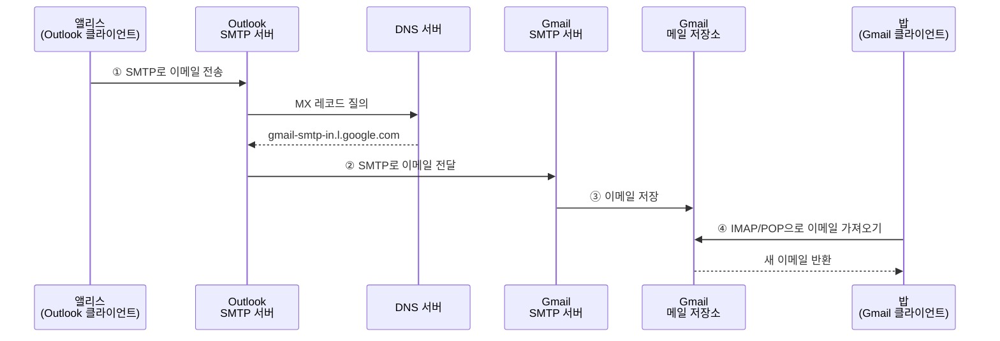
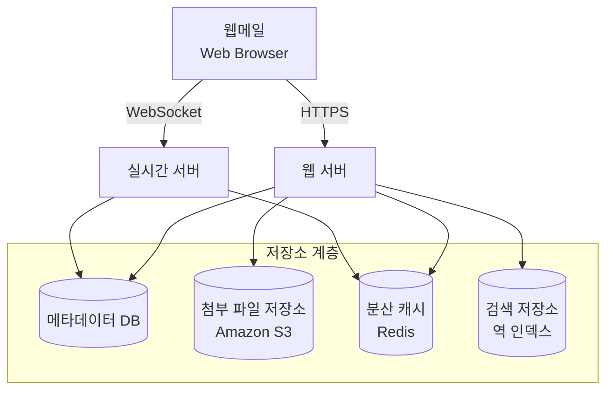
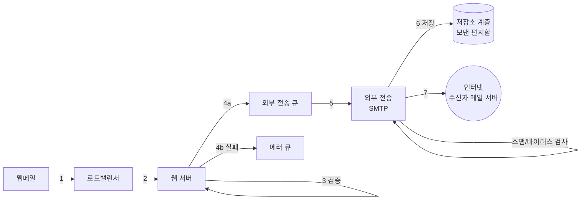
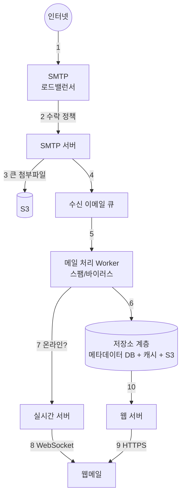
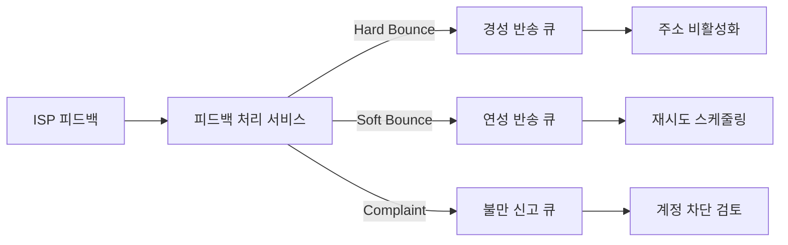
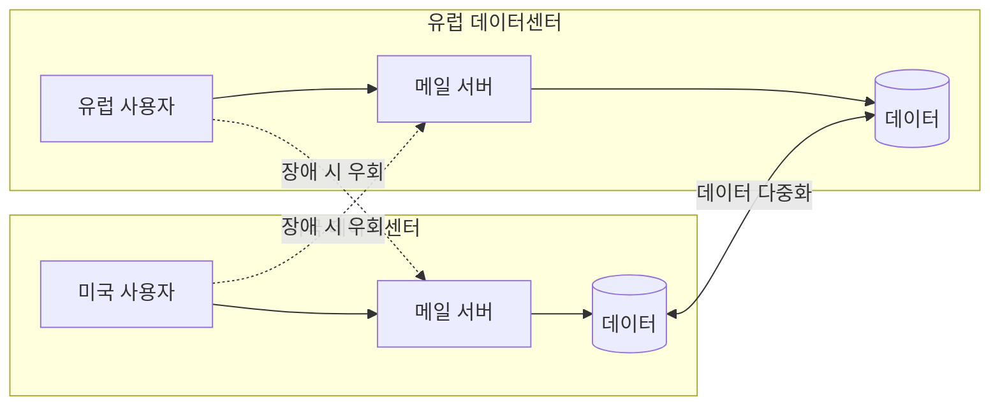

# Chapter 8: 분산 이메일 서비스 (Distributed Email Service) 발표 자료

> **발표자**: 길현준

---

## 목차

1. [1단계: 문제 이해 및 설계 범위 확정](#1-1단계-문제-이해-및-설계-범위-확정)
2. [2단계: 개략적 설계](#2-2단계-개략적-설계)
3. [3단계: 상세 설계](#3-3단계-상세-설계)
4. [면접 질문 Q&A](#4-면접-질문-qa)
5. [토론 주제](#5-토론-주제)
6. [참고 자료](#6-참고-자료)

---

## 1. 1단계: 문제 이해 및 설계 범위 확정

### 분산 이메일 서비스란?

**정의**: 지메일(Gmail), 아웃룩(Outlook), 야후 메일(Yahoo! Mail) 같은 대규모 이메일 서비스를 분산 환경에서 설계하는 것이다. 2020년 기준으로 지메일 활성 사용자 18억 명, 아웃룩 4억 명 이상의 규모를 처리해야 한다.

**실제 사례**:
- Gmail (Google) — 18억+ 활성 사용자
- Outlook (Microsoft) — 4억+ 사용자, ActiveSync 프로토콜
- Yahoo! Mail — 대규모 이메일 서비스

### ★ 요구사항 도출 (면접 대화 요약)

> 현대적 이메일 서비스는 다양한 기능을 갖춘 복잡한 시스템이므로, 45분 면접 안에 전부 설계하기는 불가능하다. 질문을 던져 범위를 좁히는 것이 핵심이다.

**지원자**: 얼마나 많은 사람들이 사용하는 제품입니까?  
**면접관**: 10억 명입니다.

**지원자**: 다음 기능이 중요할 것 같은데요 — 인증, 이메일 발송/수신, 모든 이메일 가져오기, 읽음 여부 필터링, 검색, 스팸/바이러스 방지.  
**면접관**: 인증은 건너뛰고 나머지 기능에만 집중합시다.

**지원자**: 사용자는 메일 서버에 어떻게 연결하나요?  
**면접관**: 전통적으로는 SMTP, POP, IMAP 등의 프로토콜을 사용하지만, 이번 면접에서는 **HTTP를 사용한다고 가정**하겠습니다.

**지원자**: 첨부 파일도 지원해야 하나요?  
**면접관**: 그렇습니다.

### 기능 요구사항

| 요구사항 | 세부 내용 |
|----------|----------|
| 이메일 발송/수신 | 사용자 간 이메일 전송 및 외부 메일 서버와의 SMTP 통신 |
| 모든 이메일 가져오기 | 폴더별 이메일 목록 조회, 페이지 분할 지원 |
| 읽음 여부 필터링 | 읽은 메일/읽지 않은 메일을 분리하여 조회 |
| 검색 | 제목, 발신인, 메일 내용 기반 키워드 검색 |
| 스팸/바이러스 방지 | 수신/발신 양방향에서 스팸 필터링 및 바이러스 검사 |
| 첨부 파일 지원 | MIME 표준 기반, 20~25MB 크기 제한 |

### 비기능 요구사항

- **안정성(Reliability)**: 이메일 데이터는 소실되어서는 안 된다. 이메일은 사용자에게 법적·업무적으로 중요한 문서이므로, 데이터 손실은 절대 용납되지 않는다.
- **가용성(Availability)**: 이메일과 사용자 데이터를 여러 노드에 자동으로 복제하여 가용성을 보장한다. 부분적 장애가 발생해도 시스템은 계속 동작해야 한다.
- **확장성(Scalability)**: 사용자 수가 늘어도 감당할 수 있어야 한다. 사용자나 이메일이 많아져도 시스템 성능은 저하되지 않아야 한다.
- **유연성과 확장성(Flexibility)**: 새 컴포넌트를 더하여 쉽게 기능을 추가하고 성능을 개선할 수 있어야 한다. POP나 IMAP 같은 기존 프로토콜은 기능이 매우 제한적이므로 맞춤형 프로토콜이 필요할 수도 있다.

### 개략적 규모 추정 (Back-of-envelope)

이메일은 막대한 저장 용량을 요구하는 애플리케이션이다. 문제를 개략적으로 추정하여 시스템 규모를 파악해 보자.

```
사용자 수 = 10억 명
1인 1일 평균 발송 = 10건
이메일 전송 QPS = (10^9 × 10) / 10^5 = 100,000 QPS

1인 1일 평균 수신 = 40건
이메일 1건 메타데이터 = 평균 50KB (첨부 파일 제외)
메타데이터 연간 저장소 = 10^9 × 40 × 365 × 50KB = 730 PB/년

첨부 파일 포함 비율 = 20%, 평균 크기 = 500KB
첨부 파일 연간 저장소 = 10^9 × 40 × 365 × 20% × 500KB = 1,460 PB/년
```

메타데이터만 730PB, 첨부 파일까지 합치면 연간 약 **2,190PB**에 달한다. 분산 데이터베이스 솔루션이 필수적이다.

---

## 2. 2단계: 개략적 설계

### 이메일 101 — 기초 지식

이메일을 주고받는 데 사용되는 프로토콜은 여러 가지가 있다. 분산 이메일 서비스를 설계하기 전에, 이메일의 기본 동작 방식을 이해해야 한다.

#### 이메일 프로토콜 비교

| 프로토콜 | 용도 | 핵심 특징 | 한계 |
|----------|------|----------|------|
| **SMTP** | 이메일 전송 (서버→서버) | 메일 서버 간 이메일 전달의 표준 프로토콜 | 수신 용도로는 사용 불가 |
| **POP** | 이메일 수신 (다운로드) | 원격 서버에서 이메일을 다운로드 후 서버에서 삭제 | 한 대 단말에서만 읽기 가능, 부분 읽기 불가 |
| **IMAP** | 이메일 수신 (동기화) | 클릭하기 전까지 헤더만 다운로드, 서버에서 삭제 안 됨 | 개인 이메일에서 가장 널리 사용 |
| **HTTPS** | 웹 기반 메일함 접속 | 기술적으로는 메일 전송 프로토콜이 아님, 웹메일에 이용 | ActiveSync 등 자체 프로토콜 필요 |

POP은 이메일을 통째로 내려받아야 하므로 용량이 큰 첨부 파일이 있으면 시간이 오래 걸린다. 반면 IMAP은 헤더만 먼저 다운로드하므로 인터넷 속도가 느려도 잘 동작하며, 여러 단말에서 동일한 메일을 읽을 수 있다.

#### DNS MX 레코드

이메일을 보내려면 수신자 도메인의 **메일 교환기(MX) 레코드**를 DNS에서 조회해야 한다.

```text
$ nslookup
> set q=mx
> gmail.com
gmail.com  mail exchanger = 5  gmail-smtp-in.l.google.com.
gmail.com  mail exchanger = 10 alt1.gmail-smtp-in.l.google.com.
gmail.com  mail exchanger = 20 alt2.gmail-smtp-in.l.google.com.
gmail.com  mail exchanger = 30 alt3.gmail-smtp-in.l.google.com.
gmail.com  mail exchanger = 40 alt4.gmail-smtp-in.l.google.com.
```

우선순위 값이 낮을수록 선호도가 높다. `gmail-smtp-in.l.google.com`(우선순위 5)에 먼저 접속을 시도하고, 실패하면 `alt1`(우선순위 10)으로 넘어간다. 이러한 다단계 우선순위 구조가 이메일 전달의 안정성을 보장한다.

#### 첨부 파일

이메일 첨부 파일은 일반적으로 **Base64 인코딩**을 사용하며, **MIME**(Multi-purpose Internet Mail Extension) 표준 규격을 통해 인터넷으로 전송된다. 아웃룩은 20MB, 지메일은 25MB로 첨부 파일 크기를 제한하고 있다(2021년 6월 기준). 이 수치는 개인 계정이냐 기업 계정이냐에 따라 다를 수 있다.

### 전통적 메일 서버

분산 메일 서버를 살펴보기 전에, 전통적 메일 서버의 동작 방식을 간단히 살펴보자. 이메일 서비스의 규모 확장에 대한 좋은 교훈을 얻을 수 있다.



**4단계 전송 흐름**:
1. 앨리스가 아웃룩 클라이언트에서 이메일을 작성하고 '보내기' 버튼을 누른다. 클라이언트와 메일 서버 사이의 프로토콜은 SMTP다.
2. 아웃룩 메일 서버는 DNS 질의를 통해 수신자 SMTP 서버 주소(지메일)를 찾고, 해당 서버로 이메일을 전달한다. 서버 간 프로토콜도 SMTP다.
3. 지메일 서버는 이메일을 저장하고 밥이 읽어갈 수 있도록 한다.
4. 밥이 지메일에 로그인하면 IMAP/POP 서버를 통해 새 이메일을 가져온다.

#### 전통적 메일 서버의 저장소 한계

전통적 메일 서버는 **Maildir**이라는 파일 시스템 디렉터리 구조를 사용하여 이메일을 저장했다. 각 사용자의 홈 디렉터리 아래에 `cur`, `new`, `tmp` 서브디렉터리를 두고, 각 이메일을 고유한 이름의 별도 파일로 보관하는 방식이다.

이 접근법은 사용자가 적을 때는 잘 동작하지만, 수십억 개의 이메일을 검색하고 백업하기에는 곤란했다. 이메일의 양이 많아지면 **디스크 I/O가 병목**이 되었고, 파일 시스템에 보관하므로 가용성과 안정성 요구사항도 만족할 수 없었다. 디스크 손상이나 서버 장애가 언제든 발생할 수 있기 때문이다.

또한 POP, IMAP, SMTP 같은 이메일 프로토콜은 오래 전에 발명되어 멀티미디어, 메일 대화(threading), 검색, 레이블 등 현대적 기능을 지원하도록 설계되지 않았고, 수십억 명의 사용자를 지원하도록 확장할 수도 없었다.

### 분산 메일 서버 아키텍처

분산 메일 서버는 현대적 사용 패턴을 지원하고 확장성과 안정성 문제를 해결한다. 클라우드 기술을 활용하여 전통적 메일 서버의 한계를 극복하는 방법을 알아보자.



| 컴포넌트 | 역할 | 특징 |
|----------|------|------|
| **웹메일** | 웹 브라우저 기반 메일 클라이언트 | HTTPS로 웹서버와, WebSocket으로 실시간 서버와 통신 |
| **웹 서버** | 요청/응답 서비스 | 로그인, 가입, 프로파일 관리, 이메일 API 처리 |
| **실시간 서버** | 새 이메일 실시간 전달 | 지속성 연결(stateful), WebSocket 기본 + 롱 폴링 백업 |
| **메타데이터 DB** | 이메일 헤더/본문/발신인/수신인 저장 | 상세 설계에서 DB 선정 논의 |
| **첨부 파일 저장소** | 대용량 파일 저장 (S3) | 25MB까지, Cassandra BLOB은 실질적으로 1MB 이상 부적합 |
| **분산 캐시 (Redis)** | 최근 수신 이메일 캐싱 | 리스트 등 다양한 기능 + 규모 확장 용이 |
| **검색 저장소** | 고속 텍스트 검색 | 역 인덱스(inverted index) 기반 분산 문서 저장소 |

> **참고**: 아파치 제임스(Apache James)는 WebSocket 위에 JMAP(JSON Meta Application Protocol)을 구현하여 실시간 메일 통신을 지원하는 실제 사례다.

### 이메일 API 설계

웹메일 통신에는 일반적으로 HTTP 프로토콜을 사용한다. 모바일 단말은 SMTP/POP/IMAP API를, 송신 측과 수신 측 메일 서버 간에는 SMTP 통신을 사용하지만, 여기서는 가장 중요한 RESTful API만 다룬다.

| Method | Endpoint | 설명 |
|--------|----------|------|
| POST | `/v1/messages` | To/Cc/Bcc 헤더에 명시된 수신자에게 메시지 전송 |
| GET | `/v1/folders` | 주어진 이메일 계정의 모든 폴더 반환 (RFC6154 기본 폴더: All, Archive, Drafts, Flagged, Junk, Sent, Trash) |
| GET | `/v1/folders/{:folder_id}/messages` | 주어진 폴더의 모든 메시지 반환 (페이지 분할 지원) |
| GET | `/v1/messages/{:message_id}` | 특정 메시지의 상세 정보 반환 |

**메시지 응답 객체 예시**:

```json
{
  "user_id": "string",
  "from": { "name": "string", "email": "string" },
  "to": [{ "name": "string", "email": "string" }],
  "subject": "string",
  "body": "string",
  "is_read": false
}
```

### 이메일 전송 절차

이메일을 보내는 과정은 웹메일에서 시작하여 수신자의 메일 서버에 도달하기까지 7단계로 이루어진다.



| 단계 | 설명 |
|------|------|
| **1** | 사용자가 웹메일에서 메일을 작성하고 전송 → 요청이 로드밸런서로 전달 |
| **2** | 로드밸런서는 처리율 제한(rate limit)을 넘지 않는 선에서 웹 서버로 전달 |
| **3** | 웹 서버: 이메일 크기 한도 등 기본 검증. 수신자 도메인 = 송신자 도메인이면 스팸/바이러스 검사 후 바로 저장 (4단계 이후 불필요) |
| **4a** | 검증 통과 → 외부 전송 큐에 전달. 첨부 파일이 너무 크면 S3에 따로 저장하고 참조 정보만 큐에 |
| **4b** | 검증 실패 → 에러 큐에 보관 |
| **5** | 외부 전송 SMTP 프로세스가 큐에서 메시지를 꺼내 스팸/바이러스 재검사 |
| **6** | 검증 통과한 이메일을 '보낸 편지함'에 저장 |
| **7** | 수신자의 메일 서버로 이메일 전송 |

분산 메시지 큐는 비동기적 메일 처리를 가능케 하는 핵심 컴포넌트다. 웹 서버에서 외부 전송 SMTP 프로세스를 분리함으로써 전송용 SMTP 프로세스의 규모를 **독립적으로** 조정할 수 있다.

외부 전송 큐의 크기는 각별히 모니터링해야 한다. 메일이 오랫동안 처리되지 않고 남아있다면:
- **수신자 측 메일 서버 장애**: 지수적 백오프(Exponential Backoff) 전략으로 재시도
- **소비자 수 불충분**: 더 많은 소비자를 추가하여 처리 시간 단축

### 이메일 수신 절차

이메일 수신은 외부 메일 서버로부터 메일이 도착한 시점부터 사용자 클라이언트에 전달되기까지 10단계를 거친다.



| 단계 | 설명 |
|------|------|
| **1** | 이메일이 SMTP 로드밸런서에 도착 |
| **2** | 로드밸런서가 여러 SMTP 서버로 트래픽 분산. 이메일 수락 정책(유효하지 않은 이메일 반송)을 적용 |
| **3** | 첨부 파일이 큐에 넣기 너무 크면 S3에 먼저 저장 |
| **4** | 이메일을 수신 이메일 큐에 보관 (Worker와 SMTP 서버 간 결합도 낮춤, 폭증 시 버퍼 역할) |
| **5** | 메일 처리 Worker가 스팸 필터링, 바이러스 차단 등 수행 |
| **6** | 검증 통과한 이메일을 메일 저장소, 캐시, 객체 저장소에 보관 |
| **7** | 수신자가 온라인이면 실시간 서버로 전달 |
| **8** | 실시간 서버가 WebSocket으로 클라이언트에 새 이메일 실시간 푸시 |
| **9** | 오프라인 사용자가 접속하면 웹메일이 웹 서버에 RESTful API로 연결 |
| **10** | 웹 서버가 저장소 계층에서 새 이메일을 가져와 클라이언트에 반환 |

---

## 3. 3단계: 상세 설계

### 메타데이터 데이터베이스

이번 절에서는 이메일 메타데이터의 특성을 분석하고, 올바른 데이터베이스를 선정하며, 데이터 모델을 설계한다.

#### 이메일 메타데이터의 5가지 특성

| # | 특성 | 설명 |
|---|------|------|
| 1 | 헤더는 작고 빈번 | 이메일 헤더는 일반적으로 작고, 자주 접근된다 |
| 2 | 본문은 크기 다양, 빈도 낮음 | 사용자는 이메일을 보통 한 번만 읽는다 |
| 3 | 사용자별 격리 | 이메일 가져오기, 읽음 표시, 검색 등은 사용자별로 격리 수행되어야 한다 |
| 4 | 데이터 신선도 편향 | 16일 이하 데이터에 대한 읽기 질의가 전체의 **82%** |
| 5 | 높은 안정성 | 데이터 손실은 용납되지 않는다 |

#### 올바른 데이터베이스의 선정

지메일이나 아웃룩 규모가 되면 IOPS(Input/Output Operations Per Second)를 낮추기 위해 맞춤 제작한 데이터베이스를 사용한다. 가능한 모든 선택지를 비교해 보자.

| DB 유형 | 장점 | 단점 | 판정 |
|---------|------|------|------|
| **관계형 DB** (MySQL, PostgreSQL) | 헤더/본문 인덱싱으로 간단한 검색 가능 | 큰 이메일(100KB+ HTML) 처리 곤란. BLOB 자료형은 고정 크기 페이지 연결 방식이라 디스크 I/O 과다 | ❌ |
| **분산 객체 저장소** (Amazon S3) | 백업 데이터 보관에 적합 | 읽음 표시, 키워드 검색, 이메일 타래 기능 구현 곤란 | ❌ |
| **NoSQL** (Google Bigtable, Cassandra) | 지메일이 Bigtable 사용 → 실현 가능 | Bigtable은 비공개. Cassandra는 대형 이메일 서비스에서 사용 확인 안 됨 | △ |
| **맞춤형 DB** | 필요한 기능을 완벽히 지원 가능 | 개발 비용 높음 | ✅ |

어떤 기성 데이터베이스도 본 설계안의 요구사항을 완벽히 지원하지 못한다. 대형 이메일 서비스 업체는 대체로 **독자적인 데이터베이스 시스템**을 만들어 사용한다.

**맞춤형 DB가 만족해야 할 5가지 조건**:

1. 어떤 단일 칼럼의 크기는 한 자릿수 MB 정도일 수 있다
2. 강력한 데이터 일관성이 보장되어야 한다
3. 디스크 I/O가 최소화되도록 설계되어야 한다
4. 가용성이 아주 높아야 하고 일부 장애를 감내할 수 있어야 한다
5. 증분 백업(incremental backup)이 쉬워야 한다

### 데이터 모델

데이터를 저장하는 방법은 `user_id`를 파티션 키로 사용하여 특정 사용자의 이메일을 항상 같은 샤드에 보관하는 것이다. 기본 키는 **파티션 키**와 **클러스터 키**로 구성된다.

- **파티션 키(K)**: 데이터를 여러 노드에 분산. 모든 노드에 균등하게 분산되도록 선택해야 한다.
- **클러스터 키(C↑/C↓)**: 같은 파티션에 속한 데이터를 정렬하는 역할.

이메일 서비스의 데이터 계층이 지원해야 할 **4+1가지 질의**:
1. 주어진 사용자의 모든 폴더를 구한다
2. 특정 폴더 내의 모든 이메일을 표시한다
3. 메일을 새로 만들거나, 삭제하거나, 가져온다
4. 읽은 메일 전부, 또는 읽지 않은 메일 전부를 가져온다
5. (보너스) 이메일 타래를 전부 가져온다

---

#### 질의 1: 특정 사용자의 모든 폴더

`user_id`를 파티션 키로 사용하면, 어떤 사용자의 모든 폴더가 같은 파티션에 위치한다.

```sql
-- folders_by_user 테이블
CREATE TABLE folders_by_user (
    user_id   UUID,        -- K (파티션 키)
    folder_id UUID,
    folder_name TEXT,
    PRIMARY KEY (user_id)
);

SELECT * FROM folders_by_user WHERE user_id = <user_id>;
```

#### 질의 2: 특정 폴더에 속한 모든 이메일

같은 폴더에 속한 모든 이메일이 같은 파티션에 오도록 **복합 파티션 키** `<user_id, folder_id>`를 사용한다. `email_id`는 **TIMEUUID** 타입의 클러스터 키로, 이메일을 시간 역순으로 정렬한다.

```sql
-- emails_by_folder 테이블
CREATE TABLE emails_by_folder (
    user_id   UUID,        -- K (복합 파티션 키)
    folder_id UUID,        -- K (복합 파티션 키)
    email_id  TIMEUUID,    -- C↓ (클러스터 키, 내림차순)
    from_addr TEXT,
    subject   TEXT,
    preview   TEXT,
    is_read   BOOLEAN,
    PRIMARY KEY ((user_id, folder_id), email_id)
) WITH CLUSTERING ORDER BY (email_id DESC);
```

#### 질의 3: 이메일 생성/삭제/수신

특정 이메일의 상세 정보를 가져오는 `emails_by_user` 테이블과, 첨부 파일을 관리하는 `attachments` 테이블이 필요하다.

```sql
-- emails_by_user 테이블
CREATE TABLE emails_by_user (
    user_id     UUID,            -- K (파티션 키)
    email_id    TIMEUUID,        -- C↓ (클러스터 키)
    from_addr   TEXT,
    to_addrs    LIST<TEXT>,
    subject     TEXT,
    body        TEXT,
    attachments LIST<TEXT>,      -- filename|size 쌍
    PRIMARY KEY (user_id, email_id)
) WITH CLUSTERING ORDER BY (email_id DESC);

-- 특정 이메일 상세 조회
SELECT * FROM emails_by_user WHERE email_id = 123;

-- attachments 테이블
CREATE TABLE attachments (
    email_id  TIMEUUID,   -- K (파티션 키)
    filename  TEXT,        -- C (클러스터 키)
    url       TEXT,
    PRIMARY KEY (email_id, filename)
);
```

#### 질의 4: 읽은/읽지 않은 메일 — 비정규화 전략

관계형 DB라면 `WHERE is_read = true`로 쉽게 필터링할 수 있다. 하지만 NoSQL은 보통 파티션 키와 클러스터 키에 대한 질의만 허용하므로, `is_read` 필드로는 직접 질의할 수 없다.

**해결책: 비정규화(Denormalization)** — `emails_by_folder` 테이블을 `read_emails`와 `unread_emails` 두 개로 분할한다.

```sql
-- read_emails 테이블 (읽은 메일)
CREATE TABLE read_emails (
    user_id   UUID,        -- K
    folder_id UUID,        -- K
    email_id  TIMEUUID,    -- C↓
    from_addr TEXT,
    subject   TEXT,
    preview   TEXT,
    PRIMARY KEY ((user_id, folder_id), email_id)
) WITH CLUSTERING ORDER BY (email_id DESC);

-- unread_emails 테이블 (읽지 않은 메일)
CREATE TABLE unread_emails (
    user_id   UUID,        -- K
    folder_id UUID,        -- K
    email_id  TIMEUUID,    -- C↓
    from_addr TEXT,
    subject   TEXT,
    preview   TEXT,
    PRIMARY KEY ((user_id, folder_id), email_id)
) WITH CLUSTERING ORDER BY (email_id DESC);

-- 특정 폴더의 읽지 않은 메일 조회
SELECT * FROM unread_emails
WHERE user_id = <user_id> AND folder_id = <folder_id>
ORDER BY email_id;
```

읽지 않은 메일을 읽으면 → `unread_emails`에서 삭제 → `read_emails`로 이동. 애플리케이션 코드가 복잡해지지만, 질의 성능은 대규모 서비스에 어울리는 수준으로 개선된다.

#### 보너스: 이메일 타래(Threading)

이메일 타래는 모든 답장을 최초 메시지에 엮어 보여주는 기능이다. 전통적으로 **JWZ 알고리즘**을 통해 구현한다.

이메일 헤더의 세 가지 핵심 필드:

| 필드 | 설명 |
|------|------|
| `Message-Id` | 메시지 식별자. 보내는 클라이언트가 생성 |
| `In-Reply-To` | 이 메시지가 어떤 메시지에 대한 답신인지 나타내는 식별자 |
| `References` | 타래에 관계된 메시지 식별자 목록 |

```json
{
  "headers": {
    "Message-Id": "<7BA04B2A-430C-4D12-8B57-862103C34501@gmail.com>",
    "In-Reply-To": "<CAEWTXuPfn-LzECjDJtgY9Vu03kgFvJnJUSTTt6TW@gmail.com>",
    "References": ["<7BA04B2A-430C-4D12-8B57-862103C34501@gmail.com>"]
  }
}
```

이 필드들이 있으면 이메일 클라이언트는 타래 내의 모든 메시지가 메모리에 로드되어 있을 때 전체 대화 타래를 재구성할 수 있다.

### 일관성 문제

높은 가용성을 달성하기 위해 다중화(replication)에 의존하는 분산 데이터베이스는 데이터 일관성과 가용성 사이에서 타협적 결정을 내릴 수밖에 없다.

이메일 시스템의 경우 **데이터의 정확성이 아주 중요**하므로, 모든 메일함은 반드시 **하나의 주(primary) 사본**을 통해 서비스된다고 가정해야 한다. 따라서 장애가 발생하면 클라이언트는 다른 사본을 통해 주 사본이 복원될 때까지 동기화/갱신 작업을 완료할 수 없다. 이는 **데이터 일관성을 위해 가용성을 희생**하는 결정이다.

### 이메일 전송 가능성 (Deliverability)

메일 서버를 구성하고 이메일을 보내는 것은 쉽다. 하지만 특정 사용자의 메일함에 **실제로 메일이 전달되도록 하는 것**은 어려운 문제다. Statista 연구에 따르면 전체 메일의 **50%가 스팸으로 분류**되며, 새로 구성한 메일 서버가 보내는 메일은 십중팔구 스팸 폴더로 떨어진다.

#### 전송 가능성을 높이기 위한 전략

| 전략 | 설명 |
|------|------|
| **전용 IP** | 전용 IP 주소를 사용. 대부분의 ISP는 이력 없는 새 IP에서 온 메일을 무시한다 |
| **범주화** | 마케팅 이메일과 중요 이메일은 다른 IP로 발송. 같은 서버에서 보내면 ISP가 전부 판촉 메일로 분류할 수 있다 |
| **발신인 평판** | 새 IP 주소의 사용 빈도를 서서히 올려 평판을 쌓는다. AWS SES에 따르면 2~6주 소요 |
| **스팸 발송자 차단** | 스팸을 뿌리는 사용자를 서버 평판 훼손 전에 신속 차단 |

#### 피드백 처리 체계

ISP로부터의 피드백을 받아 처리하는 경로가 필수적이다. 이메일 전달 실패 또는 사용자 불만 신고 시 다음 세 가지 유형으로 분류하여 별도의 큐로 관리한다.

| 피드백 유형 | 설명 | 대응 |
|------------|------|------|
| **경성 반송 (Hard Bounce)** | 수신인의 이메일 주소가 올바르지 않아 ISP가 전달 거부 | 해당 주소 비활성화 |
| **연성 반송 (Soft Bounce)** | ISP 측 자원 부족 등으로 일시적 전달 불가 | 지수적 백오프로 재시도 |
| **불만 신고 (Complaint)** | 수신인이 '스팸으로 신고' 버튼 클릭 | 불만 비율 모니터링 + 계정 차단 |



#### 이메일 인증 (SPF/DKIM/DMARC)

Verizon 2018 데이터 유출 조사 보고서에 따르면 피싱이나 프리텍스팅이 전체 유출 사고의 **93%**를 차지한다. 이에 대응하는 세 가지 인증 프레임워크:

| 인증 방식 | 정식 명칭 | 역할 |
|----------|----------|------|
| **SPF** | Sender Policy Framework | 발송 서버의 IP가 해당 도메인에서 허용된 것인지 검증 |
| **DKIM** | DomainKeys Identified Mail | 이메일에 디지털 서명을 추가하여 변조 여부 확인 |
| **DMARC** | Domain-based Message Authentication, Reporting and Conformance | SPF + DKIM 결과를 종합하여 정책 적용 |

핵심은 이메일이 목적지에 성공적으로 도착하도록 하기가 어렵다는 사실이다. 도메인 지식이 필요한 것은 물론이고, ISP와 좋은 관계를 유지할 필요도 있다.

### 검색

이메일 검색은 제목이나 본문에 특정 키워드가 포함되어 있는지 찾는 것이 기본이다. 고급 기능에는 발신인, 제목, 읽지 않음 같은 속성 필터링이 포함된다.

이메일 검색의 특수성: 이메일 전송/수신/삭제마다 색인(indexing) 작업을 수행해야 하지만, 검색은 사용자가 '검색' 버튼을 누를 때만 실행된다. 따라서 **쓰기 연산이 읽기 연산보다 훨씬 많이 발생**한다.

| 비교 항목 | 구글 검색 | 이메일 검색 |
|----------|----------|------------|
| **범위** | 인터넷 전체 | 사용자의 메일함 |
| **정렬** | 관련성 기반 | 시각, 첨부 파일, 날짜, 읽음 여부 등 속성 기반 |
| **정확도** | 새 항목이 검색 결과에 즉시 나타나지 않을 수 있음 | 색인 작업은 **거의 실시간**, 검색 결과는 **정확해야** 함 |

#### 방안 1: Elasticsearch

Elasticsearch는 2021년 6월 기준 가장 널리 사용되는 검색 엔진 데이터베이스이며, 이메일 검색에 필요한 텍스트 기반 검색을 잘 지원한다. `user_id`를 파티션 키로 사용하여 같은 사용자의 이메일을 같은 노드에 묶는다.

- **검색 요청**: 동기(sync) 방식 — 사용자가 검색 버튼을 누르고 결과를 기다림
- **색인 이벤트** (전송/수신/삭제): 비동기(async) 방식 — Kafka를 활용하여 색인 서비스와의 결합도를 낮춤

한 가지 까다로운 문제는 주 이메일 저장소와의 **동기화**다. 이메일 데이터의 두 사본(메타데이터 저장소 + Elasticsearch)을 일관성 있게 유지하는 것이 도전 과제다.

#### 방안 2: 맞춤형 검색 솔루션

대규모 이메일 서비스 사업자는 자체 검색 엔진을 개발하여 사용한다. 핵심 과제는 **디스크 I/O 병목**이다. 메타데이터 + 첨부 파일이 PB 수준이고, 하나의 계정에 50만 개 이상의 이메일이 저장될 수 있기 때문이다.

**LSM(Log-Structured Merge) 트리**를 사용하여 디스크에 저장되는 색인을 구조화하는 것이 바람직한 전략이다. 쓰기 경로는 순차적 쓰기 연산(sequential write)만 수행하도록 최적화되어 있으며, Bigtable이나 Cassandra, RocksDB 같은 데이터베이스의 핵심 자료 구조이기도 하다.

새 이메일이 도착하면 우선 메모리 캐시(0번 계층)에 추가된다. 메모리 데이터가 임계치를 넘으면 다음 계층에 병합된다. LSM을 사용하는 또 다른 이유는 자주 바뀌는 데이터(폴더 정보)를 그렇지 않은 데이터(이메일 데이터)와 분리하기 위해서다.

#### Elasticsearch vs 맞춤형 검색 엔진 비교

| 비교 항목 | Elasticsearch | 맞춤형 검색 엔진 |
|----------|--------------|----------------|
| **규모 확장성** | 어느 정도까지 확장 가능 | 이메일 패턴에 최적화하여 확장 용이 |
| **시스템 복잡도** | 두 가지 시스템(데이터 저장소 + ES)을 동시 유지 | 하나의 통합 시스템 |
| **데이터 일관성** | 두 사본 존재 → 일관성 유지 까다로움 | 하나의 사본만 유지 |
| **데이터 손실** | 없음. 색인 손상 시 주 저장소에서 복구 | 없음 |
| **개발 비용** | 통합 용이하나 대규모 시 전담 팀 필요 | 굉장히 많은 엔지니어링 노력 필요 |

**판정**: 소규모 → Elasticsearch (통합 쉬움). 지메일/아웃룩 규모 → 데이터베이스에 내장된 전용 검색 솔루션이 바람직.

### 규모 확장성 및 가용성

각 사용자의 데이터 접근 패턴은 다른 사용자와 무관하므로, 시스템의 대부분 컴포넌트는 **수평적 규모 확장**이 가능하다.

가용성을 향상시키기 위해서는 데이터를 **여러 데이터센터에 다중화**하는 것이 필요하다. 사용자는 네트워크 토폴로지 측면에서 자신과 물리적으로 가까운 메일 서버와 통신하며, 네트워크 파티션이 발생하면 다른 데이터센터에 보관된 메시지를 이용할 수 있다.



### 4단계: 마무리 — 추가 논의 주제

면접장에서 시간이 남는다면 다음 주제들을 추가로 논의할 수 있다.

| 주제 | 핵심 내용 |
|------|----------|
| **결함 내성** | 노드 장애, 네트워크 문제, 이벤트 전달 지연에 대한 대처 |
| **규정 준수** | GDPR에 따른 PII 처리/저장, 합법적 감청(legal intercept) |
| **보안** | 피싱 방지, 안전 브라우징, 첨부 파일 사전 경고, 계정 안전, 기밀 모드, 이메일 암호화 |
| **최적화** | 같은 이메일이 여러 수신자에게 전송될 때 동일 첨부 파일의 중복 저장 방지(저장 전 중복 확인) |

---

## 4. 면접 질문 Q&A

### Q1. 전통적 메일 서버에서 분산 메일 서버로 전환하는 가장 큰 이유는 무엇인가?

**Answer**:
> 전통적 메일 서버는 **단일 서버에서 파일 시스템(Maildir)으로 이메일을 저장**하기 때문에 수십억 개의 이메일을 검색·백업하기 어렵고, 이메일 양이 많아지면 디스크 I/O가 병목이 된다. 또한 서버 한 대에 의존하므로 디스크 손상이나 서버 장애 시 데이터 손실 위험이 있어 가용성과 안정성 요구사항을 만족하지 못한다.
>
> 분산 메일 서버는 **메타데이터 DB, 객체 저장소(S3), 분산 캐시(Redis), 검색 저장소**를 분리하여 각 컴포넌트를 독립적으로 규모 확장할 수 있고, 데이터 다중화로 장애 내성을 확보한다.
>
> **핵심 포인트**:
> - Maildir의 파일 시스템 방식은 소규모에서만 유효
> - POP/IMAP/SMTP 프로토콜 자체가 현대적 기능(검색, 레이블, 타래)을 지원하도록 설계되지 않음
> - 분산 아키텍처는 각 계층을 독립적으로 확장 가능

### Q2. NoSQL 데이터 모델에서 읽음/안읽음 필터링을 위해 비정규화를 선택한 이유는?

**Answer**:
> NoSQL 데이터베이스는 보통 **파티션 키와 클러스터 키에 대한 질의만 허용**한다. `emails_by_folder` 테이블의 `is_read` 필드는 이에 해당하지 않으므로 `WHERE is_read = true` 같은 질의를 직접 실행하지 못한다.
>
> 모든 메시지를 가져온 뒤 애플리케이션 단에서 필터링하는 방안은 대규모 서비스에 비효율적이다. 따라서 `read_emails`와 `unread_emails` 두 개 테이블로 비정규화하여 질의 성능을 확보한다. 읽음 상태 변경 시 한 테이블에서 삭제 후 다른 테이블로 이동하는 방식이다.
>
> **핵심 포인트**:
> - NoSQL에서 비정규화는 흔한 패턴
> - 애플리케이션 코드의 복잡도 증가 vs 질의 성능 개선의 트레이드오프
> - 대규모 서비스에서는 성능 우선이 합리적

### Q3. 이메일 전송 가능성(Deliverability)이 왜 어렵고, 어떻게 해결하는가?

**Answer**:
> 전체 이메일의 **50%가 스팸**으로 분류되는 상황에서, 새로 구성한 메일 서버의 메일은 **좋은 평판이 없으므로** 십중팔구 스팸 폴더로 떨어진다.
>
> 해결 전략은 크게 5가지다:
> 1. **전용 IP 사용**: 이력 없는 IP에서 온 메일은 무시되므로 전용 IP를 확보
> 2. **이메일 범주화**: 마케팅 vs 중요 이메일을 다른 IP로 발송
> 3. **발신인 평판 구축**: 2~6주에 걸쳐 사용 빈도를 서서히 올려 IP 워밍업
> 4. **스팸 발송자 신속 차단**: 서버 평판 훼손 전에 차단
> 5. **이메일 인증(SPF/DKIM/DMARC)**: 피싱 공격 방지
>
> 또한 ISP 피드백(경성 반송, 연성 반송, 불만 신고)을 유형별 큐로 분리하여 체계적으로 처리해야 한다.

### Q4. Elasticsearch와 맞춤형 검색 솔루션을 비교할 때, 일관성 관점에서의 핵심 차이는?

**Answer**:
> Elasticsearch를 사용하면 이메일 데이터의 **두 사본**이 존재하게 된다 — 하나는 메타데이터 저장소에, 다른 하나는 Elasticsearch에. 두 저장소 간 **데이터 일관성을 유지하기 까다롭다**는 것이 핵심 문제다.
>
> 반면 맞춤형 검색 솔루션은 메타데이터 저장소에 **하나의 사본만 유지**하므로 일관성 문제가 근본적으로 발생하지 않는다. 다만 개발 비용이 훨씬 높다.
>
> **핵심 포인트**:
> - 소규모: ES의 일관성 문제가 관리 가능한 수준
> - 대규모(지메일/아웃룩급): 단일 시스템의 일관성 이점이 개발 비용을 상쇄

### Q5. 이메일 시스템에서 일관성과 가용성 중 어떤 것을 우선시하는가? 그 이유는?

**Answer**:
> 이메일 시스템은 **데이터 일관성을 우선**한다. 이메일은 법적·업무적으로 중요한 문서이므로 데이터의 정확성이 가용성보다 더 중요하다.
>
> 따라서 모든 메일함은 반드시 **하나의 주(primary) 사본**을 통해 서비스되어야 한다. 장애 발생 시 클라이언트는 주 사본이 복원될 때까지 동기화/갱신 작업을 완료할 수 없다. 이는 CAP 정리에서 **CP(Consistency + Partition tolerance)**를 선택하는 것에 해당한다.

---

## 5. 토론 주제

### 토론 1: 이메일 저장소로 기성 DB vs 맞춤형 DB

**질문**: 지메일이나 아웃룩처럼 독자적인 데이터베이스를 만들 수 없는 중소규모 이메일 서비스는 어떤 전략을 취해야 하는가?

**토론 포인트**:
- Cassandra + Elasticsearch 조합으로 메타데이터 저장과 검색을 분리하는 전략의 실현 가능성
- 관계형 DB + S3 하이브리드 방식의 비용 대비 효과
- 클라우드 관리형 서비스(AWS SES + DynamoDB + OpenSearch)를 활용한 서버리스 이메일 아키텍처의 타당성
- "완벽한 DB가 없다"는 결론은 대부분의 대규모 시스템 설계에서 공통적으로 등장하는 패턴인가?

### 토론 2: 비정규화의 대가 — 읽음/안읽음 분리 테이블

**질문**: `read_emails`와 `unread_emails`로 테이블을 분리하면 읽음 상태 변경마다 삭제+삽입이 발생한다. 대규모 사용자가 이메일을 대량으로 읽음 처리할 때 발생할 수 있는 문제는?

**토론 포인트**:
- 수천 건의 이메일을 한 번에 읽음 처리할 때의 쓰기 폭증(write amplification)
- 삭제+삽입이 원자적으로 수행되지 않으면 중간 상태(두 테이블 모두에 없는 상태)가 발생할 가능성
- 배치(batch) 처리로 원자성을 보장할 수 있는지, 그 비용은?
- RDB의 `UPDATE ... SET is_read = true` 한 줄과의 트레이드오프

### 토론 3: 이메일 전송 가능성(Deliverability)과 실무

**질문**: 새로운 서비스를 런칭할 때 이메일 인프라를 직접 구축하는 것이 합리적인가, 아니면 AWS SES 같은 관리형 서비스를 사용하는 것이 나은가?

**토론 포인트**:
- IP 워밍업에 2~6주가 소요된다는 것은 초기 스타트업에게 큰 장벽
- SendGrid, Mailgun 같은 서드파티 이메일 서비스의 장단점
- SPF/DKIM/DMARC 설정을 놓치면 비즈니스 메일이 스팸으로 떨어지는 실제 사례
- "이메일 인프라는 반드시 전문 서비스를 사용하라"는 업계 합의가 존재하는가?

---

## 6. 참고 자료

### 공식 문서 / RFC
- [RFC 1939 - Post Office Protocol v3](http://www.faqs.org/rfcs/rfc1939.html)
- [RFC 6154 - IMAP LIST Extension for Special-Use Mailboxes](https://datatracker.ietf.org/doc/html/rfc6154)
- [RFC 8887 - JMAP WebSocket Subprotocol](https://datatracker.ietf.org/doc/rfc8887/)
- [SPF (Sender Policy Framework)](https://en.wikipedia.org/wiki/Sender_Policy_Framework)
- [DKIM (DomainKeys Identified Mail)](https://en.wikipedia.org/wiki/DomainKeys_Identified_Mail)
- [DMARC (Domain-based Message Authentication)](https://dmarc.org/)

### 기술 블로그 / 참고
- [Gmail 활성 사용자 수](https://financesonline.com/number-of-active-gmail-users/)
- [2021년 일일 이메일 전송량](https://review42.com/resources/how-many-emails-are-sent-per-day/)
- [QQ Email System Optimization (중문)](https://www.slideshare.net/areyouok/06-qq-5431919)
- [AWS SES 전용 IP 워밍업 프로세스](https://docs.aws.amazon.com/ses/latest/dg/dedicated-ip-warming.html)
- [Verizon 2018 Data Breach Investigations Report](https://enterprise.verizon.com/resources/reports/DBIR_2018_Report.pdf)
- [전 세계 스팸 메일 규모 (Statista)](https://www.statista.com/statistics/420391/spam-email-traffic-share/)

### 실무 사례

| 기업 | 기술 | 특징 |
|------|------|------|
| **Google (Gmail)** | Bigtable (맞춤형 분산 DB) | 18억+ 사용자, 자체 검색 엔진, JMAP 미사용 |
| **Microsoft (Outlook)** | Exchange Server + ActiveSync | HTTPS 기반 자체 프로토콜, 다중 데이터센터 |
| **Apache James** | WebSocket + JMAP | 오픈소스 메일 서버, 실시간 통신 지원 |

### 핵심 기술 용어

| 용어 | 설명 |
|------|------|
| MX 레코드 | DNS에서 메일 서버 주소를 가리키는 레코드 |
| MIME | 인터넷을 통해 첨부 파일을 전송하는 표준 규격 |
| TIMEUUID | UUID와 타임스탬프를 결합한 자료형, 시간순 정렬에 사용 |
| LSM 트리 | 순차적 쓰기에 최적화된 트리 구조, 검색 색인에 활용 |
| 비정규화 | NoSQL에서 질의 성능을 위해 데이터를 중복 저장하는 기법 |
| JWZ 알고리즘 | 이메일 헤더(Message-Id, In-Reply-To, References)를 사용한 타래 재구성 알고리즘 |
| IP 워밍업 | 새 IP 주소의 메일 발송 빈도를 서서히 올려 ISP 신뢰를 확보하는 과정 |

---

## 8장 요약 마인드맵

```
분산 이메일 서비스
├── 1단계: 요구사항
│   ├── 기능: 발송/수신, 검색, 읽음 필터링, 스팸 방지, 첨부 파일
│   ├── 비기능: 안정성, 가용성, 확장성, 유연성
│   └── 규모: 10억 사용자, 100K QPS, 메타데이터 730PB/년, 첨부 1,460PB/년
├── 2단계: 개략적 설계
│   ├── 이메일 101: SMTP/POP/IMAP/HTTPS, DNS MX, MIME
│   ├── 전통적 서버: Maildir → 디스크 I/O 병목, 가용성 부족
│   ├── 분산 아키텍처: 웹서버 + 실시간서버 + 메타데이터DB + S3 + Redis + 검색
│   ├── 전송 흐름: 7단계 (웹메일→LB→웹서버→큐→SMTP→인터넷)
│   └── 수신 흐름: 10단계 (LB→SMTP→큐→Worker→저장→실시간/오프라인)
├── 3단계: 상세 설계
│   ├── 메타데이터 DB: RDB/S3/NoSQL 비교 → 맞춤형 DB (5가지 조건)
│   ├── 데이터 모델: 파티션 키 + 클러스터 키, 4+1 질의, 비정규화
│   ├── 일관성: 주 사본 기반, 가용성보다 일관성 우선
│   ├── 전송 가능성: 전용 IP, 범주화, IP 워밍업, SPF/DKIM/DMARC
│   ├── 검색: Elasticsearch vs 맞춤형 (LSM 트리)
│   └── 규모 확장: 수평 확장 + 다중 데이터센터 다중화
└── 4단계: 마무리
    ├── 결함 내성
    ├── 규정 준수 (GDPR)
    ├── 보안 (피싱/암호화)
    └── 최적화 (중복 첨부 파일)
```

---

*Last Updated: 2026-03-12*
