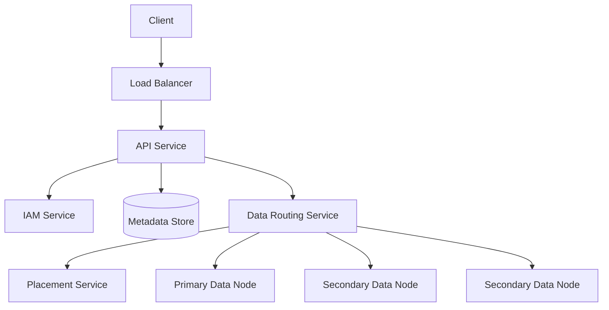
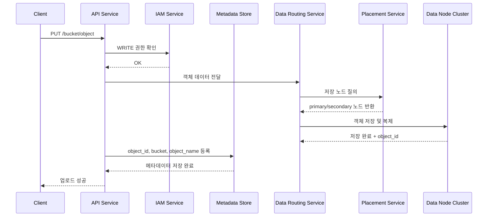
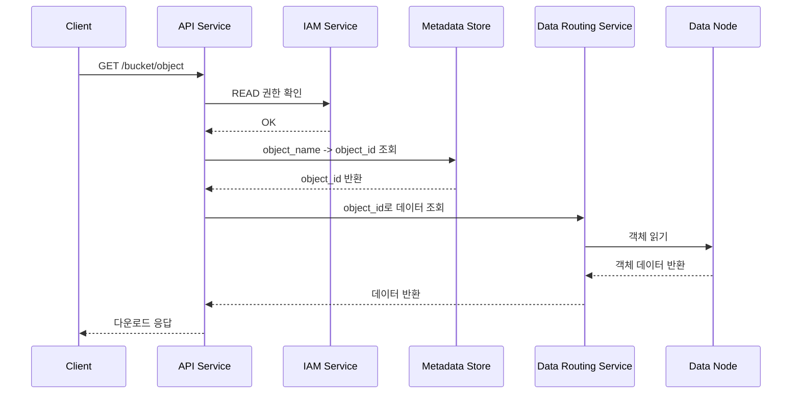
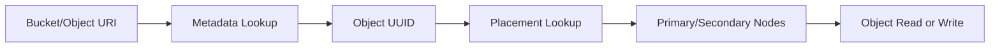
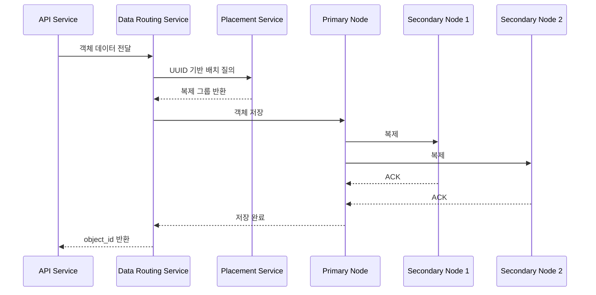
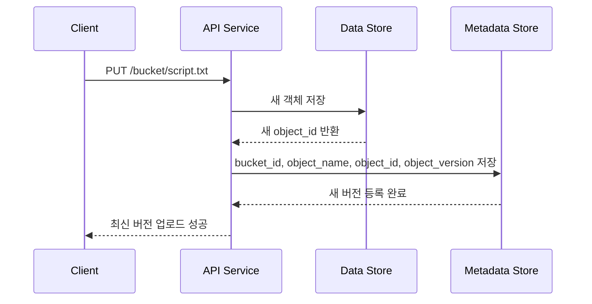
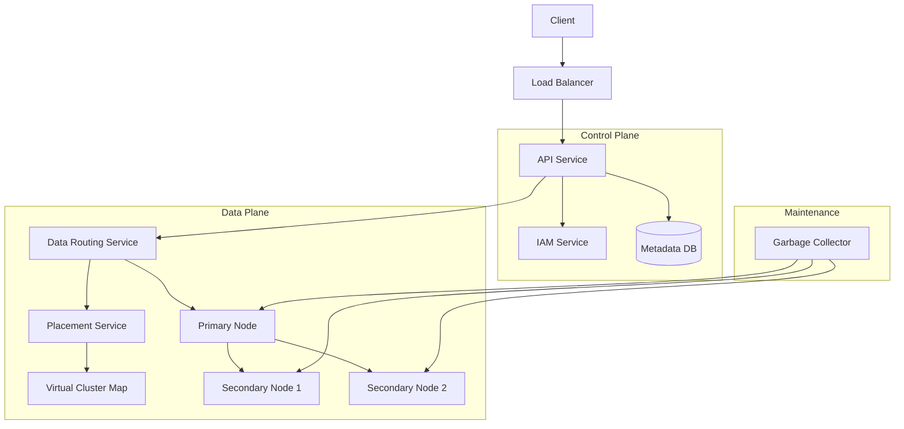

# Chapter 9: S3와 유사한 객체 저장소 (S3-like Object Storage) 발표 자료

> **발표자**: 길현준

---

## 목차

1. [1단계: 문제 이해 및 설계 범위 확정](#1-1단계-문제-이해-및-설계-범위-확정)
2. [2단계: 개략적 설계](#2-2단계-개략적-설계)
3. [3단계: 상세 설계](#3-3단계-상세-설계)
4. [면접 질문 Q&A](#4-면접-질문-qa)
5. [토론 주제](#5-토론-주제)
6. [참고 자료](#6-참고-자료)

---

## 1. 1단계: 문제 이해 및 설계 범위 확정

### S3와 유사한 객체 저장소란?

**정의**: 객체 저장소는 데이터를 파일이나 블록이 아니라 **객체(object)** 단위로 저장하는 시스템이다. 각 객체는 실제 데이터와 메타데이터를 함께 가지며, 보통 RESTful API를 통해 접근한다. 계층형 디렉터리 구조 대신 수평적인 네임스페이스를 사용하고, 높은 내구성과 대규모 확장을 목표로 한다.

**실제 사례**:
- **Amazon S3** - 대표적인 퍼블릭 클라우드 객체 저장소
- **Azure Blob Storage** - 마이크로소프트의 객체 저장소 서비스
- **Google Cloud Storage** - GCP의 객체 저장소 서비스

### 저장소 시스템 101

객체 저장소를 이해하려면 먼저 저장소 시스템의 세 가지 큰 부류를 비교하는 것이 좋다.

| 저장소 유형 | 데이터 단위 | 접근 방식 | 장점 | 단점 | 적합한 용도 |
|---|---|---|---|---|---|
| **블록 저장소** | 블록 | SAS, iSCSI, FC | 가장 유연하고 고성능 | 운영 복잡도 높음 | DB, VM, 고성능 워크로드 |
| **파일 저장소** | 파일/디렉터리 | SMB/CIFS, NFS | 사람이 이해하기 쉽고 공유 편리 | 메타데이터 계층 비용 존재 | 범용 파일 공유 |
| **객체 저장소** | 객체 | RESTful API | 최상 수준의 확장성과 낮은 비용 | 지연 시간은 상대적으로 높음 | 백업, 아카이브, 비정형 대용량 데이터 |

**왜 객체 저장소가 필요한가?**

객체 저장소는 실시간 갱신보다 **대용량 데이터의 영속성, 확장성, 비용 효율성**을 우선한다. 즉, SSD 위에 올려 초저지연 응답을 뽑아내는 시스템이 아니라, 수많은 객체를 오랫동안 안전하게 저장하고 필요할 때 꺼내 쓰는 시스템이다. 이 설계 철학 때문에 계층형 파일 시스템 대신 버킷/객체 구조를 사용하고, 데이터 접근도 POSIX 파일 연산이 아니라 API 중심으로 이뤄진다.

### 객체 저장소 핵심 용어

| 용어 | 설명 |
|---|---|
| **버킷(Bucket)** | 객체를 담는 논리적 컨테이너. 보통 이름은 전역적으로 유일해야 한다. |
| **객체(Object)** | 실제 저장되는 데이터 단위. 페이로드와 메타데이터를 함께 가진다. |
| **버전 관리(Versioning)** | 같은 객체 이름에 대해 여러 버전을 유지하는 기능. 실수로 덮어쓴 데이터를 복구할 때 유용하다. |
| **URI** | 객체를 식별하는 주소. 객체 저장소는 보통 `s3://bucket/key` 또는 HTTP URI로 접근한다. |
| **SLA** | 내구성, 가용성 같은 서비스 수준 약속. 예: 99.9999% 내구성, 99.99% 가용성. |

### ★ 요구사항 도출 (면접 대화 요약)

> 이 장의 핵심은 “파일을 저장한다”가 아니라, **대규모 객체를 어떻게 안전하고 저렴하게 보관할 것인가**를 정의하는 것이다. 그래서 기능 질문보다도 데이터 규모, 내구성, 비용, 객체 목록 출력 같은 사용 패턴 질문이 중요하다.

**지원자**: 어떤 기능을 지원해야 하나요?  
**면접관**: 버킷 생성, 객체 업로드/다운로드, 객체 버전, 그리고 `aws s3 ls`와 유사한 버킷 내 객체 목록 출력 기능이 필요합니다.

**지원자**: 데이터의 크기는 어느 정도인가요?  
**면접관**: 수 KB짜리 작은 객체도 많고, 수 GB 이상의 큰 객체도 효율적으로 저장할 수 있어야 합니다.

**지원자**: 매년 추가되는 데이터는 어느 정도입니까?  
**면접관**: 100PB 수준입니다.

**지원자**: 99.9999%의 데이터 내구성과 99.99%의 서비스 가용성을 목표로 해도 될까요?  
**면접관**: 네. 그 정도면 만족스럽습니다.

### 기능 요구사항

| 요구사항 | 세부 내용 |
|---|---|
| **버킷 생성** | 객체를 담는 논리 컨테이너 생성 |
| **객체 업로드** | 작은 객체와 큰 객체를 모두 업로드 가능해야 함 |
| **객체 다운로드** | 객체 이름 기반으로 데이터를 조회 가능해야 함 |
| **객체 버전 관리** | 덮어쓰기/삭제 이후에도 이전 버전 복구 가능 |
| **객체 목록 출력** | 접두어(prefix) 기반 목록 출력, 재귀적 조회 지원 |

### 비기능 요구사항

- **대규모 저장 용량**: 매년 100PB 수준의 데이터가 유입된다.
- **높은 내구성**: 식스 나인(99.9999%) 수준의 데이터 내구성이 요구된다.
- **높은 가용성**: 포 나인(99.99%) 수준의 서비스 가용성이 요구된다.
- **저장소 효율성**: 안정성과 가용성을 확보하면서도 저장 비용은 최대한 낮춰야 한다.

### 개략적 규모 추정 (Back-of-envelope)

객체 저장소에서 병목이 되기 쉬운 것은 CPU보다 **디스크 용량과 IOPS**다. 그래서 객체 크기 분포를 먼저 잡고, 수용 가능한 객체 수와 메타데이터 규모를 추정한다.

```text
연간 추가 데이터 = 100 PB = 10^11 MB

객체 크기 분포 가정
- 소형 객체 20%: 중앙값 0.5MB
- 중형 객체 60%: 중앙값 32MB
- 대형 객체 20%: 중앙값 200MB

저장소 사용률 = 40%

수용 가능한 객체 수
= (10^11 x 0.4) / (0.2 x 0.5 + 0.6 x 32 + 0.2 x 200)
= 약 6.8억 개 객체

객체 메타데이터 크기 = 1KB/객체
전체 메타데이터 공간 = 약 0.68TB
```

이 계산은 정확한 용량 계획표라기보다는, **데이터 저장은 PB 단위인데 메타데이터는 TB 이하일 수 있다**는 점을 보여준다. 즉, 실제 설계에서는 데이터 저장소와 메타데이터 저장소를 분리하는 것이 자연스럽다.

---

## 2. 2단계: 개략적 설계

### 객체 저장소의 중요한 성질

개략 설계를 하기 전에 객체 저장소가 일반 파일 시스템과 어떻게 다른지 짚고 가야 한다.

| 성질 | 설명 | 왜 중요한가 |
|---|---|---|
| **객체 불변성** | 객체는 직접 수정하지 않고 새 버전으로 대체한다 | 데이터 저장 경로를 단순화할 수 있다 |
| **키-값 저장소 성격** | URI를 키로 보고 데이터를 값으로 볼 수 있다 | 메타데이터 조회 모델이 단순해진다 |
| **쓰기 1회, 읽기 다수** | LinkedIn 조사 기준 요청의 95%가 읽기 | 읽기 최적화 설계가 중요하다 |
| **데이터/메타데이터 분리** | 객체 데이터와 메타데이터를 다른 저장 계층에 둔다 | 각각 다른 방식으로 확장·최적화할 수 있다 |

### API 설계

객체 저장소는 RESTful API 기반이므로, 클라이언트는 파일 시스템 명령이 아니라 HTTP 연산을 통해 데이터를 조작한다.

**주요 API 예시**

```http
PUT /bucket-to-share/script.txt HTTP/1.1
Host: foo.s3example.org
Authorization: [권한 문자열]
Content-Type: text/plain
Content-Length: 4567
x-amz-meta-author: Alex
```

```http
GET /bucket-to-share/script.txt HTTP/1.1
Host: foo.s3example.org
Authorization: [권한 문자열]
```

**API 목록**

| Method | Endpoint | 설명 |
|---|---|---|
| `PUT` | `/{bucket}` | 버킷 생성 |
| `PUT` | `/{bucket}/{object}` | 객체 업로드 |
| `GET` | `/{bucket}/{object}` | 객체 다운로드 |
| `GET` | `/{bucket}?prefix=...` | 버킷 내 객체 목록 조회 |
| `PUT` | `/{bucket}/{object}` + versioning | 새 버전 객체 업로드 |
| `DELETE` | `/{bucket}/{object}` | 삭제 마커 삽입 기반 삭제 |

### 개략적 아키텍처



| 컴포넌트 | 역할 | 특징 |
|---|---|---|
| **Load Balancer** | API 요청 분산 | 무상태 API 서버 앞단 트래픽 분산 |
| **API Service** | 요청 오케스트레이션 | IAM, 메타데이터, 데이터 저장소 호출 조율 |
| **IAM Service** | 인증/권한 부여/접근 제어 | 객체 업로드/다운로드 전에 권한 확인 |
| **Metadata Store** | 버킷/객체 메타데이터 저장 | 객체명→UUID 매핑, 버전 정보, 목록 조회 지원 |
| **Data Routing Service** | 데이터 노드와의 입출력 담당 | 객체 ID 할당, 저장 노드 결정, 읽기/쓰기 수행 |
| **Placement Service** | 저장 노드 배치 계산 | 장애 도메인을 고려해 복제 위치 선택 |
| **Data Node** | 실제 객체 데이터 저장 | 주/부 노드 구조, 복제와 내구성 담당 |

### 왜 메타데이터와 데이터 저장소를 분리하는가?

이 설계의 핵심 결정은 **메타데이터와 객체 데이터를 분리하는 것**이다. 이유는 단순하다.

1. **변경 패턴이 다르다**: 객체 데이터는 불변인 반면 메타데이터는 버전, 삭제 마커, 목록 조회 때문에 더 자주 갱신된다.
2. **액세스 패턴이 다르다**: 객체 다운로드 전에 우선 메타데이터에서 UUID를 찾아야 하므로 메타데이터는 조회 지연이 짧아야 한다.
3. **확장 방식이 다르다**: 데이터 저장소는 PB 규모로 확장되고, 메타데이터는 상대적으로 작지만 인덱스와 질의가 중요하다.

### 객체 업로드 흐름



**설계 근거**: 업로드 흐름을 이렇게 쪼개는 이유는 API 서비스가 모든 저장 세부사항을 직접 들고 있지 않도록 만들기 위해서다. API는 요청 조율만 담당하고, 저장 위치 계산은 배치 서비스, 실제 입출력은 라우팅 서비스가 맡으면 각 계층을 독립적으로 확장할 수 있다.

### 객체 다운로드 흐름



**핵심 포인트**: 데이터 저장소는 객체 이름을 모른다. 오직 `object_id(UUID)`만 이해한다. 따라서 다운로드는 항상 **객체 이름 → UUID → 실제 데이터**의 2단계 조회를 거친다.

### 핵심 알고리즘/데이터 구조

**핵심 개념**: 객체 저장소는 URI 기반 키-값 모델 + 메타데이터 인덱스 + 대용량 데이터 노드 복제로 동작한다.



---

## 3. 3단계: 상세 설계

### 데이터 저장소

#### 데이터 저장소 내부 구조

데이터 저장소는 세 가지 주요 컴포넌트로 구성된다.

| 컴포넌트 | 역할 | 왜 필요한가 |
|---|---|---|
| **데이터 라우팅 서비스** | 데이터 읽기/쓰기 요청 처리 | 클라이언트 요청과 실제 데이터 노드 사이를 추상화 |
| **배치 서비스** | 객체를 저장할 노드 결정 | 장애 도메인을 고려한 복제 배치 필요 |
| **데이터 노드** | 실제 객체 데이터 저장 | 내구성과 가용성의 핵심 실행 계층 |

#### 배치 서비스

배치 서비스는 **가상 클러스터 지도(virtual cluster map)** 를 유지한다. 이 지도에는 데이터 노드들의 위치와 상태가 기록된다. 배치 서비스는 이 정보를 바탕으로 같은 다중화 그룹의 사본들이 서로 다른 물리적 위치에 놓이도록 결정한다.

이 서비스가 중요한 이유는 단순한 라운드로빈으로는 내구성을 보장할 수 없기 때문이다. 예를 들어 같은 랙에 있는 서버 세 대에만 복제하면, 랙 전원 장애 한 번으로 세 사본이 동시에 사라질 수 있다. 따라서 복제는 **서버, 랙, AZ 같은 장애 도메인** 을 고려해야 한다.

#### 장애 도메인

| 장애 도메인 수준 | 예시 | 영향 |
|---|---|---|
| **서버** | 파워 서플라이, CPU, 보드 고장 | 단일 노드 장애 |
| **랙** | 랙 단위 네트워크/전원 장애 | 해당 랙 서버 집단 장애 |
| **가용성 구역(AZ)** | 데이터센터 급 장애 | 광범위한 지역 장애 |

**설계 근거**: 데이터 복제의 목적은 복제 그 자체가 아니라 **같은 시점에 함께 죽지 않도록 분산하는 것**이다. 그래서 복제 정책은 수학적 복제 개수보다도 장애 도메인 배치가 더 중요하다.

### 데이터 저장 흐름



이 흐름에서 중요한 결정은 **응답을 언제 반환하느냐**다. 책은 세 가지 선택지를 보여 준다.

| 저장 성공 조건 | 일관성 | 지연 시간 | 특징 |
|---|---|---|---|
| **세 노드 모두 저장 완료** | 가장 강함 | 가장 높음 | 데이터 정확성 최우선 |
| **주 노드 + 부 노드 1개 저장 완료** | 중간 | 중간 | 일관성과 지연 시간의 절충 |
| **주 노드만 저장 완료** | 가장 약함 | 가장 낮음 | 빠르지만 결과적 일관성 성격 |

책의 흐름은 첫 번째 선택지를 강조한다. **가장 느린 사본까지 기다리므로 지연 시간은 손해지만 데이터 일관성은 가장 좋다.** 객체 저장소는 내구성 목표가 높은 시스템이므로 이 선택이 설득력 있다.

### 데이터는 실제로 어떻게 저장되는가?

각 객체를 파일 하나로 저장하는 가장 단순한 방법은 현실적으로 문제가 있다.

1. **작은 파일 낭비**: 4KB 블록에 1KB 파일 하나를 넣어도 블록 하나를 통째로 사용한다.
2. **inode 소진**: 수백만 개 소형 파일은 파일 시스템 메타데이터에 큰 부담을 준다.

그래서 책은 작은 객체를 큰 파일 안에 **append-only** 방식으로 붙여 넣는 구조를 제안한다. 이는 WAL과 유사한 전략이다.

| 방법 | 장점 | 단점 |
|---|---|---|
| **객체별 개별 파일 저장** | 구현 단순 | 소형 파일 폭증 시 비효율 |
| **큰 파일에 연속 append** | 블록 낭비 감소, inode 부담 감소 | 객체 위치 추적 인덱스 필요 |

#### 객체 위치 추적

큰 파일 하나에 여러 객체를 넣으면, 특정 UUID가 어느 파일의 어느 오프셋에 있는지 알아야 한다. 그래서 `object_mapping` 같은 인덱스가 필요하다.

| 필드 | 설명 |
|---|---|
| `object_id` | 객체 UUID |
| `file_name` | 객체가 저장된 데이터 파일 |
| `start_offset` | 파일 내 시작 위치 |
| `object_size` | 객체 크기 |

**왜 관계형 DB를 선택하는가?**

책은 RocksDB 같은 파일 기반 KV 저장소와 관계형 DB를 비교한다. 이 인덱스 데이터는 한 번 기록된 뒤 거의 바뀌지 않고 읽기 요청이 많다. 따라서 쓰기 성능보다 **읽기 성능이 더 중요한 데이터**다. 그래서 읽기에 강한 관계형 DB가 더 적절하다는 결론에 도달한다. 또한 이 인덱스는 다른 데이터 노드와 공유할 필요가 없으므로, 각 데이터 노드 로컬에 SQLite 같은 파일 기반 관계형 DB를 두는 구조가 잘 맞는다.

### 데이터 내구성

#### 3중 복제

책의 기본 설계는 **3중 복제(replication)** 다. 하드웨어 장애는 피할 수 없기 때문에, 단일 디스크에 의존해서는 식스 나인 내구성을 달성할 수 없다. 드라이브 연간 장애율을 0.81%로 두면, 3중 복제를 통해 아주 높은 수준의 내구성을 얻을 수 있다.

#### 소거 코드(Erasure Coding)

소거 코드는 데이터를 여러 조각으로 나누고, 일부 조각이 사라졌을 때 복구할 수 있도록 **페리티(parity)** 를 추가하는 방식이다. 예를 들어 4+2 소거 코드는 4개 데이터 조각과 2개 페리티 조각을 만든다. 더 일반적인 8+4 소거 코드에서는 12개 조각을 서로 다른 장애 도메인에 배치하고, 최대 4개 조각이 사라져도 복구할 수 있다.


| 항목 | 다중화 | 소거 코드 |
|---|---|---|
| **내구성** | 높음 | 더 높음 |
| **저장소 효율성** | 200% 오버헤드 | 50% 오버헤드 |
| **계산 자원** | 거의 없음 | 페리티 계산 필요 |
| **쓰기 성능** | 더 좋음 | 계산 때문에 더 느림 |
| **읽기 성능** | 건강한 노드 하나에서 읽기 가능 | 여러 노드 조합 필요 |

**설계 판단**: 응답 지연이 중요한 시스템이면 다중화가 낫고, 저장 비용이 더 중요하면 소거 코드가 매력적이다. 책은 데이터 노드 설계 복잡도를 낮추기 위해 다중화 중심으로 설명한다.

### 정확성 검증

대규모 저장소는 디스크 장애뿐 아니라 메모리 손상, 전송 중 데이터 훼손도 고려해야 한다. 이 문제를 해결하는 기본 수단이 **체크섬(checksum)** 이다.

체크섬은 데이터에서 계산한 작은 검증값이다. 수신 측에서 다시 계산한 결과가 원본 체크섬과 다르면 데이터가 훼손된 것으로 본다. 책은 MD5 같은 단순한 체크섬 알고리즘 사용을 예로 든다.

| 알고리즘 | 특징 | 여기서의 의미 |
|---|---|---|
| **MD5** | 빠르고 간단 | 무결성 확인용으로 충분 |
| **SHA-1** | 더 무겁지만 널리 알려짐 | 대안 가능 |
| **HMAC** | 키 기반 무결성 검증 | 단순 체크섬보다 더 강한 보안 목적 |

객체를 읽을 때는 다음 절차를 반복한다.

1. 객체 조각과 체크섬을 함께 읽는다.
2. 수신 데이터로 체크섬을 다시 계산한다.
3. 일치하면 사용하고, 불일치하면 다른 장애 도메인에서 조각을 다시 가져온다.
4. 필요한 조각이 모두 모이면 원본 객체를 복원해 클라이언트에 반환한다.

### 메타데이터 데이터 모델

#### 지원해야 하는 질의

메타데이터 계층은 최소한 다음 세 가지 질의를 지원해야 한다.

1. 객체 이름으로 객체 ID 찾기
2. 객체 이름 기반 삽입/삭제
3. 같은 접두어를 갖는 객체 목록 조회

이를 위해 `bucket` 테이블과 `object` 테이블이 필요하다.

```sql
-- 버킷 목록 조회
SELECT * FROM bucket WHERE owner_id = {id};

-- 접두어 기반 객체 목록 조회
SELECT * FROM object
WHERE bucket_id = '123' AND object_name LIKE 'abc/%';
```

#### bucket 테이블 vs object 테이블 규모 확장

| 테이블 | 규모 | 확장 방법 |
|---|---|---|
| **bucket** | 상대적으로 작음 | 읽기 복제본으로 부하 분산 |
| **object** | 매우 큼 | 샤딩 필요 |

bucket 테이블은 사용자당 버킷 수가 제한되므로 상대적으로 작다. 반면 object 테이블은 수억 개 객체 메타데이터를 담아야 하므로 단일 서버에 둘 수 없다.

#### 샤딩 키 선택

| 샤딩 기준 | 장점 | 단점 |
|---|---|---|
| **bucket_id** | 같은 버킷 객체가 한 샤드에 모임 | 거대 버킷이 있으면 핫스팟 발생 |
| **object_id** | 부하 균등 분산 | URI 기반 질의에 비효율 |
| **bucket_name + object_name 해시** | URI 기반 질의와 분산 균형 모두 고려 | 목록 조회는 어려워짐 |

책은 `bucket_name + object_name` 순서쌍의 해시를 샤딩 키로 선택한다. 대부분의 연산이 URI 기반이기 때문이다.

### 버킷 내 객체 목록 출력

객체 저장소는 진짜 디렉터리를 제공하지 않지만, **접두어(prefix)** 를 통해 디렉터리처럼 보이게 할 수 있다.

예를 들어 다음 객체들이 있다고 하자.

```text
CA/cities/losangeles.txt
CA/cities/sanfranciso.txt
NY/cities/ny.txt
federal.txt
```

`aws s3 ls s3://mybucket/` 로 조회하면 `CA/`, `NY/`, `federal.txt` 처럼 보인다. 반면 `--recursive` 옵션을 주면 전체 객체 경로가 모두 나온다.

#### 단일 DB에서는 쉬운데, 분산 DB에서는 왜 어려운가?

단일 DB에서는 `LIKE 'abc/%'` + `OFFSET/LIMIT` 로 페이지네이션을 쉽게 구현할 수 있다. 하지만 샤딩된 환경에서는 각 샤드에서 반환된 결과를 모두 모아서 정렬하고, 다음 페이지를 위해 **샤드별 오프셋을 각각 추적**해야 한다. 샤드가 수백 개면 커서가 매우 복잡해진다.

**책의 시사점**: 객체 목록 출력은 객체 저장소의 최우선 최적화 대상이 아니다. 그래서 별도 비정규화 테이블을 두고, 목록 조회는 그 테이블에서만 처리하는 절충안이 현실적이다.

### 객체 버전

버전 기능이 꺼져 있으면 같은 이름의 객체를 다시 업로드할 때 이전 메타데이터는 덮어써진다. 하지만 버전 기능이 켜져 있으면 기존 레코드를 갱신하는 대신 **새 레코드를 추가**한다.

핵심은 `object_version` 필드다. 책은 `TIMEUUID` 값을 사용해 최신 버전을 판별한다. 같은 `object_name` 을 가진 레코드 중 `object_version` 이 가장 큰 항목이 현재 버전이다.



#### 삭제는 어떻게 처리하는가?

객체 삭제도 물리 삭제가 아니라 **삭제 마커(delete marker)** 를 추가하는 방식으로 처리한다. 삭제 마커는 또 하나의 새 버전이다. 그래서 현재 버전 조회 시 삭제 마커가 가장 최신이면 `404 Object Not Found` 를 반환한다.

**장애 시나리오**: 삭제 마커만 쓰고 즉시 물리 삭제를 하지 않기 때문에, 실수로 삭제한 객체를 복구할 여지가 남는다. 이 패턴은 안정성을 높이지만, 나중에 쓰레기 수집이 반드시 필요해진다.

### 큰 파일의 업로드 성능 최적화

수 GB짜리 파일을 한 번에 업로드하면 오래 걸리고, 중간에 네트워크 장애가 나면 처음부터 다시 전송해야 한다. 그래서 큰 파일은 **멀티파트 업로드** 로 처리한다.

| 단계 | 설명 |
|---|---|
| 1 | 클라이언트가 멀티파트 업로드 시작 요청 |
| 2 | 저장소가 `uploadID` 반환 |
| 3 | 클라이언트가 파일을 여러 파트로 나눠 업로드 |
| 4 | 각 파트 업로드 시 `ETag` 반환 |
| 5 | 클라이언트가 파트 번호 목록 + ETag 목록과 함께 업로드 완료 요청 |
| 6 | 저장소가 원본 객체 복원 후 성공 응답 |

`ETag` 는 각 파트의 MD5 해시 체크섬 역할을 한다. 즉, 멀티파트 업로드는 단순 성능 최적화가 아니라 **재전송 비용 절감 + 무결성 확인** 을 동시에 해결하는 설계다.

### 쓰레기 수집

쓰레기 수집기는 다음 데이터를 회수한다.

- **지연 삭제된 객체**
- **orphaned data**: 중간에 실패한 업로드 조각
- **훼손된 데이터**: 체크섬 검증 실패 데이터

책은 즉시 삭제 대신 **정리(compaction)** 기반 회수를 제안한다. 즉, 살아 있는 객체만 새 파일로 복사하고, 삭제된 객체는 건너뛴다. 그리고 나서 `object_mapping` 의 `file_name`, `start_offset` 을 새 위치로 갱신한다.

이때 중요한 것은 **트랜잭션** 이다. 위치 정보 둘 중 하나만 갱신되면 객체를 잃어버린 상태가 되므로, 관련 필드는 같은 트랜잭션 안에서 함께 갱신하는 것이 바람직하다.

### 규모 확장

**데이터 저장소 확장**:
- 데이터 노드는 수평 확장 가능하다.
- 배치 서비스는 새 노드 합류 시 가상 클러스터 지도를 갱신한다.
- 데이터 라우팅 서비스는 무상태이므로 쉽게 스케일 아웃 가능하다.

**메타데이터 확장**:
- bucket 테이블은 읽기 복제본으로 대응 가능하다.
- object 테이블은 샤딩이 필수다.
- 목록 출력은 비정규화 테이블로 단순화할 수 있다.

### 최종 아키텍처



**처리 플로우**:
1. API 서비스가 인증과 메타데이터 질의를 처리한다.
2. 데이터 라우팅 서비스가 배치 서비스에서 저장 노드를 계산한다.
3. 데이터 노드가 복제, 체크섬, 파일 append, 위치 매핑을 담당한다.
4. 쓰레기 수집기가 지연 삭제 데이터와 orphaned data 를 회수한다.

---

## 4. 면접 질문 Q&A

### Q1. 객체 저장소는 왜 파일 저장소 대신 RESTful API 중심으로 설계되는가?

**Answer**:
> 객체 저장소는 계층형 디렉터리 구조와 POSIX 파일 연산보다, **대규모 확장성과 단순한 네트워크 접근** 을 우선하기 때문이다. 객체는 URI 기반으로 식별되고, 클라이언트는 HTTP 요청만으로 업로드/다운로드를 수행할 수 있다.
>
> 이렇게 하면 여러 서버와 데이터센터에 걸쳐 저장 구조를 확장하기 쉬워진다. 반면 파일 저장소처럼 락, 디렉터리 탐색, 세밀한 수정 연산을 자연스럽게 제공하지는 못한다.
>
> **핵심 포인트**:
> - 객체 저장소는 API 친화적 구조다
> - 디렉터리보다는 버킷/객체 모델이 확장에 유리하다
> - 성능보다 내구성, 확장성, 비용 효율에 초점이 있다

### Q2. 메타데이터와 실제 객체 데이터를 왜 분리해서 저장하는가?

**Answer**:
> 메타데이터와 객체 데이터는 **변경 빈도, 액세스 패턴, 확장 요구사항** 이 다르기 때문이다. 메타데이터는 객체 이름, 버전, UUID, 삭제 마커처럼 자주 조회되고 일부 갱신되지만, 객체 데이터는 한 번 쓰고 여러 번 읽는 불변 데이터에 가깝다.
>
> 두 계층을 분리하면 메타데이터는 인덱스 질의에 맞게, 실제 데이터는 저비용 대용량 저장에 맞게 각자 최적화할 수 있다.

### Q3. 3중 복제와 소거 코드 중 어떤 방식을 선택해야 하는가?

**Answer**:
> 둘은 내구성을 높이는 방식이지만 목표가 다르다. **3중 복제** 는 단순하고 읽기/쓰기 성능이 좋다. 반면 **소거 코드** 는 저장소 효율성과 내구성이 더 좋지만 계산 비용과 읽기 지연이 커진다.
>
> 응답 지연이 더 중요하면 복제가 적합하고, 저장 비용이 더 중요하면 소거 코드가 유리하다. 책은 구현 복잡도를 낮추기 위해 다중화 중심 설계를 선택한다.

### Q4. 작은 객체를 파일 하나씩 저장하면 왜 문제가 되는가?

**Answer**:
> 작은 객체를 개별 파일로 저장하면 **디스크 블록 낭비** 와 **inode 고갈** 문제가 발생한다. 예를 들어 1KB 파일도 4KB 블록 하나를 소비할 수 있다. 수백만 개 파일이 쌓이면 파일 시스템 메타데이터가 병목이 된다.
>
> 그래서 작은 객체를 큰 파일에 append 하고, 별도 `object_mapping` 인덱스로 위치를 찾는 구조가 더 현실적이다.

### Q5. 객체 목록 출력은 왜 분산 환경에서 어려운가?

**Answer**:
> URI 기반 샤딩은 삽입과 단일 객체 조회에는 잘 맞지만, 접두어 기반 목록 출력은 여러 샤드에 걸친 검색이 필요해진다. 각 샤드에서 결과 수가 다르기 때문에 페이지네이션을 구현하려면 **샤드별 오프셋을 모두 추적하는 복잡한 커서** 가 필요하다.
>
> 그래서 실무적으로는 별도 비정규화 테이블을 두거나, 목록 출력 성능을 엄격히 보장하지 않는 절충안이 자주 등장한다.

### Q6. 멀티파트 업로드가 필요한 이유는 무엇인가?

**Answer**:
> 큰 파일을 한 번에 업로드하면 네트워크 실패 시 처음부터 다시 전송해야 하므로 비효율적이다. 멀티파트 업로드는 파일을 여러 조각으로 나누고, 각 조각을 독립적으로 업로드한 뒤 마지막에 조립한다.
>
> 이 방식은 대형 객체 업로드 시간을 줄일 뿐 아니라, 실패한 조각만 재전송할 수 있게 하고, 각 파트의 ETag를 통해 무결성 검증도 가능하게 만든다.

---

## 5. 토론 주제

### 토론 1: 객체 목록 출력은 꼭 빠를 필요가 있을까?

**질문**: 객체 저장소에서 핵심은 내구성과 확장성인데, `ls` 성능까지 고성능으로 보장해야 할까?

**토론 포인트**:
- 객체 저장소의 1순위 목표는 목록 출력이 아니라 저장 안정성일 수 있다
- 비정규화 테이블을 추가하면 구현은 단순해지지만 동기화 비용이 생긴다
- 사용자 경험 측면에서는 느린 목록 출력이 실제로 얼마나 치명적인가

### 토론 2: 3중 복제 vs 소거 코드

**질문**: 비용과 복잡도를 감수하더라도 소거 코드를 기본 전략으로 채택하는 것이 더 합리적일까?

**토론 포인트**:
- 저장소 비용이 전체 비용의 대부분이라면 소거 코드가 매력적이다
- 읽기 지연과 구현 복잡도는 실시간 워크로드에 불리하다
- “내구성은 높지만 운영이 복잡한 시스템”을 팀이 감당할 수 있는가

### 토론 3: 삭제를 즉시 수행하지 않고 delete marker + GC 로 처리하는 이유

**질문**: 왜 바로 지우지 않고 delete marker 와 compaction 기반 정리를 선택할까?

**토론 포인트**:
- 복구 가능성과 안정성 측면에서는 유리하다
- 저장 공간 회수가 지연되고 GC 시스템이 추가로 필요하다
- 버전 관리와 삭제 semantics 가 단순 물리 삭제보다 더 중요할 수 있다

---

## 6. 참고 자료

### 공식 문서
- [Amazon S3 Service Level Agreement](https://aws.amazon.com/s3/sla/)
- [Amazon S3 Strong Consistency](https://aws.amazon.com/s3/consistency/)
- [AWS CLI s3 ls](https://docs.aws.amazon.com/cli/latest/reference/s3/ls.html)
- [Ceph Rados Gateway](https://docs.ceph.com/en/pacific/radosgw/index.html)
- [gRPC](https://grpc.io/)

### 기술/개념 참고
- [Consistent Hashing](https://www.toptal.com/big-data/consistent-hashing)
- [RocksDB](https://github.com/facebook/rocksdb)
- [SQLite](https://www.sqlite.org/index.html)
- [Erasure Coding](https://en.wikipedia.org/wiki/Erasure_code)
- [Checksum](https://en.wikipedia.org/wiki/Checksum)
- [MD5](https://en.wikipedia.org/wiki/MD5)
- [TIMEUUID](https://docs.datastax.com/en/cql-oss/3.3/cql/cql_reference/timeuuid_functions_r.html)

### 실무 사례

| 시스템 | 특징 | 시사점 |
|---|---|---|
| **Amazon S3** | 대표적 객체 저장소, 버전 관리/멀티파트/높은 내구성 제공 | 이 장의 기준 모델 |
| **Azure Blob Storage** | 대규모 클라우드 객체 저장소 | API 중심 객체 모델의 보편성 |
| **Ceph RGW** | 메타데이터 저장 방식이 다를 수 있음을 보여 줌 | 설계는 하나가 아니라 구현 선택지가 존재 |

### 핵심 용어 정리

| 용어 | 설명 |
|---|---|
| **Object immutability** | 객체를 직접 수정하지 않고 새 버전으로 대체하는 성질 |
| **Placement service** | 객체를 어느 데이터 노드에 둘지 계산하는 서비스 |
| **Replication group** | 같은 객체의 복제본을 보관하는 노드 집합 |
| **Erasure coding** | 데이터 조각 + 페리티로 내구성을 확보하는 방식 |
| **Delete marker** | 객체의 논리 삭제를 표현하는 특수한 최신 버전 |
| **Garbage collection** | 더 이상 필요 없는 데이터 공간을 회수하는 절차 |

---

## 9장 요약 마인드맵

```text
S3와 유사한 객체 저장소
├── 1단계: 요구사항
│   ├── 기능: 버킷 생성, 업로드/다운로드, 버전, 목록 출력
│   ├── 비기능: 100PB, 99.9999% 내구성, 99.99% 가용성, 저장소 효율성
│   └── 규모: 약 6.8억 객체, 메타데이터 약 0.68TB
├── 2단계: 개략적 설계
│   ├── 저장소 유형 비교: 블록 / 파일 / 객체
│   ├── 아키텍처: LB + API + IAM + Metadata + Routing + Placement + Data Nodes
│   ├── 업로드: 권한 확인 → 저장 노드 배치 → 복제 → 메타데이터 등록
│   └── 다운로드: 객체명 → UUID 조회 → 데이터 노드 읽기
├── 3단계: 상세 설계
│   ├── 데이터 저장소: append 파일 + object_mapping
│   ├── 내구성: 3중 복제 vs 소거 코드
│   ├── 정확성: 체크섬(MD5)
│   ├── 메타데이터: bucket/object 테이블, URI 기반 샤딩
│   ├── 목록 출력: prefix, pagination, 분산 질의 복잡성
│   ├── 버전: object_version, delete marker
│   ├── 대형 파일: multipart upload, ETag, uploadID
│   └── 쓰레기 수집: compaction, orphaned data 회수
└── 핵심 포인트
    ├── 데이터와 메타데이터는 분리해야 한다
    ├── 복제는 장애 도메인을 고려해야 한다
    └── 객체 저장소는 성능보다 내구성과 확장성, 비용 효율을 우선한다
```

---

*Last Updated: 2026-03-19*
